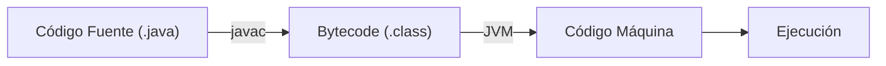

- [2. Introducción al lenguaje de programación Java](#2-introducción-al-lenguaje-de-programación-java)
  - [2.1. ¿Qué es Java y por qué usarlo?](#21-qué-es-java-y-por-qué-usarlo)
  - [2.2. El proceso de compilación y ejecución: El papel de la JVM](#22-el-proceso-de-compilación-y-ejecución-el-papel-de-la-jvm)

# 2. Introducción al lenguaje de programación Java

## 2.1. ¿Qué es Java y por qué usarlo?

Java es un lenguaje de programación de propósito general, orientado a objetos y diseñado para ser portable, lo que significa que el código escrito en Java puede ejecutarse en cualquier plataforma que disponga de una **Java Virtual Machine (JVM)**. Sus principales características son:

- **Orientado a objetos**: Todo en Java es un objeto, lo que facilita el desarrollo modular y reutilizable.
- **Multiplataforma**: La filosofía "**escribe una vez, ejecuta en cualquier lugar**" permite que las aplicaciones Java funcionen en distintos sistemas operativos (Windows, macOS, Linux) sin necesidad de recompilaciones.
- **Seguro**: La JVM ofrece un entorno controlado para evitar que el código malicioso acceda a recursos del sistema.
- **Robusto**: Tiene un fuerte sistema de tipado y un manejo de memoria automático (recolector de basura), lo que reduce la posibilidad de errores.
- **Gran comunidad y ecosistema**: Existe una enorme cantidad de librerías, frameworks y herramientas que aceleran el desarrollo.

📝 **Nota del Profesor**: Java es uno de los lenguajes más demandados en el mercado laboral, especialmente en entornos empresariales. Dominar Java te abre puertas en sectores como banca, telecomunicaciones y comercio electrónico.

💡 **Tip del Examinador**: En el examen pueden preguntar las diferencias entre tipos primitivos y clases envolventes. Recuerda: primitivos no pueden ser nulos, envolventes sí.

## 2.2. El proceso de compilación y ejecución: El papel de la JVM

Comprender este proceso es fundamental para entender cómo funciona Java. A diferencia de otros lenguajes que se compilan directamente a código máquina, Java utiliza un paso intermedio.



1. **Compilación**: El código fuente, escrito en un archivo con extensión `.java`, es procesado por el **compilador de Java (javac)**. Este paso verifica la sintaxis y transforma el código legible para humanos en un formato intermedio llamado **bytecode**, almacenado en un archivo con extensión `.class`. Este bytecode no es específico de una máquina, lo que le da a Java su portabilidad.

La JVM (Java Virtual Machine) es el corazón del ecosistema Java. Cada sistema operativo tiene su propia versión de JVM, que traduce el bytecode a código máquina específico del sistema en tiempo real.

    **Ejemplo**:
    Supongamos que tienes un archivo `HolaMundo.java`:

    ```java
    public class HolaMundo {
        public static void main(String[] args) {
            System.out.println("Hola, mundo!");
        }
    }
    ```

    Para compilarlo, usas el comando:

    ```bash
    javac HolaMundo.java
    ```

    Esto creará el archivo `HolaMundo.class`.

2. **Ejecución**: El archivo `.class` (bytecode) es interpretado y ejecutado por la **Java Virtual Machine (JVM)**. La JVM es el corazón del ecosistema Java. Cada sistema operativo tiene su propia versión de JVM, que es la encargada de traducir el bytecode a código máquina específico del sistema en tiempo real. Esto permite que el mismo archivo `.class` se ejecute en cualquier computadora con una JVM instalada.

    **Ejemplo**:
    Para ejecutar el archivo `.class`, usas el comando:

    ```bash
    java HolaMundo
    ```

    La JVM cargará el `bytecode` y lo ejecutará, mostrando la salida por consola:

    ```
    Hola, mundo!
    ```

En resumen, el proceso de dos pasos de Java (compilación a bytecode y luego ejecución por la JVM) es lo que le otorga su independencia de plataforma, haciéndolo un lenguaje robusto y versátil para el desarrollo.
