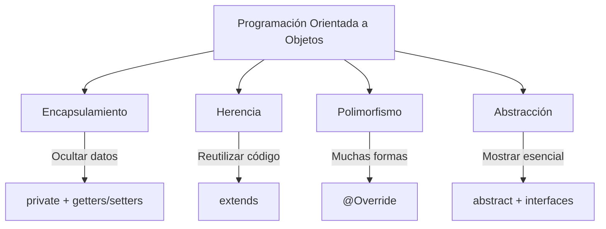

- [4. Programación orientada a objetos (POO)](#4-programación-orientada-a-objetos-poo)
  - [4.1. Clases, objetos, atributos y métodos](#41-clases-objetos-atributos-y-métodos)
  - [4.2. Constructores, getters y setters](#42-constructores-getters-y-setters)
  - [4.3. Principios de la POO](#43-principios-de-la-poo)
  - [4.4. Interfaces y clases abstractas](#44-interfaces-y-clases-abstractas)
  - [4.5. Clases abstract y sealed class](#45-clases-abstract-y-sealed-class)
  - [4.6. Clases vs. Records](#46-clases-vs-records)

# 4. Programación orientada a objetos (POO)

La POO es un paradigma de programación que utiliza el concepto de "objetos" para modelar el mundo real. En lugar de escribir una serie de instrucciones secuenciales, se organizan los datos y el comportamiento en unidades lógicas.



📝 **Nota del Profesor**: Los cuatro pilares de la POO son esenciales para cualquier examen. Entiende que cada principio solve un problema específico del desarrollo de software.

## 4.1. Clases, objetos, atributos y métodos

- **Clase**: Es el "plano" o la plantilla a partir de la cual se crean los objetos. Define la estructura de los objetos, incluyendo sus **atributos** (las características o datos) y **métodos** (el comportamiento o las acciones). No puedes usar una clase directamente, debes crear una instancia de ella.
- **Objeto**: Es una instancia de una clase. Cada objeto tiene su propia copia de los atributos definidos en la clase. Es la entidad real con la que interactúas en el programa.
- **Atributo**: Una variable que pertenece a una clase y define una de sus propiedades. Por ejemplo, en una clase `Coche`, los atributos podrían ser `marca`, `modelo` y `color`.
- **Método**: Una función que pertenece a una clase. Define el comportamiento de un objeto. Siguiendo con la clase `Coche`, los métodos podrían ser `acelerar()`, `frenar()` o `girar()`.

**Ejemplo de clase Coche:**

```java
public class Coche {
    // Atributos
    private String marca;
    private String modelo;
    private int velocidad;
    
    // Constructor
    public Coche(String marca, String modelo) {
        this.marca = marca;
        this.modelo = modelo;
        this.velocidad = 0;
    }
    
    // Métodos
    public void acelerar(int incremento) {
        this.velocidad += incremento;
    }
    
    public void frenar(int decremento) {
        this.velocidad -= decremento;
        if (this.velocidad < 0) this.velocidad = 0;
    }
    
    public int getVelocidad() {
        return this.velocidad;
    }
}

// Uso
Coche miCoche = new Coche("Ford", "Focus");
miCoche.acelerar(50);
System.out.println(miCoche.getVelocidad()); // 50
```

## 4.2. Constructores, getters y setters

Estos tres componentes son la base para el manejo y la **encapsulación** de los datos de un objeto, un pilar fundamental de la Programación Orientada a Objetos.

### 📝 Nota del Profesor: La falacia de los Getters/Setters automáticos

> A menudo, los IDEs nos permiten generar getters y setters para todos los atributos con un clic. ¡Cuidado!
> La encapsulación real consiste en proteger el estado del objeto. Si das acceso `public void setAtributo(val)` a todo, es casi como si el atributo fuera público.
> *Tip:* Pregúntate siempre: "¿Realmente necesito modificar este dato desde fuera?". Si la respuesta es no, no crees el setter.

- **Constructores**: Son métodos especiales que se ejecutan cuando se crea un nuevo objeto de una clase. Su propósito principal es **inicializar los atributos** del objeto. Una clase puede tener múltiples constructores con diferentes parámetros (lo que se conoce como **sobrecarga de constructores**), lo que permite crear objetos de diversas maneras. Si no defines un constructor, Java crea uno por defecto sin parámetros.

- ***Getters***: También conocidos como **métodos de acceso**, son funciones que se usan para **leer o obtener el valor** de un atributo. Siguen la convención de nombrar el método como `getNombreDelAtributo()`. Su uso principal es permitir el acceso a atributos que están declarados como `private`, garantizando un acceso controlado a la información.

- ***Setters***: Conocidos como **métodos de mutación**, son funciones que se usan para **establecer o modificar el valor** de un atributo. La convención de nombres es `setNombreDelAtributo()`. Los *setters* son clave para la encapsulación, ya que pueden incluir lógica de validación para asegurar que el nuevo valor es válido antes de asignarlo, lo que previene que los datos del objeto queden en un estado inconsistente.

**Ejemplo completo con validación:**

```java
public class Coche {
    private String marca;
    private String modelo;
    private int velocidad;

    // Constructor con parámetros
    public Coche(String marca, String modelo) {
        this.marca = marca;
        this.modelo = modelo;
        this.velocidad = 0;
    }

    // Sobrecarga de constructor
    public Coche() {
        this("Desconocida", "Desconocido");
    }

    // Getters
    public String getMarca() { return this.marca; }
    public String getModelo() { return this.modelo; }
    public int getVelocidad() { return this.velocidad; }

    // Setters con validación
    public void setVelocidad(int nuevaVelocidad) {
        if (nuevaVelocidad >= 0) {
            this.velocidad = nuevaVelocidad;
        }
    }

    public void acelerar(int incremento) {
        setVelocidad(this.velocidad + incremento);
    }
}
```

## 4.3. Principios de la POO

Estos cuatro pilares son fundamentales para diseñar software de forma eficiente, escalable y mantenible.

### 4.3.1. Encapsulamiento

Es el principio de agrupar los datos (atributos) y los métodos que operan sobre esos datos en una sola unidad (la clase), ocultando la implementación interna. Esto se logra principalmente con los modificadores de acceso (`private`, `public`, `protected`) y los métodos **"getters" y "setters"**. Ocultar los datos a través de la encapsulación se conoce como **ocultación de información**.

**Ejemplo:**

```java
public class CuentaBancaria {
    private double saldo; // El saldo es privado, no accesible directamente

    public CuentaBancaria(double saldoInicial) {
        this.saldo = saldoInicial;
    }

    // Getter para acceder al saldo de forma controlada
    public double getSaldo() {
        return this.saldo;
    }

    // Setter para modificar el saldo de forma segura
    public void depositar(double monto) {
        if (monto > 0) {
            this.saldo += monto;
        }
    }
}
```

En este ejemplo, no puedes modificar el `saldo` directamente desde fuera de la clase; debes usar el método `depositar()`, que incluye una lógica de validación.

### 4.3.2. Herencia

Permite a una nueva clase (subclase o clase hija) heredar los atributos y métodos de una clase existente (superclase o clase padre). La palabra clave para esto es `extends`. La herencia promueve la reutilización de código. Una clase solo puede heredar de una única superclase en Java (herencia simple).

💡 **Tip del Examinador**: Pregunta típica: "¿Java soporta herencia múltiple?" Respuesta: No, solo herencia simple. Pero puedes implementar múltiples interfaces.

**Ejemplo:**

```java
public class Vehiculo {
    protected int ruedas;
    public void pitar() {
        System.out.println("¡Pi-pi!");
    }
}

// La clase Coche hereda de Vehiculo
public class Coche extends Vehiculo {
    public Coche() {
        this.ruedas = 4;
    }
}
```

### 4.3.3. Polimorfismo

Significa "muchas formas". Permite que objetos de diferentes clases, que están relacionadas por herencia, sean tratados como objetos de una superclase común. Esto se logra mediante la **sobrescritura de métodos (`@Override`)** o la **sobrecarga de métodos**.

**Ejemplo de Polimorfismo por sobrescritura:**

```java
public class Animal {
    public void sonido() {
        System.out.println("El animal hace un sonido.");
    }
}
public class Gato extends Animal {
    @Override
    public void sonido() {
        System.out.println("El gato maúlla.");
    }
}
public class Perro extends Animal {
    @Override
    public void sonido() {
        System.out.println("El perro ladra.");
    }
}

// Uso polimórfico
public class Main {
    public static void main(String[] args) {
        Animal miAnimal = new Gato();
        miAnimal.sonido(); // Llama al método de Gato, Salida: El gato maúlla.

        miAnimal = new Perro();
        miAnimal.sonido(); // Llama al método de Perro, Salida: El perro ladra.
    }
}
```

### 4.3.4. Abstracción

Se centra en mostrar solo los detalles esenciales del objeto al usuario, ocultando la complejidad de la implementación interna. Se logra a través de **clases abstractas** e **interfaces**.

## 4.4. Interfaces y clases abstractas

Ambos son mecanismos clave para lograr la **abstracción**.

### 4.4.1. Clases abstractas

Son clases que no se pueden instanciar directamente y pueden contener métodos `abstract` (sin implementación) y métodos concretos (con implementación). Una subclase que hereda de una clase abstracta debe proporcionar una implementación para todos los métodos abstractos, a menos que también sea abstracta.

**Ejemplo:**

```java
public abstract class FiguraGeometrica {
    public abstract double calcularArea(); // Método abstracto sin cuerpo
    public void mostrarMensaje() { // Método concreto
        System.out.println("Esto es una figura geométrica.");
    }
}
public class Circulo extends FiguraGeometrica {
    private double radio;
    public Circulo(double radio) { this.radio = radio; }
    @Override
    public double calcularArea() {
        return Math.PI * radio * radio;
    }
}
```

### 4.4.2. Interfaces

Son un "contrato" que una clase debe cumplir. Contienen solo métodos abstractos (implícitamente) y constantes. Una clase puede `implements` (implementar) múltiples interfaces, lo que permite a Java superar la limitación de la herencia simple.

💡 **Tip del Examinador**: Desde Java 8, las interfaces pueden tener métodos default con implementación. Esto permite añadir funcionalidad sin romper las implementaciones existentes.

**Ejemplo:**

```java
public interface Volador {
    void despegar();
    void aterrizar();
}
public class Avion implements Volador {
    @Override
    public void despegar() {
        System.out.println("El avión está despegando.");
    }
    @Override
    public void aterrizar() {
        System.out.println("El avión está aterrizando.");
    }
}
```

Una clase implementa una interfaz para garantizar que tendrá el comportamiento definido por la misma.

**Comparativa:**

| Aspecto | Clase Abstracta | Interface |
|---------|-----------------|-----------|
| Herencia | Simple (extends) | Múltiple (implements) |
| Métodos | Abstractos y concretos | Abstractos, default, static |
| Atributos | Cualquier modificador | Solo final (constantes) |
| Constructor | Tiene | No tiene |

## 4.5. Clases abstract y sealed class

### 4.5.1. Clases abstract

Ya se han explicado, su propósito es ser heredadas para que las subclases implementen sus métodos abstractos.

### 4.5.2. Clases sealed

(Añadidas en Java 17) Son clases que permiten controlar qué otras clases pueden heredar de ellas. Se usa la palabra clave `sealed` seguida de `permits` para enumerar las clases que tienen permiso para ser subclases. Esto ofrece un control granular sobre la jerarquía de herencia.

**Ejemplo:**

```java
public sealed class Forma permits Circulo, Cuadrado {
    // ...
}
final class Circulo extends Forma {
    // ...
}
final class Cuadrado extends Forma {
    // ...
}
// La siguiente clase no puede compilarse, ya que no está permitida.
// public class Triangulo extends Forma { ... }
```

## 4.6. Clases vs. Records

### 4.6.1. Clases tradicionales

Son la plantilla estándar para crear objetos, con atributos mutables, constructores, "getters", "setters" y cualquier lógica de negocio. Requieren que el programador escriba mucho código repetitivo.

### 4.6.2. Records

(Añadidos en Java 16) Son un tipo de clase especial, inmutable y concisa, diseñada para ser un simple contenedor de datos. El compilador de Java genera automáticamente el constructor, los "getters" (conocidos como métodos de acceso), los métodos `equals()`, `hashCode()` y `toString()`. Son ideales para modelos de datos sencillos.

**Ejemplo de clase Record vs. una clase normal:**

```java
// Clase tradicional (código extenso)
public class PersonaClasica {
    private final String nombre;
    private final int edad;

    public PersonaClasica(String nombre, int edad) {
        this.nombre = nombre;
        this.edad = edad;
    }

    public String getNombre() { return nombre; }
    public int getEdad() { return edad; }
    // y más métodos...
}

// Record (código conciso)
public record PersonaRecord(String nombre, int edad) {
    // El compilador genera automáticamente los métodos nombre(), edad(), equals(), hashCode(), toString(), etc.
}
```

Como ves, el `Record` es perfecto para datos inmutables y reduce la cantidad de código.

⚠️ **Advertencia**: Los Records son inmutables por defecto. Si necesitas mutabilidad, usa clases tradicionales. Los Records no pueden extender ninguna clase (pero sí implementar interfaces).
