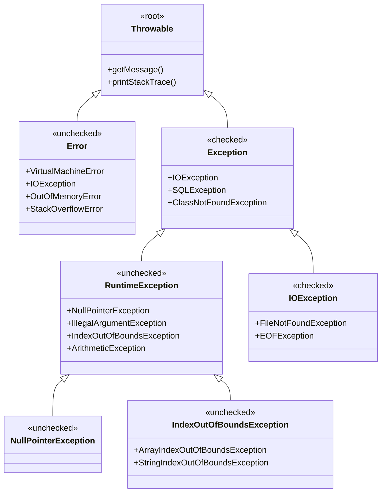

- [6. Manejo de errores y excepciones](#6-manejo-de-errores-y-excepciones)
  - [6.1. Tipos de excepciones: `checked` vs. `unchecked`](#61-tipos-de-excepciones-checked-vs-unchecked)
  - [6.2. Manejo de excepciones: `try-catch-finally`](#62-manejo-de-excepciones-try-catch-finally)
  - [6.3. El uso de `try-with-resources`](#63-el-uso-de-try-with-resources)
  - [6.4. Creación de excepciones personalizadas](#64-creación-de-excepciones-personalizadas)


# 6. Manejo de errores y excepciones

## 6.1. Tipos de excepciones: `checked` vs. `unchecked`

Las excepciones en Java se dividen en dos categorías principales.

### Árbol de Jerarquía de Excepciones en Java



### Resumen: Checked vs Unchecked

| Característica | Checked | Unchecked |
|----------------|---------|-----------|
| **Herencia** | `extends Exception` | `extends RuntimeException` |
| **Compilador** | Obliga a manejar (`try-catch` o `throws`) | No obliga |
| **Uso típico** | Errores externos recuperables (E/S, BBDD) | Errores de programación |
| **Ejemplos** | `IOException`, `SQLException` | `NullPointerException`, `IndexOutOfBoundsException` |

- **Excepciones `checked` (comprobadas)**:

  - El compilador **obliga** a que estas excepciones sean manejadas, ya sea con un bloque `try-catch` o declarándolas con la palabra clave `throws` en la firma del método.
  - Generalmente, son excepciones que un programador puede prever y manejar, como un archivo que no se encuentra (`FileNotFoundException`) o un problema de red (`IOException`).
  - **Ejemplo**:

    ```java
    import java.io.FileReader;
    import java.io.IOException;

    public class LectorArchivo {
        public void leer() throws IOException {
            // El compilador exige manejar esta excepción
            FileReader archivo = new FileReader("mi_archivo.txt");
        }
    }
    ```

- **Excepciones `unchecked` (no comprobadas)**:

  - El compilador **no obliga** a manejarlas. Son subtipos de `RuntimeException`.
  - Generalmente, son causadas por errores de lógica o de programación que podrían haberse evitado.
  - **Ejemplos comunes**: `NullPointerException` (acceder a un objeto nulo) o `ArrayIndexOutOfBoundsException` (acceder a un índice de array fuera de los límites).
  - **Ejemplo**:
    ```java
    int[] numeros = {1, 2, 3};
    // No se requiere try-catch para esta excepción
    System.out.println(numeros[5]); // Lanza un ArrayIndexOutOfBoundsException
    ```

📝 **Nota del Profesor**: Una forma fácil de recordar: checked = IOException (cosas de E/S que pueden fallar), unchecked = RuntimeException (errores de programación). El compilador te "checked" (observa) las checked, las unchecked las dejas pasar.

## 6.2. Manejo de excepciones: `try-catch-finally`

La estructura `try-catch-finally` es la forma más común de manejar excepciones.

- **`try`**: Encierra el código que podría lanzar una excepción.
- **`catch`**: Si una excepción ocurre en el bloque `try`, el control pasa al bloque `catch`. Aquí se especifica el tipo de excepción que se va a manejar.
- **`finally`**: Opcional, pero si está presente, el código en este bloque se ejecuta siempre, haya o no ocurrido una excepción. Es útil para limpiar recursos, como cerrar un archivo o una conexión a la base de datos.

**Ejemplo completo:**

```java
public class ManejoExcepciones {
    public static void main(String[] args) {
        try {
            int resultado = 10 / 0; // Esto lanzará un ArithmeticException
            System.out.println(resultado);
        } catch (ArithmeticException e) {
            System.err.println("Error: No se puede dividir entre cero.");
        } finally {
            System.out.println("Este bloque siempre se ejecuta.");
        }

        // Se pueden usar múltiples catch para diferentes tipos de excepciones
        try {
            String texto = null;
            System.out.println(texto.length());
        } catch (NullPointerException e) {
            System.err.println("Error: El texto es nulo.");
        } catch (Exception e) {
            // Un catch genérico para cualquier otra excepción
            System.err.println("Ocurrió un error inesperado.");
        }
    }
}
```

## 6.3. El uso de `try-with-resources`

Añadido en Java 7, esta estructura es una mejora del `try-catch` tradicional. Su objetivo es asegurar que los recursos que implementan la interfaz `AutoCloseable` (como archivos o conexiones a bases de datos) se cierran automáticamente, incluso si ocurre una excepción.

💡 **Tip del Examinador**: En el examen práctico, si abres un recurso (FileReader, Connection, etc.) usa siempre try-with-resources. Es una buena práctica que demuestra que dominas Java moderno.

⚠️ **Advertencia de Seguridad**: No cerrar recursos puede causar memory leaks y fugas de recursos. Siempre que implements AutoCloseable, úsalo con try-with-resources.

**Ejemplo sin `try-with-resources` (requiere `finally`):**

```java
// Código propenso a errores si no se cierra correctamente el recurso
FileReader reader = null;
try {
    reader = new FileReader("mi_archivo.txt");
    // ... leer del archivo
} catch (IOException e) {
    System.err.println("Error de E/S.");
} finally {
    if (reader != null) {
        try {
            reader.close(); // Se debe cerrar explícitamente
        } catch (IOException e) {
            System.err.println("Error al cerrar el archivo.");
        }
    }
}
```

**Ejemplo con `try-with-resources` (más limpio y seguro):**

```java
// El recurso se declara dentro del paréntesis y se cierra automáticamente
try (FileReader reader = new FileReader("mi_archivo.txt")) {
    // ... leer del archivo
    System.out.println("Archivo leído exitosamente.");
} catch (IOException e) {
    System.err.println("Error de E/S: " + e.getMessage());
}
// El reader se cierra automáticamente, sin necesidad de un bloque finally
```

## 6.4. Creación de excepciones personalizadas

Puedes crear tus propias clases de excepción para manejar errores específicos de tu aplicación. Esto mejora la legibilidad del código y permite a otros desarrolladores entender mejor qué tipo de problema ha ocurrido.

- Para crear una excepción **`checked`** personalizada, la clase debe heredar de `Exception`.
- Para crear una excepción **`unchecked`** personalizada, la clase debe heredar de `RuntimeException`.

**Ejemplo de excepción personalizada (`checked`):**

```java
public class SaldoInsuficienteException extends Exception {
    public SaldoInsuficienteException(String mensaje) {
        super(mensaje);
    }
}

public class CuentaBancaria {
    private double saldo;

    public void retirar(double monto) throws SaldoInsuficienteException {
        if (monto > saldo) {
            // Lanza la excepción personalizada
            throw new SaldoInsuficienteException("No hay suficiente saldo para el retiro.");
        }
        this.saldo -= monto;
        System.out.println("Retiro exitoso. Saldo actual: " + this.saldo);
    }
}

// Uso en otra clase
public class Cajero {
    public static void main(String[] args) {
        CuentaBancaria cuenta = new CuentaBancaria(100);
        try {
            cuenta.retirar(150);
        } catch (SaldoInsuficienteException e) {
            System.err.println("Error: " + e.getMessage());
        }
    }
}
```
