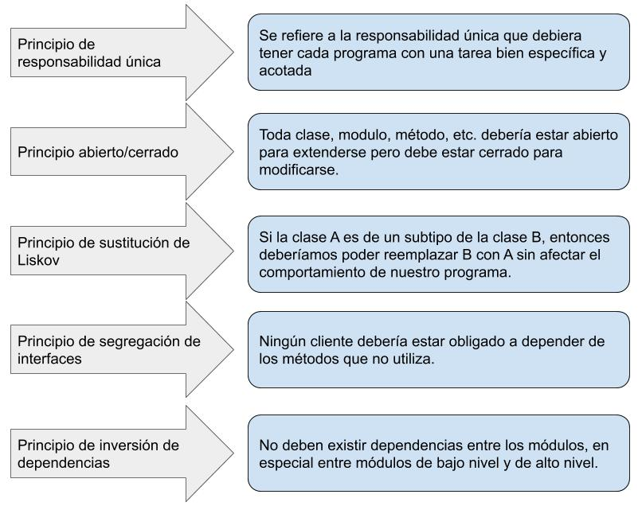
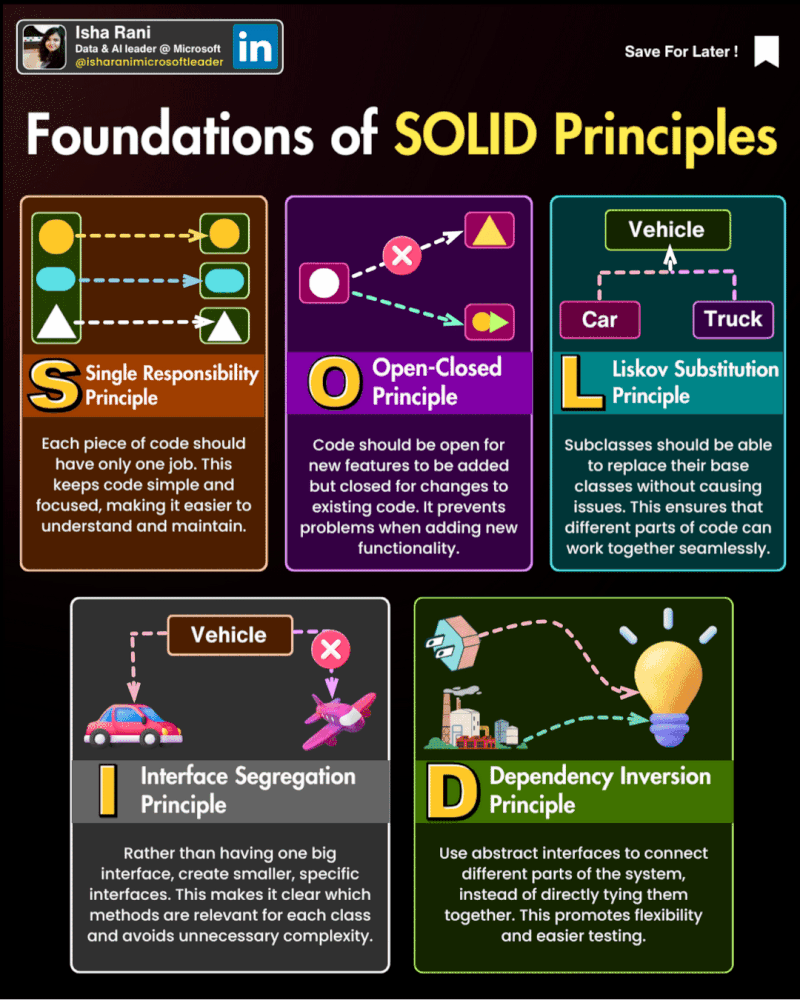
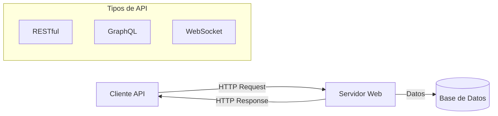

- [7. Patrones y tipos de arquitecturas en Servidor](#7-patrones-y-tipos-de-arquitecturas-en-servidor)
  - [7.1. Principios SOLID](#71-principios-solid)
  - [7.2. Patrones de Diseño](#72-patrones-de-diseño)
  - [7.3. Arquitecturas Software](#73-arquitecturas-software)
    - [7.3.1. Diagrama Comparativo de Arquitecturas](#731-diagrama-comparativo-de-arquitecturas)
  - [7.4. Ejemplo de arquitectura de Netflix](#74-ejemplo-de-arquitectura-de-netflix)
  - [7.5. API Web](#75-api-web)


# 7. Patrones y tipos de arquitecturas en Servidor.

## 7.1. Principios SOLID
Los cinco principios SOLID son un conjunto de reglas y mejores prácticas para el diseño de software orientado a objetos. 

[Video SOLID](https://www.youtube.com/watch?v=E_mSr-VFd3g)





Los principios son:

1. **Principio de responsabilidad única (Single Responsibility Principle, SRP)**: Una clase debe tener una, y solo una, razón para cambiar. Esto significa que una clase debe tener solo una tarea o responsabilidad.

    ```java
    public class Informe {
        public void generarInforme() {
            // lógica para generar el informe
        }
    }

    public class ImprimirInforme {
        public void imprimir(Informe informe) {
            // lógica para imprimir el informe
        }
    }
    ```

    En este ejemplo, la clase `Informe` solo tiene la responsabilidad de generar el informe, mientras que la clase `ImprimirInforme` tiene la responsabilidad de imprimir el informe.

2. **Principio abierto/cerrado (Open/Closed Principle, OCP)**: Las entidades de software (clases, módulos, funciones, etc.) deben estar abiertas para la extensión, pero cerradas para la modificación.

    ```java
    public abstract class Forma {
        abstract void dibujar();
    }

    public class Circulo extends Forma {
        void dibujar() {
            // lógica para dibujar un círculo
        }
    }

    public class Cuadrado extends Forma {
        void dibujar() {
            // lógica para dibujar un cuadrado
        }
    }
    ```

    En este ejemplo, la clase `Forma` está abierta para la extensión (se puede crear una nueva forma como `Circulo` o `Cuadrado`), pero cerrada para la modificación (no necesitamos cambiar la clase `Forma` para añadir una nueva forma).

3. **Principio de sustitución de Liskov (Liskov Substitution Principle, LSP)**: Los objetos de una superclase deben poder ser reemplazados por objetos de una subclase sin afectar la corrección del programa.

    ```java
    public class Pajaro {
        public void volar() {
            // lógica para volar
        }
    }

    public class Pinguino extends Pajaro {
        @Override
        public void volar() {
            throw new UnsupportedOperationException();
        }
    }
    ```

    Este es un ejemplo de violación del principio de sustitución de Liskov, ya que `Pinguino` es una subclase de `Pajaro`, pero no puede volar. Una solución sería tener una clase separada para pájaros que pueden volar.

4. **Principio de segregación de interfaces (Interface Segregation Principle, ISP)**: Los clientes no deben ser forzados a depender de interfaces que no usan.

    ```java
    public interface Pajaro {
        void comer();
    }

    public interface PajaroVolador {
        void volar();
    }

    public class Pinguino implements Pajaro {
        public void comer() {
            // lógica para comer
        }
    }

    public class Paloma implements Pajaro, PajaroVolador {
        public void comer() {
            // lógica para comer
        }

        public void volar() {
            // lógica para volar
        }
    }
    ```

    En este ejemplo, `Pinguino` no está forzado a implementar un método `volar()` que no necesita, ya que hemos segregado las responsabilidades en dos interfaces diferentes.

5. **Principio de inversión de dependencias (Dependency Inversion Principle, DIP)**: Los módulos de alto nivel no deben depender de los módulos de bajo nivel. Ambos deben depender de abstracciones.

    ```java
    public interface BaseDeDatos {
        void guardar(String datos);
    }

    public class MySqlDB implements BaseDeDatos {
        public void guardar(String datos) {
            // lógica para guardar datos en MySQL
        }
    }

    public class Aplicacion {
        private BaseDeDatos db;

        public Aplicacion(BaseDeDatos db) {
            this.db = db;
        }

        public void guardarDatos(String datos) {
            db.guardar(datos);
        }
    }
    ```

    En este ejemplo, la clase `Aplicacion` no depende directamente de la clase `MySqlDB`. En lugar de eso, ambos dependen de la abstracción `BaseDeDatos`. De esta manera, si queremos cambiar la base de datos en el futuro, solo necesitamos crear una nueva implementación de `BaseDeDatos`, sin tener que cambiar la clase `Aplicacion`.


## 5.2. Patrones de Diseño
Un patrón de diseño de software es una solución generalmente aplicable a un problema común en el diseño de software. Los patrones de diseño proporcionan un enfoque probado y estructurado para resolver problemas recurrentes y mejorar la calidad y flexibilidad del código.

Existen varios tipos de patrones de diseño de software, entre ellos:

1. Patrones de creación: Estos patrones se centran en la creación de objetos de manera flexible y eficiente. Algunos ejemplos son: Singleton, Factory Method, Abstract Factory y Builder.

2. Patrones estructurales: Estos patrones se ocupan de la composición y estructura de las clases y objetos. Algunos ejemplos son: Adapter, Decorator, Composite y Proxy.

3. Patrones de comportamiento: Estos patrones se centran en la interacción y comunicación entre objetos. Algunos ejemplos son: Observer, Strategy, Template Method y Command.

4. Patrones arquitectónicos: Estos patrones abordan la estructura y organización de sistemas de software a gran escala. Algunos ejemplos son: Modelo-Vista-Controlador (MVC), Capas y Microservicios.

5. Patrones de concurrencia: Estos patrones se utilizan para gestionar la concurrencia y la comunicación entre hilos. Algunos ejemplos son: Mutex, Semaphore, Productor-Consumidor y Monitor.

Estos son solo algunos ejemplos de patrones de diseño de software. Cada patrón tiene un propósito específico y puede aplicarse en diferentes contextos para resolver problemas particulares en el diseño y la implementación de software.

Puedes aprenderlos en [Refactoring Guru](https://refactoring.guru/es/design-patterns) y [Entornos de Desarrollo 8](https://github.com/joseluisgs/EntornosDesarrollo-08-2022-2023).

## 5.3. Arquitecturas Software
Una arquitectura de software se refiere a la estructura organizativa fundamental de un sistema de software. Define cómo se dividen, combinan y coordinan los componentes del software para lograr los objetivos del sistema. En el desarrollo de aplicaciones web del lado del servidor (backend), existen varias arquitecturas de software principales:


#### 5.3.1. Diagrama Comparativo de Arquitecturas

```mermaid
graph TB
    subgraph Monolítica
        M1[Monolito]
        M2[TODO en un proceso]
        M3[Escalado vertical]
    end

    subgraph Capas
        C1[Presentación]
        C2[Lógica de Negocio]
        C3[Persistencia]
    end

    subgraph Microservicios
        MS1[Servicio A]
        MS2[Servicio B]
        MS3[Servicio C]
        MS4[API Gateway]
    end

    M1 -->|Evoluciona| MS1
    M1 -->|Modulariza| C1
```



1. Arquitectura monolítica: Es un enfoque tradicional en el que todos los componentes de una aplicación web se agrupan en un solo bloque. La lógica de negocio, la interfaz de usuario y la capa de acceso a datos se encuentran dentro de la misma aplicación. Es fácil de desarrollar y desplegar, pero puede volverse complejo y difícil de mantener a medida que la aplicación crece. Características:
- Todos los componentes se ejecutan en el mismo proceso y comparten recursos.
- La escalabilidad puede ser un desafío, ya que la aplicación se ejecuta en una sola instancia.
- Los cambios en una parte de la aplicación pueden afectar a otras partes.

> ⚠️ **Advertencia de Seguridad**: Los monolitos pueden ser más fáciles de securizar inicialmente, pero el radio de impacto de un fallo es mayor.

2. Arquitectura de capas: Esta arquitectura divide la aplicación en diferentes capas lógicas, donde cada capa tiene una responsabilidad específica. Las capas típicas incluyen la capa de presentación, la capa de lógica de negocio y la capa de acceso a datos. Cada capa se comunica con la capa adyacente a través de interfaces bien definidas. Características:
- Mejora la modularidad y la reutilización del código.
- Permite cambios en una capa sin afectar a las demás.
- Facilita la escalabilidad y el mantenimiento del sistema.

3. Arquitectura de servicios web: Esta arquitectura se basa en la comunicación entre diferentes servicios a través de protocolos web estándar, como HTTP. Cada servicio es una unidad independiente que se puede desarrollar, desplegar y escalar de forma independiente. Los servicios se comunican entre sí para cumplir con los requisitos de la aplicación. Características:
- Favorece la modularidad y la independencia de los servicios.
- Permite la integración de diferentes tecnologías y lenguajes de programación.
- Facilita la escalabilidad horizontal, ya que los servicios se pueden replicar y distribuir en múltiples servidores.

4. Arquitectura basada en microservicios: Es una evolución de la arquitectura de servicios web, donde los servicios se dividen en componentes aún más pequeños y autónomos llamados microservicios. Cada microservicio se enfoca en una tarea específica y se comunica con otros microservicios a través de protocolos ligeros. Características:
- Cada microservicio se puede desarrollar, desplegar y escalar de forma independiente.
- Mejora la flexibilidad y la agilidad del desarrollo.
- Permite la adopción de diferentes tecnologías y enfoques dentro de cada microservicio.

> 💡 **Tip del Examinador**: En el examen suelen preguntar las diferencias entre arquitectura monolítica y microservicios. Enfatiza las ventajas y desventajas de cada una.

Estas son solo algunas de las arquitecturas de software más comunes en el desarrollo de aplicaciones web backend. Cada una tiene sus ventajas y desafíos, y la elección de la arquitectura adecuada depende de los requisitos y objetivos del proyecto.

### 5.4. Ejemplo de arquitectura de Netflix
La arquitectura de backend de Netflix es conocida por ser altamente escalable y resiliente, diseñada para manejar grandes volúmenes de tráfico y garantizar la disponibilidad y el rendimiento de sus servicios. Netflix adopta una arquitectura basada en microservicios, donde las diferentes funcionalidades se dividen en servicios independientes. Cada microservicio se enfoca en una tarea específica y se comunica con otros servicios a través de interfaces bien definidas. Esto permite una mayor flexibilidad, escalabilidad y mantenimiento de los servicios individuales.


### 5.5. API Web
Una API web (Application Programming Interface) es un conjunto de reglas y protocolos que permite a diferentes aplicaciones o sistemas comunicarse y compartir datos entre sí a través de la web. Proporciona un conjunto de funciones y métodos que permiten a los desarrolladores acceder y manipular los datos de una aplicación o servicio específico.

> 📝 **Nota del Profesor**: Las APIs son el pegamento que conecta todos los componentes de una aplicación moderna. Entender cómo diseñar y consumir APIs es esencial.

En el contexto de las aplicaciones web, una API web permite que el backend de una aplicación exponga ciertas funcionalidades y datos a otras aplicaciones o servicios, como aplicaciones móviles, sitios web o sistemas externos. Esto permite la integración y la creación de aplicaciones más complejas y robustas.

Las API web se basan en protocolos estándar de la web, como HTTP (Hypertext Transfer Protocol), y utilizan formatos de intercambio de datos como JSON (JavaScript Object Notation) o XML (eXtensible Markup Language) para enviar y recibir información.



Algunos ejemplos comunes de API web incluyen:

1. API RESTful: Es un estilo arquitectónico que utiliza los métodos HTTP (GET, POST, PUT, DELETE, etc.) para acceder y manipular recursos en un sistema. Se basa en la representación de recursos a través de URLs (Uniform Resource Locators) y utiliza formatos como JSON para el intercambio de datos.

2. API GraphQL: Es un lenguaje de consulta y una especificación para las APIs web. Permite a los clientes solicitar y recibir solo los datos necesarios, lo que mejora la eficiencia y reduce la cantidad de datos transferidos.
    
3. API Websocket: Utiliza el protocolo de comunicación de WebSockets para permitir una comunicación bidireccional y en tiempo real entre un cliente y un servidor a través de una conexión persistente. A diferencia de las API tradicionales basadas en HTTP, que siguen un modelo de solicitud-respuesta, las API con WebSockets establecen una conexión continua entre el cliente y el servidor, lo que permite una comunicación más eficiente y en tiempo real.

> 💡 **Tip del Examinador**: Saber cuándo usar REST vs GraphQL es un tema recurrente. REST es ideal para operaciones CRUD simples, mientras que GraphQL brilla cuando el cliente necesita flexibility en los datos.

Las API web son fundamentales en el desarrollo de aplicaciones modernas, ya que permiten la integración de diferentes servicios y la creación de aplicaciones más flexibles y escalables.

