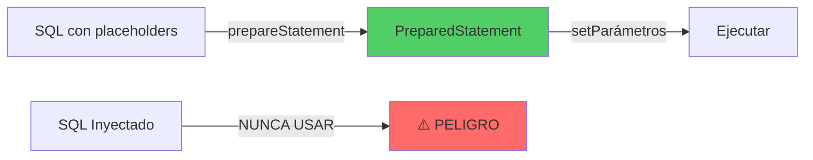
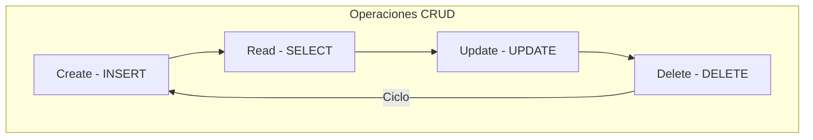

- [9. Bases de datos relacionales. Patrón Repository y DAO. CRUD.](#9-bases-de-datos-relacionales-patrón-repository-y-dao-crud)
  - [9.1. PreparedStatement](#91-preparedstatement)
  - [9.2. CRUD](#92-crud)

# 9. Bases de datos relacionales. Patrón Repository y DAO. CRUD.

> 📝 **Nota del Profesor**: El acceso a datos es una skill fundamental. Entiende bien JDBC antes de usar ORMs, ya que entenderás mejor qué están haciendo "bajo el capó".

## 9.1. PreparedStatement
`PreparedStatement` es una interfaz en Java que representa un objeto SQL precompilado. En otras palabras, es una declaración SQL que se traduce y compila en el servidor de base de datos una vez, pero puede ser ejecutada muchas veces con diferentes conjuntos de parámetros.

> ⚠️ **Advertencia de Seguridad**: SIEMPRE usa PreparedStatement en lugar de Statement concatenando strings para prevenir inyección SQL. Es una vulnerabilidad crítica.



La principal ventaja de usar `PreparedStatement` en lugar de `Statement` es que es más eficiente cuando se ejecuta la misma sentencia SQL varias veces, ya que la base de datos puede reutilizar la versión precompilada de la sentencia.

Además, `PreparedStatement` puede ayudar a prevenir los ataques de inyección SQL, ya que todos los parámetros de una sentencia `PreparedStatement` se escapan automáticamente por el controlador JDBC. Esto significa que no tienes que preocuparte de escapar manualmente los caracteres especiales en los valores de los parámetros para evitar la inyección SQL.

Aquí tienes un ejemplo de cómo se puede usar `PreparedStatement`:

```java
String updateSql = "UPDATE employees SET salary = ? WHERE id = ?";
PreparedStatement pstmt = conn.prepareStatement(updateSql);

pstmt.setDouble(1, 5000.0); // Establece el primer parámetro (?)
pstmt.setInt(2, 1); // Establece el segundo parámetro (?)

pstmt.executeUpdate(); // Ejecuta la actualización
```

En este ejemplo, los signos de interrogación son marcadores de posición para los parámetros que se establecen más tarde con los métodos `setDouble` y `setInt`. Cada vez que se ejecuta `executeUpdate`, se ejecuta la sentencia SQL con los parámetros actuales.

## 9.2. CRUD
CRUD es un acrónimo que significa Create, Read, Update, Delete. Estas son las cuatro operaciones básicas que se pueden realizar en cualquier base de datos persistente. En el contexto de una aplicación web, estas operaciones corresponden a diferentes endpoints de la API que permiten a los usuarios crear, leer, actualizar y eliminar recursos.

> 📝 **Nota del Profesor**: El patrón Repository abstrae la capa de datos y proporciona una interfaz limpia para las operaciones CRUD. Es el puente entre tu dominio y la persistencia.



Aquí tienes un ejemplo de cómo podrías implementar una clase `Producto` y un repositorio `ProductoRepository` que implementa las operaciones CRUD:

```java
import java.util.UUID;

public class Producto {
    private UUID id;
    private String nombre;
    private double precio;
    private int cantidad;

    // Constructor, getters y setters omitidos por brevedad
}

import java.sql.Connection;
import java.sql.PreparedStatement;
import java.sql.ResultSet;
import java.sql.SQLException;
import java.util.ArrayList;
import java.util.List;
import java.util.Optional;
import java.util.UUID;

public class ProductoRepository {
    private static ProductoRepository instance;
    private Connection connection;

    private ProductoRepository(Connection connection) {
        this.connection = connection;
    }

    public static synchronized ProductoRepository getInstance(Connection connection) {
        if (instance == null) {
            instance = new ProductoRepository(connection);
        }
        return instance;
    }

    public List<Producto> findAll() throws SQLException {
        List<Producto> productos = new ArrayList<>();
        ResultSet resultSet = connection.createStatement().executeQuery("SELECT * FROM productos");

        while (resultSet.next()) {
            productos.add(new Producto(
                UUID.fromString(resultSet.getString("id")),
                resultSet.getString("nombre"),
                resultSet.getDouble("precio"),
                resultSet.getInt("cantidad")
            ));
        }

        return productos;
    }

    public Optional<Producto> findById(UUID id) throws SQLException {
        PreparedStatement statement = connection.prepareStatement("SELECT * FROM productos WHERE id = ?");
        statement.setString(1, id.toString());
        ResultSet resultSet = statement.executeQuery();

        if (resultSet.next()) {
            return Optional.of(new Producto(
                UUID.fromString(resultSet.getString("id")),
                resultSet.getString("nombre"),
                resultSet.getDouble("precio"),
                resultSet.getInt("cantidad")
            ));
        } else {
            return Optional.empty();
        }
    }

    public void create(Producto producto) throws SQLException {
        PreparedStatement statement = connection.prepareStatement("INSERT INTO productos (id, nombre, precio, cantidad) VALUES (?, ?, ?, ?)");
        statement.setString(1, producto.getId().toString());
        statement.setString(2, producto.getNombre());
        statement.setDouble(3, producto.getPrecio());
        statement.setInt(4, producto.getCantidad());
        statement.executeUpdate();
    }

    public void update(Producto producto) throws SQLException {
        PreparedStatement statement = connection.prepareStatement("UPDATE productos SET nombre = ?, precio = ?, cantidad = ? WHERE id = ?");
        statement.setString(1, producto.getNombre());
        statement.setDouble(2, producto.getPrecio());
        statement.setInt(3, producto.getCantidad());
        statement.setString(4, producto.getId().toString());
        statement.executeUpdate();
    }

    public void delete(UUID id) throws SQLException {
        PreparedStatement statement = connection.prepareStatement("DELETE FROM productos WHERE id = ?");
        statement.setString(1, id.toString());
        statement.executeUpdate();
    }
}

// Clase DatabaseManager
public class DatabaseManager {
    private static DatabaseManager instance;
    private Connection connection;

    private DatabaseManager() throws SQLException {
        this.connection = DriverManager.getConnection("jdbc:h2:~/test", "sa", "");  // Cambia "sa" y "" a tu usuario y contraseña
    }

    public static synchronized DatabaseManager getInstance() throws SQLException {
        if (instance == null) {
            instance = new DatabaseManager();
        }
        return instance;
    }

    public Connection getConnection() {
        return this.connection;
    }
}

public class Main {
    public static void main(String[] args) {
        try {
    
            // Crear una instancia del repositorio con la conexión a la base de datos de dependencia
            ProductoRepository productoRepository = ProductoRepository
                .getInstance(DatabaseManager.getInstance().getConnection());

            // Crear un nuevo producto
            Producto nuevoProducto = new Producto(UUID.randomUUID(), "Nuevo producto", 100.0, 10);
            productoRepository.create(nuevoProducto);

            // Obtener todos los productos
            List<Producto> productos = productoRepository.findAll();
            for (Producto producto : productos) {
                System.out.println(producto);
            }

            // Actualizar un producto
            nuevoProducto.setPrecio(200.0);
            productoRepository.update(nuevoProducto);

            // Eliminar un producto
            productoRepository.delete(nuevoProducto.getId());
        } catch (SQLException e) {
            e.printStackTrace();
        }
    }
}
```

Este código es un ejemplo muy básico y no incluye validación de datos ni manejo de errores, que son aspectos que deberías considerar en una implementación real. También asume que tienes una tabla `productos` en tu base de datos H2 con las columnas `id`, `nombre`, `precio` y `cantidad`.
