- [9. Ficheros y formatos de intercambio. Procesamiento masivo de información.](#9-ficheros-y-formatos-de-intercambio-procesamiento-masivo-de-información)
  - [Uso de recursos](#uso-de-recursos)
  - [Formatos de intercambio](#formatos-de-intercambio)
    - [CSV](#csv)
    - [JSON](#json)

# 9. Ficheros y formatos de intercambio. Procesamiento masivo de información.

> 📝 **Nota del Profesor**: El manejo de ficheros y formatos de intercambio es esencial para la integración de sistemas. JSON se ha convertido en el estándar de facto para el intercambio de datos.

## 9.1. Uso de recursos
Puedes usar la declaración try-with-resources para leer/escribir un archivo u otro recursos. try-with-resources es útil porque se asegura de que cada recurso que se abre se cierre automáticamente al final de la declaración, lo que puede ayudar a prevenir errores y fugas de recursos.

Además, se recomienda usar la API de NIO2, con [Files](https://docs.oracle.com/javase/8/docs/api/java/nio/file/Files.html) y [Paths](https://docs.oracle.com/javase/8/docs/api/java/nio/file/Paths.html) y con ello usar la API de Streams para leer/escribir ficheros.

```java
public class LeerFichero {
    public static void main(String[] args) {
        String rutaDelArchivo = "/ruta/al/archivo.txt";

        try (Stream<String> lines = Files.lines(Paths.get(rutaDelArchivo))) {
            lines.forEach(System.out::println);
        } catch (IOException e) {
            e.printStackTrace();
        }
    }
}
````

```java
public class EscribirFichero {
    public static void main(String[] args) {
        String rutaDelArchivo = "/ruta/al/archivo.txt";
        List<String> lineas = Arrays.asList("Primera línea", "Segunda línea", "Tercera línea");

        try {
            Files.write(Paths.get(rutaDelArchivo), lineas);
        } catch (IOException e) {
            e.printStackTrace();
        }
    }
}
```

## 9.2. Formatos de intercambio
Los formatos de intercambio de datos son un conjunto de reglas que definen cómo se estructuran y organizan los datos para su intercambio entre diferentes sistemas. Estos formatos permiten que los datos se transfieran y compartan de manera eficiente y segura, independientemente de la plataforma o lenguaje de programación utilizado. Destacamos XML, CSV y JSON.

### 9.2.1. CSV
Es un formato de intercambio de datos que se utiliza para representar datos tabulares. Cada línea del archivo representa una fila de datos, y cada campo de la fila está separado por un delimitador, generalmente una coma o un punto y coma. Los archivos CSV se pueden abrir y editar en cualquier editor de texto.

> 💡 **Tip del Examinador**: Ten cuidado con los valores que contienen comas o saltos de línea. Usa bibliotecas como OpenCSV para manejar casos edge correctamente.

```mermaid
flowchart LR
    CSV[Archivo CSV]
    Parser[Parser CSV]
    Objetos[Objetos Java]
    
    CSV -->|Lectura| Parser -->|Deserialización| Objetos
    Objetos -->|Escritura| Parser -->|Serialización| CSV
```



Ejemplo para leer el archivo CSV y convertir cada línea en un objeto Pokemon:

```java
public class Pokemon {
    private String nombre;
    private String tipo;
    private int nivel;

    // constructor

    // getters y setters

    // toString()
}

public class LeerCSV {
    public static void main(String[] args) {
        String rutaDelArchivo = "/ruta/al/archivo.csv";

        try (BufferedReader reader = new BufferedReader(new FileReader(rutaDelArchivo))) {
            Stream<Pokemon> pokemons = reader.lines()
                  .map(linea -> linea.split(",")) // separar cada línea en un array de strings
                  .map(valores -> new Pokemon(valores[0], valores[1], Integer.parseInt(valores[2])));

            // imprimir cada pokemon
            pokemons.forEach(System.out::println);
        } catch (IOException e) {
            e.printStackTrace();
        }
    }
}
```

En este ejemplo, Stream.map() se utiliza dos veces: primero para convertir cada línea en un array de strings, y luego para convertir cada array de strings en un objeto Pokemon. Luego, Stream.forEach() se utiliza para imprimir cada objeto Pokemon.

#### 9.2.2. JSON
Es un formato de intercambio de datos que se utiliza para representar datos estructurados. Es un formato de texto que es legible tanto para humanos como para máquinas. Los archivos JSON se pueden abrir y editar en cualquier editor de texto. Puedes usar como librería [GSON o Jackson](https://www.baeldung.com/jackson-vs-gson). OJO, cuidado con las fechas y los tipos fechas.

> ⚠️ **Advertencia de Seguridad**: Al deserializar JSON de fuentes no confiables, usa listas allowlists para las clases a deserializar para prevenir ataques de deserialización.


> 💡 **Tip del Examinador**: Jackson es más configurable y tiene mejor rendimiento, pero Gson es más sencillo de usar. Elige según las necesidades del proyecto.

Estos ejemplos están con [GSON](https://github.com/google/gson).

Ejemplo para leer el archivo JSON y convertir cada línea en un objeto Pokemon:

```java
import com.google.gson.annotations.SerializedName;

public class Pokemon {
    // nombre del campo en el archivo JSON, no es necesario si coinciden
    @SerializedName("nombre") 
    private String nombre;

    @SerializedName("tipo")
    private String tipo;

    @SerializedName("nivel")
    private int nivel;

    // constructor

    // getters y setters

    // toString()
}

public class LeerJSON {
    public static void main(String[] args) {
        String rutaDelArchivo = "/ruta/al/archivo.json";
        Gson gson = new Gson();

        // leer el archivo JSON y convertir cada línea en un objeto Pokemon
        try (FileReader reader = new FileReader(rutaDelArchivo)) {
            // Deserializar el JSON a una lista de objetos Pokemon, decimos cómo es el tipo de lista
            Type pokemonListType = new TypeToken<List<Pokemon>>(){}.getType();
            // Leemos el JSON y lo convertimos a una lista de objetos Pokemon una vez definido el tipo
            List<Pokemon> pokemons = gson.fromJson(reader, pokemonListType);
            // Imprimimos cada pokemon
            pokemons.forEach(System.out::println);
        } catch (IOException e) {
            e.printStackTrace();
        }

        /*
        Otra forma
        try {
            // Leer todo el archivo como una sola cadena
            String json = Files.readString(Path.of(rutaDelArchivo));

            // Deserializar el JSON a una lista de objetos Pokemon
            Type pokemonListType = new TypeToken<List<Pokemon>>(){}.getType();
            List<Pokemon> pokemons = gson.fromJson(json, pokemonListType);

            // Imprimir cada pokemon
            pokemons.forEach(System.out::println);
        } catch (IOException e) {
            e.printStackTrace();
        }
        */
    }
}

public class EscribirJSON {
    public static void main(String[] args) {
        String rutaDelArchivo = "/ruta/al/archivo.json";
        Gson gson = new Gson();
        // Si queremos PrettyPrint 
        // Gson gson = new GsonBuilder().setPrettyPrinting().create();

        List<Pokemon> pokemons = Arrays.asList(
                new Pokemon("Pikachu", "Eléctrico", 10),
                new Pokemon("Charmander", "Fuego", 10),
                new Pokemon("Bulbasaur", "Planta", 10)
        );

        // escribir la lista de pokemons en el archivo JSON
        try (FileWriter writer = new FileWriter(rutaDelArchivo)) {
            // Escribimos la lista de pokemons en el archivo JSON
            gson.toJson(pokemons, writer);
        } catch (IOException e) {
            e.printStackTrace();
        }

        /*
        Otra forma
        Gson gson = new GsonBuilder()
                .registerTypeAdapter(LocalDate.class, new LocalDateAdapter())
                .setPrettyPrinting()
                .create();
        String json = gson.toJson(personas);
        Files.writeString(Path.of(rutaDelFichero), json);
        */
    }
}
```