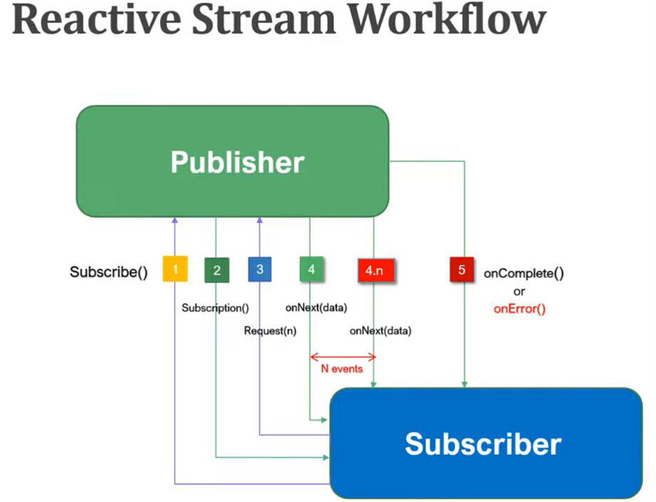
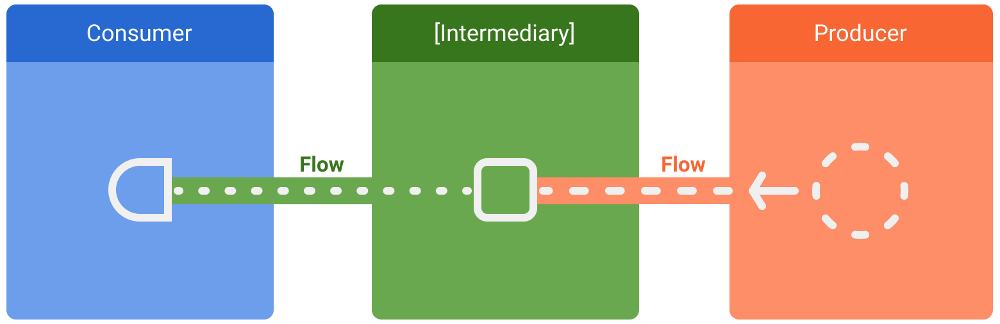
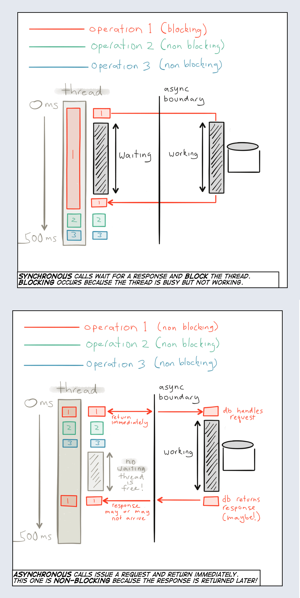
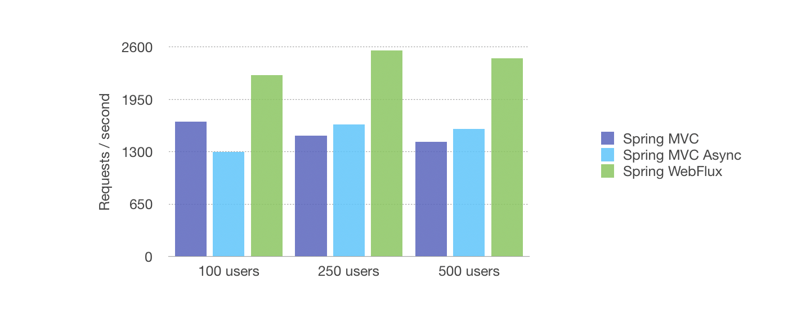

- [Programación reactiva](#programación-reactiva)
  - [Programación Secuencial vs Programación Reactiva](#programación-secuencial-vs-programación-reactiva)
- [RXJava](#rxjava)
  - [Cold Streams y Notificaciones en Tiempo Real](#cold-streams-y-notificaciones-en-tiempo-real)
  - [Testeando RxJava con JUnit y Mockito](#testeando-rxjava-con-junit-y-mockito)
- [Project Reactor](#project-reactor)
  - [Cold Streams y Notificaciones en Tiempo Real](#cold-streams-y-notificaciones-en-tiempo-real-1)
- [Kotlin Flow](#kotlin-flow)
  - [Dependencias](#dependencias)
  - [Ejemplo Simple de Flow](#ejemplo-simple-de-flow)
  - [Productor de Datos y Consumidor](#productor-de-datos-y-consumidor)
  - [SharedFlow y StateFlow](#sharedflow-y-stateflow)
  - [Cold Streams y Notificaciones en Tiempo Real](#cold-streams-y-notificaciones-en-tiempo-real-2)
    - [Ejemplo de Uso de SharedFlow y StateFlow](#ejemplo-de-uso-de-sharedflow-y-stateflow)
  - [Notificaciones usando SharedFlow y StateFlow](#notificaciones-usando-sharedflow-y-stateflow)
- [Bases de Datos con R2DBC](#bases-de-datos-con-r2dbc)
  - [Project Reactor](#project-reactor-1)
  - [RXJava](#rxjava-1)
  - [Kotlin Flows](#kotlin-flows)


## Programación reactiva
La [programación reactiva](https://www.reactivemanifesto.org/es) es un paradigma de programación que se centra en el manejo de flujos de datos y la propagación de cambios. Esto significa que se puede establecer una variable que, cuando cambie, cause que otras variables o cálculos cambien automáticamente.

La [programación reactiva](https://joseluisgs.dev/blogs/2022/2022-12-06-ya-no-se-programar-sin-reactividad.html) se basa en el concepto de variables "observables" y "observadores". Un observable es una fuente de datos o eventos, y un observador es algo que está interesado en esos datos o eventos. Cuando un observable cambia, notifica a todos sus observadores.


Uno de los principales beneficios de la programación reactiva sobre la programación imperativa tradicional es que simplifica el manejo de eventos asincrónicos y múltiples flujos de datos. Es decir,  se refiere a la idea de que puedes tratar una colección de datos como un flujo de eventos. Por ejemplo, podrías tener una lista de pedidos en un sistema de comercio electrónico que se actualiza en tiempo real. En lugar de tener que comprobar constantemente si hay nuevos pedidos, puedes "observar" la lista y configurar tu código para que se ejecute automáticamente cada vez que se añade un nuevo pedido. O en aplicaciones con interfaces de usuario, donde los cambios en los datos a menudo necesitan reflejarse en la interfaz de usuario de forma inmediata. Por ejemplo, en una aplicación de chat, podrías observar la lista de mensajes y actualizar automáticamente la interfaz de usuario cada vez que se añade un nuevo mensaje.

Por último, la programación reactiva puede ayudar a mejorar el rendimiento de las aplicaciones al permitir un manejo más eficiente de los recursos. Por ejemplo, si estás observando una colección de datos que cambia con frecuencia, puedes configurar tu código para que sólo se ejecute cuando realmente se produzca un cambio, en lugar de tener que comprobar constantemente si los datos han cambiado.

Entre las muchas librerías tenemos RxJava, Webflux y Project Reactor, Flows, tec.

### Programación Secuencial vs Programación Reactiva
La programación secuencial y la programación reactiva son dos enfoques diferentes para manejar la concurrencia y la asincronía en el desarrollo de software. Aquí tienes una descripción de cada uno de ellos:

- Programación Secuencial: las operaciones se ejecutan en secuencia, una después de la otra, en un hilo de ejecución único. Las operaciones bloqueantes pueden detener la ejecución hasta que se complete una operación, lo que puede llevar a una espera innecesaria y un uso ineficiente de los recursos y que cada operación espera a que la anterior se complete antes de ejecutarse.

Programación Reactiva:se basa en el manejo de flujos de datos asincrónicos y eventos concurrentes diseñados para reaccionar a los cambios y eventos en tiempo real, en lugar de esperar pasivamente a que se complete una operación. Se basa en la propagación de eventos y la notificación de cambios, lo que permite un enfoque más eficiente y escalable para manejar flujos de datos en tiempo real.

¿Qué es el backpressure? Es un mecanismo que permite a los consumidores de datos controlar la velocidad a la que reciben datos de los productores. En un sistema reactivo, los productores pueden generar datos a una velocidad mucho mayor que la que los consumidores pueden procesar. El backpressure permite a los consumidores indicar a los productores que reduzcan la velocidad de emisión de datos para evitar la sobrecarga y el desbordamiento de memoria.

En resumen, la programación secuencial se basa en la ejecución secuencial de operaciones en un hilo único, mientras que la programación reactiva se centra en el manejo eficiente de flujos de datos asincrónicos y eventos concurrentes, utilizando patrones y operadores reactivos. La programación reactiva es especialmente útil en aplicaciones que requieren un alto rendimiento y capacidad de respuesta en tiempo real.



## RXJava
[RxJava](https://github.com/ReactiveX/RxJava) es una biblioteca para la JVM que permite a los desarrolladores componer programas asincrónicos y basados en eventos utilizando secuencias de datos. Se basa en el paradigma de programación reactiva. Al igual que Project Reactor, RxJava permite componer programas de manera no diferentes lenguajes: Java, JavaScript, C#, 

RxJava ofrece dos tipos principales de secuencias de datos reactivas:

1. **Observable**: representa una secuencia de elementos que pueden emitirse en cualquier momento, desde 0 a N elementos. Es similar a un Stream en Java, pero puede ser asincrónico y no bloqueante. Además, es el más versátil y puede emitir múltiples valores, errores y una señal de finalización.
2. **Single**: representa una secuencia de un solo elemento, o un error. Por lo tanto es recomendable para operaciones que devuelven un solo valor, como una llamada a una API o una consulta a una base de datos y no devuelva nulo. Si puede devolver nulo, es mejor usar Maybe. Por lo tanto es 1.
3. **Maybe**: representa una secuencia que puede emitir un solo elemento, ningún elemento o un error. Es útil cuando una operación puede devolver un valor o no, como una consulta a una base de datos que puede no encontrar ningún resultado o una API cuando devuelve Not Content (204) o null. Por lo tanto es 0 o 1.
4. **Completable**: representa una secuencia que no emite ningún valor, pero solo indica si la operación se completó con éxito o con error. Es útil para operaciones que no devuelven un valor, como escribir en una base de datos o enviar un correo electrónico o las que no devuelven nada (void). Por lo tanto es 0.
5. **Flowable**: similar a Observable, pero con soporte para backpressure. Es decir, permite manejar situaciones en las que un productor de datos es más rápido que un consumidor de datos. En lugar de dejar que el consumidor se sobrecargue con datos, Flowable permite al consumidor indicar cuántos datos está listo para manejar en un momento dado.

Otro tema importante son los Schedulers, que permiten controlar en qué hilo se ejecutan las operaciones. RxJava proporciona varios Schedulers predefinidos, como `Schedulers.io()` para operaciones de entrada/salida, `Schedulers.computation()` para 
operaciones de cálculo intensivo. y `Schedulers.newThread()` para crear un nuevo hilo para cada operación. También puedes crear tus propios Schedulers personalizados si es necesario. `Schedulers.trampoline()`: Ejecuta la tarea en el hilo actual de forma secuencial.

Ambos tipos implementan la interfaz `Publisher` del estándar Reactive Streams, lo que significa que pueden ser utilizados en cualquier lugar donde se espere un Publisher.

RxJava también proporciona una gran cantidad de operadores que puedes utilizar para transformar, combinar, filtrar, y de otra manera manipular estas secuencias de datos de manera similar a los Streams en Java.

Además, RxJava tiene soporte para el manejo de backpressure, similar a Project Reactor.


```kotlin
dependencies {
    implementation("io.reactivex.rxjava3:rxjava:3.0.13") // Asegúrate de usar la última versión
}
```

```java
import io.reactivex.rxjava3.core.Observable;
import io.reactivex.rxjava3.core.Single;

public class Main {
    public static void main(String[] args) {
        Single<String> single = Single.just("Hello, World"); // Fuente de datos
        single.subscribe(System.out::println); // Observador, cuando cambie actúo

        Observable<Integer> observable = Observable.just(1, 2, 3, 4, 5); // fuente de datos
        Observable<Integer> transformedObservable = observable.map(n -> n * 2); // transformo, puedo hacerlo en el original
        transformedObservable.subscribe(System.out::println); // Observador que actúa

        Observable<String> observedForErrors = Observable.just("1", "2", "oops", "4", "5")
            .map(i -> {
                try {
                    return Integer.parseInt(i);
                } catch (NumberFormatException e) {
                    throw new RuntimeException("Error al parsear el número", e);
                }
            })
            .onErrorReturnItem(-1);

        observedForErrors.subscribe(
            System.out::println,
            error -> System.err.println("Se ha producido un error: " + error)
        );
    }
}
```

Y aquí tienes un ejemplo de productor de datos y otro que los consume.
```java
import io.reactivex.rxjava3.core.Observable;

import java.time.Duration;
import java.util.concurrent.TimeUnit;

public class Main {
    public static void main(String[] args) throws InterruptedException {
        // Producimos valores constantes cada segundo... son infinitos
        Observable<Long> intervalObservable = Observable.interval(1, TimeUnit.SECONDS);

        // A veces no sabes cuando se producirán los datos, si no reaccionamos a ello.

        intervalObservable
            .filter(x -> x % 2 == 0)
            .map(x -> x * 10)
            .take(10) // toma al menos al menos x valores
            .subscribe(
                // Se ejecuta cada vez que llega un valor
                value -> System.out.println("Consumido: " + value),
                // Se ejecuta cuando se produce un error
                error -> System.err.println("Se ha producido un error: " + error),
                // Se ejecuta cuando se completa el flujo (no es obligatorio) 
                () -> System.out.println("Completado")
            );

        // Mantén el hilo principal vivo durante un tiempo para que pueda consumir los valores
        Thread.sleep(10000);
    }
}
```

Otros métodos importantes son `Observable.create(emitter -> {...})` que permite crear un Observable personalizado y emitir eventos programáticamente, y `Observable.fromIterable(iterable)` que crea un Observable a partir de una colección iterable.

Ambos tipos de secuencias (Observable, Flowable, etc.) implementan la interfaz Publisher del estándar Reactive Streams, lo que garantiza su interoperabilidad con otras bibliotecas que también lo implementan (como Project Reactor).

RxJava proporciona una gran cantidad de operadores que permiten transformar, combinar, filtrar y manipular estas secuencias de datos de manera similar a los Streams de Jav

`.map()`: Transforma los datos emitidos uno a uno.

`.flatMap()`: Transforma un elemento en un nuevo flujo, y luego "aplana" estos flujos en uno solo (útil para encadenar operaciones asíncronas).

`.filter()`: Filtra los datos emitidos según una condición.

`.reduce()`: Acumula valores en una sola emisión final.

`.zip()`: Combina las emisiones de múltiples flujos en un solo flujo, tomando el N-ésimo elemento de cada uno.

`.onErrorReturnItem()`: Permite devolver un valor por defecto en caso de un error, sin abortar el flujo.

`.take(N)`: Limita la emisión a los primeros N valores.

`.andThen()`: Permite concatenar múltiples flujos de manera secuencial (útil con Completable).

`observeOn(Scheduler)`: Cambia el hilo en el que se ejecutan los operadores posteriores.

`.subscribeOn(Scheduler)`: Cambia el hilo en el que se suscribe al flujo.

`.doOnNext()`: Permite ejecutar una acción secundaria cada vez que se emite un valor, sin modificar el flujo.

`doOnError()`: Permite ejecutar una acción secundaria cuando ocurre un error, sin modificar el flujo.

`doOnComplete()`: Permite ejecutar una acción secundaria cuando el flujo se completa, sin modificar el flujo.

`doOnFinally()`: Permite ejecutar una acción secundaria cuando el flujo termina, ya sea por completarse o por error.

`blockingSubscribe()`: Similar a `subscribe()`, pero bloquea el hilo actual hasta que el flujo se complete o falle. Útil para pruebas o scripts simples.

`blockingAwait()`: Similar a `await()` en otros contextos, bloquea el hilo actual hasta que un `Completable` se complete o falle.


### Cold Streams y Notificaciones en Tiempo Real

En RxJava, los datos son "Cold Streams" por defecto, es decir, un "Flujo frío" es aquel que genera datos cuando un suscriptor comienza a observarlo. Esto significa que cada suscriptor recibe su propia secuencia de datos independiente.

Para crear un flujo que emita datos independientemente de si tiene suscriptores, y donde todos los suscriptores reciben los mismos datos a partir del momento de su suscripción (un "Hot Stream" o Flujo Caliente, como una emisión en directo), se utilizan los Subject (Sujetos).

- `PublishSubject` es un tipo de Subject que emite a los suscriptores los elementos que se emiten después de que se hayan suscrito. Esto permite simular una fuente de datos reactiva y notificaciones en tiempo real, como se muestra en el ejemplo.
- `BehaviorSubject` es otro tipo de Subject que emite el último valor emitido a nuevos suscriptores, además de los valores futuros, ideal para notificaciones de estado.
- `ReplaySubject` almacena todos los valores emitidos y los reenvía a nuevos suscriptores, útil para mantener un historial de eventos, aunque puede consumir más memoria.

Podemos simular una base de datos reactiva utilizando `BehaviorSubject` que permite emitir eventos programáticamente.

```java
import io.reactivex.rxjava3.core.Observable;
import io.reactivex.rxjava3.subjects.PublishSubject;

import java.util.ArrayList;
import java.util.List;
import java.util.Optional;
import java.util.UUID;

public class Funko {
    private final UUID id;
    private final String name;
    private final double price;

    public Funko(UUID id, String name, double price) {
        this.id = id;
        this.name = name;
        this.price = price;
    }

    public UUID getId() {
        return id;
    }

    @Override
    public String toString() {
        return "Funko{" +
                "id=" + id +
                ", name='" + name + '\'' +
                ", price=" + price +
                '}';
    }
}

public class FunkoRepository {
    private final List<Funko> funkos = new ArrayList<>();
    private final BehaviorSubject<List<Funko>> funkoSubject = BehaviorSubject.create();
    private final BehaviorSubject<String> notificationSubject = BehaviorSubject.create();

    public void add(Funko funko) {
        funkos.add(funko);
        funkoSubject.onNext(funkos); // Emitir la lista actualizada
        notificationSubject.onNext("Se ha añadido un nuevo Funko: " + funko); // Emitir una notificación
    }

    public void delete(UUID id) {
        Optional<Funko> funkoToRemove = funkos.stream().filter(f -> f.getId().equals(id)).findFirst();
        funkoToRemove.ifPresent(f -> {
            funkos.remove(f);
            funkoSubject.onNext(funkos); // Emitir la lista actualizada
            notificationSubject.onNext("Se ha eliminado un Funko: " + f); // Emitir una notificación
        });
    }

    // Ocultamos el Subject y exponemos solo el Observable, porque no queremos que nadie emita eventos
    public Observable<List<Funko>> getAllAsObservable() {
        return funkoSubject.hide();
    }
    
    // Ocultamos el Subject y exponemos solo el Observable, porque no queremos que nadie emita eventos
    public Observable<String> getNotificationAsObservable() {
        return notificationSubject.hide();
    }
}

public class Main {
    public static void main(String[] args) throws InterruptedException {
        FunkoRepository repository = new FunkoRepository();

        System.out.println("Sistema de obtención de la lista en Tiempo Real");
        repository.getAllAsObservable().subscribe(
            lista -> System.out.println("👉 Lista de Funkos actualizada: " + lista),
            error -> System.err.println("Se ha producido un error: " + error),
            () -> System.out.println("Completado")
        );

        System.out.println("Sistema de obtención de notificaciones en Tiempo Real");
        repository.getNotificationAsObservable().subscribe(
            notificacion -> System.out.println("🟢 Notificación: " + notificacion),
            error -> System.err.println("Se ha producido un error: " + error),
            () -> System.out.println("Completado")
        );

        Funko funko1 = new Funko(UUID.randomUUID(), "Funko1", 10.0);
        System.out.println("Añadimos un nuevo Funko: " + funko1);
        repository.add(funko1);
        Thread.sleep(5000);

        Funko funko2 = new Funko(UUID.randomUUID(), "Funko2", 20.0);
        System.out.println("Añadimos un nuevo Funko: " + funko2);
        repository.add(funko2);
        Thread.sleep(5000);

        System.out.println("Eliminamos un Funko: " + funko1);
        repository.delete(funko1.getId());
        Thread.sleep(5000);

        Funko funko3 = new Funko(UUID.randomUUID(), "Funko3", 30.0);
        System.out.println("Añadimos un nuevo Funko: " + funko3);
        repository.add(funko3);
        Thread.sleep(5000);

        System.out.println("Eliminamos un Funko: " + funko2);
        repository.delete(funko2.getId());
        Thread.sleep(5000);
    }
}
```

Obtendremos de salida:
```
Sistema de obtención de la lista en Tiempo Real
Sistema de obtención de notificaciones en Tiempo Real
Añadimos un nuevo Funko: Funko{id=f8bbcd96-62bb-45eb-b241-998f6dedec6b, name=Funko1, price=10.0}
👉 Lista de Funkos actualizada: [Funko{id=f8bbcd96-62bb-45eb-b241-998f6dedec6b, name=Funko1, price=10.0}]
🟢 Notificación: Se ha añadido un nuevo Funko: Funko{id=f8bbcd96-62bb-45eb-b241-998f6dedec6b, name=Funko1, price=10.0}
Añadimos un nuevo Funko: Funko{id=d67af3ee-f1da-4543-97ea-ed93a1066cb6, name=Funko2, price=20.0}
👉 Lista de Funkos actualizada: [Funko{id=f8bbcd96-62bb-45eb-b241-998f6dedec6b, name=Funko1, price=10.0}, Funko{id=d67af3ee-f1da-4543-97ea-ed93a1066cb6, name=Funko2, price=20.0}]
🟢 Notificación: Se ha añadido un nuevo Funko: Funko{id=d67af3ee-f1da-4543-97ea-ed93a1066cb6, name=Funko2, price=20.0}
Eliminamos un Funko: Funko{id=f8bbcd96-62bb-45eb-b241-998f6dedec6b, name=Funko1, price=10.0}
👉 Lista de Funkos actualizada: [Funko{id=d67af3ee-f1da-4543-97ea-ed93a1066cb6, name=Funko2, price=20.0}]
🟢 Notificación: Se ha eliminado un Funko: Funko{id=f8bbcd96-62bb-45eb-b241-998f6dedec6b, name=Funko1, price=10.0}
Añadimos un nuevo Funko: Funko{id=0729a565-25d2-4f02-bc30-c503eed2ccad, name=Funko3, price=30.0}
👉 Lista de Funkos actualizada: [Funko{id=d67af3ee-f1da-4543-97ea-ed93a1066cb6, name=Funko2, price=20.0}, Funko{id=0729a565-25d2-4f02-bc30-c503eed2ccad, name=Funko3, price=30.0}]
🟢 Notificación: Se ha añadido un nuevo Funko: Funko{id=0729a565-25d2-4f02-bc30-c503eed2ccad, name=Funko3, price=30.0}
Eliminamos un Funko: Funko{id=d67af3ee-f1da-4543-97ea-ed93a1066cb6, name=Funko2, price=20.0}
👉 Lista de Funkos actualizada: [Funko{id=0729a565-25d2-4f02-bc30-c503eed2ccad, name=Funko3, price=30.0}]
🟢 Notificación: Se ha eliminado un Funko: Funko{id=d67af3ee-f1da-4543-97ea-ed93a1066cb6, name=Funko2, price=20.0}
```

### Testeando RxJava con JUnit y Mockito
Para testear código que utiliza RxJava, puedes usar JUnit junto con Mockito para crear pruebas unitarias efectivas. Aquí tienes un ejemplo de cómo hacerlo:

```java
@ExtendWith(MockitoExtension.class)
public class FunkoServiceTest {

    @Mock
    private FunkoRepository funkoRepository;

    @InjectMocks
    private FunkoService funkoService;

    @BeforeEach
    public void setUp() {
        MockitoAnnotations.openMocks(this);
    }

    @Test
    public void testGetAllFunkos() {
        List<Funko> mockFunkos = Arrays.asList(
            new Funko(UUID.randomUUID(), "Funko1", 10.0),
            new Funko(UUID.randomUUID(), "Funko2", 20.0)
        );

        when(funkoRepository.getAllAsObservable()).thenReturn(Observable.just(mockFunkos));

        // Esto no seria la forma correcta
        List<Funko> result = funkoService.getAllFunkos().blockingFirst();

        assertEquals(2, result.size());
        assertEquals("Funko1", result.get(0).getName());
        assertEquals("Funko2", result.get(1).getName());

        verify(funkoRepository, times(1)).getAllAsObservable();
    }
}
```

Para hacerlo vamos a usar
- `.test()`: Crea un TestObserver que permite hacer aserciones sobre el comportamiento del stream
- `.assertComplete()`: Verifica que el stream se completó exitosamente
- `.assertNoErrors()`: Verifica que no hubo errores
- `.assertValue()`: Para Single, verifica el valor emitido
- `.assertValues()`: Para Observable, verifica todos los valores emitidos
- `.assertValueCount()`: Verifica el número de valores emitidos
- `.assertError()`: Verifica que se emitió un error específico
- `.assertErrorMessage()`: Verifica el mensaje del error

```java

@Test
public void testGetAllFunkos() {
    List<Funko> mockFunkos = Arrays.asList(
        new Funko(UUID.randomUUID(), "Funko1", 10.0),
        new Funko(UUID.randomUUID(), "Funko2", 20.0)
    );

    when(funkoRepository.getAllAsObservable()).thenReturn(Observable.just(mockFunkos));

    // Esto no seria la forma correcta
    funkoService.getAllFunkos().test()
        .assertComplete()
        .assertNoErrors()
        .assertValue(funkos -> funkos.size() == 2 &&
            funkos.get(0).getName().equals("Funko1") &&
            funkos.get(1).getName().equals("Funko2"));
    
    verify(funkoRepository, times(1)).getAllAsObservable();

@Test
public void testGetAllFunkosWithError() {
    when(funkoRepository.getAllAsObservable()).thenReturn(Observable.error(new FunkoException("Database error")));

    funkoService.getAllFunkos().test()
        .assertNotComplete()
        .assertError(FunkoException.class)
        .assertErrorMessage("Database error");

    verify(funkoRepository, times(1)).getAllAsObservable();
}

// Multiples emisiones
@Test
public void testObservableWithMultipleEmissions() {
    when(funkoRepository.getAllAsObservable())
        .thenReturn(Observable.fromIterable(mockFunkos));

    funkoService.getAllFunkos().test()
        .assertComplete()
        .assertNoErrors()
        .assertValueCount(2)  // Verificar cantidad
        .assertValues(mockFunkos.get(0), mockFunkos.get(1)); // Verificar valores exactos

    verify(funkoRepository, times(1)).getAllAsObservable();
}

// Y un ejemplo con TestScheduler para operaciones asíncronas
@Test
public void testWithTestScheduler() {
    TestScheduler testScheduler = new TestScheduler();
    
    when(funkoRepository.getAllAsObservable())
        .thenReturn(Observable.just(mockFunkos)
            .delay(1, TimeUnit.SECONDS, testScheduler));

    TestObserver<List<Funko>> testObserver = funkoService.getAllFunkos().test();
    
    testScheduler.advanceTimeBy(1, TimeUnit.SECONDS);
    
    testObserver.assertComplete()
        .assertNoErrors()
        .assertValueCount(1);
    
    verify(funkoRepository, times(1)).getAllAsObservable();
}
```

## Project Reactor
[Project Reactor](https://projectreactor.io/) es una biblioteca para la JVM que permite a los desarrolladores componer programas asincrónicos y basados en eventos utilizando secuencias de datos. Se basa en el paradigma de programación reactiva y es muy similar a RXJava (las diferencias a este nivel no las encontraás, pero el solo tener dos tipos de datos y el backpreasure más optimizado ayuda, y sobre todo su integración con algunos frameworks). Esto puede ser especialmente útil en aplicaciones con alta concurrencia o con flujos de datos en tiempo real.

Project Reactor ofrece dos tipos principales de secuencias de datos reactivas:

1. **Flux**: representa una secuencia de 0 a N elementos. En otras palabras, un Flux puede emitir múltiples elementos. Es similar a un Stream en Java, pero puede ser asincrónico y no bloqueante.

2. **Mono**: representa una secuencia de 0 a 1 elementos. Un Mono emitirá un elemento o ninguno, y luego completará. Es similar a un Future o a un Optional, pero también puede ser asincrónico y no bloqueante. En el caso de que sea nulo, se puede consultar con `Mono.empty()` o usar `Mono.justOrEmpty(valorNullable)`

Estos dos tipos, Flux y Mono, implementan la interfaz `Publisher` del estándar Reactive Streams, lo que significa que pueden ser utilizados en cualquier lugar donde se espere un Publisher.

Project Reactor también proporciona una gran cantidad de operadores que puedes utilizar para transformar, combinar, filtrar, y de otra manera manipular estas secuencias de datos tal y como has hecho con los Streams (map, filter, etc)

Además, Project Reactor tiene soporte para la programación basada en backpressure, lo que significa que puede manejar situaciones en las que un productor de datos es más rápido que un consumidor de datos. En lugar de dejar que el consumidor se sobrecargue con datos, Project Reactor permite al consumidor indicar cuántos datos está listo para manejar en un momento dado.


```kotlin
dependencies {
    implementation("io.projectreactor:reactor-core:3.4.10") // Asegúrate de usar la última versión
}
```

```java
public class Main {
    public static void main(String[] args) {
        Mono<String> mono = Mono.just("Hello, World"); // Fuente de datos
        mono.subscribe(System.out::println); // Observador, cuando cambie actúo

        Flux<Integer> flux = Flux.just(1, 2, 3, 4, 5); // fuente de datos
        Flux<Integer> transformedFlux = flux.map(n -> n * 2); // transformo, puedo hacerlo en el original
        transformedFlux.subscribe(System.out::println); // Observador que actúa

        Flux<String> flux = Flux.just("1", "2", "oops", "4", "5")
            .map(i -> {
                try {
                    return Integer.parseInt(i);
                } catch (NumberFormatException e) {
                    throw new RuntimeException("Error al parsear el número", e);
                }
            })
            .onErrorReturn(-1);
        flux.subscribe(
            System.out::println,
            error -> System.err.println("Se ha producido un error: " + error)
        );
    }
}
``` 
Te dejo un ejmeplo de productor de datos y otro que lo consume
```java
public static void main(String[] args) throws InterruptedException {
    // Producimos valores constantes cada segundo... son infinitos
    Flux<Long> intervalFlux = Flux.interval(Duration.ofSeconds(1));

    // A veces no sabes cuando se producirán los datos, si no reaccionamos a ello.

    intervalFlux
            .filter(x -> x % 2 == 0)
            .map(x -> x * 10)
            .take(10) // toma al menos al menos x Valores (usa take) o hasta que se complete (usa blockLast)
            .subscribe(
                 // Se ejecuta cada vez que llega un valor
                    value -> System.out.println("Consumido: " + value),
                    // Se ejecuta cuando se produce un error
                    error -> System.err.println("Se ha producido un error: " + error),
                    // Se ejecuta cuando se completa el flujo (no es obligatorio) 
                    () -> System.out.println("Completado") /
            );

    // Mantén el hilo principal vivo durante un tiempo para que pueda consumir los valores
    // Thread.sleep(10000);
    intervalFlux.blockLast(); // como no termina nunca, bloqueamos el hilo principal
    // toma al menos al menos x Valores (usa take) o hasta que se complete (usa blockLast)
}
```

### Cold Streams y Notificaciones en Tiempo Real

Reuerda que Flujo de datos es un "Cold Stream", es decir, un "Flujo frío" es aquel que genera datos cuando un suscriptor comienza a observarlo. Esto significa que cada suscriptor recibe su propia secuencia de datos independiente. 

Pues gracias a esto, podemos hacernos servicios reactivos o leer datos suscribirnos a cambios en la base de datos, de manera que al hacer una modificación nos avise.

Simulemos esto con un array list de una clase DataBase, hay un metodos para escuchar y cada vez que haya un cambio consumimos el Flow.

Para ello haremos uso de `FluxSink` es una interfaz proporcionada por Reactor que permite la generación programática de eventos en un Flux. Se crea un `Flux<T>` usando el método `create`. Este método toma una función lambda que se invoca con un FluxSink. En este caso, la función simplemente almacena el FluxSink en la variable funkoFluxSink para su uso posterior. El método share se utiliza para hacer que este Flux sea "compartido", lo que significa que todos los suscriptores recibirán los mismos eventos.

Otra forma rápida de emitir es usando `Flux.create(sink -> {...})` e implementando el lambda asociado.

```java 
public class FunkoRepository {
    private final List<Funko> funkos = new ArrayList<>();

    // una interfaz proporcionada por Reactor que
    // permite la generación programática de eventos en un Flux.
    private FluxSink<List<Funko>> funkoFluxSink;

    // Usando el método create toma una función lambda que se invoca con un FluxSink.
    // En este caso, la función simplemente almacena el FluxSink
    // en la variable funkoFluxSink para su uso posterior.
    // El método share se utiliza para hacer que este Flux sea "compartido",
    // lo que significa que todos los suscriptores recibirán los mismos eventos.
    private final Flux<List<Funko>> funkoFlux = Flux.<List<Funko>>create(emitter -> this.funkoFluxSink = emitter).share();

    private FluxSink<String> funkoNotification;
    private final Flux<String> funkoNotificationFlux = Flux.<String>create(emitter -> this.funkoNotification = emitter).share();


    public void add(Funko funko) {
        funkos.add(funko);
        funkoFluxSink.next(funkos); // Emite el evento con la lista actualizada
        funkoNotification.next("Se ha añadido un nuevo Funko: " + funko); // Emite el evento con la notificacion
    }

    public void delete(UUID id) {
        Optional<Funko> funkoToRemove = funkos.stream().filter(f -> f.getId().equals(id)).findFirst();
        funkoToRemove.ifPresent(f -> {
            funkos.remove(f);
            funkoFluxSink.next(funkos); // Emite el evento con la lista actualizada
            funkoNotification.next("Se ha eliminado un Funko: " + f); // Emite el evento con la notificacion
        });
    }

    public Flux<List<Funko>> getAllAsFlux() {
        return funkoFlux;
    }

    public Flux<String> getNotificationAsFlux() {
        return funkoNotificationFlux;
    }
}

public class Main {
    public static void main(String[] args) throws InterruptedException {
        FunkoRepository repository = new FunkoRepository();

        System.out.println("Systema de obtención de la lista en Tiempo Real");
        repository.getAllAsFlux().subscribe(
                lista -> System.out.println("👉 Lista de Funkos actulizada: " + lista),
                error -> System.err.println("Se ha producido un error: " + error),
                () -> System.out.println("Completado")
        );

        System.out.println("Sistema de obtención de notificaciones en Tiempo Real");
        repository.getNotificationAsFlux().subscribe(
                notificacion -> System.out.println("🟢 Notificación: " + notificacion),
                error -> System.err.println("Se ha producido un error: " + error),
                () -> System.out.println("Completado")
        );

        Funko funko1 = new Funko(UUID.randomUUID(), "Funko1", 10.0);
        System.out.println("Añadimos un nuevo Funko: " + funko1);
        repository.add(funko1);
        Thread.sleep(5000);

        Funko funko2 = new Funko(UUID.randomUUID(), "Funko2", 20.0);
        System.out.println("Añadimos un nuevo Funko: " + funko2);
        repository.add(funko2);
        Thread.sleep(5000);

        System.out.println("Eliminamos un Funko: " + funko1);
        repository.delete(funko1.getId());
        Thread.sleep(5000);

        Funko funko3 = new Funko(UUID.randomUUID(), "Funko3", 30.0);
        System.out.println("Añadimos un nuevo Funko: " + funko3);
        repository.add(funko3);
        Thread.sleep(5000);

        System.out.println("Eliminamos un Funko: " + funko2);
        repository.delete(funko2.getId());
        Thread.sleep(5000);
    }
}

```

Obtendremos de salida
```
Systema de obtención de la lista en Tiempo Real
Sistema de obtención de notificaciones en Tiempo Real
Añadimos un nuevo Funko: Funko(id=f8bbcd96-62bb-45eb-b241-998f6dedec6b, name=Funko1, price=10.0)
👉 Lista de Funkos actulizada: [Funko(id=f8bbcd96-62bb-45eb-b241-998f6dedec6b, name=Funko1, price=10.0)]
🟢 Notificación: Se ha añadido un nuevo Funko: Funko(id=f8bbcd96-62bb-45eb-b241-998f6dedec6b, name=Funko1, price=10.0)
Añadimos un nuevo Funko: Funko(id=d67af3ee-f1da-4543-97ea-ed93a1066cb6, name=Funko2, price=20.0)
👉 Lista de Funkos actulizada: [Funko(id=f8bbcd96-62bb-45eb-b241-998f6dedec6b, name=Funko1, price=10.0), Funko(id=d67af3ee-f1da-4543-97ea-ed93a1066cb6, name=Funko2, price=20.0)]
🟢 Notificación: Se ha añadido un nuevo Funko: Funko(id=d67af3ee-f1da-4543-97ea-ed93a1066cb6, name=Funko2, price=20.0)
Eliminamos un Funko: Funko(id=f8bbcd96-62bb-45eb-b241-998f6dedec6b, name=Funko1, price=10.0)
👉 Lista de Funkos actulizada: [Funko(id=d67af3ee-f1da-4543-97ea-ed93a1066cb6, name=Funko2, price=20.0)]
🟢 Notificación: Se ha eliminado un Funko: Funko(id=f8bbcd96-62bb-45eb-b241-998f6dedec6b, name=Funko1, price=10.0)
Añadimos un nuevo Funko: Funko(id=0729a565-25d2-4f02-bc30-c503eed2ccad, name=Funko3, price=30.0)
👉 Lista de Funkos actulizada: [Funko(id=d67af3ee-f1da-4543-97ea-ed93a1066cb6, name=Funko2, price=20.0), Funko(id=0729a565-25d2-4f02-bc30-c503eed2ccad, name=Funko3, price=30.0)]
🟢 Notificación: Se ha añadido un nuevo Funko: Funko(id=0729a565-25d2-4f02-bc30-c503eed2ccad, name=Funko3, price=30.0)
Eliminamos un Funko: Funko(id=d67af3ee-f1da-4543-97ea-ed93a1066cb6, name=Funko2, price=20.0)
👉 Lista de Funkos actulizada: [Funko(id=0729a565-25d2-4f02-bc30-c503eed2ccad, name=Funko3, price=30.0)]
🟢 Notificación: Se ha eliminado un Funko: Funko(id=d67af3ee-f1da-4543-97ea-ed93a1066cb6, name=Funko2, price=20.0)
```


## Kotlin Flow
[Kotlin Flow](https://kotlinlang.org/docs/flow.html) es una biblioteca para realizar programación reactiva en el lenguaje Kotlin. Al igual que RxJava y Project Reactor, Kotlin Flow permite a los desarrolladores componer programas asincrónicos y basados en eventos utilizando secuencias de datos.

Kotlin Flow ofrece dos tipos principales de secuencias de datos reactivas:

1. **Flow**: representa una secuencia de valores que son emitidos de manera asincrónica.
2. **StateFlow** y **SharedFlow**: son tipos especiales de Flow que manejan el estado y los eventos compartidos.

Kotlin Flow proporciona una gran cantidad de operadores que puedes utilizar para transformar, combinar, filtrar, y de otra manera manipular estas secuencias de datos.



### Dependencias

Asegúrate de incluir las siguientes dependencias en tu archivo `build.gradle.kts`:

```kotlin
dependencies {
    implementation("org.jetbrains.kotlinx:kotlinx-coroutines-core:1.5.2")
}
```

### Ejemplo Simple de Flow

```kotlin
import kotlinx.coroutines.flow.*
import kotlinx.coroutines.runBlocking

fun main() = runBlocking {
    val simpleFlow = flow {
        emit("Hello, World") // Fuente de datos
    }
    simpleFlow.collect { println(it) } // Observador, cuando cambie actúo

    val numberFlow = flow {
        (1..5).forEach { emit(it) } // fuente de datos
    }
    val transformedFlow = numberFlow.map { it * 2 } // transformo, puedo hacerlo en el original
    transformedFlow.collect { println(it) } // Observador que actúa

    val errorHandlingFlow = flow {
        listOf("1", "2", "oops", "4", "5").forEach {
            emit(it)
        }
    }.map {
        it.toIntOrNull() ?: throw NumberFormatException("Error al parsear el número")
    }.catch { emit(-1) }
    errorHandlingFlow.collect { println(it) }
}
```

### Productor de Datos y Consumidor

```kotlin
import kotlinx.coroutines.flow.*
import kotlinx.coroutines.runBlocking
import kotlinx.coroutines.delay

fun main() = runBlocking {
    // Producimos valores constantes cada segundo... son infinitos
    val intervalFlow = flow {
        var value = 0L
        while (true) {
            emit(value++)
            delay(1000L)
        }
    }

    // A veces no sabes cuando se producirán los datos, si no reaccionamos a ello.
    intervalFlow
        .filter { it % 2 == 0L }
        .map { it * 10 }
        .take(10) // toma al menos 10 valores
        .collect { value ->
            println("Consumido: $value")
        }
}
```


### SharedFlow y StateFlow

En Kotlin Flow, `SharedFlow` y `StateFlow` son dos tipos de flujo que permiten gestionar eventos y estados compartidos de manera eficiente.

- **SharedFlow**: es un flujo caliente que permite emitir eventos a múltiples suscriptores. Puede configurarse para gestionar el buffer y la política de sobrecarga.
- **StateFlow**: es una variante de `SharedFlow` diseñada específicamente para manejar estados. Siempre guarda el último valor emitido y emite ese valor a nuevos suscriptores.

### Cold Streams y Notificaciones en Tiempo Real

Kotlin Flow admite flujos fríos por defecto, es decir, genera datos cuando un suscriptor comienza a observarlos. Esto significa que cada suscriptor recibe su propia secuencia de datos independiente.

Podemos simular una base de datos reactiva usando `MutableSharedFlow o StateFlow` que permite emitir eventos programáticamente.

#### Ejemplo de Uso de SharedFlow y StateFlow

```kotlin
import kotlinx.coroutines.flow.*
import kotlinx.coroutines.runBlocking
import kotlinx.coroutines.launch
import kotlinx.coroutines.channels.BufferOverflow

fun main() = runBlocking {
    // Crear un SharedFlow con configuración de buffer y sobrecarga
    val shared = MutableSharedFlow<String>(
        replay = 1,
        onBufferOverflow = BufferOverflow.DROP_OLDEST
    )
    shared.tryEmit("Valor inicial") // Emitir valor inicial
    val stateFlow = shared.distinctUntilChanged() // Obtener comportamiento tipo StateFlow

    // Suscribirse y observar valores del StateFlow
    launch {
        stateFlow.collect { value ->
            println("Valor del StateFlow: $value")
        }
    }

    // Emitir nuevos valores
    shared.emit("Nuevo Valor 1")
    shared.emit("Nuevo Valor 2")

    delay(5000)
}
```

### Notificaciones usando SharedFlow y StateFlow

Podemos usar `SharedFlow` para manejar notificaciones de manera reactiva, y `StateFlow` para gestionar el estado de manera consistente.

```kotlin
import kotlinx.coroutines.flow.*
import kotlinx.coroutines.runBlocking
import kotlinx.coroutines.launch
import kotlinx.coroutines.channels.BufferOverflow
import kotlinx.coroutines.delay
import java.util.*

data class Funko(val id: UUID, val name: String, val price: Double)

class FunkoRepository {
    private val funkos = mutableListOf<Funko>()
    private val funkoSharedFlow = MutableSharedFlow<List<Funko>>()
    private val notificationSharedFlow = MutableSharedFlow<String>(
        replay = 1,
        onBufferOverflow = BufferOverflow.DROP_OLDEST
    )

    private val notificationStateFlow = notificationSharedFlow.distinctUntilChanged()

    suspend fun add(funko: Funko) {
        funkos.add(funko)
        funkoSharedFlow.emit(funkos) // Emitir la lista actualizada
        notificationSharedFlow.emit("Se ha añadido un nuevo Funko: $funko") // Emitir una notificación
    }

    suspend fun delete(id: UUID) {
        val funkoToRemove = funkos.find { it.id == id }
        funkoToRemove?.let {
            funkos.remove(it)
            funkoSharedFlow.emit(funkos) // Emitir la lista actualizada
            notificationSharedFlow.emit("Se ha eliminado un Funko: $it") // Emitir una notificación
        }
    }

    fun getAllAsFlow(): Flow<List<Funko>> = funkoSharedFlow

    fun getNotificationAsStateFlow(): StateFlow<String> = notificationStateFlow
}

fun main() = runBlocking {
    val repository = FunkoRepository()

    println("Sistema de obtención de la lista en Tiempo Real")
    launch {
        repository.getAllAsFlow().collect { lista ->
            println("👉 Lista de Funkos actualizada: $lista")
        }
    }

    println("Sistema de obtención de notificaciones en Tiempo Real")
    launch {
        repository.getNotificationAsStateFlow().collect { notificacion ->
            println("🟢 Notificación: $notificacion")
        }
    }

    val funko1 = Funko(UUID.randomUUID(), "Funko1", 10.0)
    println("Añadimos un nuevo Funko: $funko1")
    repository.add(funko1)
    delay(5000)

    val funko2 = Funko(UUID.randomUUID(), "Funko2", 20.0)
    println("Añadimos un nuevo Funko: $funko2")
    repository.add(funko2)
    delay(5000)

    println("Eliminamos un Funko: $funko1")
    repository.delete(funko1.id)
    delay(5000)

    val funko3 = Funko(UUID.randomUUID(), "Funko3", 30.0)
    println("Añadimos un nuevo Funko: $funko3")
    repository.add(funko3)
    delay(5000)

    println("Eliminamos un Funko: $funko2")
    repository.delete(funko2.id)
    delay(5000)
}
```

Obtendremos de salida:

```
Sistema de obtención de la lista en Tiempo Real
Sistema de obtención de notificaciones en Tiempo Real
Añadimos un nuevo Funko: Funko(id=f8bbcd96-62bb-45eb-b241-998f6dedec6b, name=Funko1, price=10.0)
👉 Lista de Funkos actualizada: [Funko(id=f8bbcd96-62bb-45eb-b241-998f6dedec6b, name=Funko1, price=10.0)]
🟢 Notificación: Se ha añadido un nuevo Funko: Funko{id=f8bbcd96-62bb-45eb-b241-998f6dedec6b, name=Funko1, price=10.0)
Añadimos un nuevo Funko: Funko{id=d67af3ee-f1da-4543-97ea-ed93a1066cb6, name=Funko2, price=20.0)
👉 Lista de Funkos actualizada: [Funko{id=f8bbcd96-62bb-45eb-b241-998f6dedec6b, name=Funko1, price=10.0}, Funko{id=d67af3ee-f1da-4543-97ea-ed93a1066cb6, name=Funko2, price=20.0)]
🟢 Notificación: Se ha añadido un nuevo Funko: Funko{id=d67af3ee-f1da-4543-97ea-ed93a1066cb6, name=Funko2, price=20.0)
Eliminamos un Funko: Funko{id=f8bbcd96-62bb-45eb-b241-998f6dedec6b, name=Funko1, price=10.0)
👉 Lista de Funkos actualizada: [Funko{id=d67af3ee-f1da-4543-97ea-ed93a1066cb6, name=Funko2, price=20.0)]
🟢 Notificación: Se ha eliminado un Funko: Funko{id=f8bbcd96-62bb-45eb-b241-998f6dedec6b, name=Funko1, price=10.0)
Añadimos un nuevo Funko: Funko{id=0729a565-25d2-4f02-bc30-c503eed2ccad, name=Funko3, price=30.0)
👉 Lista de Funkos actualizada: [Funko{id=d67af3ee-f1da-4543-97ea-ed93a1066cb6, name=Funko2, price=20.0}, Funko{id=0729a565-25d2-4f02-bc30-c503eed2ccad, name=Funko3, price=30.0)]
🟢 Notificación: Se ha añadido un nuevo Funko: Funko{id=0729a565-25d2-4f02-bc30-c503eed2ccad, name=Funko3, price=30.0)
Eliminamos un Funko: Funko{id=d67af3ee-f1da-4543-97ea-ed93a1066cb6, name=Funko2, price=20.0)
👉 Lista de Funkos actualizada: [Funko{id=0729a565-25d2-4f02-bc30-c503eed2ccad, name=Funko3, price=30.0)]
🟢 Notificación: Se ha eliminado un Funko: Funko{id=d67af3ee-f1da-4543-97ea-ed93a1066cb6, name=Funko2, price=20.0)
```


## Bases de Datos con R2DBC
Trabajar reactivamente con bases de datos o servicios, implica que no vamos a bloquear hasta que se resuleva, si no que reaccionaremos cuando se obtenga el resultado. Esto nos ofrece poder reutilizar mejor nuestros recursos. 





Con bases de datos usaremos [R2DBC](https://r2dbc.io/) que nos ofece un driver reactivo para desarrollar [nuestras apps sobre JVM](https://www.baeldung.com/r2dbc). 

### Project Reactor

```kotlin
dependencies {
    implementation("io.r2dbc:r2dbc-h2:0.8.4.RELEASE")
    implementation("io.r2dbc:r2dbc-pool:0.8.5.RELEASE")
    implementation("org.projectreactor:reactor-core:3.4.8")
}
```

```java
public class DatabaseManager {

    private static DatabaseManager instance;

    private final ConnectionFactory connectionFactory;

    private DatabaseManager(String propertiesFilePath) {
        Properties properties = new Properties();
        try (InputStream input = getClass().getClassLoader().getResourceAsStream(propertiesFilePath)) {
            if (input == null) {
                throw new IOException("Imposible localizar " + propertiesFilePath);
            }
            properties.load(input);
        } catch (IOException ex) {
            throw new RuntimeException("Fallo al leer el fichero de propiedades desde " + propertiesFilePath, ex);
        }

        String url = properties.getProperty("database.url");
        String username = properties.getProperty("database.username");
        String password = properties.getProperty("database.password");

        H2ConnectionConfiguration configuration = H2ConnectionConfiguration.builder()
                .url(url)
                .username(username)
                .password(password)
                .build();
        this.connectionFactory = new H2ConnectionFactory(configuration);
    }

    public static synchronized DatabaseManager getInstance(String propertiesFilePath) {
        if (instance == null) {
            instance = new DatabaseManager(propertiesFilePath);
        }
        return instance;
    }

    public ConnectionFactory getConnectionFactory() {
        return this.connectionFactory;
    }
}

public class FunkoRepository {

    private final ConnectionFactory connectionFactory;

    public FunkoRepository(DatabaseManager databaseManager) {
        this.connectionFactory = databaseManager.getConnectionFactory();
    }

    public Flux<Funko> getAllFunkos() {
        String sql = "SELECT * FROM funkos";
        return Flux.usingWhen(
                connectionFactory.create(),
                connection -> Flux.from(connection.createStatement(sql).execute())
                        .flatMap(result -> result.map((row, rowMetadata) -> new Funko(
                                UUID.fromString(row.get("id", String.class)),
                                row.get("name", String.class),
                                row.get("price", Double.class)
                        ))),
                Connection::close
        );
    }

    public Mono<Funko> getFunkoById(UUID id) {
        String sql = "SELECT * FROM funkos WHERE id = $1";
        return Mono.usingWhen(
                connectionFactory.create(),
                connection -> Mono.from(connection.createStatement(sql)
                        .bind("$1", id.toString())
                        .execute())
                        .flatMap(result -> Mono.from(result.map((row, rowMetadata) -> new Funko(
                                UUID.fromString(row.get("id", String.class)),
                                row.get("name", String.class),
                                row.get("price", Double.class)
                        )))),
                Connection::close
        );
    }

    public Mono<Void> insertFunko(Funko funko) {
        String sql = "INSERT INTO funkos (id, name, price) VALUES ($1, $2, $3)";
        return Mono.usingWhen(
                connectionFactory.create(),
                connection -> connection.createStatement(sql)
                        .bind("$1", funko.getId().toString())
                        .bind("$2", funko.getName())
                        .bind("$3", funko.getPrice())
                        .execute()
                        .then(),
                Connection::close
        );
    }

    public Mono<Void> updateFunko(Funko funko) {
        String sql = "UPDATE funkos SET name = $2, price = $3 WHERE id = $1";
        return Mono.usingWhen(
                connectionFactory.create(),
                connection -> connection.createStatement(sql)
                        .bind("$1", funko.getId().toString())
                        .bind("$2", funko.getName())
                        .bind("$3", funko.getPrice())
                        .execute()
                        .then(),
                Connection::close
        );
    }

    public Mono<Void> deleteFunko(UUID id) {
        String sql = "DELETE FROM funkos WHERE id = $1";
        return Mono.usingWhen(
                connectionFactory.create(),
                connection -> connection.createStatement(sql)
                        .bind("$1", id.toString())
                        .execute()
                        .then(),
                Connection::close
        );
    }
}
```

### RXJava

```kotlin	
dependencies {
    implementation("io.reactivex.rxjava3:rxjava:3.0.13")
    implementation("io.reactivex.rxjava3:rxjdbc:1.0.3")
    implementation("com.h2database:h2:1.4.200")
}
```

```java
import java.io.IOException;
import java.io.InputStream;
import java.util.Properties;
import javax.sql.DataSource;
import org.h2.jdbcx.JdbcDataSource;

public class DatabaseManager {

    private static DatabaseManager instance;

    private final DataSource dataSource;

    private DatabaseManager(String propertiesFilePath) {
        Properties properties = new Properties();
        try (InputStream input = getClass().getClassLoader().getResourceAsStream(propertiesFilePath)) {
            if (input == null) {
                throw new IOException("Imposible localizar " + propertiesFilePath);
            }
            properties.load(input);
        } catch (IOException ex) {
            throw new RuntimeException("Fallo al leer el fichero de propiedades desde " + propertiesFilePath, ex);
        }

        String url = properties.getProperty("database.url");
        String username = properties.getProperty("database.username");
        String password = properties.getProperty("database.password");

        JdbcDataSource ds = new JdbcDataSource();
        ds.setURL(url);
        ds.setUser(username);
        ds.setPassword(password);
        this.dataSource = ds;
    }

    public static synchronized DatabaseManager getInstance(String propertiesFilePath) {
        if (instance == null) {
            instance = new DatabaseManager(propertiesFilePath);
        }
        return instance;
    }

    public DataSource getDataSource() {
        return this.dataSource;
    }
}
```

```java
import io.reactivex.rxjava3.core.*;
import io.reactivex.rxjava3.schedulers.Schedulers;
import org.davidmoten.rx.jdbc.Database;

import javax.sql.DataSource;
import java.util.UUID;

public class FunkoRepository {

    private final Database database;

    public FunkoRepository(DatabaseManager databaseManager) {
        this.database = Database.from(databaseManager.getDataSource());
    }

    public Flowable<Funko> getAllFunkos() {
        String sql = "SELECT * FROM funkos";
        return database.select(sql)
                .get(rs -> new Funko(
                        UUID.fromString(rs.getString("id")),
                        rs.getString("name"),
                        rs.getDouble("price")
                ));
    }

    public Single<Funko> getFunkoById(UUID id) {
        String sql = "SELECT * FROM funkos WHERE id = ?";
        return database.select(sql)
                .parameter(id.toString())
                .get(rs -> new Funko(
                        UUID.fromString(rs.getString("id")),
                        rs.getString("name"),
                        rs.getDouble("price")
                ))
                .firstOrError();
    }

    public Completable insertFunko(Funko funko) {
        String sql = "INSERT INTO funkos (id, name, price) VALUES (?, ?, ?)";
        return database.update(sql)
                .parameters(funko.getId().toString(), funko.getName(), funko.getPrice())
                .counts()
                .ignoreElement();
    }

    public Completable updateFunko(Funko funko) {
        String sql = "UPDATE funkos SET name = ?, price = ? WHERE id = ?";
        return database.update(sql)
                .parameters(funko.getName(), funko.getPrice(), funko.getId().toString())
                .counts()
                .ignoreElement();
    }

    public Completable deleteFunko(UUID id) {
        String sql = "DELETE FROM funkos WHERE id = ?";
        return database.update(sql)
                .parameter(id.toString())
                .counts()
                .ignoreElement();
    }
}
```

### Kotlin Flows

```kotlin
dependencies {
    implementation("org.jetbrains.kotlinx:kotlinx-coroutines-core:1.5.2")
    implementation("com.h2database:h2:1.4.200")
}
```

```
import java.io.IOException
import java.io.InputStream
import java.util.Properties
import javax.sql.DataSource
import org.h2.jdbcx.JdbcDataSource

class DatabaseManager private constructor(propertiesFilePath: String) {

    val dataSource: DataSource

    init {
        val properties = Properties()
        val input: InputStream? = this::class.java.classLoader.getResourceAsStream(propertiesFilePath)
        if (input == null) {
            throw IOException("Imposible localizar $propertiesFilePath")
        } else {
            properties.load(input)
            input.close()
        }

        val url = properties.getProperty("database.url")
        val username = properties.getProperty("database.username")
        val password = properties.getProperty("database.password")

        val ds = JdbcDataSource()
        ds.setURL(url)
        ds.user = username
        ds.password = password
        dataSource = ds
    }

    companion object {
        @Volatile
        private var instance: DatabaseManager? = null

        fun getInstance(propertiesFilePath: String): DatabaseManager {
            return instance ?: synchronized(this) {
                instance ?: DatabaseManager(propertiesFilePath).also { instance = it }
            }
        }
    }
}
```

```kotlin

class FunkoRepository(databaseManager: DatabaseManager) {

    private val dataSource: DataSource = databaseManager.dataSource

    private suspend fun <T> useConnection(block: suspend (Connection) -> T): T {
        val connection = dataSource.connection
        try {
            return block(connection)
        } finally {
            connection.close()
        }
    }

    fun getAllFunkos(): Flow<Funko> = flow {
        useConnection { connection ->
            val statement = connection.createStatement()
            val resultSet = statement.executeQuery("SELECT * FROM funkos")
            while (resultSet.next()) {
                emit(Funko(
                    UUID.fromString(resultSet.getString("id")),
                    resultSet.getString("name"),
                    resultSet.getDouble("price")
                ))
            }
        }
    }

    suspend fun getFunkoById(id: UUID): Funko? {
        return useConnection { connection ->
            val statement = connection.prepareStatement("SELECT * FROM funkos WHERE id = ?")
            statement.setString(1, id.toString())
            val resultSet = statement.executeQuery()
            if (resultSet.next()) {
                Funko(
                    UUID.fromString(resultSet.getString("id")),
                    resultSet.getString("name"),
                    resultSet.getDouble("price")
                )
            } else {
                null
            }
        }
    }

    suspend fun insertFunko(funko: Funko) {
        useConnection { connection ->
            val statement = connection.prepareStatement("INSERT INTO funkos (id, name, price) VALUES (?, ?, ?)")
            statement.setString(1, funko.id.toString())
            statement.setString(2, funko.name)
            statement.setDouble(3, funko.price)
            statement.executeUpdate()
        }
    }

    suspend fun updateFunko(funko: Funko) {
        useConnection { connection ->
            val statement = connection.prepareStatement("UPDATE funkos SET name = ?, price = ? WHERE id = ?")
            statement.setString(1, funko.name)
            statement.setDouble(2, funko.price)
            statement.setString(3, funko.id.toString())
            statement.executeUpdate()
        }
    }

    suspend fun deleteFunko(id: UUID) {
        useConnection { connection ->
            val statement = connection.prepareStatement("DELETE FROM funkos WHERE id = ?")
            statement.setString(1, id.toString())
            statement.executeUpdate()
        }
    }
}
```

