- [10. Testeo y pruebas de aplicaciones en el lado del servidor.](#10-testeo-y-pruebas-de-aplicaciones-en-el-lado-del-servidor)
  - [10.1. Test unitarios con JUnit](#101-test-unitarios-con-junit)
  - [10.2. Test con dobles](#102-test-con-dobles)

# 10. Testeo y pruebas de aplicaciones en el lado del servidor.

> 📝 **Nota del Profesor**: "No hay código sin test" debería ser tu mantra. El testing no es opcional, es parte integral del desarrollo profesional.

## 10.1. Test unitarios con JUnit
Un test unitario es una forma de comprobar el correcto funcionamiento de una unidad individual de código fuente. Esta "unidad" puede ser una función, un método, una clase, un módulo, etc. Los tests unitarios son una parte fundamental de la metodología de desarrollo de software conocida como "Desarrollo guiado por pruebas" o Test-Driven Development (TDD).

> 💡 **Tip del Examinador**: En el examen práctico, se valorará que tus tests sean independientes, repetibles y que cubran casos límite (edge cases).

[JUnit](https://junit.org/junit5/docs/current/user-guide/) es un marco de pruebas unitarias para el lenguaje de programación Java. Proporciona anotaciones para definir los tests y para configurar el comportamiento del test, así como aserciones para verificar el comportamiento del código que se está probando.

Aquí tienes un ejemplo básico de un test unitario con JUnit:

```java
class CalculadoraTest {

    Calculadora calculadora = new Calculadora(); //

    // Antes de cada test
    @BeforeEach
    void setUp() {
        calculadora = new Calculadora();
    }

    @Test
    void sumar() {
        assertAll("Suma",
                () -> assertEquals(5, calculadora.sumar(2, 3), "2 + 3 = 5"),
                () -> assertEquals(5, calculadora.sumar(3, 2), "3 + 2 = 5"),
                () -> assertEquals(0, calculadora.sumar(0, 0), "0 + 0 = 0"),
                () -> assertEquals(-1, calculadora.sumar(2, -3), "2 + (-3) = -1")
        );

    }

    // Otros

    @Test
    void dividir() {
        assertAll("División",
                () -> assertEquals(2, calculadora.dividir(6, 3), "6 / 3 = 2"),
                () -> assertEquals(0, calculadora.dividir(3, 6), "3 / 6 = 0"),
                () -> assertEquals(-2, calculadora.dividir(6, -3), "6 / (-3) = -2")
        );
    }

    @Test
    void dividirPorZeroException() {
        var ex = assertThrows(OperacionNoValidaException.class, () -> calculadora.dividir(2, 0), "No se puede dividir por cero");
        assertEquals("No se puede dividir por cero", ex.getMessage());

    }
}
```

Este código representa un conjunto de tests unitarios para una clase `Calculadora`. Aquí están las partes más importantes:

- **Clase de prueba**: Definimos una clase de prueba `CalculadoraTest`. Por convención, esta clase tiene el mismo nombre que la clase que estamos probando (`Calculadora`), con la palabra `Test` añadida al final.

- **Conjunto**: En el método `setUp`, que está anotado con `@BeforeEach`, inicializamos la `Calculadora`. Este método se ejecuta antes de cada test unitario.

- **Tests unitarios**: Los métodos `testSuma` y `testResta` son tests unitarios, como lo indica la anotación `@Test`. Cada uno de estos métodos prueba un comportamiento específico de la `Calculadora`.

- **Aserciones**: Dentro de cada test unitario, usamos el método `assertEquals` para verificar el comportamiento de la `Calculadora`. `assertEquals` es una aserción que verifica que dos valores son iguales. Si no lo son, el test unitario falla.

En JUnit, las aserciones son fundamentales para verificar si el código funciona como se espera. Algunas de las aserciones más comunes en JUnit son:

- `assertEquals(expected, actual)`: Verifica que el valor esperado y el valor real son iguales.
- `assertNotEquals(unexpected, actual)`: Verifica que el valor inesperado y el valor real no son iguales.
- `assertTrue(condition)`: Verifica que una condición es verdadera.
- `assertFalse(condition)`: Verifica que una condición es falsa.
- `assertNull(object)`: Verifica que un objeto es nulo.
- `assertNotNull(object)`: Verifica que un objeto no es nulo.

## 10.2. Test con dobles
Los "dobles de prueba" (test doubles) son sustitutos de los componentes del sistema que tu código está diseñado para interactuar. Los "dobles de prueba" pueden ser útiles cuando los componentes reales son difíciles o imposibles de incorporar en un test unitario o simplemente quieres hacer un test unitario sin realizar la integración de dicho componente, o simular su comportamiento.

> ⚠️ **Advertencia de Seguridad**: No uses mocks para evitar testar la lógica de negocio real. Los mocks son para dependencias externas, no para reemplazar tus propias clases.

```mermaid
graph LR
    SUT[Sistema Bajo Test]
    Mock[Mock]
    Dependencia[Dependencia Real]
    
    SUT -->|Usa| Mock
    SUT -->|Podría usar| Dependencia
    
    style Mock fill:#74c0fc
    style Dependencia fill:#ffd43b
```



Un "mock" es un tipo de "doble de prueba" que puede preprogramarse para actuar de cierta manera durante un test. Por ejemplo, un mock puede ser programado para devolver ciertos valores cuando se le llame, o para lanzar una excepción cuando se le llame de una determinada manera. Los mocks también pueden registrar cómo se les llama, lo que permite verificar que el código se comporta de la forma esperada.

[Mockito](https://site.mockito.org/) es un popular marco de pruebas en Java que proporciona una API para crear y usar mocks dentro de JUnit.

Podemos usar `@Mock` para crear un mock de `Calculadora` y `@InjectMocks` para inyectar ese mock en otra clase que estemos probando. Supongamos que tenemos una clase `Matematicas` que usa `Calculadora`. Además podemos verificar que se han llamado los métodos:

```java
public class Matematicas {

    private Calculadora calculadora;

    public Matematicas(Calculadora calculadora) {
        this.calculadora = calculadora;
    }

    public int dobleSuma(int a, int b) {
        return calculadora.suma(a, b) * 2;
    }

    public int dobleResta(int a, int b) {
        return calculadora.resta(a, b) * 2;
    }
}
```

Podríamos testear `Matematicas` con Mockito de la siguiente manera, simulando la calculadora:

```java
@ExtendWith(MockitoExtension.class)
class CalculadoraServiceTest {

    @Mock
    private Calculadora calculadora;

    @InjectMocks
    private CalculadoraService calculadoraService;

    @Test
    void sumar() {
        // Arrange
        // Cuando llamemos a calculadora....
        when(calculadora.sumar(2, 3)).thenReturn(5);

        // Act
        int resultado = calculadoraService.sumar(2, 3);

        // Assert
        assertEquals(resultado, 5);

        // Verificar que que ha llamado a...
        verify(calculadora, times(1)).sumar(2, 3);
    }

    // Otros test
    
    @Test
    void multiplicar() {
        // Arrange
        // Cuando llamemos a calculadora.... (podemos usar comodines, que es cualquier cosa)
        when(calculadora.multiplicar(anyInt(), anyInt())).thenReturn(6);

        // Act
        int resultado = calculadoraService.multiplicar(2, 3);

        // Assert
        assertEquals(resultado, 6);

        // Verificar que que ha llamado a...
        verify(calculadora, times(1)).multiplicar(anyInt(), anyInt());
    }

    @Test
    void dividir() throws OperacionNoValidaException {
        // Arrange
        // Cuando llamemos a calculadora....
        when(calculadora.dividir(6, 3)).thenReturn(2);

        // Act
        int resultado = calculadoraService.dividir(6, 3);

        // Assert
        assertEquals(resultado, 2);

        // Verificar que que ha llamado a...
        verify(calculadora, times(1)).dividir(6, 3);
    }

    @Test
    void dividirPorZero() throws OperacionNoValidaException {
        // Arrange
        // Cuando llamemos a calculadora....
        when(calculadora.dividir(6, 0)).thenThrow(new OperacionNoValidaException("No se puede dividir por cero"));

        // Act
        try {
            calculadoraService.dividir(6, 0);
        } catch (OperacionNoValidaException e) {
            // Assert
            assertEquals(e.getMessage(), "No se puede dividir por cero");
        }

        // Verificar que que ha llamado a...
        verify(calculadora, times(1)).dividir(6, 0);
    }
}
```

Aquí, usamos `@Mock` para crear un mock de `Calculadora` y `@InjectMocks` para inyectar ese mock en `CalculadoraService`. En cada test unitario, usamos `when` para especificar cómo debe comportarse el mock de `Calculadora`, y luego verificamos que `CalculadoraService` se comporta de la manera esperada cuando usa ese mock.