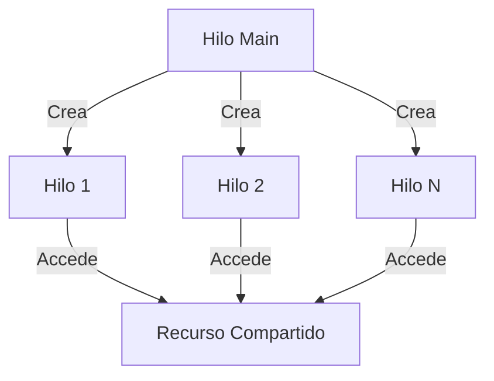
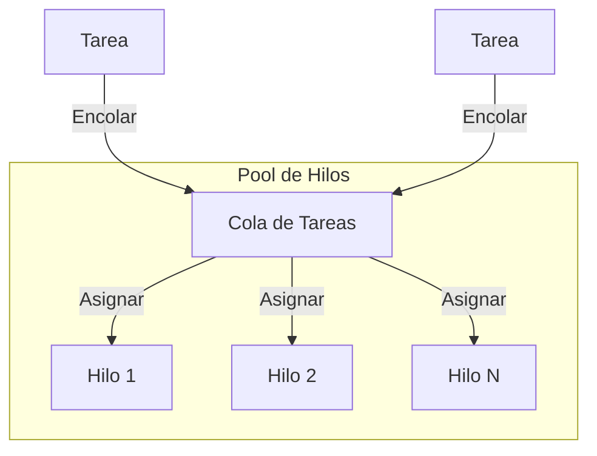
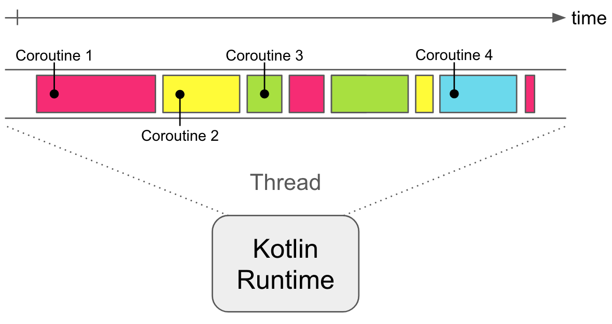

- [11. Programación concurrente y asíncrona.](#11-programación-concurrente-y-asíncrona)
  - [11.1. Programación Concurrente](#111-programación-concurrente)
  - [11.2. Introducción a la Sincronía y Asincronía en Programación](#112-introducción-a-la-sincronía-y-asincronía-en-programación)
    - [11.2.1. ¿Qué es la Sincronía?](#1121-qué-es-la-sincronía)
    - [11.2.2. ¿Qué es la Asincronía?](#1122-qué-es-la-asincronía)
    - [11.2.3. Escenarios Comunes Donde Se Presenta la Asincronía](#1123-escenarios-comunes-donde-se-presenta-la-asincronía)
    - [11.2.4. ¿Por Qué Es Importante Programar de Manera Asíncrona?](#1124-por-qué-es-importante-programar-de-manera-asíncrona)
  - [11.3. Hilos](#113-hilos)
  - [11.4. Pool de Hilos](#114-pool-de-hilos)
  - [11.5. Futuros y Promesas](#115-futuros-y-promesas)
    - [11.5.1. Encadenando operaciones con CompletableFuture](#1151-encadenando-operaciones-con-completablefuture)
    - [11.5.2. Manejo de errores con CompletableFuture](#1152-manejo-de-errores-con-completablefuture)
    - [11.5.3. Combinando múltiples CompletableFuture](#1153-combinando-múltiples-completablefuture)
    - [11.5.4. ¿Cuándo usar Future y CompletableFuture?](#1154-cuándo-usar-future-y-completablefuture)
  - [11.6. Sección crítica y sincronización](#116-sección-crítica-y-sincronización)
  - [11.7. Kotlin Corrutinas](#117-kotlin-corrutinas)
    - [11.7.1. ¿Qué son las Corrutinas?](#1171-qué-son-las-corrutinas)
    - [11.7.2. ¿Qué es una función suspendida?](#1172-qué-es-una-función-suspendida)
    - [11.7.3. Inicializadores: `runBlocking`, `launch`, y `async`](#1173-inicializadores-runblocking-launch-y-async)
      - [11.7.3.1. `runBlocking`](#11731-runblocking)
      - [11.7.3.2. `launch`](#11732-launch)
      - [11.7.3.3. `async` y `await`](#11733-async-y-await)
    - [11.7.4. Scope y Contextos](#1174-scope-y-contextos)
      - [11.7.4.1. Coroutine Scope](#11741-coroutine-scope)
      - [11.7.4.2. Dispatchers](#11742-dispatchers)
    - [11.7.5. Ejemplos de Uso](#1175-ejemplos-de-uso)
      - [11.7.5.1. Carga y procesamiento de datos en paralelo](#11751-carga-y-procesamiento-de-datos-en-paralelo)
      - [11.7.5.2. Cancelación de corrutinas](#11752-cancelación-de-corrutinas)
      - [11.7.5.3. Manejo de excepciones](#11753-manejo-de-excepciones)

# 11. Programación concurrente y asíncrona.

> 📝 **Nota del Profesor**: La concurrencia es uno de los temas más desafiantes en programación. Dominar hilos, Futures y corrutinas te diferencia de un programador promedio.

## 11.1. Programación Concurrente
Programación Concurrente es un paradigma de programación que permite la ejecución de múltiples procesos o hilos de manera simultánea o intercalada, a fin de mejorar el rendimiento y la eficiencia de un programa. En un sistema con capacidad concurrente, varias tareas pueden progresar al mismo tiempo, en lugar de esperar que una tarea se complete antes de comenzar otra. Esta capacidad es particularmente útil en sistemas multitarea o multiproceso y es fundamental para el desarrollo de aplicaciones modernas y de alto rendimiento.

### 11.2. Introducción a la Sincronía y Asincronía en Programación

En el mundo de la programación, es fundamental comprender los conceptos de sincronía y asincronía, ya que influyen en cómo se ejecutan las tareas dentro de nuestras aplicaciones y, en última instancia, en su rendimiento y capacidad de respuesta.

#### 11.2.1. ¿Qué es la Sincronía?

La sincronía se refiere a la ejecución de tareas de manera secuencial. Cuando una tarea se ejecuta de manera síncrona, el programa espera a que esa tarea termine antes de pasar a la siguiente. Esto es fácil de entender y de implementar, ya que el flujo del programa es lineal y predecible. Sin embargo, puede llevar a problemas de rendimiento, especialmente cuando se trata de tareas que llevan mucho tiempo, como operaciones de entrada/salida (E/S) o tareas computacionalmente intensivas.

**Ejemplo de Sincronía:**

```java
public void procesoSincrono() {
    tarea1();
    tarea2();
    tarea3();
}
```
En este ejemplo, `tarea2` no comenzará hasta que `tarea1` haya terminado, y `tarea3` no comenzará hasta que `tarea2` haya terminado.

#### 11.2.2. ¿Qué es la Asincronía?

La asincronía, por otro lado, permite que las tareas se ejecuten de manera concurrente o paralela. Cuando una tarea se ejecuta de manera asíncrona, el programa no espera a que esa tarea termine antes de pasar a la siguiente. En su lugar, las tareas pueden ejecutarse en segundo plano, lo que permite que otras tareas continúen ejecutándose sin bloqueo.

**Ejemplo de Asincronía:**

```java
public void procesoAsincrono() {
    CompletableFuture.runAsync(() -> tarea1());
    CompletableFuture.runAsync(() -> tarea2());
    CompletableFuture.runAsync(() -> tarea3());
}
```
En este ejemplo, `tarea1`, `tarea2` y `tarea3` pueden ejecutarse en paralelo, lo que puede llevar a un mejor rendimiento del programa.


#### 11.2.3. Escenarios Comunes Donde Se Presenta la Asincronía

- **Operaciones de Entrada/Salida (E/S):** Lectura de archivos, llamadas a bases de datos, solicitudes de red, etc.
- **Interfaces de Usuario (UI):** En aplicaciones con interfaces gráficas, es crucial que la UI se mantenga receptiva mientras se realizan operaciones de larga duración en segundo plano.
- **Tareas Computacionales:** Algoritmos y cálculos que requieren mucho tiempo de CPU.

#### 11.2.4. ¿Por Qué Es Importante Programar de Manera Asíncrona?

**1. Rendimiento Mejorado:**
   - **Mejor Utilización de Recursos:** Permitir que las tareas se ejecuten en paralelo puede llevar a una mejor utilización de los recursos del sistema, como la CPU y la memoria.
   - **Reducción de Bloqueos:** El uso de asincronía puede reducir los bloqueos en el sistema, lo que lleva a un rendimiento global más eficiente.

**2. Mejora de la Experiencia del Usuario:**
   - **Interactividad:** En aplicaciones con interfaz de usuario, la asincronía asegura que la UI permanezca receptiva, mejorando la experiencia del usuario.
   - **Tiempo de Respuesta:** Las operaciones de red y de E/S se pueden realizar en segundo plano, mejorando el tiempo de respuesta de la aplicación.

**3. Escalabilidad:**
   - **Manejo de Carga:** Las aplicaciones asíncronas pueden manejar mejor las cargas pesadas y simultáneas, como en servidores web que gestionan múltiples solicitudes al mismo tiempo.

### 11.3. Hilos
Los hilos en Java son utilizados para lograr la ejecución concurrente de tareas en un programa. Permiten que múltiples secuencias de instrucciones se ejecuten de forma simultánea, lo que puede mejorar la eficiencia y la capacidad de respuesta de una aplicación. Por ejemplo, un hilo puede ejecutar una tarea mientras otro hilo ejecuta otra tarea.

> ⚠️ **Advertencia de Seguridad**: Los hilos comparten recursos, por lo que debes tener cuidado con la concurrencia y la sincronización. Las condiciones de carrera pueden causar comportamientos impredecibles y difíciles de depurar.

> 💡 **Tip del Examinador**: En Java, extiende Thread o implementa Runnable. Recuerda que Thread no devuelve resultados; para eso usa Callable y Future.



En Java, puedes trabajar con hilos de dos maneras principales: heredando de la clase `Thread` o implementando la interfaz `Runnable`. Al heredar de la clase Thread, debes sobrescribir el método `run()`, que contendrá el código que se ejecutará en el hilo. Al implementar la interfaz Runnable, debes proporcionar una implementación del método run() en una clase separada y luego crear una instancia de Thread pasando esa instancia de Runnable como argumento. Pero piensa que un hilo no devuelve nada, por lo que es un "lanzar y a ejecutar".

Debemos tener en cuenta que los hilos comparten recursos, por lo que debemos tener cuidado con la concurrencia y la sincronización de los mismos. Si queremos podemos usar un almacen compartid, pero eso presenta unos problemas que luego ya veremos: Acceso a la Sección Crítica y por lo tanto usar métodos que nos permitan un acceso exclusivo y sincronizar las operaciones.

Recuerda que un programa siempre esta formado por un hilo llamado Main del que parte otros hilos, por lo que es utilo usar el método `join()` sin queremos que nuestro hilo Main espere al resto. Este método se utiliza para hacer que un hilo espere hasta que otro hilo haya terminado su ejecución. Puedes llamar al método join() en un hilo para esperar a que otro hilo termine antes de continuar con la ejecución del hilo actual. Además, ten en cuenta que ya no se ejecuta de forma secuencial, si no paralela, por lo que el tiempo de ejecución será lo que tarde el hilo más largo.

```java
public class EjemploJoin {
    public static void main(String[] args) throws InterruptedException {
        Thread hilo1 = new Thread(() -> {
            System.out.println("Hilo 1 iniciado");
            try {
                Thread.sleep(2000); // Simula una tarea que toma 2 segundos
            } catch (InterruptedException e) {
                e.printStackTrace();
            }
            System.out.println("Hilo 1 terminado");
        });

        Thread hilo2 = new Thread(() -> {
            System.out.println("Hilo 2 iniciado");
            try {
                Thread.sleep(1000); // Simula una tarea que toma 1 segundo
            } catch (InterruptedException e) {
                e.printStackTrace();
            }
            System.out.println("Hilo 2 terminado");
        });

        hilo1.start();
        hilo2.start();

        hilo1.join(); // Espera a que hilo1 termine
        hilo2.join(); // Espera a que hilo2 termine

        System.out.println("Todos los hilos han terminado");
    }
}
```

### 11.4. Pool de Hilos
Un pool de hilos (thread pool) es una colección de hilos preinicializados y listos para ejecutar tareas. En lugar de crear y destruir hilos para cada tarea, un pool de hilos mantiene un conjunto de hilos en espera y los reutiliza para ejecutar tareas. Esto evita el costo de creación y destrucción de hilos repetidamente, lo que puede mejorar el rendimiento y la eficiencia de la aplicación.

> 📝 **Nota del Profesor**: El ExecutorService es la forma moderna y recomendada de gestionar hilos. Nunca crees hilos directamente en producción.



Aquí tienes un ejemplo de cómo utilizar un ExecutorService y un pool de hilos:
    
```java
    public class EjemploThreadPool {
    public static void main(String[] args) {
        // Crea un ExecutorService con un pool de 5 hilos
        ExecutorService executor = Executors.newFixedThreadPool(5);

        // Envía 10 tareas al ExecutorService
        for (int i = 0; i < 10; i++) {
            int taskId = i;
            executor.submit(() -> {
                System.out.println("Tarea " + taskId + " ejecutada por " + Thread.currentThread().getName());
            });
        }

        // Apaga el ExecutorService después de que todas las tareas hayan sido enviadas
        executor.shutdown();
    }
}
```

El pool de hilos administrado por el ExecutorService se encarga de ejecutar las tareas en los hilos disponibles. Si hay más tareas que hilos en el pool, las tareas adicionales esperarán en una cola hasta que haya un hilo disponible para ejecutarlas. Esto permite controlar la concurrencia y administrar eficientemente la ejecución de las tareas.

Además, podemos ejecutar una tarea periódicamente en segundo plano cada cierto tiempo usando ShecduledExecutorService. Este tipo de ExecutorService es una subinterfaz de ExecutorService que proporciona métodos para programar la ejecución de tareas en el futuro. Por ejemplo, podemos programar una tarea para que se ejecute después de un retraso inicial o para que se ejecute periódicamente cada cierto tiempo.

```java
public class EjemploScheduledThreadPool {
    public static void main(String[] args) {
        // Crea un ScheduledExecutorService con un pool de 5 hilos
        ScheduledExecutorService executor = Executors.newScheduledThreadPool(5);

        // Programa una tarea para que se ejecute después de un retraso inicial de 2 segundos
        ScheduledFuture<?> future1 = executor.schedule(() -> {
            System.out.println("Tarea 1 ejecutada por " + Thread.currentThread().getName());
        }, 2, TimeUnit.SECONDS);

        // Tarea que se ejecuta cada 30 segundos despues delos 5 segundos iniciales
        ScheduledFuture<?> future2 = executor.scheduleAtFixedRate(() -> {
            System.out.println("Tarea 2 ejecutada por " + Thread.currentThread().getName());
        }, 5, 30, TimeUnit.SECONDS);

        // Programa una tarea para que se ejecute periódicamente cada 1 segundo al instante de crearse
        ScheduledFuture<?> future2 = executor.scheduleAtFixedRate(() -> {
            System.out.println("Tarea 2 ejecutada por " + Thread.currentThread().getName());
        }, 0, 1, TimeUnit.SECONDS);

        // Programa una tarea para que se ejecute periódicamente cada 2 segundos después de que la tarea anterior haya terminado
        ScheduledFuture<?> future3 = executor.scheduleWithFixedDelay(() -> {
            System.out.println("Tarea 3 ejecutada por " + Thread.currentThread().getName());
        }, 0, 2, TimeUnit.SECONDS);

        // Apaga el ExecutorService después de 10 segundos
        executor.schedule(() -> {
            executor.shutdown();
        }, 10, TimeUnit.SECONDS);
    }
}
```

### 11.5. Futuros y Promesas
Un `Future` es un objeto que representa el resultado de una tarea asíncrona. Cuando se crea un Future, se inicia una tarea en un hilo separado. El Future se puede utilizar para comprobar el estado de la tarea, cancelarla o esperar a que termine y obtener su resultado. Al contrario que los hilos, los Futures están pensandos para devolver un resultado, por lo que implementan la interfaz `Callable`. Recuerda en Java, la interfaz Callable se utiliza para representar una tarea que devuelve un resultado y puede lanzar una excepción. La interfaz Future se utiliza para representar el resultado futuro de una tarea asíncrona y proporciona métodos para obtener el resultado y controlar el estado de la tarea. Esto que quiere decir, que nos indica que este resultado estará en algún momento del futuro. Si nuestro código llega antes de que esté, se espera, si llega cuando ya está el resultado lo obtiene. Es decir, utilizamos el método `get()` del objeto Future para esperar a que la tarea se complete y obtener el resultado. Si la tarea aún no ha finalizado, el método get() bloqueará hasta que esté disponible. También se pueden utilizar otros métodos de Future para controlar el estado de la tarea, como `isDone()` para verificar si la tarea ha finalizado o cancelarla si pasa un timeOut.

Si no quieres usar un Executer puedes usar un` CompletbleFuture`. CompletableFuture es una clase en Java que proporciona una forma más flexible y funcional de trabajar con tareas asíncronas y sus resultados futuros. Permite encadenar operaciones, combinar múltiples CompletableFuture y aplicar transformaciones a los resultados de manera más intuitiva. A diferencia de los Future convencionales, los CompletableFuture ofrecen una serie de métodos que permiten especificar acciones a realizar cuando una tarea se completa, se cancela o se produce una excepción. Además, también proporcionan métodos para combinar y encadenar tareas de forma más concisa y expresiva.

```java	
public class EjemploFutureCallable {
    public static void main(String[] args) {
        // Crea un ExecutorService con un pool de 1 hilo
        ExecutorService executor = Executors.newSingleThreadExecutor();

        // Crea una instancia de Callable que devuelve un resultado de tipo String
        Callable<String> callableTask = () -> {
            Thread.sleep(2000); // Simula una tarea que tarda 2 segundos en completarse
            return "Resultado de la tarea";
        };

        // Envía la tarea al ExecutorService y obtiene un Future que representa el resultado futuro
        Future<String> future = executor.submit(callableTask);

        // Realiza otras operaciones mientras la tarea se está ejecutando en segundo plano

        try {
            // Espera a que la tarea se complete y obtiene el resultado
            String resultado = future.get();
            System.out.println("Resultado: " + resultado);
        } catch (Exception e) {
            e.printStackTrace();
        }

        // Apaga el ExecutorService después de que todas las tareas hayan sido enviadas
        executor.shutdown();

        // Un ejemplo con CompletableFutureAsync
        CompletableFuture<String> completableFuture = CompletableFuture.supplyAsync(() -> {
            try {
                Thread.sleep(2000); // Simula una tarea que tarda 2 segundos en completarse
            } catch (InterruptedException e) {
                e.printStackTrace();
            }
            return "Resultado de la tarea";
        });

        try {
            // Espera a que la tarea se complete y obtiene el resultado
            String resultado = completableFuture.get();
            System.out.println("Resultado: " + resultado);
        } catch (Exception e) {
            e.printStackTrace();
        }
    }
}
```

#### 11.5.1. Encadenando operaciones con CompletableFuture
Una de las ventajas de CompletableFuture es la capacidad de encadenar múltiples operaciones.

````java
import java.util.concurrent.*;

public class CompletableFutureChainExample {
    public static void main(String[] args) {
        CompletableFuture.supplyAsync(() -> {
            return "Tarea 1";
        }).thenApply(result -> {
            return result + " -> Tarea 2";
        }).thenApply(result -> {
            return result + " -> Tarea 3";
        }).thenAccept(result -> {
            System.out.println(result);
        }).join();
    }
}
````
#### 11.5.2. Manejo de errores con CompletableFuture
CompletableFuture permite manejar excepciones de forma eficiente.

```java
import java.util.concurrent.*;

public class CompletableFutureExceptionExample {
    public static void main(String[] args) {
        CompletableFuture.supplyAsync(() -> {
            if (true) {
                throw new RuntimeException("Ocurrió un error");
            }
            return "Tarea exitosa";
        }).exceptionally(ex -> {
            System.out.println("Excepción capturada: " + ex.getMessage());
            return "Valor por defecto"; // valor por defecto en caso de error
        }).thenAccept(result -> {
            System.out.println(result);
        }).join();
    }
}
````

#### 11.5.3. Combinando múltiples CompletableFuture
Puedes combinar múltiples CompletableFuture para ejecutar tareas en paralelo.

```java
import java.util.concurrent.*;

public class CompletableFutureCombineExample {
    public static void main(String[] args) {
        CompletableFuture<Integer> future1 = CompletableFuture.supplyAsync(() -> {
            return 2;
        });

        CompletableFuture<Integer> future2 = CompletableFuture.supplyAsync(() -> {
            return 3;
        });

        CompletableFuture<Integer> combinedFuture = future1.thenCombine(future2, (result1, result2) -> {
            return result1 + result2;
        });

        combinedFuture.thenAccept(result -> {
            System.out.println("Resultado combinado: " + result);
        }).join();
    }
}
```

#### 11.5.4. ¿Cuándo usar Future y CompletableFuture?

Future
- Tareas simples: Para casos simples donde solo necesitas ejecutar una tarea asincrónica y obtener el resultado posteriormente.
- Compatibilidad con versiones anteriores: Si trabajas en un proyecto que debe ser compatible con versiones anteriores a Java 8.

CompletableFuture
- Manipulación avanzada de tareas asincrónicas: Ideal para encadenar múltiples operaciones, manejar errores y combinar tareas asincrónicas.
- Reactividad y programación funcional: Permite un estilo de programación más reactivo y funcional, lo que hace que el código sea más legible y mantenible.
- Modernización: Si estás trabajando en Java 8 o posterior y quieres aprovechar las capacidades avanzadas del lenguaje.

### 11.6. Sección crítica y sincronización
Una sección crítica es una sección de código que accede a un recurso compartido y que debe ser ejecutada de forma exclusiva. Esto significa que sólo un hilo puede ejecutar la sección crítica en un momento dado. Si varios hilos intentan ejecutar la sección crítica al mismo tiempo, pueden producirse errores o resultados inesperados.

Para proteger un recurso compartido podemos hgacer uso de:
- [Métodos sincronizados](https://www.baeldung.com/java-synchronized): el método `synchronized` es una forma sencilla de lograr la sincronización en Java. Cuando se declara un método como synchronized, solo un hilo puede ejecutar ese método a la vez. Los demás hilos que intenten acceder al método tendrán que esperar hasta que el hilo actual haya terminado de ejecutarlo.
- [Cerrojos Reentrantes](https://www.baeldung.com/java-concurrent-locks): la interfaz `Lock` y su implementación más común, `ReentrantLock`, proporcionan una forma más flexible de lograr la sincronización en Java. A diferencia de synchronized, los Locks permiten adquirir y liberar explícitamente los bloqueos, lo que brinda un mayor control sobre las secciones críticas de código. Además permite la equidad y justicia asegurando que el hilo que más lleva esperando pueda obtener el recurso.
- [Variables atómicas](https://www.baeldung.com/java-atomic-variables): son un tipo especial de variables en Java que proporcionan operaciones atómicas, lo que significa que las operaciones en estas variables se ejecutan como una sola unidad indivisible, sin ser interrumpidas por otros hilos. Esto garantiza que las operaciones en las variables atómicas sean seguras en entornos de concurrencia, evitando problemas como condiciones de carrera y lecturas inconsistentes.
- [Colecciones concurrentes](https://javarevisited.blogspot.com/2013/02/concurrent-collections-from-jdk-56-java-example-tutorial.html): Las colecciones concurrentes en Java son estructuras de datos diseñadas para ser utilizadas en entornos multi-hilo, donde varios hilos pueden acceder y modificar la colección al mismo tiempo de manera segura. Estas colecciones proporcionan mecanismos internos para garantizar la consistencia y la integridad de los datos compartidos entre los hilos:
  - ConcurrentHashMap: Es una implementación de la interfaz Map diseñada para ser utilizada en entornos multi-hilo. Proporciona un acceso concurrente seguro y eficiente a los datos compartidos. Permite realizar operaciones de lectura sin bloqueo y utiliza bloqueos a nivel de segmento para garantizar la consistencia de las operaciones de escritura.
  - CopyOnWriteArrayList: Es una implementación de la interfaz List que mantiene una copia separada de la lista original para cada operación de escritura. Esto garantiza que las operaciones de lectura sean rápidas y seguras sin necesidad de bloquear el acceso concurrente. Sin embargo, puede haber un mayor costo de memoria debido a la duplicación de la lista en cada escritura.

```java
public class Monitor {
    private ReentrantLock lock;
    private int entero;
    private AtomicInteger atomicInteger;
    private CopyOnWriteArrayList<String> lista;

    public Monitor() {
        lock = new ReentrantLock();
        entero = 0;
        atomicInteger = new AtomicInteger(0);
    }

    public void modificarEntero(int valor) {
        lock.lock();
        try {
            entero = valor;
        } finally {
            lock.unlock();
        }
    }

    public int obtenerEntero() {
        lock.lock();
        try {
            return entero;
        } finally {
            lock.unlock();
        }
    }

    public void incrementarAtomicInteger() {
        atomicInteger.incrementAndGet();
    }

    public int obtenerAtomicInteger() {
        return atomicInteger.get();
    }

    public void agregarElemento(String elemento) {
        lista.add(elemento);
    }

    public Optional<String></String> obtenerElementoLista(int index) {
        if (index < lista.size()) {
            return Optional.of(lista.get(index));
        } else {
            return Optional.empty();
        }
    }
}

public class Main {
    public static void main(String[] args) {
        Monitor monitor = new Monitor();

        // Crear varios hilos que modifican y obtienen el entero protegido por el cerrojo
        Thread thread1 = new Thread(() -> {
            monitor.modificarEntero(42);
            int entero = monitor.obtenerEntero();
            System.out.println("Hilo 1 - Entero: " + entero);
            // Añadimos un elemento a la lista
            monitor.agregarElemento("Elemento 1");
        });

        Thread thread2 = new Thread(() -> {
            monitor.modificarEntero(99);
            int entero = monitor.obtenerEntero();
            System.out.println("Hilo 2 - Entero: " + entero);
            // Añadimos un elemento a la lista
            monitor.agregarElemento("Elemento 1");
        });

        // Crear un hilo que incrementa y obtiene el AtomicInteger
        Thread thread3 = new Thread(() -> {
            monitor.incrementarAtomicInteger();
            int atomicInteger = monitor.obtenerAtomicInteger();
            System.out.println("Hilo 3 - AtomicInteger: " + atomicInteger);
            // Obtenemos el primer elemento de la lista
            Optional<String> elemento = monitor.obtenerElementoLista(0).orElse("No hay elementos");
            System.out.println("Hilo 3 - Elemento: " + elemento);
        });

        // Iniciar los hilos
        thread1.start();
        thread2.start();
        thread3.start();

        // Esperar a que los hilos terminen
        try {
            thread1.join();
            thread2.join();
            thread3.join();
        } catch (InterruptedException e) {
            e.printStackTrace();
        }
    }
}

```

## 11.7. Kotlin Corrutinas

### 11.7.1. ¿Qué son las Corrutinas?

Las corrutinas son una abstracción que nos permite escribir código asíncrono y no bloqueante de una manera más sencilla y legible. Las corrutinas en Kotlin se basan en el concepto de suspender y reanudar la ejecución de una función, lo que permite realizar operaciones de entrada/salida asincrónicas, tareas intensivas en CPU y más, sin bloquear el hilo subyacente.



### 11.7.2. ¿Qué es una función suspendida?

Una función suspendida es una función que puede ser pausada y resumida en un punto posterior. Se define con la palabra clave `suspend`. Las funciones suspendidas solo pueden ser llamadas desde otras funciones suspendidas o desde una corrutina.

```kotlin
suspend fun doSomething() {
    // Código que puede ser pausado y resumido
}
```

### 11.7.3. Inicializadores: `runBlocking`, `launch`, y `async`

#### 11.7.3.1. `runBlocking`

`runBlocking` es una función que bloquea el hilo actual hasta que la corrutina dentro de ese bloque se complete. Se suele usar en el contexto principal para iniciar la primera corrutina.

```kotlin
import kotlinx.coroutines.*

fun main() = runBlocking {
    println("Inicio")
    delay(1000L) // Pausa la corrutina por 1 segundo
    println("Fin")
}
```

#### 11.7.3.2. `launch`

`launch` inicia una nueva corrutina y no bloquea el hilo subyacente. Se usa para iniciar tareas que no devuelven un resultado (equivalente a `Job`).

```kotlin
import kotlinx.coroutines.*

fun main() = runBlocking {
    launch {
        delay(1000L)
        println("Tarea en corrutina")
    }
    println("Inicio")
} // La corrutina dentro de launch puede seguir ejecutándose después de este punto
```

#### 11.7.3.3. `async` y `await`

`async` también inicia una nueva corrutina, pero está diseñado para devolver un resultado (equivalente a `Deferred`). Puedes obtener el resultado usando `await`. Se sigue ejecutando y solo cuando necesite para a obtener el resultado (si no lo ha procesado ya)

```kotlin
import kotlinx.coroutines.*

fun main() = runBlocking {
    val deferred = async {
        delay(1000L)
        "Resultado de la corrutina"
    }

    println("Esperando el resultado...")
    val result = deferred.await()
    println(result)
}
```

### 11.7.4. Scope y Contextos

#### 11.7.4.1. Coroutine Scope

Un `CoroutineScope` define el alcance de las corrutinas, permitiendo cancelar todas las corrutinas lanzadas en dicho scope si es necesario. Puedes definir tu propio scope con `CoroutineScope`.

```kotlin
import kotlinx.coroutines.*

fun main() {
    val scope = CoroutineScope(Dispatchers.Default)

    scope.launch {
        delay(1000L)
        println("Tarea en corrutina con scope personalizado")
    }

    runBlocking {
        delay(1500L) // Esperamos lo suficiente para que se completen las corrutinas
    }
}
```

#### 11.7.4.2. Dispatchers

Los `Dispatchers` controlan en qué hilo o pool de hilos se ejecutará una corrutina.

- `Dispatchers.Default`: Se usa para tareas intensivas en CPU.
- `Dispatchers.IO`: Se usa para tareas de entrada/salida como llamadas a bases de datos o redes.
- `Dispatchers.Main`: Usado en aplicaciones Android para la ejecución en el hilo principal.
- `Dispatchers.Unconfined`: Comienza la corrutina en el hilo actual, pero puede reanudarla en otro hilo.

```kotlin
import kotlinx.coroutines.*

fun main() = runBlocking {
    launch(Dispatchers.Default) {
        println("Tarea con Dispatchers.Default en ${Thread.currentThread().name}")
    }

    launch(Dispatchers.IO) {
        println("Tarea con Dispatchers.IO en ${Thread.currentThread().name}")
    }

    launch(Dispatchers.Unconfined) {
        println("Tarea con Dispatchers.Unconfined en ${Thread.currentThread().name}")
    }
}
```

### 11.7.5. Ejemplos de Uso

#### 11.7.5.1. Carga y procesamiento de datos en paralelo

```kotlin
import kotlinx.coroutines.*
import kotlin.system.measureTimeMillis

suspend fun loadData(id: Int): String {
    delay(1000L) // Simula una operación de red
    return "Data $id"
}

fun main() = runBlocking {
    val time = measureTimeMillis {
        val data1 = async { loadData(1) }
        val data2 = async { loadData(2) }

        println("Resultado: ${data1.await()}, ${data2.await()}")
    }

    println("Tiempo total: $time ms")
}
```

#### 11.7.5.2. Cancelación de corrutinas

```kotlin
import kotlinx.coroutines.*

fun main() = runBlocking {
    val job = launch {
        repeat(1000) { i ->
            println("Trabajo $i ...")
            delay(500L)
        }
    }

    delay(2000L) // Permitimos que algunos trabajos se completen
    println("Cancelando el trabajo")
    job.cancelAndJoin() // Cancela la corrutina y espera a que se complete
    println("Trabajo cancelado")
}
```

#### 11.7.5.3. Manejo de excepciones

```kotlin
import kotlinx.coroutines.*
import java.io.IOException

fun main() = runBlocking {
    val job = launch {
        try {
            repeat(1000) { i ->
                println("Trabajo $i ...")
                delay(500L)
                if (i == 3) throw IOException("Error simulado")
            }
        } catch (e: IOException) {
            println("Excepción capturada: ${e.message}")
        } finally {
            println("Trabajo finalizado")
        }
    }

    job.join()
}
```