- [19. Resumen](#19-resumen)
  - [19.1. Resumen Global](#191-resumen-global)
  - [19.2. Mapa Conceptual](#192-mapa-conceptual)
  - [19.3. Checklist de Supervivencia](#193-checklist-de-supervivencia)

# 19. Resumen

## 19.1. Resumen Global

En este bloque hemos cubierto los fundamentos y técnicas avanzadas del desarrollo en Java para el entorno servidor. Desde la sintaxis básica hasta la programación reactiva y Dockerización.

**Concepts clau apresos:**

1.  **Fundamentos Java**: Tipos de datos, estructuras de control, POO (clases, herencia, polimorfismo, encapsulación, abstracción).
2.  **Programación Avanzada**: Genéricos, Streams, Lambdas, Optional, programación funcional.
3.  **Acceso a Datos**: JDBC, PreparedStatement, patrones DAO y Repository, CRUD completo.
4.  **Testing**: JUnit, Mockito, TestContainers para pruebas con contenedores reales.
5.  **Concurrencia**: Hilos, ExecutorService, CompletableFuture, synchronized, locks.
6.  **Programación Reactiva**: RxJava, Publisher-Subscriber, backpressure.
7.  **DevOps**: Docker, Docker Compose, despliegue de aplicaciones JVM.
8.  **Patrones y Arquitecturas**: SOLID, Repository, ROP (Railway Oriented Programming).

## 19.2. Mapa Conceptual

```mermaid
graph TD
    UD02[UD02: Java Servidor] --> FUND[Fundamentos]
    UD02 --> POO[Programación Orientada a Objetos]
    UD02 --> FUNC[Programación Funcional]
    UD02 --> DATOS[Acceso a Datos]
    UD02 --> TEST[Testing]
    UD02 --> CONC[Concurrencia]
    UD02 --> REAC[Programación Reactiva]
    UD02 --> DEV[DevOps]

    FUND --> TIPOS[Tipos y datos]
    FUND --> EXC[Excepciones]
    FUND --> GEN[Genéricos]

    POO --> CLA[Clases e Interfaces]
    POO --> HER[Herencia]
    POO --> ABS[Abstracción]

    FUNC --> STR[Streams]
    FUNC --> LAM[Lambdas]
    FUNC --> OPT[Optional]

    DATOS --> JDBC[JDBC]
    DATOS --> CRUD[CRUD completo]
    DATOS --> PAT[Patrones DAO/Repository]

    TEST --> JUNIT[JUnit]
    TEST --> MOCK[Mockito]
    TEST --> TC[TestContainers]

    CONC --> HIL[Hilos]
    CONC --> FUT[CompletableFuture]
    CONC --> SIN[Synchronized]

    REAC --> RX[RxJava]
    REAC --> OBS[Observables]

    DEV --> DOK[Docker]
    DEV --> CMP[Docker Compose]
```

## 19.3. Checklist de Supervivencia

Utiliza esta lista para verificar que dominas los conceptos clave antes del examen:

- [ ] **Fundamentos Java**:
    - [ ] Conozco la diferencia entre tipos primitivos y clases envolventes.
    - [ ] Sé usar try-catch, try-with-resources y crear excepciones personalizadas.
    - [ ] Entiendo qué son los genéricos y la varianza.

- [ ] **POO**:
    - [ ] Puedo explicar los 4 pilares (encapsulación, herencia, polimorfismo, abstracción).
    - [ ] Conozco la diferencia entre clase abstracta e interfaz.
    - [ ] Sé usar Records y sealed classes (Java 16+).

- [ ] **Programación Funcional**:
    - [ ] Puedo usar Streams para filtrar, mapear y reducir.
    - [ ] Entiendo la diferencia entre expresiones lambda y referencias a métodos.
    - [ ] Sé usar Optional para evitar NullPointerException.

- [ ] **Acceso a Datos**:
    - [ ] Conozco PreparedStatement y su importancia para seguridad (SQL Injection).
    - [ ] Puedo implementar el patrón Repository con JDBC.
    - [ ] Sé la diferencia entre Statement y PreparedStatement.

- [ ] **Testing**:
    - [ ] Puedo escribir tests unitarios con JUnit 5.
    - [ ] Sé usar @Mock y @InjectMocks con Mockito.
    - [ ] Entiendo qué es TestContainers y cuándo usarlo.

- [ ] **Concurrencia**:
    - [ ] Puedo crear y gestionar hilos con Thread y Runnable.
    - [ ] Conozco ExecutorService y los tipos de pools.
    - [ ] Sé usar CompletableFuture para operaciones asíncronas.

- [ ] **Programación Reactiva**:
    - [ ] Entiendo el modelo Publisher-Subscriber.
    - [ ] Conozco la diferencia entre flujo frío (cold) y caliente (hot).
    - [ ] Sé qué es backpressure.

- [ ] **DevOps**:
    - [ ] Puedo crear un Dockerfile multietapa para Java.
    - [ ] Conozco docker compose para levantar infraestructura de tests.
    - [ ] Sé la diferencia entre imagen y contenedor.

💡 **Tip del Examinador**: En el examen práctico, suelen valorar más la claridad del código y el uso de patrones que la cantidad de código. Usa nombres descriptivos y estructura tu código.

📝 **Nota del Profesor**: Este checklist es tu hoja de ruta. Si puedes responder "sí" a todos los items, estás preparado para el examen de Java.
