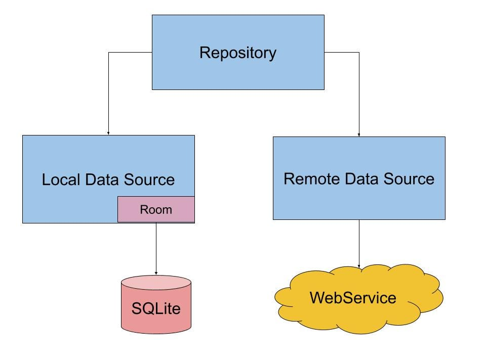

# Practica: Servicio con almacenamiento local y remoto

- [Practica: Servicio con almacenamiento local y remoto](#practica-servicio-con-almacenamiento-local-y-remoto)
  - [Objetivo](#objetivo)
  - [Descripción de la Práctica](#descripción-de-la-práctica)
  - [Consideraciones de Diseño](#consideraciones-de-diseño)
  - [Requisitos Técnicos](#requisitos-técnicos)


## Objetivo
El objetivo de esta práctica es desarrollar un servicio web en Java que permita almacenar y gestionar datos tanto en un almacenamiento local (bases de datos embebida) como en un almacenamiento remoto (API REST). El servicio debe ser capaz de realizar operaciones CRUD (Crear, Leer, Actualizar, Eliminar) y manejar la comunicación con ambos tipos de almacenamiento de manera eficiente y segura.


## Descripción de la Práctica
Vamos a usar una API ficticia para simular el almacenamiento remoto. Puedes utilizar la API de JSONPlaceholder (https://jsonplaceholder.typicode.com) o DummyJson (https://dummyjson.com/) que proporciona endpoints para realizar operaciones CRUD sobre recursos como usuarios, posts, comentarios, etc. 

Recomiendo probar la API de JSONPlaceholder para practicar, ya que es gratuita y no requiere autenticación. Además deberás leer cómo hacer consultas en ella (https://github.com/typicode/json-server) y una vez la domines podrás usar cualquier otra API REST que te guste.

Vamos a trabajar con el recurso "users" de JSONPlaceholder, que tiene la siguiente estructura:

```json
{
  "id": 1,
  "name": "Leanne Graham",
  "username": "Bret",
  "email": "Sincere@april.biz",
  "address": {
    "street": "Kulas Light",
    "suite": "Apt. 556",
    "city": "Gwenborough",
    "zipcode": "92998-3874",
    "geo": {
      "lat": "-37.3159",
      "lng": "81.1496"
    }
  },
  "phone": "1-770-736-8031 x56442",
  "website": "hildegard.org",
  "company": {
    "name": "Romaguera-Crona",
    "catchPhrase": "Multi-layered client-server neural-net",
    "bs": "harness real-time e-markets"
  }
}
```

Nuestro objetivo es crear un servicio cacheado de de tres niveles: cache, base de datos embebida y API REST y que pueda exportar los datos a un fichero json.

Pero debemos tener en cuenta que no necesitamos todos los campos que existen a nivel remoto, en nuestra base de datos local y en nuestro servicio solo vamos a manejar los siguientes campos:
- id: Identificador único del usuario. Se generará automáticamente a nivel remoto.
- name: Nombre completo del usuario.
- username: Nombre de usuario.
- email: Dirección de correo electrónico del usuario.

1. El primer paso es tener las clases de modelo que representen los datos que vamos a manejar en nuestro servicio. En este Caso la clase User

2. A nivel de Entidades de la base de datos tendremos UserEntity con los campos id, name, username y email, además del createdAt y updatedAt para llevar el control de las fechas de creación y actualización.

3. Para exportar los datos a un fichero JSON, usaremos los datos de la entidad.

4. Para mapear los datos procedente de la API REST, podemos crear un DTO, usando https://json2csharp.com/code-converters/json-to-pojo o https://www.jsonschema2pojo.org/  o usar algún plugin de IntelliJ como Json2Pojo o similares.

5. El servicio debe ser capaz de realizar las siguientes operaciones:
   - Obtener todos los usuarios.
   - Obtener un usuario por su ID.
   - Crear un nuevo usuario.
   - Actualizar un usuario existente.
   - Eliminar un usuario.
   - Exportar los usuarios a un fichero JSON.

- El servicio debe trabajar con una caché en memoria para mejorar el rendimiento de las operaciones de lectura.
- El servicio debe trabajar con un almacenamiento par exportar los datos a un fichero JSON.
- El servicio debe interactuar con una base de datos embebida (H2, SQLite, etc.) para el almacenamiento local.
- El servicio debe interactuar con la API REST para el almacenamiento remoto.
- El servicio debe manejar errores y excepciones de manera adecuada, proporcionando mensajes claros y útiles.
- El servicio debe permitir la configuración de la URL de la API REST de forma externa (por ejemplo, a través de un archivo de propiedades o variables de entorno), así como la cache y las credenciales si fueran necesarias y de la tasa de refresco de consultas a la API REST.
- Debe haber un sistema de notificaciones que avise del refresco de la base de datos embebida, así como de de las operaciones de creación, actualización y eliminación de usuarios.
- Debe haber un sistema de logging que registre las operaciones realizadas y los errores ocurridos en los últimos 7 días.




## Consideraciones de Diseño

- Al arrancar el programa, se borra la base de datos y se carga con el contenido de la API REST.
- Cada 30 segundos, automáticamente y en segundo plano, se sincroniza la base de datos embebida con la API REST. Es decir, borramos todo el contenido de la cache y de la base de datos y lo volvemos a cargar desde la API REST.
- Al obtener todos los usuarios, se devuelven los datos desde la base de datos embebida,pues se ha cargado al iniciar el programa. Si no hay datos en la base de datos, se obtienen desde la API REST y se almacenan en la base de datos y se devuelven.
- Al obtener un usuario por su ID, se busca primero en la caché. Si no está en la caché, se busca en la base de datos embebida y se mete en la caché. Si no está en la base de datos, se obtiene desde la API REST, se almacena en la base de datos y se añade a la caché. Se devuelve. Si no existe, se devuelve un error.
- Al crear un nuevo usuario, se envía a la API REST, se obtiene el ID generado, se almacena en la base de datos embebida y se añade a la caché. Se devuelve el usuario creado.
- Al actualizar un usuario existente, se envía a la API REST, si se actualiza correctamente, se actualiza en la base de datos embebida y en la caché. Se devuelve el usuario actualizado. Si no existe, se devuelve un error.
- Al eliminar un usuario, se elimina de la API REST, si se elimina correctamente, se elimina de la base de datos embebida y de la caché. Se devuelve un mensaje de éxito. Si no existe, se devuelve un error.
- Al exportar los usuarios a un fichero JSON, se obtienen todos los usuarios siguiendo la lógica de obtener todos los usuarios y se escriben en un fichero JSON en el sistema de archivos local.

## Requisitos Técnicos
- Debe ser lo más asíncrono/reactivo posible.
- Debes crear el modelo de datos necesario.
- Debes crear todos los DTOs (request y response de las llamadas que necesites), entidades y mapeos necesarios con el modelo.
- Debes dejar claro los errores de dominio y cómo los manejas.
- Debes testear el servicio con pruebas unitarias y de integración.
- Debes testear el repositorio remoto con pruebas unitarias y de integración.
- Debes testear el repositorio local con pruebas unitarias y de integración (opcional).
- Debes documentar el código y el diseño del servicio.
- Debes usar un sistema de control de versiones (Git) y alojar el proyecto en un repositorio remoto (GitHub, GitLab, etc.).