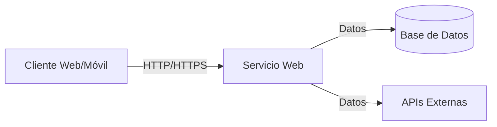
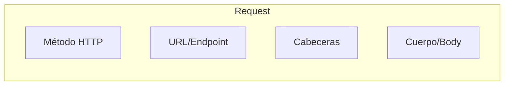
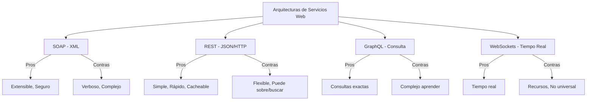

- [1. Servicios Web](#1-servicios-web)
  - [1.1. Servicios orientados a la conexión vs No orientados a la conexión](#11-servicios-orientados-a-la-conexión-vs-no-orientados-a-la-conexión)
    - [Servicios Orientados a la Conexión](#servicios-orientados-a-la-conexión)
    - [Servicios Sin Conexión (HTTP)](#servicios-sin-conexión-http)
  - [1.2. Componentes de un Servicio Web](#12-componentes-de-un-servicio-web)
    - [1.2.1. Request (Solicitud)](#121-request-solicitud)
    - [1.2.2. Response (Respuesta)](#122-response-respuesta)
    - [1.2.3. Ejemplos de Servicios Web](#123-ejemplos-de-servicios-web)
    - [1.2.4. Arquitecturas de Servicios Web](#124-arquitecturas-de-servicios-web)
  - [1.3. Práctica de clase](#13-práctica-de-clase)

# 1. Servicios Web

Un **servicio web** es un sistema de software diseñado para soportar la interoperabilidad entre máquinas a través de una red, utilizando protocolos estándar como HTTP. Los servicios web permiten que diferentes aplicaciones se comuniquen entre sí, independientemente del lenguaje de programación, plataforma o sistema operativo que utilicen.

📝 **Nota del Profesor**: Los servicios web son la base de la comunicación moderna entre sistemas. Entiende bien la diferencia entre arquitecturas (SOAP, REST, GraphQL, WebSockets) porque es fundamental para diseñar APIs escalables.

## 1.1. Servicios orientados a la conexión vs No orientados a la conexión

Los servicios pueden ser **orientados a la conexión** (requieren establecer una conexión primero) o **sin conexión** (cada mensaje es independiente).

### Servicios Orientados a la Conexión

**Pros:**
- **Fiabilidad:** Los datos se entregan en orden y sin errores, con confirmaciones de recepción.
- **Control de Flujo:** Evita que el remitente sobrecargue al receptor.
- **Control de Congestión:** Previene problemas en redes saturadas.

**Contras:**
- **Tiempo de Configuración:** Requiere handshake inicial.
- **Overhead:** Mayor consumo de recursos por las confirmaciones.
- **Menos eficiente para datos pequeños:** El coste de establecer la conexión puede superar los beneficios.

### Servicios Sin Conexión (HTTP)

**Pros:**
- **Rapidez:** No requiere configuración previa.
- **Eficiencia para datos pequeños:** Ideal para solicitudes/respuestas simples.
- **Escalabilidad:** La naturaleza sin estado permite manejar muchas conexiones simultáneas.

**Contras:**
- **Menos fiabilidad:** No garantiza entrega ni orden.
- **Sin control de flujo:** Puede haber pérdida de paquetes.
- **Mayor gestión de errores:** Necesita mecanismos adicionales para garantizar la recepción.

💡 **Tip del Examinador**: HTTP es el protocolo más usado porque combina la simplicidad de ser sin conexión con la fiabilidad de TCP/IP subyacente.

## 1.2. Componentes de un Servicio Web

### 1.2.1. Request (Solicitud)

Una solicitud HTTP consta de:

- **Método:** Indica la acción (GET, POST, PUT, DELETE, PATCH)
- **URL/Endpoint:** Identifica el recurso
- **Cabeceras:** Metadatos (Content-Type, Authorization, Accept)
- **Cuerpo:** Datos enviados (opcional en GET/DELETE)

### 1.2.2. Response (Respuesta)

La respuesta incluye:

- **Código de Estado:** 2xx (éxito), 3xx (redirección), 4xx (error cliente), 5xx (error servidor)
- **Cabeceras:** Metadatos de la respuesta
- **Cuerpo:** Datos solicitados (JSON, XML, HTML)

### 1.2.3. Ejemplos de Servicios Web

| Servicio | Uso | Tipo |
|----------|-----|------|
| Google Maps API | Maps y geolocalización | REST |
| Twitter API | Redes sociales | REST |
| Stripe API | Pagos | REST |
| Facebook Graph API | Datos de usuarios | GraphQL |

### 1.2.4. Arquitecturas de Servicios Web

| Arquitectura | Formato | Uso Ideal |
|--------------|---------|----------|
| **SOAP** | XML/WSDL | Enterprise, transacciones |
| **REST** | JSON/HTTP | APIs públicas, web apps |
| **GraphQL** | JSON | UIs complejas, datos variados |
| **WebSockets** | TCP | Chat, juegos, tiempo real |

## 1.3. Práctica de clase

Analiza y cita distintos servicios web que uses diariamente, indicando:
- Recursos y endpoints que podrían usar
- Métodos HTTP utilizados
- Respuestas y errores posibles

💡 **Tip del Examinador**: En el examen práctico, diseña APIs RESTful siguiendo las convenciones: recursos en plural, métodos HTTP apropiados, códigos de estado correctos.
