- [2. Servicios REST](#2-servicios-rest)
  - [2.1. Características](#21-características)
  - [2.2. Componentes](#22-componentes)
  - [2.3. Ventajas y Desventajas](#23-ventajas-y-desventajas)
  - [2.4. API REST (RestFul)](#24-api-rest-restful)
  - [2.5. Recursos y Endpoints](#25-recursos-y-endpoints)
  - [2.6. Métodos HTTP](#26-métodos-http)
  - [2.7. Respuestas](#27-respuestas)
  - [2.8. Error Handling](#28-error-handling)
  - [2.9. Versionado](#29-versionado)
  - [2.10. Ejemplo de diseño de acceso de un recurso](#210-ejemplo-de-diseño-de-acceso-de-un-recurso)
  - [2.11. Pr√°ctica de clase](#211-pr√°ctica-de-clase)

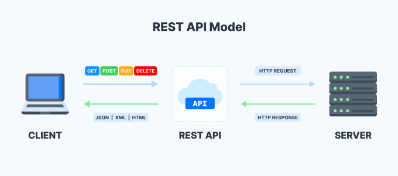

üìù **Nota del Profesor**
> REST (Representational State Transfer) es el est√°ndar de facto para APIs en Spring Boot. Dominar estos conceptos es fundamental para el examen.

üí° **Tip del Examinador**
> En el examen suelen preguntar sobre las diferencias entre PUT vs PATCH y cu√°ndo usar cada uno.

---

# 2. Servicios REST

REST, que significa Representational State Transfer, es un estilo de arquitectura para sistemas de software que se utiliza principalmente en el desarrollo de servicios web. Los servicios web que siguen los principios de REST se denominan servicios web RESTful.

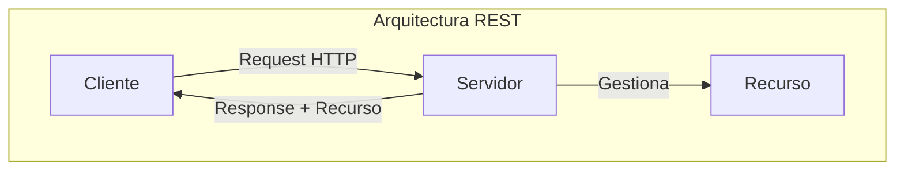
```mermaid
graph TB
    subgraph "Arquitectura REST"
        Cliente["Cliente"]
        Servidor["Servidor"]
        Recurso["Recurso"]
    end
    
    Cliente -- "Request HTTP" --> Servidor
    Servidor -- "Response + Recurso" --> Cliente
    Servidor -- "Gestiona" --> Recurso
```

## 2.1. Características 

1. **Protocolo Cliente-Servidor:** En un servicio REST, la interacción entre el cliente y el servidor se realiza a través de solicitudes y respuestas. El cliente envía una solicitud al servidor, y el servidor procesa la solicitud y envía una respuesta al cliente.

2. **Sin estado:** Cada solicitud del cliente al servidor debe contener toda la información necesaria para comprender y procesar la solicitud. El servidor no almacena ninguna información sobre el estado del cliente entre solicitudes.

üí° **Tip del Examinador**
> "Sin estado" significa que cada petición es independiente. No guardamos sesión del usuario en el servidor.

3. **Cacheable:** Las respuestas del servidor pueden ser almacenadas en cache por el cliente. Esto puede mejorar la eficiencia y la escalabilidad del servicio al reducir la necesidad de solicitudes repetitivas de la misma información.

4. **Sistema en capas:** Un servicio REST puede estar compuesto por varias capas de servidores. Cada capa tiene una responsabilidad específica y puede interactuar solo con la capa inmediatamente anterior o siguiente.

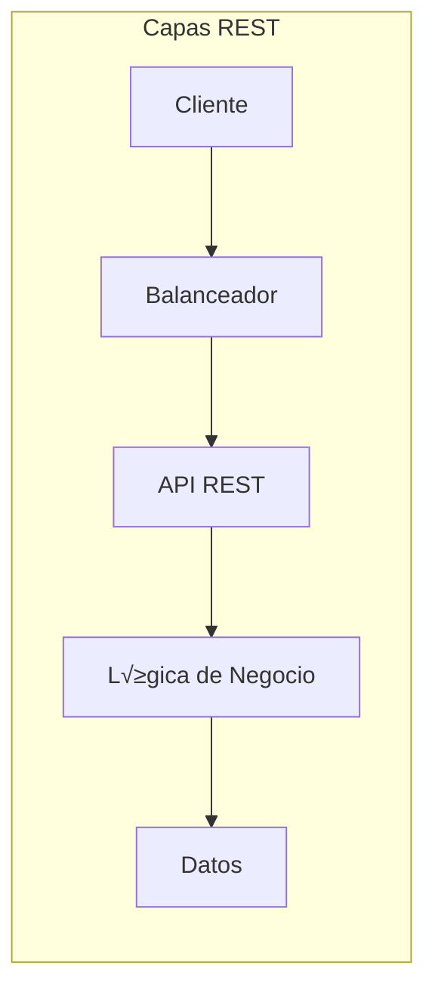
```mermaid
graph LR
    subgraph "Capas REST"
        ClienteC["Cliente"]
        LB["Balanceador"]
        API["API REST"]
        Negocio["Lógica de Negocio"]
        Datos["Datos"]
    end
    
    ClienteC --> LB
    LB --> API
    API --> Negocio
    Negocio --> Datos
```

5. **Interfaz uniforme:** Los servicios REST utilizan un conjunto limitado de métodos bien definidos para interactuar con los recursos. Los recursos se identifican por sus URIs (Uniform Resource Identifiers), y se pueden manipular utilizando representaciones estándar.

⚠️ **Advertencia**
> La uniformidad en la interfaz es clave. Si usas GET para eliminar, romper√°s las expectativas de cualquier desarrollador.

## 2.2. Componentes

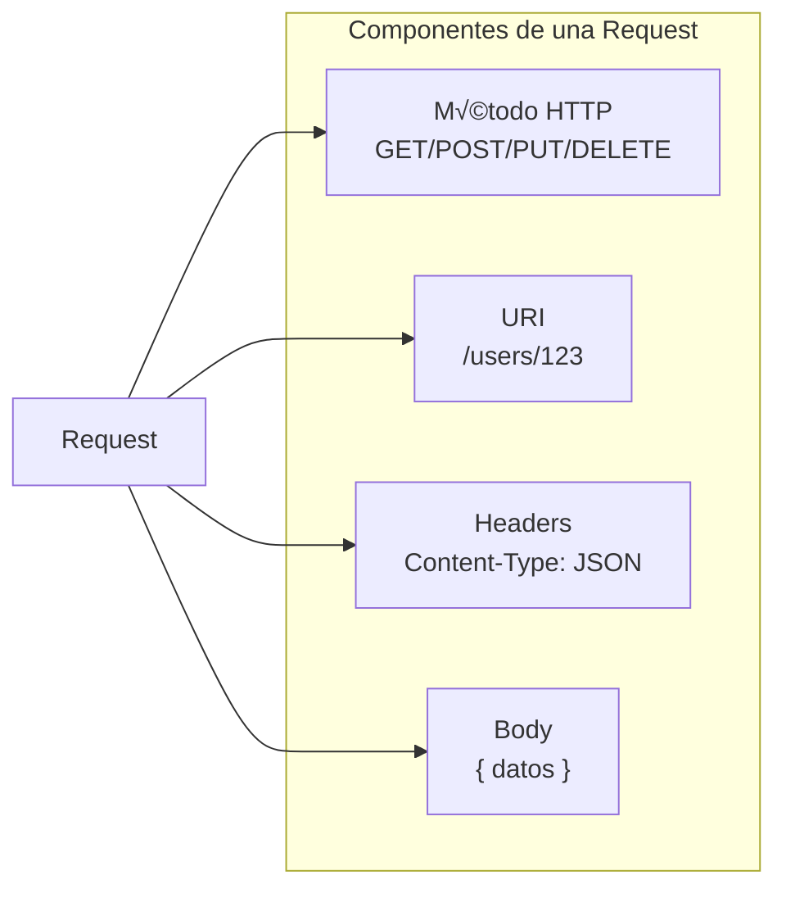
```mermaid
flowchart LR
    subgraph "Componentes de una Request"
        Metodo["Método HTTP<br/>GET/POST/PUT/DELETE"]
        URI["URI<br/>/users/123"]
        Headers["Headers<br/>Content-Type: JSON"]
        Body["Body<br/>{ datos }"]
    end
    
    Request["Request"] --> Metodo
    Request --> URI
    Request --> Headers
    Request --> Body
    

```

- **Request:** Una solicitud REST se compose de un método HTTP, una URI, una serie de headers y, opcionalmente, un body. Los métodos HTTP más comunes utilizados en los servicios REST son GET (para recuperar información), POST (para enviar nueva información), PUT (para actualizar información existente) y DELETE (para eliminar información).

- **Header:** El header de una solicitud REST contiene metadatos sobre la solicitud, como el tipo de contenido, la autenticación, la información de la cache, etc.

- **Response:** Una respuesta REST incluye un código de estado HTTP, un header y, a menudo, un body con la representación del recurso solicitado. Los códigos de estado HTTP indican el resultado de la solicitud, por ejemplo, si fue exitosa, si hubo un error del cliente o del servidor, etc.

## 2.3. Ventajas y Desventajas

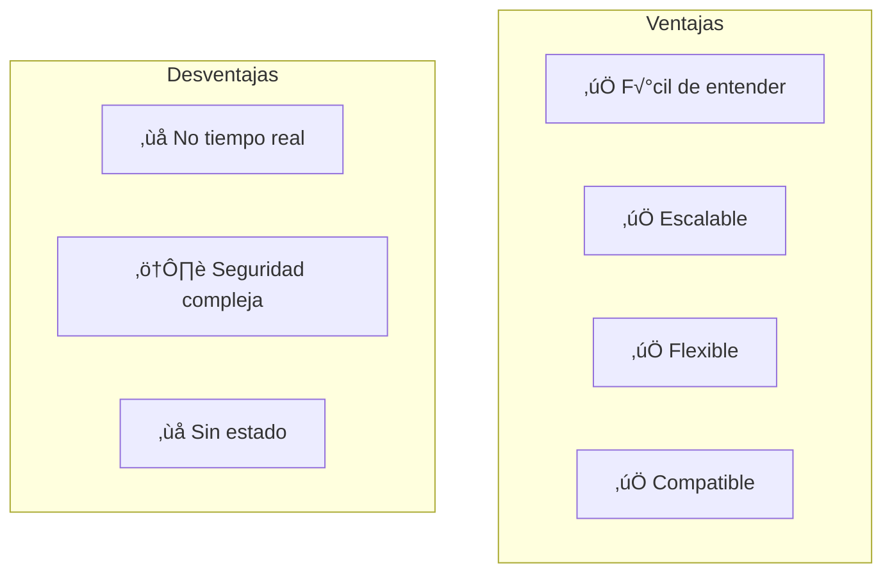
```mermaid
graph TB
    subgraph "Ventajas"
        V1["‚úÖ F√°cil de entender"]
        V2["‚úÖ Escalable"]
        V3["‚úÖ Flexible"]
        V4["‚úÖ Compatible"]
    end
    
    subgraph "Desventajas"
        D1["‚ùå No tiempo real"]
        D2["⚠️ Seguridad compleja"]
        D3["‚ùå Sin estado"]
    end
    

```

**Ventajas de los servicios REST**

- Son f√°ciles de entender y utilizar.
- Son altamente escalables debido a su naturaleza sin estado.
- Permiten una gran flexibilidad en el tipo de datos que pueden ser transferidos.
- Son compatibles con la mayoría de los lenguajes y plataformas.

**Desventajas de los servicios REST**

- No son adecuados para operaciones en tiempo real o para la transmisión de datos en tiempo real.
- La seguridad puede ser m√°s desafiante debido a la falta de un est√°ndar de seguridad integrado.
- No son la mejor opción para operaciones que requieren el mantenimiento de un estado de conexión.

## 2.4. API REST (RestFul)

Una API REST (Representational State Transfer) es un estilo de arquitectura de software que se utiliza en el desarrollo de aplicaciones web. REST se basa en principios y estándares que permiten construir interfaces de programación de aplicaciones (API) de una manera coherente y predecible.

üìù **Nota del Profesor**
> API REST y API RESTful son lo mismo. El término "RESTful" simplemente indica que la API sigue todos los principios REST.

La API REST utiliza métodos HTTP estándar, como GET, POST, DELETE y PUT, para realizar operaciones en los recursos. Los recursos, que son cualquier tipo de objeto, dato o servicio que se quiera proporcionar a través de la API, se identifican a través de URLs.

El formato de una API RESTful tiene tres componentes principales: URL endpoint; Verbo HTTP; y Cuerpo.

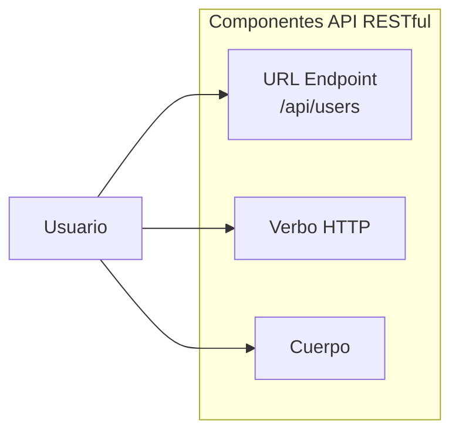
```mermaid
graph LR
    subgraph "Componentes API RESTful"
        Endpoint["URL Endpoint<br/>/api/users"]
        Verbo["Verbo HTTP"]
        Cuerpo["Cuerpo"]
    end
    
    Usuario --> Endpoint
    Usuario --> Verbo
    Usuario --> Cuerpo
```

- **URL endpoint**. Es un enlace URL que representa los recursos a los que queremos acceder. Los recursos pueden ser texto, im√°genes, documentos o cualquier entrada de datos. Por ejemplo, example.com/surveys nos permite ver o crear plantillas de encuestas y example.com/surveys/123/responses nos permite hacer lo mismo para todas las respuestas de la encuesta 123.
- **Verbo HTTP**. Dice al servidor qué queremos hacer con el recurso del URL endpoint. Por ejemplo, una solicitud POST significa que queremos crear una nueva plantilla de encuesta y una solicitud GET significa que queremos ver una plantilla de encuesta existente.
- **Mensaje del cuerpo**. Es una carga √∫til personalizada opcional que contiene un mensaje con las propiedades y valores que queremos usar para crear o actualizar un recurso dado.

Las API RESTful son muy populares porque son fáciles de entender y usar. Además, son altamente escalables y flexibles, y son compatibles con la mayoría de los lenguajes y plataformas.

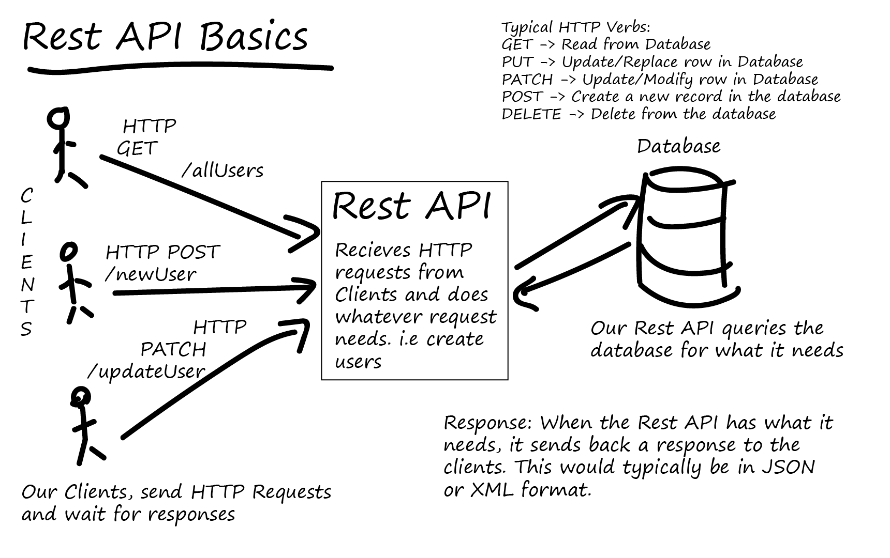

## 2.5. Recursos y Endpoints

Diseñar una API REST (Representational State Transfer) para gestionar un recurso implica seguir ciertas convenciones y principios fundamentales. 

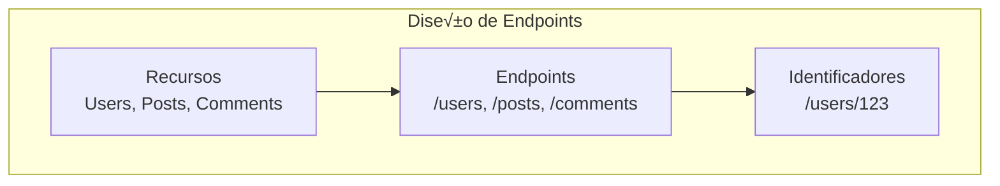
```mermaid
graph TB
    subgraph "Diseño de Endpoints"
        Recursos["Recursos<br/>Users, Posts, Comments"]
        Endpoints["Endpoints<br/>/users, /posts, /comments"]
        IDs["Identificadores<br/>/users/123"]
    end
    
    Recursos --> Endpoints
    Endpoints --> IDs
    

```

En primer lugar, debes entender qué es un **recurso** en el contexto de una API REST. Un recurso es cualquier objeto que queremos gestionar y puede ser accedido a través de una URL única. Por ejemplo, si estás construyendo una API para un blog, tus recursos podrían ser "usuarios", "posts" y "comentarios".

Las URL de los **endpoints** en una API REST deben ser diseñadas de tal manera que representen los recursos. Aquí hay algunas convenciones comunes:

- Utiliza sustantivos en plural para los nombres de los recursos. Por ejemplo, `/users` para acceder a la lista de usuarios y `/users/{id}` para acceder a un usuario específico.

üí° **Tip del Examinador**
> Siempre usa plural en endpoints: `/users` NO `/user`. Esto es un error muy com√∫n en el examen.

- Evita utilizar verbos en las URL. En su lugar, utiliza los métodos HTTP para representar acciones. Por ejemplo, `GET /users` para obtener la lista de usuarios, `POST /users` para crear un nuevo usuario, `PUT /users/{id}` para actualizar un usuario específico, y `DELETE /users/{id}` para eliminar un usuario específico.

⚠️ **Advertencia**
> ERROR: `/users/create` con POST
> CORRECTO: `/users` con POST

Ten en cuenta que una URL debe identificar un recurso específico, y no una acción. Por ejemplo, `/users/123` es una URL válida, pero `/users/create` no lo es.

## 2.6. Métodos HTTP

Los métodos HTTP representan las acciones que se pueden realizar sobre un recurso. Los más comunes son:

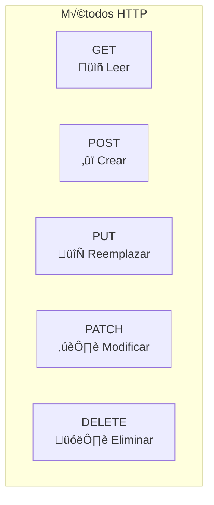
```mermaid
graph TD
    subgraph "Métodos HTTP"
        GET["GET<br/>üìñ Leer"]
        POST["POST<br/>‚ûï Crear"]
        PUT["PUT<br/>🔄 Reemplazar"]
        PATCH["PATCH<br/>✏️ Modificar"]
        DELETE["DELETE<br/>🗑️ Eliminar"]
    end
```

1. **GET**: Este método se utiliza para obtener información de un recurso en particular. Cuando se realiza una solicitud GET a un servidor, este devuelve los datos solicitados del recurso especificado. Por ejemplo, si tienes un servicio web que proporciona información sobre libros, una solicitud GET a "/books/1" podría devolver los detalles del libro con el ID 1.

2. **POST**: Este método se utiliza para enviar datos a un servidor y crear un nuevo recurso. Los datos a enviar se incluyen en el cuerpo de la solicitud. Siguiendo el ejemplo anterior, podrías usar POST para añadir un nuevo libro a la colección, enviando los detalles del libro (título, autor, fecha de publicación, etc.) en el cuerpo de la solicitud a "/books".

3. **PUT**: Este método se utiliza para actualizar un recurso existente. Al igual que POST, los datos a enviar se incluyen en el cuerpo de la solicitud. Sin embargo, a diferencia de POST, PUT es idempotente, lo que significa que hacer la misma solicitud PUT varias veces tendrá el mismo efecto que hacerla una vez. Por ejemplo, podrías utilizar PUT para actualizar los detalles del libro con el ID 1, enviando los nuevos detalles en el cuerpo de la solicitud a "/books/1".

üí° **Tip del Examinador**
> PUT es idempotente: enviar la misma petición 100 veces tiene el mismo efecto que enviarla 1 vez.

4. **PATCH**: Este método es similar a PUT, pero se utiliza para actualizar parcialmente un recurso. Mientras que PUT requiere que envíes todos los datos del recurso, independientemente de si han cambiado o no, PATCH te permite enviar solo los datos que han cambiado. Por ejemplo, podrías utilizar PATCH para actualizar solo el título del libro con el ID 1, enviando el nuevo título en el cuerpo de la solicitud a "/books/1".

üìù **Nota del Profesor**
> PUT = reemplaza todo el recurso. PATCH = modifica solo los campos enviados.

5. **DELETE**: Este método se utiliza para eliminar un recurso. No necesitas enviar ningún dato adicional con una solicitud DELETE; simplemente especificas el recurso que deseas eliminar. Por ejemplo, podrías utilizar DELETE para eliminar el libro con el ID 1 haciendo una solicitud DELETE a "/books/1".

Estos métodos son fundamentales para el diseño de APIs RESTful, que se basan en los principios de los sistemas de representación de estado transferible (REST) para permitir la creación de servicios web que pueden ser utilizados por múltiples clientes, incluyendo navegadores web, aplicaciones móviles, y otros servidores.

## 2.7. Respuestas

Los códigos de estado HTTP son una parte integral de cómo funcionan los servicios web y la arquitectura REST. Estos códigos son la manera en que un servidor informa al cliente sobre el resultado de su solicitud, y pueden tener un contenido asociado. Por ejemplo, si realizas una solicitud GET a un servidor y el recurso solicitado se encuentra, el servidor devolverá un código 200 OK junto con el recurso solicitado en el cuerpo de la respuesta.

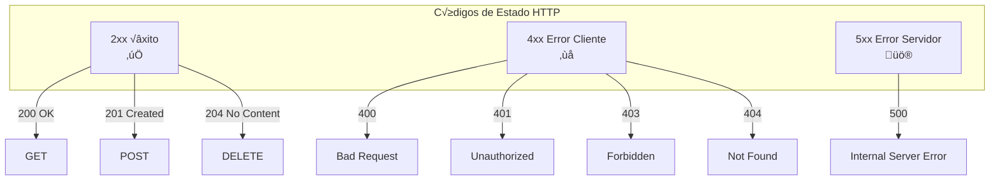
```mermaid
flowchart TD
    subgraph "Códigos de Estado HTTP"
        2xx["2xx Éxito<br/>✅"]
        4xx["4xx Error Cliente<br/>‚ùå"]
        5xx["5xx Error Servidor<br/>üö®"]
    end
    
    GET["GET"]
    POST["POST"]
    DELETE["DELETE"]
    BadRequest["Bad Request"]
    Unauthorized["Unauthorized"]
    Forbidden["Forbidden"]
    NotFound["Not Found"]
    InternalError["Internal Server Error"]
    
    2xx -->|"200 OK"| GET
    2xx -->|"201 Created"| POST
    2xx -->|"204 No Content"| DELETE
    4xx -->|"400"| BadRequest
    4xx -->|"401"| Unauthorized
    4xx -->|"403"| Forbidden
    4xx -->|"404"| NotFound
    5xx -->|"500"| InternalError
    
```

Algunos de lo que m√°s usar√°s son:

- 200 OK: Este es el código de estado más comúnmente recibido. Significa que la solicitud ha sido procesada con éxito y la respuesta es apropiada a la petición.

- 201 Created: Este código de estado se utiliza para indicar que la solicitud ha sido cumplida y ha resultado en la creación de un nuevo recurso. Por ejemplo, si se realiza una solicitud POST para crear un nuevo usuario en una base de datos y la operación es exitosa, el servidor puede devolver un código 201. El cuerpo de la respuesta puede incluir una URL que apunte al nuevo recurso, así como los datos del nuevo recurso.

üí° **Tip del Examinador**
> 201 Created SIEMPRE debe acompañar a POST que crea un recurso. Es un error común devolver 200.

- 204 No Content: Este código indica que la solicitud se ha completado con éxito, pero no hay contenido para enviar de vuelta. Esto es común en situaciones donde sólo necesitas realizar una acción, como eliminar un recurso, pero no necesitas una respuesta.

- 400 Bad Request: Este código indica que el servidor no pudo entender la solicitud debido a una sintaxis inválida. Por ejemplo, si envías datos JSON mal formados en una solicitud POST, puedes recibir un código 400.

- 401 Unauthorized: Este código de estado indica que la solicitud requiere autenticación de usuario. Si intentas acceder a un recurso que requiere autenticación sin proporcionar las credenciales correctas, recibirás un código 401.

üìù **Nota del Profesor**
> 401 = "No identificado" (no has shown who you are)
> 403 = "Identificado pero no autorizado" (you are who you say, but you can't do this)

- 403 Forbidden: A diferencia del 401, este código indica que la autenticación ha sido procesada pero el cliente no tiene permisos para acceder al recurso. Por ejemplo, si un usuario intenta modificar datos a los que no tiene acceso, recibirá un código 403.

- 404 Not Found: Este código indica que el recurso solicitado no pudo ser encontrado en el servidor. Por ejemplo, si intentas acceder a una URL que no existe, recibirás un código 404.

- 405 Method Not Allowed: Este código indica que el método de solicitud (GET, POST, PUT, DELETE, etc.) no es compatible con el recurso solicitado. Por ejemplo, si intentas realizar una solicitud PUT en una URL que sólo admite GET, recibirás un código 405.

- 406 Not Acceptable: Este código se utiliza para indicar que el recurso solicitado es incapaz de generar contenido que cumpla con los encabezados de aceptación enviados en la solicitud. Por ejemplo, si solicitas un tipo de contenido que el servidor no puede proporcionar, recibirás un código 406, o si pasas un tipo de contenido que el servidor no puede aceptar, recibirás un código 415.

- 408 Request Timeout: Este código indica que el servidor cerró la conexión inactiva porque la solicitud del cliente tardó demasiado tiempo. Por ejemplo, si el servidor tiene un tiempo de espera configurado y tu solicitud no se completa en ese tiempo, recibirás un código 408.

- 500 Internal Server Error: Este código indica que el servidor encontró una condición inesperada que le impidió cumplir con la solicitud. Por ejemplo, si el servidor encuentra un error al procesar una solicitud, puede devolver un código 500.

⚠️ **Advertencia**
> 500 Internal Server Error es un error genérico del servidor. Nunca devuelvas detalles de excepciones internas al cliente por seguridad.

Además, las respuestas deberían incluir el recurso o los recursos solicitados en el cuerpo de la respuesta en un formato como JSON.

## 2.8. Error Handling

Es importante manejar los errores de manera adecuada en tu API REST. Esto significa proporcionar mensajes de error claros y útiles, así como códigos de estado HTTP adecuados.

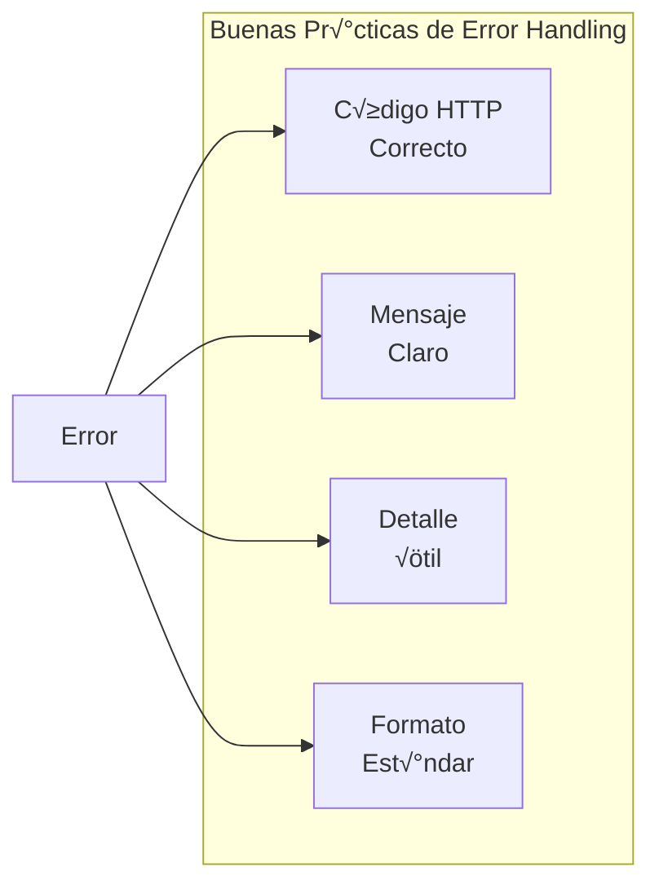
```mermaid
graph LR
    subgraph "Buenas Pr√°cticas de Error Handling"
        Codigo["Código HTTP<br/>Correcto"]
        Mensaje["Mensaje<br/>Claro"]
        Detalle["Detalle<br/>√ötil"]
        Formato["Formato<br/>Est√°ndar"]
    end
    
    Error["Error"] --> Codigo
    Error --> Mensaje
    Error --> Detalle
    Error --> Formato
```

## 2.9. Versionado

Es aconsejable versionar tu API para que puedas hacer cambios y mejoras sin romper las aplicaciones existentes que utilizan tu API. Una forma común de hacer esto es incluir el número de versión en la URL, como en `/v1/users`.

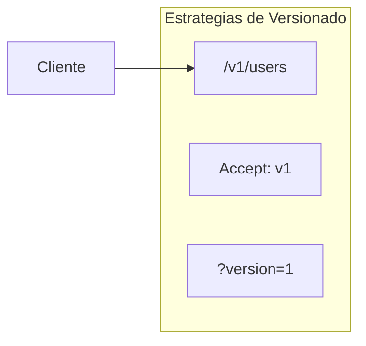
```mermaid
graph LR
    subgraph "Estrategias de Versionado"
        URL["/v1/users"]
        Header["Accept: v1"]
        Param["?version=1"]
    end
    
    Cliente --> URL
```

üí° **Tip del Examinador**
> La forma m√°s com√∫n y sencilla es versionar por URL: `/v1/users`. Es lo que se espera en el examen.

## 2.10. Ejemplo de diseño de acceso de un recurso

| Endpoint | Petición HTTP | Body | Response Code | Response Body | Posibles Errores |
|----------|---------------|------|---------------|---------------|------------------|
| /productos | GET | N/A | 200 (OK) | `{ "productos": [{"id": 1, "nombre": "Producto 1", "precio": 10.99}, {"id": 2, "nombre": "Producto 2", "precio": 20.99}]}` | |
| /productos | POST | `{ "nombre": "Producto Nuevo", "precio": 15.99 }` | 201 (Created) | `{ "id": 3, "nombre": "Producto Nuevo", "precio": 15.99 }` | 400 (Solicitud incorrecta) |
| /productos/{id} | GET | N/A | 200 (OK) | `{ "id": 1, "nombre": "Producto 1", "precio": 10.99}` | 404 (No encontrado) |
| /productos/{id} | PUT | `{ "nombre": "Producto Actualizado", "precio": 12.99 }` | 200 (OK) | `{ "id": 1, "nombre": "Producto Actualizado", "precio": 12.99 }` | 400 (Solicitud incorrecta), 404 (No encontrado) |
| /productos/{id} | PATCH | `{ "precio": 12.99 }` | 200 (OK) | `{ "id": 1, "nombre": "Producto Actualizado", "precio": 12.99 }` | 400 (Solicitud incorrecta), 404 (No encontrado) |
| /productos/{id} | DELETE | N/A | 204 (No Content) | N/A | 404 (No encontrado) |

## 2.11. Pr√°ctica de clase

Imagina que vas a hacer un servicio para gestionar Funkos.

üìù **Nota del Profesor**
> Esta pr√°ctica es cl√°sica para entender REST. Funkos es el recurso m√°s usado en clase.

Diseña el enpoint completo, operaciones asociadas para hacer un CRUD sobre este recurso, indicando: ejemplo de petición, verbo HTTP, body, response code, response body y posibles errores.

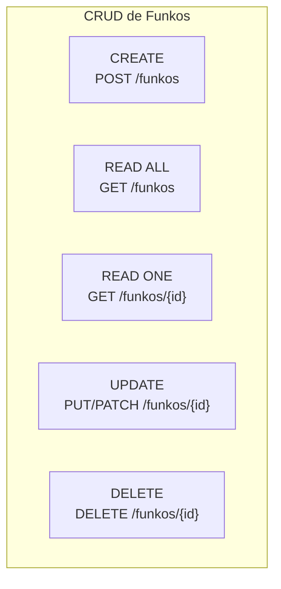
```mermaid
graph TB
    subgraph "CRUD de Funkos"
        C["CREATE<br/>POST /funkos"]
        R1["READ ALL<br/>GET /funkos"]
        R2["READ ONE<br/>GET /funkos/{id}"]
        U["UPDATE<br/>PUT/PATCH /funkos/{id}"]
        D["DELETE<br/>DELETE /funkos/{id}"]
    end
```
