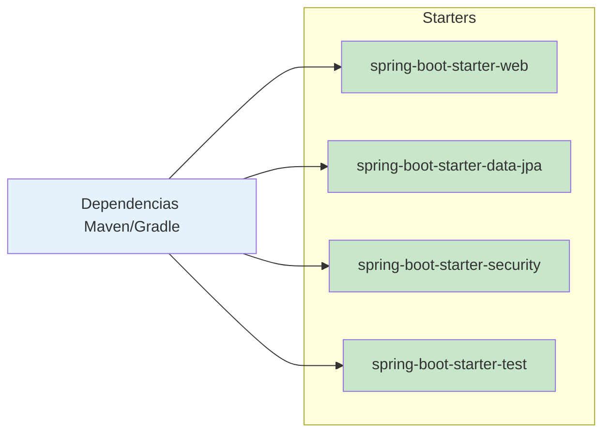
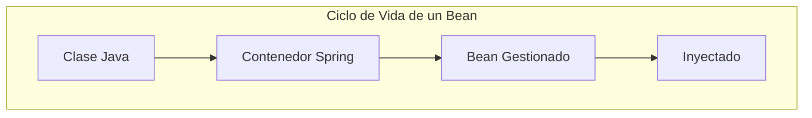
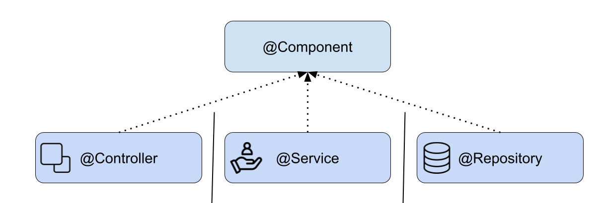

- [3. Spring Framework](#3-spring-framework)
  - [3.1. Spring Boot](#31-spring-boot)
    - [3.1.1. Módulos principales de Spring](#311-módulos-principales-de-spring)
    - [3.1.2. Beans](#312-beans)
    - [3.1.3. Inversión de Control e Inyección de Dependencias](#313-inversión-de-control-e-inyección-de-dependencias)
  - [3.5. Práctica de clase: Spring Boot](#35-práctica-de-clase-spring-boot)


📝 **Nota del Profesor**
> Spring es el framework más popular de Java. Dominar Spring Boot es esencial para cualquier desarrollador Java moderno.

💡 **Tip del Examinador**
> En el examen preguntan mucho sobre la diferencia entre IoC y DI. ¡No los confundas!

---


# 3. Spring Framework

[Spring](https://spring.io/) es un marco de trabajo (framework) de código abierto para el desarrollo de aplicaciones en la plataforma JVM. Fue creado para abordar la complejidad del desarrollo empresarial y es ampliamente adoptado debido a sus características, como:

```mermaid
graph TB
    subgraph "Características de Spring"
        IoC["Inversión de Control<br/>🔄"]
        AOP["AOP<br/>📐"]
        BD["Integración BD<br/>💾"]
        Tx["Transacciones<br/>✅"]
        MW["Middleware<br/>🔗"]
        Test["Testing<br/>🧪"]
    end
    
    Spring["Spring Framework"] --> IoC
    Spring --> AOP
    Spring --> BD
    Spring --> Tx
    Spring --> MW
    Spring --> Test
    
    style Spring fill:#e3f2fd
    style IoC fill:#c8e6c9
    style AOP fill:#c8e6c9
    style BD fill:#c8e6c9
    style Tx fill:#c8e6c9
    style MW fill:#c8e6c9
    style Test fill:#c8e6c9
```



1. **Inversión de Control (IoC)**: Spring maneja la creación y gestión de objetos, lo que reduce la dependencia entre los componentos del software.

2. **Programación Orientada a Aspectos (AOP)**: Spring proporciona un soporte potente para la programación orientada a aspectos, lo que permite a los desarrolladores aplicar funcionalidades transversales de manera declarativa, como registro, seguridad, transacciones, etc.

3. **Integración de la base de datos**: Spring proporciona una abstracción de la base de datos a través de su módulo JDBC y ORM, lo que facilita la integración con diferentes bases de datos.

4. **Soporte para transacciones**: Spring proporciona un mecanismo de gestión de transacciones que puede integrarse con una variedad de tecnologías de persistencia.

5. **Integración con tecnologías de middleware**: Spring se integra bien con tecnologías de middleware como JMS, EJB, etc.

6. **Soporte para pruebas**: Spring proporciona soporte para pruebas unitarias y de integración, lo que ayuda a los desarrolladores a verificar su código de manera más eficiente.

💡 **Tip del Examinador**
> Spring simplifica Java EE. Antiguoamente había que usar EJB complejo; ahora con Spring es mucho más sencillo.

## 3.1. Spring Boot

Spring Boot es un proyecto que se basa en el Spring Framework y simplifica el proceso de configuración y ejecución de aplicaciones Spring. Las características clave de Spring Boot incluyen:

```mermaid
graph TB
    subgraph "Características Spring Boot"
        Auto["Autoconfiguración<br/>⚙️"]
        Standalone["Standalone<br/>🚀"]
        Opinion["Opinión Predefinida<br/>📋"]
        Starters["Starters<br/>📦"]
        Actuator["Actuator<br/>📊"]
        Test["Testing<br/>🧪"]
    end
    
    SpringBoot["Spring Boot"] --> Auto
    SpringBoot --> Standalone
    SpringBoot --> Opinion
    SpringBoot --> Starters
    SpringBoot --> Actuator
    SpringBoot --> Test
    
    style SpringBoot fill:#e8f5e9
    style Auto fill:#fff9c4
    style Standalone fill:#fff9c4
    style Opinion fill:#fff9c4
    style Starters fill:#fff9c4
    style Actuator fill:#fff9c4
    style Test fill:#fff9c4
```



1. **Autoconfiguración**: Spring Boot puede configurar automáticamente una aplicación basada en las dependencias que se han agregado al proyecto.

⚠️ **Advertencia**
> La autoconfiguración es mágica, pero puede causar problemas si no entiendes qué está pasando. Usa `--debug` para ver qué se ha autoconfigurado.

2. **Standalone**: Spring Boot permite crear aplicaciones independientes con un servidor embebido, lo que significa que no necesitas un servidor web o de aplicaciones separado.

📝 **Nota del Profesor**
> Antes: WAR desplegado en Tomcat/JBoss. Ahora: JAR ejecutable con Tomcat embebido. Mucho más sencillo.

3. **Opinión predefinida**: Spring Boot tiene una opinión predefinida para configurar proyectos Spring, aunque permite a los desarrolladores modificar la configuración para satisfacer sus necesidades.

4. **Dependencias de inicio**: Proporciona starters que son un conjunto de dependencias convenientes que simplifican la configuración de la aplicación.



5. **Actuator**: Proporciona funcionalidades de producción listas para usar, como la monitorización y la gestión de la aplicación.

6. **Pruebas**: Spring Boot proporciona soporte para pruebas con Spring Boot Test Starter, lo que facilita la escritura de pruebas para las aplicaciones Spring Boot.

### 3.1.1. Módulos principales de Spring

**Spring Framework** está diseñado de manera modular, lo que significa que puedes elegir usar solo los módulos que necesitas para tu aplicación. Aquí te describo algunos de los [módulos](https://spring.io/projects/) más comunes:

```mermaid
graph TB
    subgraph "Módulos Core"
        Core["Spring Core<br/>IoC + DI"]
        AOP["Spring AOP<br/>Aspectos"]
    end
    
    subgraph "Módulos Datos"
        JDBC["Spring JDBC"]
        ORM["Spring ORM<br/>Hibernate/JPA"]
    end
    
    subgraph "Módulos Web"
        MVC["Spring Web MVC<br/>REST/Web"]
        WebFlux["Spring WebFlux<br/>Reactivo"]
    end
    
    Core --> AOP
    Core --> JDBC
    Core --> ORM
    Core --> MVC
    Core --> WebFlux
    
    style Core fill:#e3f2fd
    style AOP fill:#c8e6c9
    style JDBC fill:#c8e6c9
    style ORM fill:#c8e6c9
    style MVC fill:#c8e6c9
    style WebFlux fill:#c8e6c9
```




1. **Spring Core**: Este es el módulo central del framework Spring que proporciona la implementación fundamental de la Inversión de Control (IoC) y la Inyección de Dependencias (DI). 

💡 **Tip del Examinador**
> Spring Core es la base de TODO Spring. Sin Core, no hay nada más.

2. **Spring AOP**: Este módulo proporciona soporte para la Programación Orientada a Aspectos (AOP), que permite a los desarrolladores definir métodos que se ejecutan antes, después o alrededor de los métodos de negocio.

3. **Spring DAO / Spring JDBC**: Estos módulos proporcionan una capa de abstracción sobre las operaciones de bajo nivel de JDBC, lo que facilita el manejo de las operaciones de la base de datos.

4. **Spring ORM**: Este módulo proporciona integración con tecnologías de mapeo objeto-relacional como Hibernate, JPA, JDO, etc.

5. **Spring Web MVC**: Este módulo proporciona un marco para el desarrollo de aplicaciones web y RESTful utilizando el patrón Modelo-Vista-Controlador.

6. **Spring WebFlux**: Este módulo es la respuesta de Spring al desarrollo de aplicaciones reactivas y permite la construcción de aplicaciones no bloqueantes.

📝 **Nota del Profesor**
> WebFlux usa programación reactiva con Project Reactor (Mono/Flux). Es más avanzado y para casos de alta concurrencia.

Además de estos módulos, Spring tiene varios proyectos que extienden su funcionalidad:

```mermaid
graph TB
    subgraph "Proyectos Spring"
        Boot["Spring Boot<br/>Creación apps"]
        Security["Spring Security<br/>Autenticación"]
        Data["Spring Data<br/>Persistencia"]
        Cloud["Spring Cloud<br/>Nube"]
        Integration["Spring Integration<br/>Mensajería"]
        Batch["Spring Batch<br/>Procesamiento lotes"]
    end
    
    Spring["Spring IO"] --> Boot
    Spring --> Security
    Spring --> Data
    Spring --> Cloud
    Spring --> Integration
    Spring --> Batch
    
    style Spring fill:#e3f2fd
    style Boot fill:#c8e6c9
    style Security fill:#c8e6c9
    style Data fill:#c8e6c9
    style Cloud fill:#c8e6c9
    style Integration fill:#c8e6c9
    style Batch fill:#c8e6c9
```



1. **Spring Boot**: Facilita la creación de aplicaciones Spring autónomas y basadas en la producción, simplificando la configuración y el despliegue.

2. **Spring Security**: Es un marco de seguridad altamente personalizable que proporciona autenticación y autorización, protección contra ataques, etc.

3. **Spring Data**: Simplifica la persistencia de datos y proporciona soporte para diferentes tecnologías de base de datos, incluyendo JPA, Hibernate, JDBC, MongoDB, Redis, etc.

4. **Spring Cloud**: Proporciona herramientas para el desarrollo de aplicaciones en la nube, incluyendo la configuración centralizada, el descubrimiento de servicios, el enrutamiento, etc.

5. **Spring Integration**: Proporciona una implementación del patrón de integración de sistemas empresariales (EIP) para facilitar la integración con otros sistemas mediante la mensajería.

6. **Spring Batch**: Proporciona funciones robustas para el procesamiento por lotes, incluyendo servicios de transacción, tareas programadas, etc.

Cada uno de estos módulos y proyectos proporciona funcionalidad específica, lo que permite a los desarrolladores elegir y usar solo lo que necesitan para sus aplicaciones.

### 3.1.2. Beans

En Spring y Spring Boot, los **Beans** son los objetos fundamentales que forman la columna vertebral de tus aplicaciones. Son objetos que son instanciados, ensamblados y administrados por el contenedor Spring. 



Los Beans son creados a partir de las clases de tu aplicación. Puedes configurar cómo se crean los beans, cómo se injectan las dependencias y cómo se gestionan en el tiempo de vida de la aplicación.

La creación de beans se puede configurar de varias maneras en Spring:

1. **Anotaciones**: Puedes usar anotaciones como `@Component`, `@Service`, `@Repository` y `@Controller` para marcar una clase como bean. Spring entonces automáticamente detectará estas clases y las registrará como beans en el contenedor.

📝 **Nota del Profesor**
> @Component es la anotación genérica. Las otras son especializaciones:
> - @Service: Lógica de negocio
> - @Repository: Acceso a datos
> - @Controller: Web/API



```java
@Service
public class MyService {
    //...
}
```

2. **Archivos de configuración XML**: En aplicaciones Spring más antiguas, puedes definir beans en archivos de configuración XML. Sin embargo, este enfoque se utiliza con menos frecuencia en aplicaciones modernas.

```xml
<bean id="myService" class="com.example.MyService"/>
```

3. **Clases de configuración de Java**: También puedes definir beans en clases de configuración de Java usando la anotación `@Configuration` y el método `@Bean`.

```java
@Configuration
public class MyConfiguration {

    @Bean
    public MyService myService() {
        return new MyService();
    }
}
```

⚠️ **Advertencia**
> @Configuration crea un proxy. Si usas @Bean dentro de una clase sin @Configuration, se comporta diferente. ¡Cuidado!

Una vez que los beans están en el contenedor Spring, puedes inyectarlos en otras partes de tu aplicación usando la anotación `@Autowired`. Spring se encargará de buscar el bean correcto y de inyectarlo en tu clase.

```java
public class MyController {

    private final MyService myService;

    @Autowired
    public MyController(MyService myService) {
        this.myService = myService;
    }

    //...
}
```

💡 **Tip del Examinador**
> Usa inyección por constructor (como arriba). Es la forma recomendada desde Spring 4.3+. Permite inmutabilidad y testing más fácil.

En este ejemplo, Spring inyectará automáticamente el bean `MyService` en `MyController` cuando este último sea creado.

Los beans son útiles porque te permiten abstraer la creación y gestión de objetos. Esto hace que tu código sea más limpio, más fácil de probar y más modular. Además, los beans de Spring pueden tener ámbitos (como singleton, prototype, request, session, etc.) que te permiten controlar cuándo y cómo se crean y destruyen los beans.

```mermaid
graph TB
    subgraph "Scopes de Beans"
        Singleton["Singleton<br/>🔄 Una instancia"]
        Prototype["Prototype<br/>🔀 Nueva instancia"]
        Request["Request<br/>📝 Una por request"]
        Session["Session<br/>👤 Una por sesión"]
    end
    
    Contenedor["Contenedor"] --> Singleton
    Contenedor --> Prototype
    Contenedor --> Request
    Contenedor --> Session
    
    style Contenedor fill:#e3f2fd
    style Singleton fill:#c8e6c9
    style Prototype fill:#fff9c4
    style Request fill:#e8f5e9
    style Session fill:#e8f5e9
```



### 3.1.3. Inversión de Control e Inyección de Dependencias

**Inversión de Control (IoC)** y **Inyección de Dependencias (DI)** son dos conceptos fundamentales en Spring y Spring Boot que facilitan la creación de aplicaciones modulares y flexibles.

```mermaid
graph LR
    subgraph "Tradicional"
        A1["Clase A"] -- "new B()" --> B1["Clase B"]
    end
    
    subgraph "Con IoC/DI"
        A2["Clase A"] -- "@Autowired" --> B2["Clase B"]
        Spring["Spring<br/>🗄️"] -->|Crea| B2
        Spring -->|Inyecta| A2
    end
```



**Inversión de Control (IoC)**: IoC es un principio de diseño de software que invierte el control del flujo de la aplicación. En un programa tradicional, el flujo de control está dictado por el propio programa, lo que significa que el programa controla la creación y gestión de los objetos. Sin embargo, en un programa que utiliza IoC, este control se invierte, es decir, el framework (en este caso, Spring) se encarga de la creación y gestión de los objetos. Esto reduce el acoplamiento entre las clases y permite una mayor flexibilidad y modularidad.

📝 **Nota del Profesor**
> IoC = "No me digas qué hacer, te doy lo que necesitas".
> DI = "Las dependencias llegan desde fuera, no se crean dentro".

**Inyección de Dependencias (DI)**: DI es una técnica que implementa el principio de IoC para la gestión de dependencias entre objetos. En lugar de que los objetos creen o busquen sus dependencias, estas se "inyectan" en ellos por el framework. En Spring, esto se puede hacer a través de constructores, métodos setter o campos directamente. La DI facilita la prueba unitaria, ya que las dependencias pueden ser fácilmente sustituidas por mockups.

💡 **Tip del Examinador**
> IoC es el PRINCIPIO. DI es la TÉCNICA que implementa ese principio.

En Spring y Spring Boot, estos conceptos se implementan a través del contenedor Spring. El contenedor Spring crea y gestiona los objetos de la aplicación, que se conocen como beans. Los beans y sus dependencias se configuran en archivos de configuración XML o mediante anotaciones en el código.

Por ejemplo, si tienes una clase `A` que depende de una clase `B`, en lugar de crear un objeto `B` dentro de `A` con `new B()`, declaras esta dependencia y Spring se encarga de inyectarla. Esto se puede hacer mediante anotaciones como `@Autowired`.

```java
public class A {
    private B b;

    @Autowired
    public A(B b) {
        this.b = b;
    }

    // resto de la clase
}
```

En este ejemplo, Spring creará un bean de `B` y lo inyectará en `A` cuando cree un bean de `A`. Esto significa que no tienes que preocuparte por la creación y gestión de `B` - eso es manejado por Spring, lo que es IoC y DI en acción.

## 3.5. Práctica de clase: Spring Boot

Investiga sobre proyectos servicios que conozcas que usen Spring Boot. ¿En qué parten lo usan? ¿Qué módulos de Spring usan? ¿Qué ventajas les da Spring Boot?

```mermaid
graph TB
    subgraph "Preguntas de Investigación"
        P1["¿Qué usan?<br/>🔍"]
        P2["¿Módulos?<br/>📦"]
        P3["¿Ventajas?<br/>✅"]
    end
    
    Proyecto["Proyecto Real"] --> P1
    Proyecto --> P2
    Proyecto --> P3
    
    style Proyecto fill:#e3f2fd
    style P1 fill:#c8e6c9
    style P2 fill:#c8e6c9
    style P3 fill:#c8e6c9
```


