- [4. Spring Web](#4-spring-web)
  - [4.1. Creando un proyecto](#41-creando-un-proyecto)
    - [4.1.1. Starters](#411-starters)
    - [4.1.2. Punto de Entrada](#412-punto-de-entrada)
    - [4.1.3. Parametrizando la aplicación](#413-parametrizando-la-aplicación)
  - [4.2. Spring MVC y Spring Web](#42-spring-mvc-y-spring-web)
  - [4.3. Componentes de Spring Boot](#43-componentes-de-spring-boot)
    - [4.3.1. Scope](#431-scope)
    - [4.3.2. IoC y DI en SpringBoot](#432-ioc-y-di-en-springboot)
    - [4.3.3. Creando rutas](#433-creando-rutas)
    - [4.3.4. Responses](#434-responses)
    - [4.3.5. Requests](#435-requests)
      - [4.3.5.1. Parámetros de ruta](#4351-parámetros-de-ruta)
      - [4.3.5.2. Parámetros de consulta](#4352-parámetros-de-consulta)
      - [4.3.5.3. Peticiones con datos serializados](#4353-peticiones-con-datos-serializados)
    - [4.3.6. Versionado de la API](#436-versionado-de-la-api)
  - [4.4. Postman](#44-postman)
  - [4.5. Práctica de clase, mi primera API REST](#45-práctica-de-clase-mi-primera-api-rest)


📝 **Nota del Profesor**
> Este es el tema más importante del módulo. Aquí aprendemos a crear APIs REST reales con Spring Boot.

💡 **Tip del Examinador**
> En el examen suelen pedir crear un controlador REST con operaciones CRUD. ¡Practica mucho este tema!

---

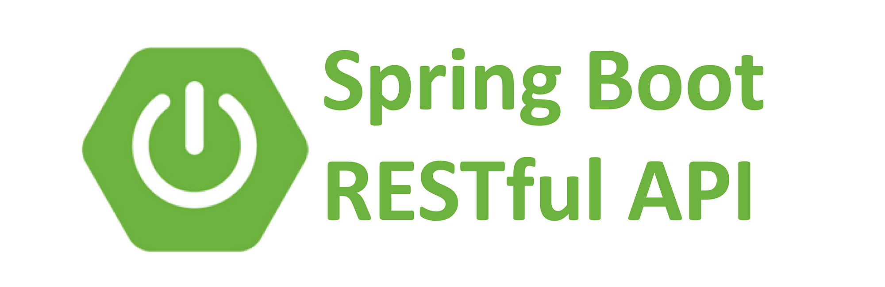

# 4. Spring Web

**Spring Web MVC** es un módulo del framework [Spring](https://spring.io/projects/spring-boot) que proporciona un marco para desarrollar aplicaciones web y servicios RESTful. Se basa en el patrón de diseño Modelo-Vista-Controlador (MVC), que es un patrón comúnmente utilizado en el desarrollo de interfaces de usuario.


Aquí está cómo funciona Spring Web MVC en términos del patrón MVC:

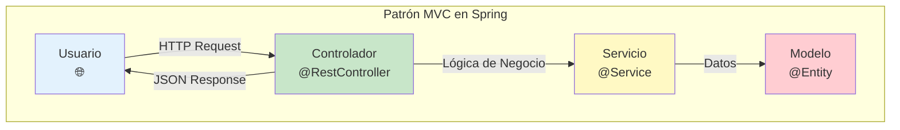

1. **Modelo**: El modelo representa los datos y las reglas de negocio de la aplicación. En Spring MVC, los modelos son a menudo objetos POJO (Plain Old Java Objects) que se pasan entre vistas y controladores.

2. **Vista**: La vista es responsable de renderizar el modelo en una forma que el usuario pueda entender (por ejemplo, HTML). Spring MVC soporta una variedad de tecnologías de vista, incluyendo JSP, Thymeleaf, FreeMarker y más.

📝 **Nota del Profesor**
> En APIs REST con @RestController, la "vista" es el JSON que enviamos. No necesitamos Thymeleaf ni JSP.

3. **Controlador**: El controlador maneja las solicitudes del usuario y actualiza el modelo correspondiente. En Spring MVC, los controladores son clases anotadas con `@Controller` o `@RestController`.

El módulo Spring Web MVC proporciona una gran cantidad de funcionalidades para el desarrollo de aplicaciones web, incluyendo:

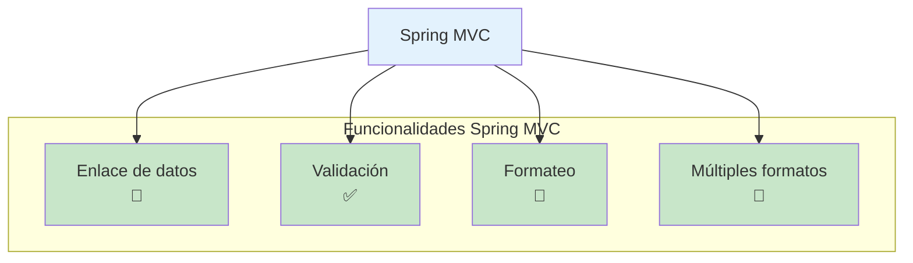

- Enlace de datos: Spring MVC puede enlazar automáticamente los parámetros de la solicitud a los parámetros del método del controlador, lo que facilita la manipulación de los datos de la solicitud.

- Validación: Spring MVC soporta la validación de los datos del modelo utilizando el API de Validación de Bean de Java.

- Formateo de datos: Spring MVC puede convertir automáticamente entre strings y tipos de datos más complejos.

- Manejo de excepciones: Spring MVC proporciona un mecanismo robusto para manejar excepciones.

- Soporte para la generación de respuestas en varios formatos, como JSON y XML.

**Spring Web** es un término más general que se refiere a todas las funcionalidades de Spring relacionadas con el desarrollo web, incluyendo Spring MVC, pero también otras como Spring WebFlux para programación reactiva, Spring Web Services para SOAP, entre otras.

💡 **Tip del Examinador**
> Spring Web ≠ Spring MVC. Spring Web es más amplio e incluye MVC y más.

En resumen, Spring MVC es una parte integral de la mayoría de las aplicaciones web basadas en Spring, proporcionando un marco robusto y flexible para el manejo de las interacciones web.

## 4.1. Creando un proyecto

Podemos crear un proyecto Spring Boot usando el plugin IntelliJ, desde su web. Con estos [asistentes](https://start.spring.io/) podemos crear un proyecto Spring con las opciones que queramos y descargarlo o fihjar su filosofía, tradicional o reactivo, el lenguaje, las dependencias, etc.

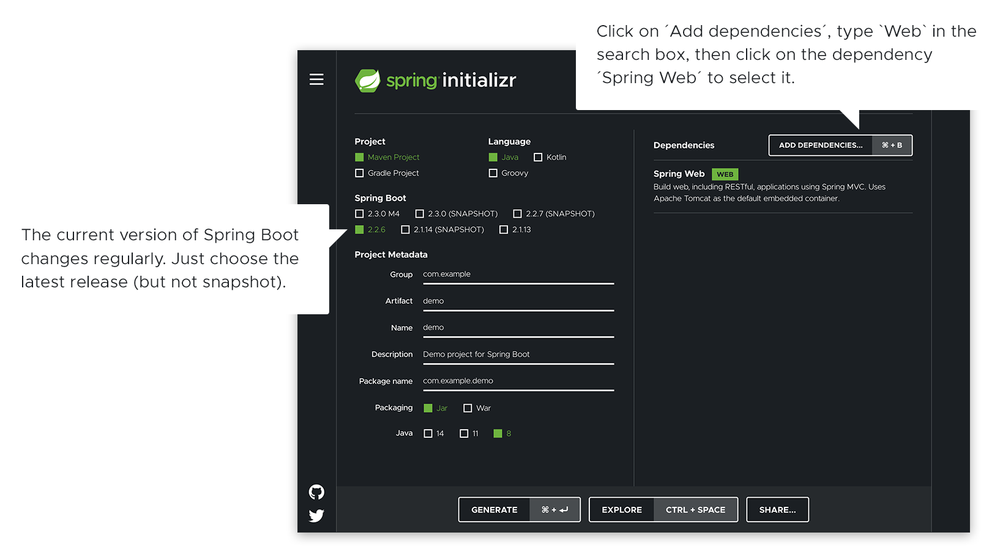

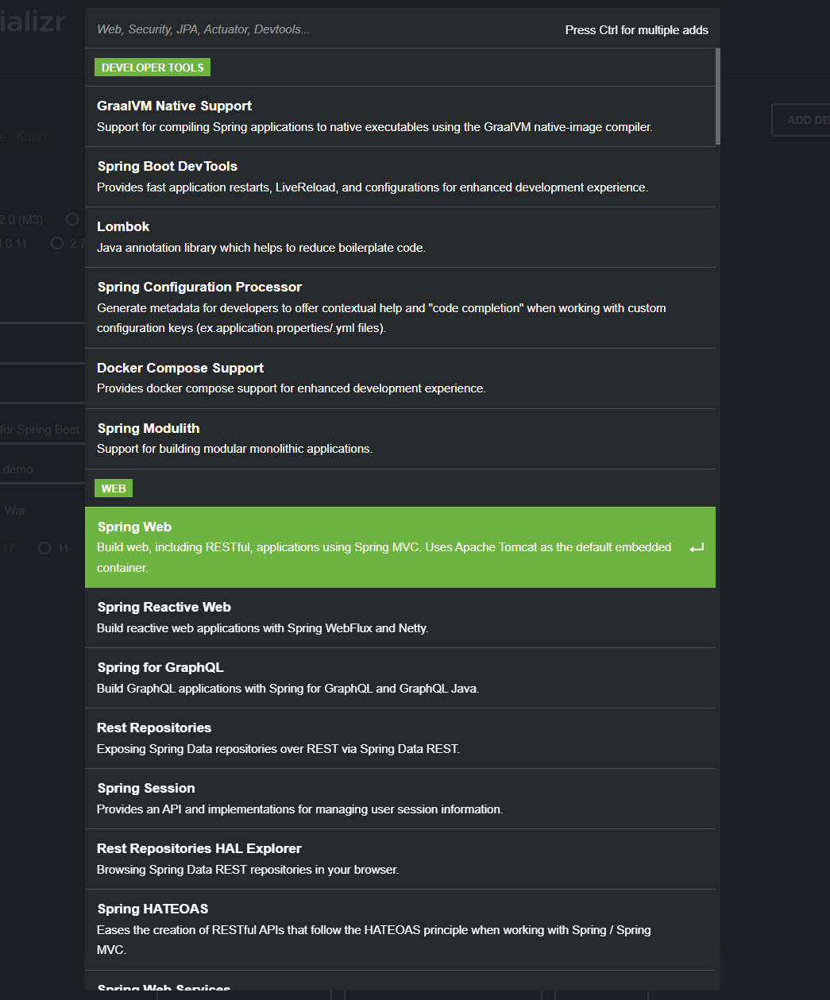

Para nuestro proyecto deberemos usar las siguientes dependencias:
- Usaremos Lenguaje Java, JVM Java 17, IntelliJ
- Gradle con Kotlin DSL y packaging jar
- Spring Boot version 3.14
- Starters y Dependencias: 
  - Spring Web: nos permite crear aplicaciones web de forma rápida y sencilla no reactiva

📝 **Nota del Profesor**
> Usamos Java 17 porque es LTS (Long Term Support) y tiene características modernas como records y pattern matching.

Posteriormente podemos añadir las dependencias que necesitemos, por ejemplo para usar una base de datos, seguridad, testing, u otras librerías que necesitemos (Lombock, etc) etc.

⚠️ **Advertencia**
> ¡Cuidado con las versiones! Spring Boot 3.x requiere Java 17+. No intentes usar Java 11 con Spring Boot 3.

Si se nos olvida alguna dependencia, podemos añadirla posteriormente desde el fichero pom.xml o build.gradle.kts sin problemas

### 4.1.1. Starters

En Spring Boot, los "starters" son dependencias preconfiguradas que facilitan la incorporación de tecnologías y funcionalidades específicas en tu aplicación. Estas dependencias incluyen todas las bibliotecas y configuraciones necesarias para trabajar con una tecnología o funcionalidad en particular, lo que te permite comenzar rápidamente sin tener que configurar todo manualmente.

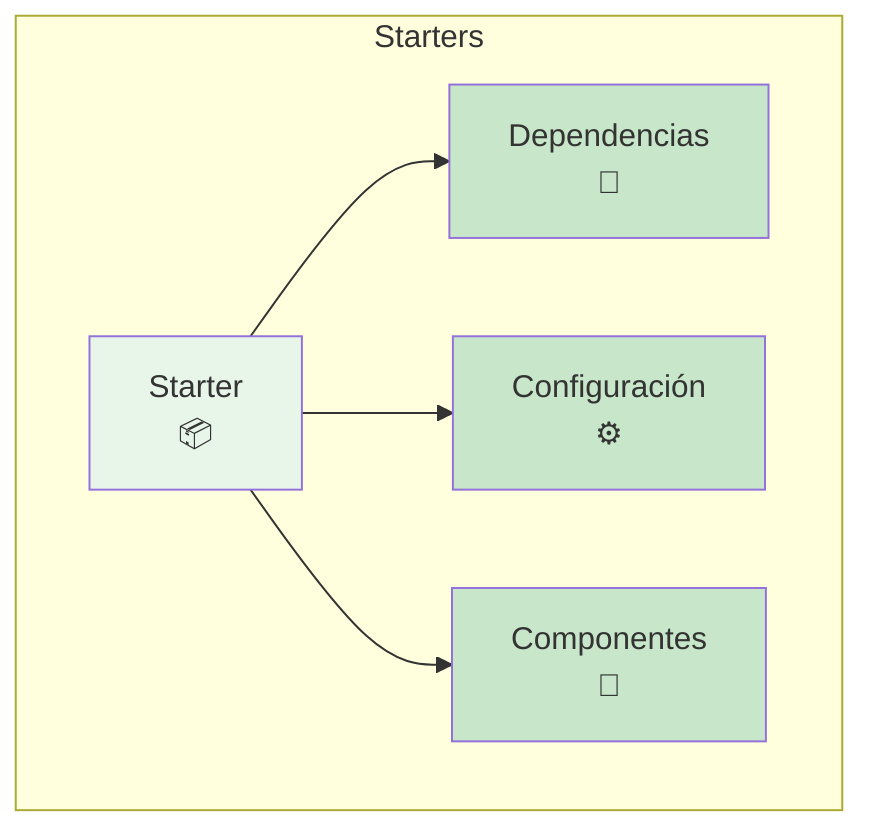

Los starters están diseñados para simplificar el proceso de desarrollo en Spring Boot al proporcionar un conjunto coherente de dependencias y configuraciones para casos de uso comunes. Cada starter se enfoca en una tecnología o funcionalidad específica, como bases de datos, seguridad, servicios web, etc.

Cuando agregas un starter a tu proyecto Spring Boot, automáticamente se incluyen todas las dependencias necesarias en tu aplicación. Además, se configuran las configuraciones predeterminadas y se activan los componentes relevantes para la tecnología o funcionalidad específica. Esto te ahorra tiempo y esfuerzo al no tener que buscar y configurar manualmente las dependencias y configuraciones correctas.

Por ejemplo, si deseas trabajar con una base de datos MySQL en tu aplicación Spring Boot, puedes agregar el starter "spring-boot-starter-data-jpa" a tu proyecto. Esto incluirá las dependencias necesarias para trabajar con JPA (Java Persistence API) y MySQL, y configurará automáticamente la conexión a la base de datos y otros aspectos relacionados.

```kotlin
dependencies {
    // Dependencias y statert de Spring Web for HTML Apps y Rest
    implementation("org.springframework.boot:spring-boot-starter-web")

    // Dependencias y starter para Test
    testImplementation("org.springframework.boot:spring-boot-starter-test")
}
```

### 4.1.2. Punto de Entrada

El servidor tiene su entrada y configuración en la clase Application. Esta lee la configuración en base al fichero de configuración(./src/main/resources/application.properties) y a partir de aquí se crea una instancia de la clase principal etiquetada con @SpringBootApplication

```java
@SpringBootApplication
public class TiendaApiSpringApplication {

    public static void main(String[] args) {
        SpringApplication.run(TiendaApiSpringApplication.class, args);
    }

}
```

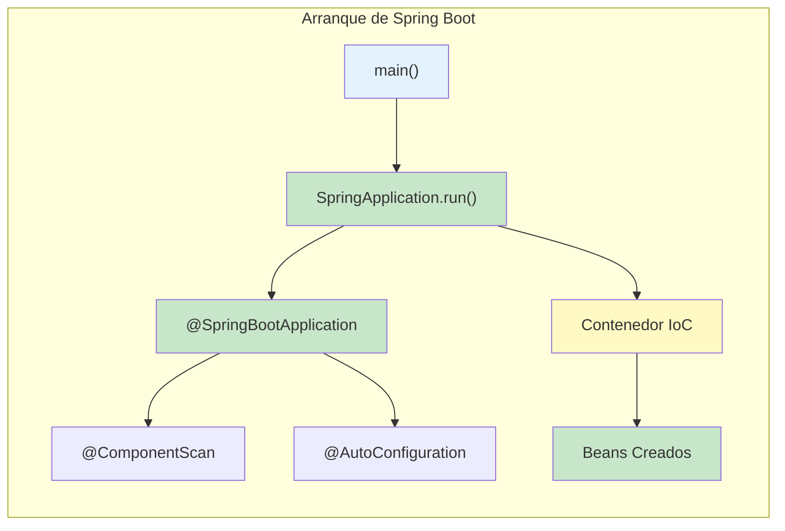

A continuación, te explico cada componente de la clase:

1. `@SpringBootApplication`: Esta anotación es una combinación de varias anotaciones de Spring Boot, incluyendo `@Configuration`, `@EnableAutoConfiguration` y `@ComponentScan`. Esta anotación marca la clase como una clase de configuración de Spring Boot y habilita la configuración automática de la aplicación. Además, escanea los componentes dentro del paquete actual y sus subpaquetes para su detección automática.

2. `public static void main(String[] args)`: Este es el método principal de la aplicación. Es el punto de entrada de la aplicación Spring Boot. Aquí, se llama al método `run` de la clase `SpringApplication` para iniciar la aplicación Spring Boot. El primer argumento (`TiendaApiSpringApplication.class`) especifica la clase principal de la aplicación, y el segundo argumento (`args`) es una matriz de argumentos de línea de comandos que se pueden pasar a la aplicación.

3. `SpringApplication.run(TiendaApiSpringApplication.class, args)`: Este método estático de la clase `SpringApplication` inicia la aplicación Spring Boot. Toma la clase principal de la aplicación (`TiendaApiSpringApplication.class`) y los argumentos de línea de comandos (`args`) como parámetros. Internamente, este método configura y arrancar el entorno de ejecución de Spring Boot, inicializa los componentes de la aplicación y comienza a escuchar las solicitudes entrantes.

💡 **Tip del Examinador**
> @SpringBootApplication = @Configuration + @EnableAutoConfiguration + @ComponentScan

En resumen, la clase `TiendaApiSpringApplication` es la clase principal de una aplicación Spring Boot. Al anotarla con `@SpringBootApplication` y llamar al método `run` de `SpringApplication`, se inicia la aplicación Spring Boot y se configura el entorno de ejecución.

Si nosotros queremos hacer algo por consola o antes de todo, dentro del contexto de Spring Boot debemos implementar `CommandLineRunner` y sobreescribir el método run. De esta manera, cuando se inicie la aplicación, se ejecutará el método run y podremos hacer lo que queramos. No es obligatorio

```java
@SpringBootApplication
public class TiendaApiSpringApplication implements CommandLineRunner {

    public static void main(String[] args) {
        SpringApplication.run(TiendaApiSpringApplication.class, args);
    }

    @Override
    public void run(String... args) throws Exception {
        System.out.println("Hola Mundo");
    }
}
```

### 4.1.3. Parametrizando la aplicación

La aplicación está parametrizada en el fichero de configuración application.properties(./src/main/resources/application.properties) que se encuentra en el directorio resources. En este fichero podemos configurar el puerto, el modo de ejecución, etc.

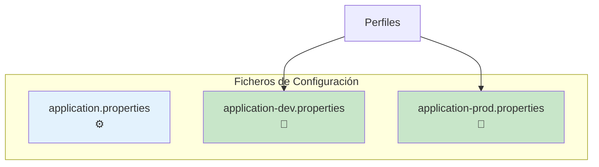

Podemos tener distintos ficheros por ejemplo para desarrollo y producción.

Propiedades globales: src/main/resources/application.properties
Propiedades de producción: src/main/resources/application-prod.properties
Propiedades de desarrollo: src/main/resources/application-dev.properties
Y luego desde la línea de comandos podemos cargar un perfil concreto de la siguiente manera:

```bash
java -jar -Dspring.profiles.active=prod demo-0.0.1-SNAPSHOT.jar
```

💡 **Tip del Examinador**
> En producción NUNCA uses application.properties con contraseñas. Usa variables de entorno o secrets.

```properties
server.port=${PORT:3000}
### Compresion de datos
server.compression.enabled=${COMPRESS_ENABLED:true}
server.compression.mime-types=text/html,text/xml,text/plain,text/css,application/json,application/javascript
server.compression.min-response-size=1024
### Configuramos el locale en España
spring.web.locale=es_ES
spring.web.locale-resolver=fixed
### directorio de almacenamiento
upload.root-location=uploads
### Indicamos el perfil por defecto (Base de datos y otros)
#### dev: development. application-dev.properties
#### prod: production. application-prod.properties
spring.profiles.active=dev
```

## 4.2. Spring MVC y Spring Web

Spring MVC es el conjunto de librerías que nos permite crear aplicaciones web de forma rápida y sencilla. Spring Web es nos permite mediante su starter crear un proyecto con las librerías necesarias para crear por ejemplo una API REST obteniendo todas las librerías y configuración básica para ello, por ejemplo tener nuestro propio servidor web para gestionar las peticiones.

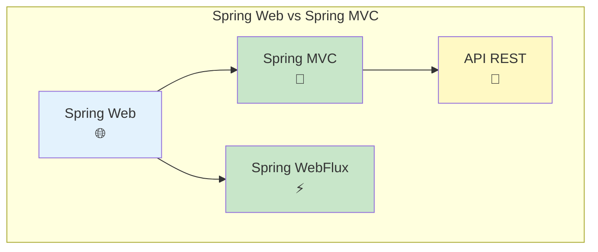

## 4.3. Componentes de Spring Boot

Spring Boot nos ofrece una serie de componentes que nos ayudan a crear aplicaciones web de forma rápida y sencilla. Nuestros componentes principales se etiquetarán con @ para que el framework Spring lo reconozca (módulo de inversión de control y posterior inyección de dependencias). Cada uno tiene una misión en nuestra arquitectura:


📝 **Nota del Profesor**
> Esta arquitectura en capas es fundamental. Controller → Service → Repository es el patrón clásico.

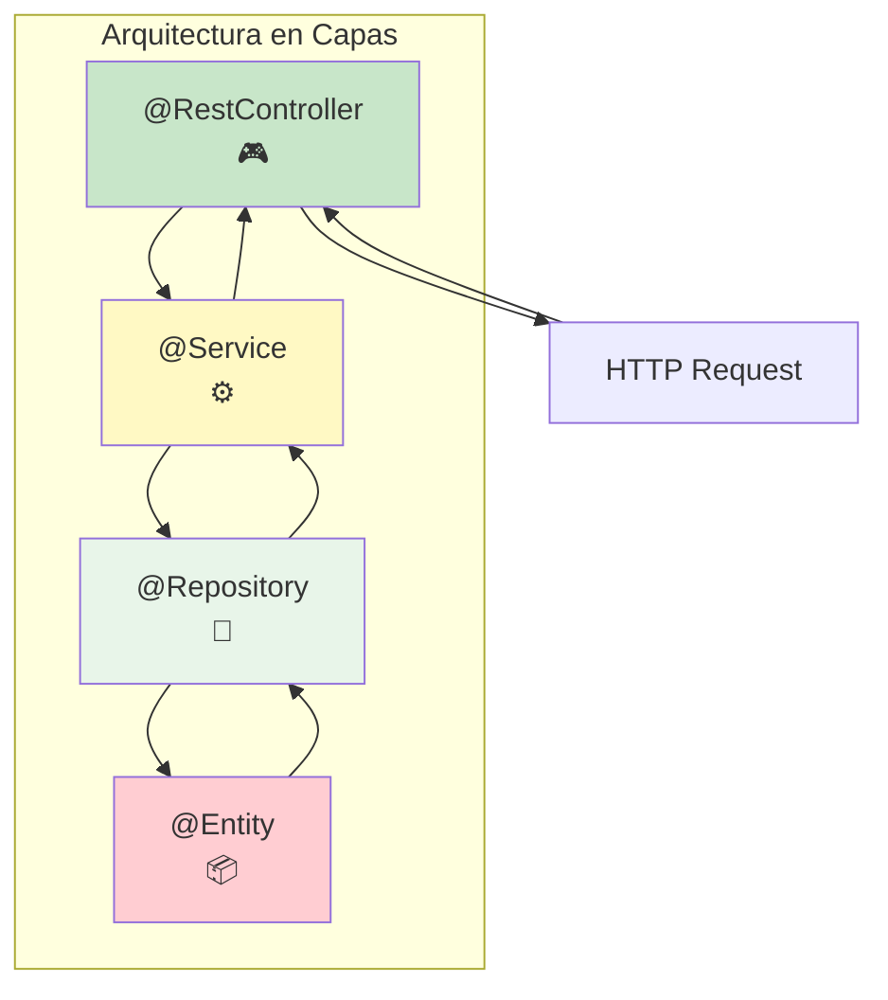

- Controladores: Se etiquetan como *@Controller* o en nuestro caso al ser una API REST como @RestController. Estos son los controladores que se encargan de recibir las peticiones de los usuarios y devolver respuestas, es decir, son anotaciones utilizadas para manejar las solicitudes HTTP en una aplicación web. Como se indica hay dos opciones:
  - @Controller: Esta anotación se utiliza para marcar una clase como un controlador en Spring MVC. Un controlador en Spring MVC se encarga de manejar las solicitudes HTTP y generar una respuesta, que puede ser una página HTML, una vista, un archivo JSON, etc. Los métodos dentro de una clase anotada con @Controller deben devolver una vista o un objeto ModelAndView que representa una vista.
  - @RestController: Esta anotación combina las anotaciones @Controller y @ResponseBody. Se utiliza para marcar una clase como un controlador REST en Spring MVC. Un controlador REST maneja las solicitudes HTTP y devuelve directamente objetos JSON, XML o cualquier otro formato de datos en lugar de una vista. Los métodos dentro de una clase anotada con @RestController devuelven directamente el objeto que se serializa en la respuesta HTTP.

- Servicios: Se etiquetan como *@Service*. Se encargan de implementar la parte de negocio o infraestructura. En nuestro caso puede ser el sistema de almacenamiento o parte de la seguridad y perfiles de usuario.

- Repositorios: Se etiquetan como *@Repository* e implementan la interfaz y operaciones de persistencia de la información. En nuestro caso, puede ser una base de datos o una API externa. Podemos extender de repositorios pre establecidos o diseñar el nuestro propio.

- Configuración: Se etiquetan como *@Configuration*. Se encargan de configurar los componentes de la aplicación. Se se suelen iniciar al comienzo de nuestra aplicación.

- Bean: La anotación *@Bean*, nos sirve para indicar que este bean será administrado por Spring Boot (Spring Container). La administración de estos beans se realiza mediante a anotaciones como @Configuration. De esta manera cuando se pida un objeto y esté anotado como  @Bean, Spring Boot se encargará de crearlo y devolverlo.

⚠️ **Advertencia**
> @Bean se pone en métodos dentro de @Configuration. @Component se pone en clases directamente.

En definitiva tratamos de fomentar una estructura de capas:


### 4.3.1. Scope

La anotación @Scope en Spring Boot se utiliza para definir el alcance de un componente gestionado por el contenedor de Spring. Permite especificar cómo se crean y se mantienen las instancias de un componente en el contexto de la aplicación.

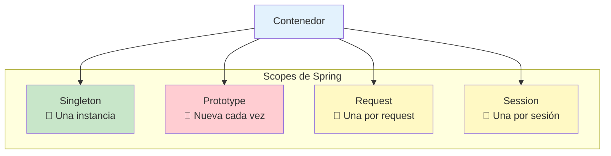

Existen diferentes valores que se pueden asignar a la anotación @Scope:

1. Singleton (valor por defecto): Indica que solo se creará una única instancia del componente en el contexto de la aplicación. Esta instancia será compartida por todos los hilos y solicitudes que accedan al componente.

2. Prototype: Indica que se creará una nueva instancia del componente cada vez que sea solicitado. Cada solicitud obtendrá una instancia independiente del componente.

3. Request: Indica que se creará una nueva instancia del componente para cada solicitud web que lo requiera. Cada solicitud obtendrá una instancia independiente del componente.

4. Session: Indica que se creará una nueva instancia del componente para cada sesión web. Cada sesión obtendrá una instancia independiente del componente.

5. GlobalSession: Similar al alcance de sesión, pero se utiliza en aplicaciones que utilizan el ámbito de sesión global.

💡 **Tip del Examinador**
> El 99% de los casos usarás Singleton. Prototype solo para casos especiales donde necesitas una instancia nueva cada vez.

Para usar la anotación @Scope, simplemente se debe colocar encima de la declaración de la clase del componente y especificar el valor del alcance deseado. Por ejemplo:

```java
@Component
@Scope("prototype") // @Scope("singleton")
public class MiComponente {
   // ...
}
```

En este ejemplo, se define un componente llamado "MiComponente" con alcance de prototipo, lo que significa que cada vez que se solicite este componente, se creará una nueva instancia.

Es importante tener en cuenta que el uso adecuado del alcance de los componentes depende de las necesidades específicas de la aplicación. Se debe considerar cuidadosamente el impacto en el rendimiento y la gestión de recursos al elegir el alcance adecuado para cada componente.

### 4.3.2. IoC y DI en SpringBoot

La Inversión de control (Inversion of Control en inglés, IoC) es un principio de diseño de software en el que el flujo de ejecución de un programa se invierte respecto a los métodos de programación tradicionales. En su lugar, en la inversión de control se especifican respuestas deseadas a sucesos o solicitudes de datos concretas, dejando que algún tipo de entidad o arquitectura externa lleve a cabo las acciones de control que se requieran en el orden necesario y para el conjunto de sencillos que tengan que ocurrir.

```mermaid
graph LR
    subgraph "Tradicional vs IoC"
        Tradicional[" Tradicional<br/>A crea B"]
        IoC["IoC/DI<br/>Spring crea B"]
    end
    
    Tradicional -->|new B()| B1["B"]
    IoC -->|@Autowired| B2["B"]
    Spring["Spring"] -->|Inyecta| B2
    
    style Tradicional fill:#ffcdd2
    style IoC fill:#c8e6c9
    style Spring fill:#e3f2fd
```

La inyección de dependencias (en inglés Dependency Injection, DI) es un patrón de diseño orientado a objetos, en el que se suministran objetos a una clase en lugar de ser la propia clase la que cree dichos objetos. Esos objetos cumplen contratos que necesitan nuestras clases para poder funcionar (de ahí el concepto de dependencia). Nuestras clases no crean los objetos que necesitan, sino que se los suministra otra clase 'contenedora' que inyectará la implementación deseada a nuestro contrato.

📝 **Nota del Profesor**
> DI es la técnica que implementa IoC. Piensa en ello como "inyectar" las dependencias desde fuera en lugar de "crearlas" dentro.

El contenedor Spring IoC lee el elemento de configuración durante el tiempo de ejecución y luego ensambla el Bean a través de la configuración. La inyección de dependencia de Spring se puede lograr a través del constructor, el método Setter y el dominio de entidad. Podemos hacer uso de la anotación **@Autowired** para inyectar la dependencia en el contexto requerido.

El contenedor llamará al constructor con parámetros al instanciar el bean, y cada parámetro representa la dependencia que queremos establecer. Spring analizará cada parámetro, primero lo analizará por tipo, pero cuando sea incierto, luego lo analizará de acuerdo con el nombre del parámetro (obtenga el nombre del parámetro a través de ParameterNameDiscoverer, implementado por ASM).

```java
public class ProductosRestController {
    private final ProductosRepository productosRepository;

    @Autowired
    public ProductosRestController(ProductosRepository productosRepository) {
        this.productosRepository = productosRepository;
    }
}
```

💡 **Tip del Examinador**
> Usa inyección por constructor (recomendado). No uses @Autowired en campos (inversión de control excesiva).

A nivel de setter
Spring primero instancia el Bean y luego llama al método Setter que debe inyectarse para lograr la inyección de dependencia. No recomendado

```java
public class ProductosRestController {
    private ProductosRepository productosRepository;

    @Autowired
    public void setProductosRepository(ProductosRepository productosRepository) {
        this.productosRepository = productosRepository;
    }
}
```

⚠️ **Advertencia**
> La inyección por setter es menos común y puede crear objetos en estado inconsistente. Usa constructores.

### 4.3.3. Creando rutas

Para crear las rutas vamos a usar on controlador de tipo **RestController**. Este controlador se encargará de recibir las peticiones y devolver las respuestas en formato por defecto, emn este caso JSON. Para ello vamos a usar las anotaciones de Spring Web.

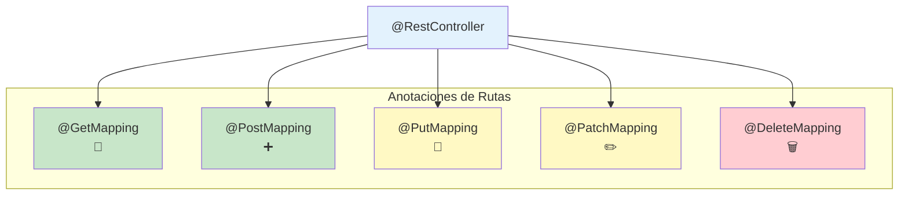

Las peticiones que vamos a recibir seguirán los verbos HTTP que conocemos: tipo GET (GetMapping), POST (PostMapping), PUT (PutMapping), PATCH (PatchMapping) y/o DELETE (DeleteMapping). De esta manera podremos hacer las peticiones CRUD que necesitemos.

Además, podemos usar **ResponseEntity** para devolver el código de estado de la respuesta, así como el cuerpo de la misma.

```java
@RestController
public class ProductosRestController {
    private final ProductosRepository productosRepository;

    @Autowired
    public ProductosRestController(ProductosRepository productosRepository) {
        this.productosRepository = productosRepository;
    }

    @GetMapping("/productos")
    public ResponseEntity<List<Producto>> getProducts() {
        return ResponseEntity.ok(productosRepository.findAll());
    }

    @GetMapping("/productos/{id}")
    public ResponseEntity<Producto> getProduct(@PathVariable Long id) {
        return ResponseEntity.ok(productosRepository.findById(id).get());
    }

    @PostMapping("/productos")
    public ResponseEntity<Producto> createProduct(@RequestBody Producto producto) {
        return ResponseEntity.status(HttpStatus.CREATED).body(productosRepository.save(producto));
    }

    @PutMapping("/productos/{id}")
    public ResponseEntity<Producto> updateProduct(@PathVariable Long id, @RequestBody Producto producto) {
        return ResponseEntity.ok(productosRepository.save(producto));
    }

    @DeleteMapping("/productos/{id}")
    public ResponseEntity<Void> deleteProduct(@PathVariable Long id) {
        productosRepository.deleteById(id);
        return ResponseEntity.noContent().build();
    }
}
```

### 4.3.4. Responses

Para devolver las respuestas vamos a usar la clase **ResponseEntity**. Esta clase nos permite devolver el código de estado HTTP de la respuesta, así como el cuerpo de la misma. Podemos usar los response entities para devolver respuestas concretas con los HttpStatus que necesitemos: OK, CREATED, BAD_REQUEST, NOT_FOUND, etc.

```java
@GetMapping("/productos")
public ResponseEntity<List<Producto>> getProducts() {
    return ResponseEntity.ok(productosRepository.findAll());
}

@GetMapping("/productos/{id}")
public ResponseEntity<Producto> getProduct(@PathVariable Long id) {
    return ResponseEntity.ok(productosRepository.findById(id).get());
}

@PostMapping("/productos")
public ResponseEntity<Producto> createProduct(@RequestBody Producto producto) {
    return ResponseEntity.status(HttpStatus.CREATED).body(productosRepository.save(producto));
}

@PutMapping("/productos/{id}")
public ResponseEntity<Producto> updateProduct(@PathVariable Long id, @RequestBody Producto producto) {
    return ResponseEntity.ok(productosRepository.save(producto));
}

@DeleteMapping("/productos/{id}")
public ResponseEntity<Void> deleteProduct(@PathVariable Long id) {
    productosRepository.deleteById(id);
    return ResponseEntity.noContent().build();
}
```

💡 **Tip del Examinador**
> POST → 201 Created
> DELETE → 204 No Content
> GET/PUT/PATCH → 200 OK

### 4.3.5. Requests

Las peticiones podemos hacerlas con usando los verbos http, y las anotaciones de Spring Web: GetMapping, PostMapping, PutMapping, PatchMapping y DeleteMapping...

#### 4.3.5.1. Parámetros de ruta

Podemos usar los [parámetros de ruta](https://www.baeldung.com/spring-pathvariable) para obtener información de la petición. Para ello debemos usar la anotación @PathVariable

```java
@GetMapping("/productos/{id}")
public ResponseEntity<Producto> getProduct(@PathVariable Long id) {
    return ResponseEntity.ok(productosRepository.findById(id).get());
}
```

#### 4.3.5.2. Parámetros de consulta

Podemos usar los [parámetros de consulta](https://www.baeldung.com/spring-request-param) (Query) para obtener información de la petición. Para ello debemos usar la anotación **@RequestParam**, si la tipamos como nula, o indicamos que no es requerida, podremos usarla como opcional. además podemos indicarle un valor por defecto con Default value

```java
@GetMapping("/productos")
public ResponseEntity<List<Producto>> getProducts(@RequestParam(required = false) nombre: String) {
    if (nombre != null) {
        return ResponseEntity.ok(productosRepository.findByNombre(nombre));
    }
    return ResponseEntity.ok(productosRepository.findAll());
}
```

📝 **Nota del Profesor**
> @RequestParam(required = false) permite que el parámetro sea opcional. Sin esto, falta el parámetro → 400 Bad Request.

#### 4.3.5.3. Peticiones con datos serializados

Podemos enviar [datos serializados](https://www.baeldung.com/spring-request-response-body) en el cuerpo de la petición. Para ello debemos usar la anotación **@RequestBody** y **ResponseEntity** para devolverlos

```java
@PostMapping("/productos")
public ResponseEntity<Producto> createProduct(@RequestBody Producto producto) {
    return ResponseEntity.status(HttpStatus.CREATED).body(productosRepository.save(producto));
}
```

⚠️ **Advertencia**
> @RequestBody convierte JSON → Java. Si el JSON no coincide con el objeto, tendrás errores de parsing.

### 4.3.6. Versionado de la API

Es una buena práctica que realicemos el versionado de la API, El versionado de una API es fundamental para garantizar la estabilidad, la evolución controlada y la compatibilidad hacia atrás. Proporciona un marco para gestionar los cambios en la API de manera efectiva y permite una comunicación y colaboración más fluidas con los usuarios. Podemos hacerlo desde el fichero properties añadiendo la clave y recuperándola en el servidor

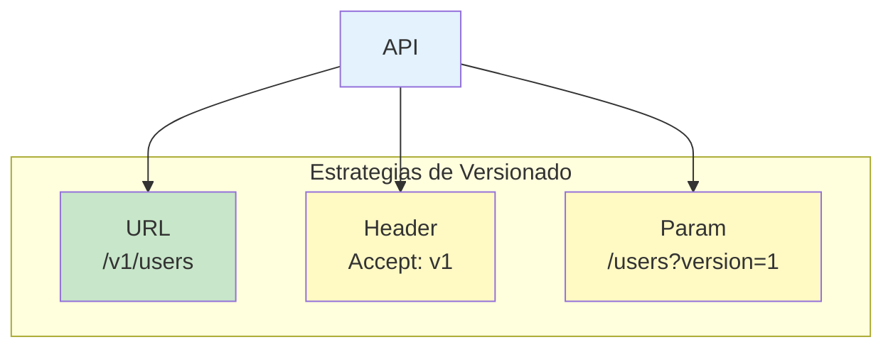

```properties
api.version=1.0
```

```java
@RestController
@RequestMapping("/api/users")
public class UserController {

    @Value("${api.version}")
    private String apiVersion;

    @GetMapping
    public ResponseEntity<String> getUsers() {
        if ("v1".equals(apiVersion)) {
            // Lógica para la versión v1 de la API
            return ResponseEntity.ok("Users API v1");
        } else if ("v2".equals(apiVersion)) {
            // Lógica para la versión v2 de la API
            return ResponseEntity.ok("Users API v2");
        } else {
            // Versión no compatible
            return ResponseEntity.status(HttpStatus.BAD_REQUEST).body("Invalid API version");
        }
    }
}
```

💡 **Tip del Examinador**
> La forma más simple y común es versionar por URL: /v1/users, /v2/users. Es lo que espera el examinador.

## 4.4. Postman

Para probar con un cliente nuestro servicio usaremos [Postman](https://www.postman.com/) que es una herramienta de colaboración para el desarrollo de APIs. Permite a los usuarios crear y compartir colecciones de peticiones HTTP, así como documentar y probar sus APIs.

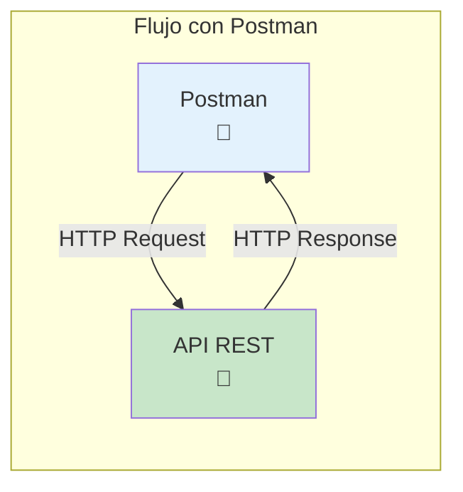

El fichero para probar nuestra api lo tienes en la carpera [postman](./postman) y puedes importarlo en tu Postman para probar el resultado.

📝 **Nota del Profesor**
> Postman es essencial para probar APIs. En el examen práctico, saber usar Postman correctamente es muy importante.

Recuerda que los cuerpos en JSON se mandan en Body - Raw - JSON


## 4.5. Práctica de clase, mi primera API REST

1. Crea un proyecto Spring Boot con las dependencias de Spring Web
2. Crea el controlador de FunkosRestController con las operaciones CRUD para productos (GET, POST, PUT, PATCH, DELETE) que devuelvan un mensaje de texto con cada operación.
3. Crea el modelo Funko con los siguientes atributos: id, nombre, precio, cantidad, imagen, categoría, fecha de creación y fecha de actualización. 
3. Crea el repositorio de Funkos en base a la colección que quieras. Puedes importarla desde un fichero csv que se lea de properties o desde un fichero json, como en ejercicios anteriores.
4. Inyecta  el repositorio el controlador de Funkos con las siguientes rutas:
   - GET /funkos: Devuelve todos los funkos, si tiene el query categoría, los filtra por categoría, por ejemplo /funkos?categoria=disney (cuidado con los letras en mayúscula o minúscula)
   - GET /funkos/{id}: Devuelve el funko con el id indicado, si no existe devuelve un error 404
   - POST /funkos: Crea un nuevo funko y lo devuelva
   - PUT /funkos/{id}: Actualiza el funko con el id indicado y lo devuelve, si no existe devuelve un error 404
   - PATCH /funkos/{id}: Actualiza el funko con el id indicado y lo devuelve, si no existe devuelve un error 404
   - DELETE /funkos/{id}: Borra el funko con el id indicado y devuelve un mensaje de éxito, si no existe devuelve un error 404
5. Prueba las rutas con Postman

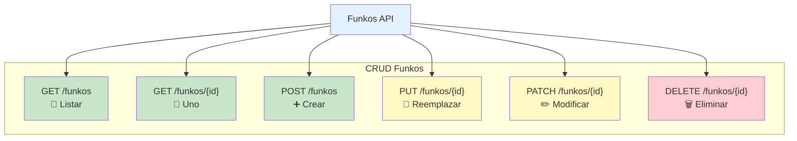
