- [5. Servicios](#5-servicios)
  - [5.1. Manejo de Excepciones y errores](#51-manejo-de-excepciones-y-errores)
    - [5.1.1. ResponseStatusException](#511-responsestatusexception)
    - [5.1.2. Excepciones personalizadas](#512-excepciones-personalizadas)
    - [5.1.3. Visualizando las excepciones](#513-visualizando-las-excepciones)
  - [5.2. Cache](#52-cache)
  - [5.3. Patrón DTO](#53-patrón-dto)
  - [5.4. Mapeadores](#54-mapeadores)
  - [5.5. Validadores](#55-validadores)
    - [5.5.1. Jakarta Bean Validation](#551-jakarta-bean-validation)
  - [5.6. Práctica de clase, Servicio](#56-práctica-de-clase-servicio)

📝 **Nota del Profesor**
> Los servicios son el corazón de la lógica de negocio. Aquí aplicamos todo lo aprendido: DTOs, validación, caché y manejo de errores.

💡 **Tip del Examinador**
> En el examen preguntan mucho sobre DTOs vs Entidades. ¡No confundas la capa de datos con la de presentación!

---

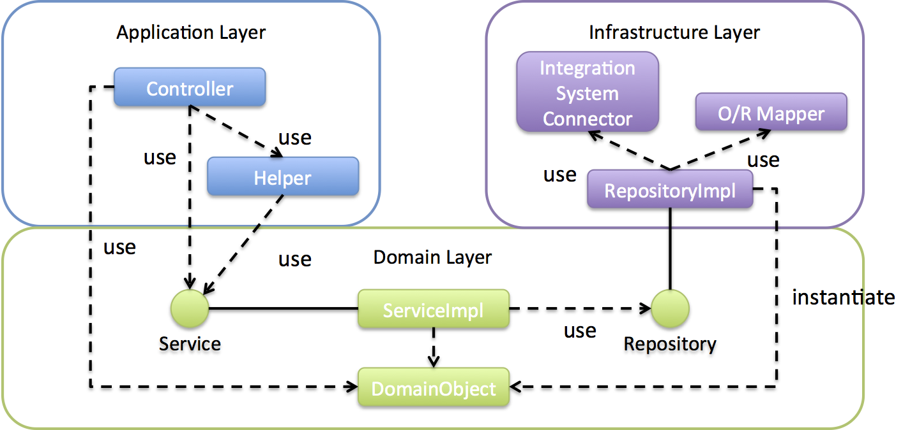

# 5. Servicios

Un servicios encapsula la lógica de negocio de nuestra app. De esta manera aplicamos el principio de responsabilidad única. Donde el controlador procesa las peticiones, y el servicio realiza las acciones necesarias para poder darle la respuesta.

```mermaid
graph TB
    subgraph "Arquitectura de Capas"
        Controller["@RestController<br/>🎮 Peticiones"]
        Service["@Service<br/>⚙️ Lógica de Negocio"]
        Repository["@Repository<br/>💾 Datos"]
    end
    
    HTTP["HTTP Request"] --> Controller
    Controller --> Service
    Service --> Repository
    Repository --> Service
    Service --> Controller
    Controller --> HTTP
    
    style Controller fill:#c8e6c9
    style Service fill:#fff9c4
    style Repository fill:#e8f5e9
```

Para ello vamos a crear nuestro servicio anotado con `@Service`y lo usaremos para procesar las peticiones requeridas por el controlador.


📝 **Nota del Profesor**
> El controlador solo recibe/y responde HTTP. El servicio contiene toda la lógica de negocio. Esta separación es clave.

## 5.1. Manejo de Excepciones y errores

### 5.1.1. ResponseStatusException

Los errores se pueden manejar de dos formas: con excepciones. Desde la versión 5 de Spring, se puede usar [ResponseStatusException](https://www.baeldung.com/spring-response-status-exception). De esta forma, podemos lanzar una excepción y Spring se encarga de convertirla en un error HTTP en base al contenido que se le indica, dando la respuesta adecuada. 

```mermaid
graph LR
    subgraph "ResponseStatusException"
        Excepcion["Excepción<br/>🚨"] -->|"Código + Mensaje"| Response["ResponseStatusException"]
        Response -->|"Convierte a"| HTTP["HTTP 400/404/500"]
    end
    
    style Excepcion fill:#ffcdd2
    style Response fill:#fff9c4
    style HTTP fill:#c8e6c9
```

```java
public class RaquetaValidator {

    public void validate(Raqueta raqueta) {
        // las distintas condiciones
        if (raqueta.getMarca() == null || raqueta.getMarca().isEmpty()) {
            throw new ResponseStatusException(
                    HttpStatus.BAD_REQUEST, "La marca no puede estar vacía");
        }
        if (raqueta.getModelo() == null || raqueta.getModelo().isEmpty()) {
            throw new ResponseStatusException(
                    HttpStatus.BAD_REQUEST, "El modelo no puede estar vacío");
        }
        if (raqueta.getPrecio() == null || raqueta.getPrecio() < 0) {
            throw new ResponseStatusException(
                    HttpStatus.BAD_REQUEST, "El precio no puede ser negativo");
        }
    }

}
```

```java
 @Override
 public Raqueta findById(Long id) {
     log.info("findById");
     return raquetasRepository.findById(id).orElseThrow(
             () -> new ResponseStatusException(
                     HttpStatus.NOT_FOUND, "No se ha encontrado la raqueta con id: " + id)
     );
 }
```

💡 **Tip del Examinador**
> ResponseStatusException es rápida y sencilla. Perfecta para excepciones simples. Para control más fino, usa excepciones personalizadas.

### 5.1.2. Excepciones personalizadas

La otra opción es crear nuestras sistema de excepciones ye errores asociado al dominio. Para ello, vamos a crear una clase `RaquetaException` que herede de `RuntimeException` y que tenga un constructor con un mensaje. De esta forma, podemos lanzar una excepción y Spring se encarga de convertirla en un error HTTP en base al contenido que se le indica, dando la respuesta adecuada. El Response Stuatus lo definimos con una anotación. de esta manera nos es más sencillo testear y acotar las excepciones que se produzcan.

```mermaid
graph TB
    subgraph "Excepciones Personalizadas"
        Runtime["RuntimeException"]
        Custom["MiExcepcion<br/>@ResponseStatus"]
        Handler["@ExceptionHandler<br/>🔧"]
    end
    
    Runtime --> Custom
    Custom --> Handler
    
    style Runtime fill:#e3f2fd
    style Custom fill:#c8e6c9
    style Handler fill:#fff9c4
```

```java
// Nos permite devolver un estado cuando salta la excepción
@ResponseStatus(HttpStatus.NOT_FOUND)
public class TenistaNotFoundException extends TenistaException {
    // Por si debemos serializar
    @Serial
    private static final long serialVersionUID = 43876691117560211L;

    public TenistaNotFoundException(String mensaje) {
        super(mensaje);
    }
}
```

```java
public class TenistaService {

    public Tenista findById(Long id) {
        log.info("findById");
        return tenistaRepository.findById(id).orElseThrow(
                () -> new TenistaNotFoundException("No se ha encontrado el tenista con id: " + id)
        );
    }
}
```

📝 **Nota del Profesor**
> Las excepciones personalizadas son más mantenibles. Puedes tener TiendaNotFoundException, FunkoNotFoundException, etc.

### 5.1.3. Visualizando las excepciones

Para mostrar los errores de forma correcta debemos añadir en nuestro fichero de propiedades la siguiente configuración:

```properties
### Para que muestre el mensaje de error de excepciones
server.error.include-message=always
```

⚠️ **Advertencia**
> En producción, cuidado con mostrar demasiado detalle. Pueden revelar información sensible.

## 5.2. Cache

Para usar [cache](https://www.baeldung.com/spring-cache-tutorial) en Spring Boot, debemos añadir la dependencia de Spring Cache:

```kotlin
// Cache
implementation("org.springframework.boot:spring-boot-starter-cache")
```

```mermaid
graph TB
    subgraph "Anotaciones de Cache"
        Cacheable["@Cacheable<br/>💾 Leer cache"]
        CachePut["@CachePut<br/>🔄 Actualizar cache"]
        CacheEvict["@CacheEvict<br/>🗑️ Eliminar cache"]
    end
    
    style Cacheable fill:#c8e6c9
    style CachePut fill:#fff9c4
    style CacheEvict fill:#ffcdd2
```

Y añadir la anotación `@EnableCaching` en la clase principal (método main y anotada con` @SpringBootApplication`) de nuestra aplicación y en los servicios que queramos cachear añadimos la anotación `@CacheConfig` con el nombre de la cache que queramos usar. Aunque esto no es obligatorio, es recomendable usarlo para no tener que repetir el nombre de la cache en cada método. 

💡 **Tip del Examinador**
> @CacheConfig es opcional pero recomendado para no repetir el nombre de la cache en cada método.

```java
@CacheConfig(cacheNames = {"raquetas"})
```

- @Cacheable: Se usa para indicar que un método es cachable. Si el método ya ha sido ejecutado, se devuelve el resultado de la cache. Si no, se ejecuta el método y se guarda el resultado en la cache. Se le puede indicar el nombre de la cache, el key y el tiempo de expiración. Se recomienda usar el key como identificador
- @CachePut: Se usa para indicar que un método es cachable. Si el método ya ha sido ejecutado, se ejecuta de nuevo y se guarda el resultado en la cache. Se le puede indicar el nombre de la cache, el key y el tiempo de expiración. Se recomienda usar result.key para la cache
- @CacheEvict: Se usa para indicar que un método es cachable. Si el método ya ha sido ejecutado, se elimina el resultado de la cache. Se le puede indicar el nombre de la cache, el key y el tiempo de expiración. Se recomienda usar el Key.

```java
@CacheConfig(cacheNames = {"raquetas"})
public RaquetasCacheado() {

    // ....

    public getRaquetas() {
        return raquetasRepository.findAll();
    }

    // Cachea con el id como key
    @Cacheable(key = "#id")
    public Raqueta findById(Long id) {
        //...
    }

    // Cachea con el id del resultado de la operación como key
   @CachePut(key = "#result.id") 
    public Raqueta save(Raqueta raqueta) {
        //...
    }

    // El key es opcional, si no se indica
    @CacheEvict(key = "#id")
    public void deleteById(Long id) {
        //...
    }

}
```

📝 **Nota del Profesor**
> @Cacheable: "si ya lo tengo, devuelvo cache"
> @CachePut: "lo ejecuto y actualizo cache"
> @CacheEvict: "borro de cache"

## 5.3. Patrón DTO

Los [dto](https://www.oscarblancarteblog.com/2018/11/30/data-transfer-object-dto-patron-diseno/) son objetos que se usan para transportar datos entre capas. Se usan para evitar que se expongan las entidades de la base de datos o los modelos de nuestra aplicación, asi como se usan para ensamblar distintos objetos, eliminar campos que no queremos que se vean o pasar de un tipo de dato a otro. 

```mermaid
graph TB
    subgraph "DTO vs Entidad"
        Entidad["Entidad<br/>💾 Base de Datos"]
        DTO["DTO<br/>📦 API"]
        Mapeador["Mapper<br/>🔄 Conversión"]
    end
    
    Entidad -->|No exponer| DTO
    Entidad --> Mapeador --> DTO
    
    style Entidad fill:#e8f5e9
    style DTO fill:#c8e6c9
    style Mapeador fill:#fff9c4
```

💡 **Tip del Examinador**
> NUNCA devuelvas directamente entidades de base de datos. Siempre usa DTOs. Así controlas qué ve el cliente.

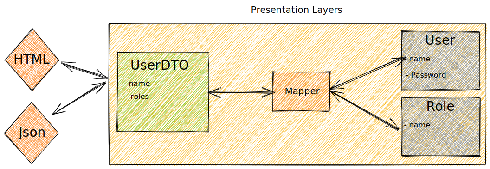

```java
public class RaquetaResponseDto {
    private final Long id;
    private final UUID uuid;
    private final String marca;
    private final String modelo;
    private final Double precio;
    private final String imagen;
}
```

## 5.4. Mapeadores

Los mapeadores son clases que se encargan de convertir de un tipo de objeto a otro. En este caso, de un dto a un modelo de nuestra aplicación y viceversa. Podemos usar librerías para mapear como [ModelMapper](https://modelmapper.org/), o hacerlo nosotros mismos.

```mermaid
graph LR
    subgraph "Mapeo"
        Request["RequestDTO<br/>📥"] -->|toModel| Entidad["Entidad<br/>💾"]
        Entidad -->|toResponse| Response["ResponseDTO<br/>📤"]
    end
    
    style Request fill:#e3f2fd
    style Entidad fill:#e8f5e9
    style Response fill:#c8e6c9
```

📝 **Nota del Profesor**
> Puedes usar ModelMapper o MapStruct para evitar código repetitivo. Pero entender el mapeo manual es fundamental.

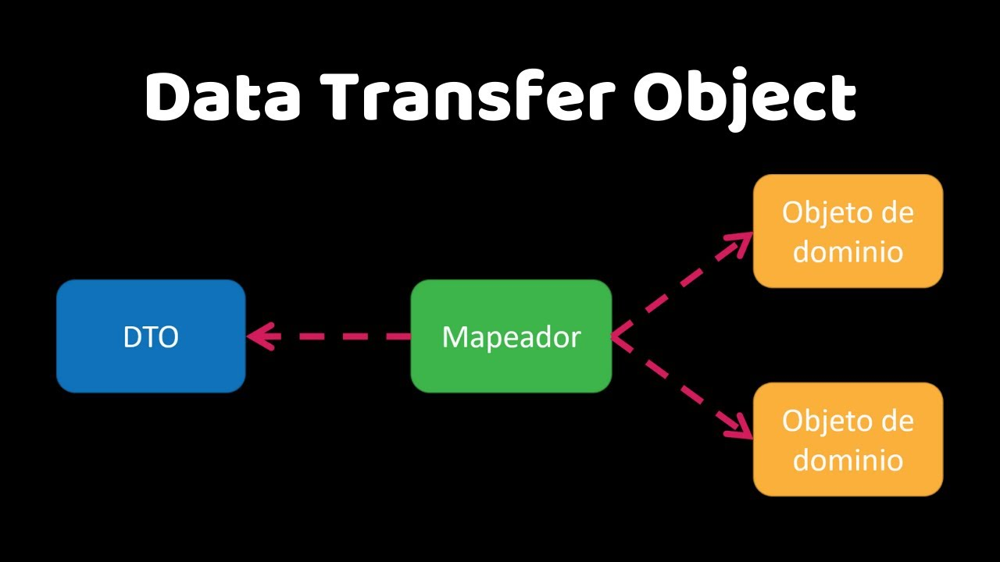

```java
public class RaquetaMapper {
    // Aquí iran los metodos para mapear los DTOs a los modelos y viceversa
    // Mapeamos de modelo a DTO
    public RaquetaResponseDto toResponse(Raqueta raqueta) {
        return new RaquetaResponseDto(
                raqueta.getId(),
                raqueta.getUuid(),
                raqueta.getMarca(),
                raqueta.getModelo(),
                raqueta.getPrecio(),
                raqueta.getImagen()

        );
    }

    // Mapeamos de DTO a modelo
    public List<RaquetaResponseDto> toResponse(List<Raqueta> raquetas) {
        return raquetas.stream()
                .map(this::toResponse)
                .toList();
    }
```

## 5.5. Validadores

Los [validadores](https://www.baeldung.com/spring-boot-bean-validation) son clases que se encargan de validar los datos que nos llegan y lanzar excepciones en caso de que no sean correctos. 

```mermaid
graph TB
    subgraph "Validación"
        Entrada["Datos Entrada<br/>📥"]
        Validador["Validador<br/>✅/❌"]
        Excepcion["Excepción o OK<br/>🚨/👍"]
    end
    
    Entrada --> Validador --> Excepcion
    
    style Entrada fill:#e3f2fd
    style Validador fill:#fff9c4
    style Excepcion fill:#c8e6c9
```

Podemos crear una clase que se encargue de validar los datos de una raqueta:

```java
public class RaquetaValidator {

    public void validate(Raqueta raqueta) {
        if (raqueta.getMarca() == null || raqueta.getMarca().isBlank()) {
            throw new InvalidRaquetaException("La marca no puede ser nula o estar en blanco");
        }
        if (raqueta.getModelo() == null || raqueta.getModelo().isBlank()) {
            throw new InvalidRaquetaException("El modelo no puede ser nulo o estar en blanco");
        }
        if (raqueta.getPrecio() == null || raqueta.getPrecio() < 0) {
            throw new InvalidRaquetaException("El precio no puede ser nulo o negativo");
        }
    }
}
```

O podemos usar el sistema de validación de Spring, que nos permite validar los datos de una forma más sencilla. Para ello, debemos añadir la dependencia de Spring Validation:

```kotlin
// Validación
implementation("org.springframework.boot:spring-boot-starter-validation")
```

⚠️ **Advertencia**
> Sin @Valid, Spring IGNORA las anotaciones de validación. ¡No lo olvides!

De esta manera podemos usar las anotaciones de validación de Spring:

```java
public class TenistaRequestDto {
    @NotBlank(message = "El nombre no puede estar vacío")
    private String nombre;
    @Min(value = 0, message = "El ranking no puede ser negativo")
    private Integer ranking;
    @NotBlank(message = "El país no puede estar vacío")
    private String pais;
    private String imagen;
    @Min(value = 0, message = "El id de la raqueta no puede ser negativo")
    private Long raquetaId; // Id de la raqueta, puede ser null
}
```

Ahora si queremos validar los datos de un dto, podemos usar `@Valid` en el parámetro del método:

```java
@PostMapping("")
public ResponseEntity<TenistaResponseDto> postTenista(
        @Valid @RequestBody TenistaRequestDto tenista
) {
    log.info("addTenista");
    return ResponseEntity.created(null).body(
            tenistaMapper.toResponse(
                    tenistasService.save(tenistaMapper.toModel(tenista)))
    );
}
```

💡 **Tip del Examinador**
> @Valid va SIEMPRE junto a @RequestBody. Es un error común olvidar @Valid.

No debes olvidar añadir un [handler](https://www.baeldung.com/spring-boot-bean-validation#the-exceptionhandler-annotation) anotado como @ExceptionHandler y el código de error para el error @ResponseStatus(HttpStatus.BAD_REQUEST) para capturar estas excepciones en tu controlador:

```java
 // Para capturar los errores de validación
@ResponseStatus(HttpStatus.BAD_REQUEST)
@ExceptionHandler(MethodArgumentNotValidException.class)
public Map<String, String> handleValidationExceptions(
        MethodArgumentNotValidException ex) {
    Map<String, String> errors = new HashMap<>();
    ex.getBindingResult().getAllErrors().forEach((error) -> {
        String fieldName = ((FieldError) error).getField();
        String errorMessage = error.getDefaultMessage();
        errors.put(fieldName, errorMessage);
    });
    return errors;
}
```

### 5.5.1. Jakarta Bean Validation

Son los [validadores](https://docs.jboss.org/hibernate/stable/validator/reference/en-US/html_single/#validator-defineconstraints-spec) que podemos usar en Spring. Aquí tienes los más importantes.

| Restricción | Descripción |
| --- | --- |
| @Null | El elemento debe ser nulo. |
| @NotNull | El elemento no debe ser nulo. |
| @AssertTrue | El elemento debe ser verdadero. |
| @AssertFalse | El elemento debe ser falso. |
| @Min | El elemento debe ser un número cuyo valor sea mayor o igual al mínimo especificado. |
| @Max | El elemento debe ser un número cuyo valor sea menor o igual al máximo especificado. |
| @DecimalMin | El elemento debe ser un número cuyo valor sea mayor o igual al mínimo especificado. |
| @DecimalMax | El elemento debe ser un número cuyo valor sea menor o igual al máximo especificado. |
| @Negative | El elemento debe ser un número estrictamente negativo (es decir, se considera que 0 es un valor inválido). |
| @NegativeOrZero | El elemento debe ser un número negativo o cero. |
| @Positive | El elemento debe ser un número estrictamente positivo (es decir, se considera que 0 es un valor inválido). |
| @PositiveOrZero | El elemento debe ser un número positivo o cero. |
| @Size | El tamaño del elemento debe estar entre los límites especificados (incluidos). |
| @Digits | El elemento debe ser un número dentro del rango aceptado. |
| @Past | El elemento debe ser una fecha, hora o instante en el pasado. |
| @PastOrPresent | El elemento debe ser una fecha, hora o instante en el pasado o en el presente. |
| @Future | El elemento debe ser una fecha, hora o instante en el futuro. |
| @FutureOrPresent | El elemento debe ser una fecha, hora o instante en el presente o en el futuro. |
| @Pattern | El elemento anotado debe coincidir con la expresión regular especificada. |
| @NotEmpty | El elemento anotado no debe ser nulo ni vacío. |
| @NotBlank | El elemento anotado no debe ser nulo y debe contener al menos un carácter que no sea un espacio en blanco. |
| @Email | La cadena debe ser una dirección de correo electrónico bien formada. |

📝 **Nota del Profesor**
> @NotBlank = @NotNull + no solo espacios. Úsalo para Strings.
> @NotEmpty = @NotNull + no vacío (length > 0). Úsalo para colecciones.

## 5.6. Práctica de clase, Servicio

1. Crea un servicio con cache para manejar tu repositorio de Funkos
2. Crea un sistema de excepciones para las operaciones más comunes para el manejo de Funkos
3. Usa DTOs para crear y actualizar Funkos u obtener las respuestas.
4. Crea un mapeador para convertir de DTO a modelo y viceversa
5. Crea un validador para validar los datos de los DTOs
6. Prueba las rutas con Postman

```mermaid
graph TB
    subgraph "Práctica de Servicios"
        Cache["Cache<br/>💾"]
        Excepciones["Excepciones<br/>🚨"]
        DTOs["DTOs<br/>📦"]
        Mapper["Mapper<br/>🔄"]
        Validacion["Validación<br/>✅"]
    end
    
    FunkoService["Funko Service"] --> Cache
    FunkoService --> Excepciones
    FunkoService --> DTOs
    FunkoService --> Mapper
    FunkoService --> Validacion
    
    style FunkoService fill:#e3f2fd
    style Cache fill:#c8e6c9
    style Excepciones fill:#ffcdd2
    style DTOs fill:#c8e6c9
    style Mapper fill:#fff9c4
    style Validacion fill:#c8e6c9
```
