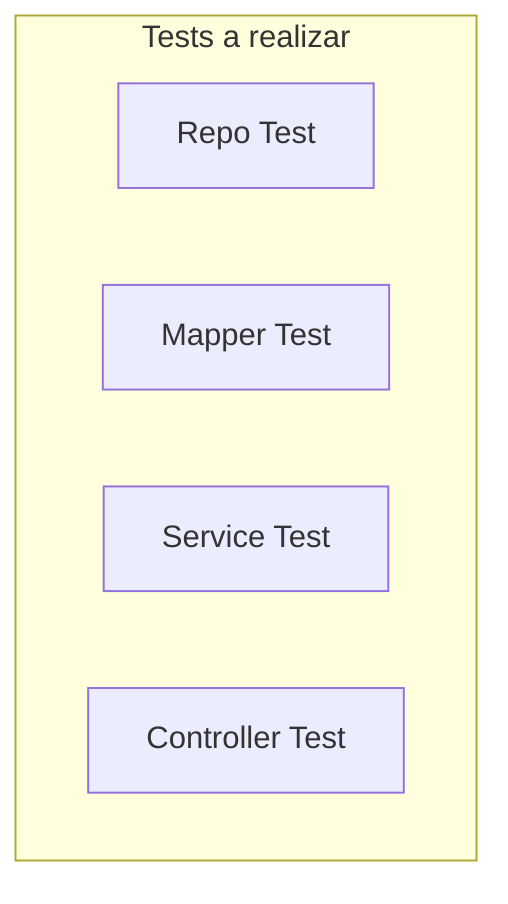

- [6. Iniciación al testing en Spring Boot](#6-iniciación-al-testing-en-spring-boot)
  - [6.1. Testing](#61-testing)
  - [6.2. Test unitarios](#62-test-unitarios)
  - [6.3. Test de integración](#63-test-de-integración)
  - [6.4. Testeando los controladores](#64-testeando-los-controladores)
  - [6.5. Práctica de clase, Testing](#65-práctica-de-clase-testing)
  - [6.6. Proyecto del curso](#66-proyecto-del-curso)

📝 **Nota del Profesor**
> Testing es fundamental para el desarrollo profesional. Spring Boot facilita enormemente el testing con sus herramientas integradas.

💡 **Tip del Examinador**
> En el examen práctico se valora tener tests. ¡No los descuides! También preguntan teoría sobre tipos de test.

---


# 6. Iniciación al testing en Spring Boot

## 6.1. Testing

El testing es una parte fundamental en el desarrollo de software. Nos permite asegurar que nuestro código funciona correctamente y que no se rompe cuando hacemos cambios en él. Para ello debe es importante que diseñemos nuestros test de forma que sean fáciles de mantener y que nos permitan detectar errores de forma rápida y cubran todos los aspectos de nuestro código.

```mermaid
graph TB
    subgraph "Pirámide de Tests"
        E2E["E2E<br/>End-to-End<br/>🔝 Pocos"]
        Integracion["Integración<br/>🟡 Algunos"]
        Unitarios["Unitarios<br/>🔴 Muchos"]
    end
    
    E2E --> Integracion --> Unitarios
```



Tenemos varios niveles de tests:
- Test unitarios: estos tests se encargan de probar una unidad de código (una clase, un método, etc.) de forma aislada. Para ello se suelen utilizar mocks para aislar la unidad de código que estamos probando de las dependencias que tiene.
- Test de integración: estos tests se encargan de probar que las distintas unidades de código funcionan correctamente cuando se integran entre ellas. Para ello se suelen utilizar bases de datos en memoria para simular el acceso a datos.
- Test End-to-End: estos tests se encargan de probar que todo el sistema funciona correctamente. Para ello se suelen utilizar herramientas que simulan un navegador web y que permiten simular las acciones que haría un usuario en la aplicación. Por ejemplo cuando usamos Postman.

📝 **Nota del Profesor**
> La pirámide de tests dice: muchos unitarios, algunos de integración, pocos E2E. Es más rápido y barato testear unidades pequeñas.

## 6.2. Test unitarios

Para realizar los test unitarios con Spring Boot podemos utilizar [JUnit 5](https://www.baeldung.com/junit-5) y [Mockito](https://www.baeldung.com/mockito-series). Para ello debemos añadir la dependencia de Starter de Test en nuestro proyecto:

```kotlin
dependencies {
    // ...
    testImplementation("org.springframework.boot:spring-boot-starter-test")
}
```

💡 **Tip del Examinador**
> spring-boot-starter-test incluye JUnit 5, Mockito, AssertJ y más. Es todo lo que necesitas para empezar.

Recuerda tener la tarea de test en el fichero `build.gradle.kts`:

```kotlin
tasks.test {
    useJUnitPlatform()
}
```

Para realizar los test unitarios en clases que no dependan de otras, no necesitamos realizar mocks. Podremos usar JUnit 5 para realizar los test. Por ejemplo de un repositorio o mapeador o servicio sin dependencias.

Es importante que los test sean independientes, es decir, que no dependan unos de otros. Para ello debemos asegurarnos que cada test se encarga de inicializar los datos que necesita para funcionar. Para ello podemos utilizar los métodos `@BeforeEach` y `@AfterEach` que se ejecutan antes y después de cada test. También podemos utilizar los métodos `@BeforeAll` y `@AfterAll` que se ejecutan antes y después de todos los test de la clase.

```mermaid
graph LR
    subgraph "Ciclo de Test"
        BeforeAll["@BeforeAll<br/>⚙️ Una vez"]
        BeforeEach["@BeforeEach<br/>⚙️ Cada test"]
        Test["@Test<br/>🧪 Test"]
        AfterEach["@AfterEach<br/>🧹 Cada test"]
        AfterAll["@AfterAll<br/>🧹 Una vez"]
    end
    
    BeforeAll --> BeforeEach --> Test --> AfterEach
    AfterEach -->|"Repetir"| BeforeEach
    AfterEach --> AfterAll
```



Además, usaremos las aserciones de JUnit 5 para comprobar que el resultado de la ejecución de nuestro código es el esperado. Por ejemplo:

```java
class RaquetasRepositoryImplTest {
    RaquetasRepository repository = new RaquetasRepositoryImpl();

    @BeforeEach
    void setUp() {
        // Inicializamos las el repositorio
        repository = new RaquetasRepositoryImpl();

    }


    @Test
    void findAll() {
        var raquetas = repository.findAll();

        assertAll(
                () -> assertNotNull(raquetas),
                () -> assertEquals(3, raquetas.size())
        );
    }

    @Test
    void findById() {
        var raqueta = repository.findById(1L);

        assertAll(
                () -> assertNotNull(raqueta),
                () -> assertEquals("Babolat", raqueta.get().getMarca()),
                () -> assertEquals("Pure Aero", raqueta.get().getModelo()),
                () -> assertEquals(199.95, raqueta.get().getPrecio())
        );
    }

    @Test
    void findByIdNotFound() {
        var raqueta = repository.findById(100L);

        assertAll(
                () -> assertNotNull(raqueta),
                () -> assertFalse(raqueta.isPresent())
        );
    }
}
```

Si estamos testeando controladores o servicios, es posible que necesitemos realizar mocks de las dependencias que tienen. Para ello podemos utilizar Mockito.

Es por ello que debemos extender nuestra clase de test con `@ExtendWith(MockitoExtension.class)` y utilizar la anotación `@Mock` para indicar que queremos que se cree un mock de la dependencia. Además, debemos indicarle a Mockito que inyecte los mocks en la clase que estamos testeando con la anotación `@InjectMocks`.

```mermaid
graph TB
    subgraph "Mockito"
        Mock["@Mock<br/>📦 Mock"]
        InjectMocks["@InjectMocks<br/>🔧 Inyección"]
        When["when()<br/>📝 Simular"]
        Verify["verify()<br/>✅ Verificar"]
    end
    
    Test["Test"] --> Mock
    Test --> InjectMocks
    InjectMocks --> When
    InjectMocks --> Verify
```



De esta manera cada vez que se use un método de la clase mockeada, se ejecutará el código que hemos definido en el mock. Des esta manera nos concentraremos en probar el código de la clase que estamos testeando y no el de las dependencias.

Para simular el comportamiento de los mocks, podemos utilizar el método `when` de Mockito. Para verificar que se ha llamado a un método de un mock, podemos utilizar el método `verify` de Mockito.

```java
@ExtendWith(MockitoExtension.class) // Extensión de Mockito para usarlo
class RaquetasServiceImplTest {
    // Datos de demo
    Map<Long, Raqueta> raquetas = RaquetasFactory.getRaquetasDemoData();
    // Creo los mocks
    @Mock
    private RaquetaValidator raquetaValidator;
    @Mock
    private RaquetasRepositoryImpl raquetasRepository;
    // Inyecto los mocks en la clase que voy a testear
    @InjectMocks 
    private RaquetasServiceImpl raquetasService;

    @BeforeEach
    void setUp() {
        raquetas = RaquetasFactory.getRaquetasDemoData();
    }


    @Test
    void findAll() {
        // Lo que vamos a simular
        when(raquetasRepository.findAll())
                .thenReturn(List.copyOf(raquetas.values()));

        //test
        var list = raquetasService.findAll();

        // comprobaciones
        assertAll(
                () -> assertNotNull(list),
                () -> assertEquals(3, list.size())
        );

        // verificamos que se ha llamado al método
        verify(raquetasRepository, times(1))
                .findAll();
    }

    @Test
    void findById() {
        // Lo que vamos a simular
        when(raquetasRepository.findById(1L))
                .thenReturn(Optional.of(raquetas.get(1L)));

        // Test
        var raqueta = raquetasService.findById(1L);

        // Comprobaciones
        assertAll(
                () -> assertNotNull(raqueta),
                () -> assertEquals("Babolat", raqueta.getMarca()),
                () -> assertEquals("Pure Aero", raqueta.getModelo()),
                () -> assertEquals(199.95, raqueta.getPrecio())
        );

        // Verificamos que se ha llamado al método
        verify(raquetasRepository, times(1))
                .findById(1L);
    }

    @Test
    void findByIdNotFound() {
        when(raquetasRepository.findById(-100L))
                .thenReturn(Optional.empty());

        // Salta la excepcion
        var res = assertThrows(ResponseStatusException.class, () -> {
            raquetasService.findById(-100L);
        });
        // Comprobamos que la excepción es la esperada
        assert (res.getMessage().contains("No se ha encontrado la raqueta con id: -100"));

        // Verificamos que se ha llamado al método
        verify(raquetasRepository, times(1))
                .findById(-100L);
    }
}
```

💡 **Tip del Examinador**
> Usa assertAll() para agrupar múltiples aserciones. Si una falla, se ejecutan todas y ves todos los errores.

## 6.3. Test de integración

Para hacer los test de integration podemos usar solo JUnit con las clases con sus respectivas dependencias reales. Sin embargo, si queremos hacer los test de integración usando el contexto Spring Boot, debemos usar la anotación `@SpringBootTest` en la clase de test. De esta manera Spring Boot se encargará de inicializar el contexto de la aplicación y de inyectar las dependencias que necesitemos con `@Autowired`.

```mermaid
graph TB
    subgraph "Test de Integración"
        SpringBootTest["@SpringBootTest"]
        Autowired["@Autowired"]
    end
```



```java
@SpringBootTest
class RaquetasControllerTest {
    @Autowired
    private RaquetasController controller;

    @Test
    void findAll() {
        var list = controller.findAll();

        assertAll(
                () -> assertNotNull(list),
                () -> assertEquals(3, list.size())
        );
    }

    @Test
    void findById() {
        var raqueta = controller.findById(1L);

        assertAll(
                () -> assertNotNull(raqueta),
                () -> assertEquals("Babolat", raqueta.getMarca()),
                () -> assertEquals("Pure Aero", raqueta.getModelo()),
                () -> assertEquals(199.95, raqueta.getPrecio())
        );
    }

    @Test
    void findByIdNotFound() {
        var res = assertThrows(ResponseStatusException.class, () -> {
            controller.findById(-100L);
        });
        assert (res.getMessage().contains("No se ha encontrado la raqueta con id: -100"));
    }
}
```

📝 **Nota del Profesor**
> Los tests de integración son más lentos porque levantan el contexto de Spring. Úsalos para probar la integración real.

## 6.4. Testeando los controladores

Aunque podemos testear los controladores como una clase más, mockeando o integrando, tal y como hemos visto en los apartados anteriores, Spring Boot nos proporciona una serie de herramientas para testear los controladores de una manera más sencilla y se simula a lo que hemos hecho con Postman.

Para ello debemos usar la anotación `@AutoConfigureMockMvc` en la clase de test. De esta manera Spring Boot se encargará de inicializar el contexto de la aplicación y de inyectar las dependencias que necesitemos. Además, nos proporciona un objeto `MockMvc` que nos permite [simular las peticiones HTTP](https://docs.spring.io/spring-framework/reference/testing/spring-mvc-test-framework.html) y con ello testear la [capa HTTP](https://spring.io/guides/gs/testing-web/) o realizar un test de [integración completo ](https://www.baeldung.com/integration-testing-in-spring)si no usamos los mocks . Usaremos ObjectMapper para mapear los objetos a JSON y poder testear los controladores.

```mermaid
graph LR
    subgraph "MockMvc"
        MockMvc["MockMvc"]
        Perform["perform()"]
        Result["ResultHandler"]
    end
```

```java
// Indicamos que es un test de Spring
@SpringBootTest
// Configuramos el cliente MVC
@AutoConfigureMockMvc
public class RaquetasControllerMvcIntegrationTest {
    // Para mapear a JSON
    private final ObjectMapper mapper = new ObjectMapper();
    @Autowired
    MockMvc mockMvc; // Cliente MVC

    Raqueta raqueta = RaquetasFactory.getRaquetasDemoData().get(1L);
    String myEndpoint = "/api/raquetas";

    @Test
    @Order(1)
    void findAllTest() throws Exception {

        // Consulto el endpoint
        MockHttpServletResponse response = mockMvc.perform(
                        get(myEndpoint)
                                .accept(MediaType.APPLICATION_JSON))
                .andReturn().getResponse();

        // Proceso la respuesta
        ObjectMapper mapper = new ObjectMapper();
        List<RaquetaResponseDto> res = mapper.readValue(response.getContentAsString(),
                mapper.getTypeFactory().constructCollectionType(List.class, RaquetaResponseDto.class));

        assertAll(
                () -> assertEquals(response.getStatus(), HttpStatus.OK.value()),
                () -> assertTrue(response.getContentAsString().contains("\"id\":" + raqueta.getId())),
                () -> assertTrue(res.size() > 0),
                () -> assertTrue(res.stream().anyMatch(r -> r.getId().equals(raqueta.getId())))
        );
    }

    @Test
    @Order(2)
    void findByIdTest() throws Exception {
        // Consulto el endpoint
        MockHttpServletResponse response = mockMvc.perform(
                        get(myEndpoint + "/" + raqueta.getId())
                                .accept(MediaType.APPLICATION_JSON))
                .andReturn().getResponse();

        // Proceso la respuesta
        RaquetaResponseDto res = mapper.readValue(response.getContentAsString(), RaquetaResponseDto.class);

        assertAll(
                () -> assertEquals(response.getStatus(), HttpStatus.OK.value()),
                () -> assertEquals(res.getId(), raqueta.getId())
        );
    }

    @Test
    @Order(3)
    void findByIdNotFound() throws Exception {
        // Consulto el endpoint
        MockHttpServletResponse response = mockMvc.perform(
                        get(myEndpoint + "/" + -1000L)
                                .accept(MediaType.APPLICATION_JSON))
                .andReturn().getResponse();

        // Proceso la respuesta
        try {
            RaquetaResponseDto res = mapper.readValue(response.getContentAsString(), RaquetaResponseDto.class);
        } catch (Exception ignored) {
        }

        assertAll(
                () -> assertEquals(response.getStatus(), HttpStatus.NOT_FOUND.value())
        );
    }
}
```

De la misma manera que en apartado anterior, podemos mockear las dependencias de los controladores para que no se conecten a la base de datos o servicios y ser solo unitario. Para ello debemos usar la anotación `@MockBean` en la clase de test. De esta manera Spring Boot se encargará de inicializar el contexto de la aplicación y de inyectar las dependencias que necesitemos. 

💡 **Tip del Examinador**
> @MockBean vs @Mock:
> - @Mock: Solo Mockito, sin Spring
> - @MockBean: Mockito dentro del contexto de Spring

```java
/ Indicamos que es un test de Spring
@SpringBootTest
@AutoConfigureMockMvc
@ExtendWith(MockitoExtension.class) // Extensión de Mockito para usarlo
public class RaquetasControllerMvcMockTest {
    // Para mapear a JSON
    private final ObjectMapper mapper = new ObjectMapper();
    @MockBean
    RaquetasServiceImpl raquetasService;
    @MockBean
    RaquetaMapper raquetaMapper;
    @Autowired
    MockMvc mockMvc; // Cliente MVC
    Raqueta raqueta = RaquetasFactory.getRaquetasDemoData().get(1L);
    RaquetaResponseDto raquetaResponseDto = new RaquetaResponseDto(
            raqueta.getId(),
            raqueta.getUuid(),
            raqueta.getMarca(),
            raqueta.getModelo(),
            raqueta.getPrecio(),
            raqueta.getImagen()
    );
    RaquetaRequestDto raquetaRequestDto = new RaquetaRequestDto(
            raqueta.getMarca(),
            raqueta.getModelo(),
            raqueta.getPrecio(),
            raqueta.getImagen()
    );
    String myEndpoint = "/api/raquetas";

    @Autowired
    public RaquetasControllerMvcMockTest(RaquetasServiceImpl raquetasService, RaquetaMapper raquetaMapper) {
        this.raquetasService = raquetasService;
        this.raquetaMapper = raquetaMapper;
    }

    @Test
    void findAllTest() throws Exception {
        // Lo que voy a simular
        // Lo que vamos a simular
        when(raquetasService.findAll())
                .thenReturn(List.of(raqueta));
        when(raquetaMapper.toResponse(List.of(raqueta)))
                .thenReturn(List.of(raquetaResponseDto));

        // Consulto el endpoint
        MockHttpServletResponse response = mockMvc.perform(
                        get(myEndpoint)
                                .accept(MediaType.APPLICATION_JSON))
                .andReturn().getResponse();

        // Proceso la respuesta
        ObjectMapper mapper = new ObjectMapper();
        List<RaquetaResponseDto> res = mapper.readValue(response.getContentAsString(),
                mapper.getTypeFactory().constructCollectionType(List.class, RaquetaResponseDto.class));

        assertAll(
                () -> assertEquals(response.getStatus(), HttpStatus.OK.value()),
                () -> assertTrue(response.getContentAsString().contains("\"id\":" + raqueta.getId())),
                () -> assertTrue(res.size() > 0),
                () -> assertTrue(res.stream().anyMatch(r -> r.getId().equals(raqueta.getId())))
        );

        // Verifico que se ha llamado al servicio
        // Verificamos que se ha llamado al método
        Mockito.verify(raquetasService, times(1))
                .findAll();
        Mockito.verify(raquetaMapper, times(1))
                .toResponse(List.of(raqueta));
    }

    @Test
    void findByIdTest() throws Exception {
        // Lo que vamos a simular
        when(raquetasService.findById(raqueta.getId()))
                .thenReturn(raqueta);
        when(raquetaMapper.toResponse(raqueta))
                .thenReturn(raquetaResponseDto);

        // Consulto el endpoint
        MockHttpServletResponse response = mockMvc.perform(
                        get(myEndpoint + "/" + raqueta.getId())
                                .accept(MediaType.APPLICATION_JSON))
                .andReturn().getResponse();

        // Proceso la respuesta
        RaquetaResponseDto res = mapper.readValue(response.getContentAsString(), RaquetaResponseDto.class);

        assertAll(
                () -> assertEquals(response.getStatus(), HttpStatus.OK.value()),
                () -> assertEquals(res.getId(), raqueta.getId())
        );

        // Verificamos que se ha llamado al método
        verify(raquetasService, times(1))
                .findById(raqueta.getId());
        verify(raquetaMapper, times(1))
                .toResponse(raqueta);
    }

    @Test
    void findByIdNotFound() throws Exception {
        // Lo que vamos a simular
        when(raquetasService.findById(-1000L))
                .thenThrow(new ResponseStatusException(HttpStatus.NOT_FOUND, "No se ha encontrado la raqueta con id: -1000"));

        // Consulto el endpoint
        MockHttpServletResponse response = mockMvc.perform(
                        get(myEndpoint + "/" + -1000L)
                                .accept(MediaType.APPLICATION_JSON))
                .andReturn().getResponse();

        // Proceso la respuesta
        try {
            RaquetaResponseDto res = mapper.readValue(response.getContentAsString(), RaquetaResponseDto.class);
        } catch (Exception ignored) {
        }

        assertAll(
                () -> assertEquals(response.getStatus(), HttpStatus.NOT_FOUND.value())
        );

        // Verificamos que se ha llamado al método
        verify(raquetasService, times(1))
                .findById(-1000L);
    }

    @Test
    void createTest() throws Exception {
        // Lo que vamos a simular
        when(raquetasService.create(raquetaRequestDto))
                .thenReturn(raqueta);
        when(raquetaMapper.toResponse(raqueta))
                .thenReturn(raquetaResponseDto);

        // Consulto el endpoint
        MockHttpServletResponse response = mockMvc.perform(
                        post(myEndpoint) 
                                .contentType(MediaType.APPLICATION_JSON) // Indicamos el tipo de contenido
                                .content(mapper.writeValueAsString(raquetaRequestDto)) // Indicamos el contenido como JSON
                .andReturn().getResponse();

        // Proceso la respuesta
        RaquetaResponseDto res = mapper.readValue(response.getContentAsString(), RaquetaResponseDto.class);

        assertAll(
                () -> assertEquals(response.getStatus(), HttpStatus.CREATED.value()),
                () -> assertEquals(res.getId(), raqueta.getId())
        );

        // Verificamos que se ha llamado al método
        verify(raquetasService, times(1))
                .create(raquetaRequestDto);
        verify(raquetaMapper, times(1))
                .toResponse(raqueta);
    }
}
```

## 6.5. Práctica de clase, Testing

1. Testea el repositorio de Funkos
2. Testea el mapeador de Funkos
3. Testea el servicio de Funkos, usando mocks, teniendo en cuenta las excepciones
4. Testea el controlador de Funkos, usando mocks, teniendo en cuenta las respuestas correctas, las excepciones y los códigos de respuesta HTTP. No olvides de testear las restricciones de los DTOs.



## 6.6. Proyecto del curso

Puedes encontrar el proyecto con lo visto hasta este punto en la etiqueta: [v.0.0.1 del repositorio del curso: productos_ini](https://github.com/joseluisgs/DesarrolloWebEntornosServidor-02-Proyecto-SpringBoot/releases/tag/productos_ini).
