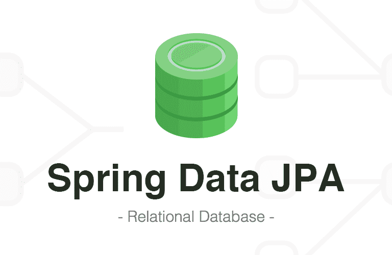

- [7. Spring Data y Spring Data JPA](#7-spring-data-y-spring-data-jpa)
  - [7.1. Definiendo la conexión a la base de datos](#71-definiendo-la-conexión-a-la-base-de-datos)
  - [7.2. Definiendo tablas personalizadas o insertando datos](#72-definiendo-tablas-personalizadas-o-insertando-datos)
  - [7.3. Entidades, Modelos y Esquemas](#73-entidades-modelos-y-esquemas)
    - [7.3.1. Identificadores](#731-identificadores)
      - [7.3.1.1. Autoincremental vs UUID](#7311-autoincremental-vs-uuid)
    - [7.3.2. Marcas temporales](#732-marcas-temporales)
  - [7.4. Relaciones entre entidades](#74-relaciones-entre-entidades)
    - [7.4.1. Relación Uno a Uno (OneToOne)](#741-relación-uno-a-uno-onetoone)
    - [7.4.2. Relación Uno a Muchos (OneToMany/ManyToOne).](#742-relación-uno-a-muchos-onetomanymanytoone)
    - [7.4.3. Relación Muchos a Muchos (ManyToMany)](#743-relación-muchos-a-muchos-manytomany)
    - [7.4.4. Relaciones Embebidas (Embedded)](#744-relaciones-embebidas-embedded)
    - [7.4.5. Relaciones jerárquicas](#745-relaciones-jerárquicas)
    - [7.4.6. Opciones de cascada](#746-opciones-de-cascada)
    - [7.4.7. La opción OrphanRemoval](#747-la-opción-orphanremoval)
    - [7.4.8. Eager vs Lazy Loading](#748-eager-vs-lazy-loading)
    - [7.4.9. Borrado Físico vs Borrado Lógico](#749-borrado-físico-vs-borrado-lógico)
    - [7.4.10. El problema de la recursión infinita y la bidireccional](#7410-el-problema-de-la-recursión-infinita-y-la-bidireccional)
  - [7.5. Repositorios en Spring Data JPA](#75-repositorios-en-spring-data-jpa)
    - [7.5.1. Creando consultas para nuestros repositorios](#751-creando-consultas-para-nuestros-repositorios)
    - [7.5.2. Consultas generadas automáticamente](#752-consultas-generadas-automáticamente)
    - [7.5.3. Consultas con Query y JPQL y SQL](#753-consultas-con-query-y-jpql-y-sql)
  - [7.6. Testeando el Repositorio JPA](#76-testeando-el-repositorio-jpa)
    - [7.6.1. TestEntityManager](#761-testentitymanager)
    - [7.6.2. TestContainer](#762-testcontainer)
      - [7.6.2.1. Dependencias (build.gradle.kts)](#7621-dependencias-buildgradlekts)
      - [7.6.2.2. Configuración Principal (application.properties)](#7622-configuración-principal-applicationproperties)
      - [7.6.2.3. Configuración de Test (application-test.properties)](#7623-configuración-de-test-application-testproperties)
      - [7.6.2.4. Entidad Usuario](#7624-entidad-usuario)
      - [7.6.2.5. Repositorio de Usuario](#7625-repositorio-de-usuario)
      - [7.6.2.6. Clase Base para Tests de Repositorio](#7626-clase-base-para-tests-de-repositorio)
      - [7.6.2.7. Tests Completos del Repositorio](#7627-tests-completos-del-repositorio)
      - [7.6.2.8. Datos de Prueba SQL (/src/test/resources/data-test.sql)](#7628-datos-de-prueba-sql-srctestresourcesdata-testsql)
      - [7.6.2.9. Archivo de Configuración Docker Compose (Opcional)](#7629-archivo-de-configuración-docker-compose-opcional)
      - [7.6.2.10. Ejecución de Tests](#76210-ejecución-de-tests)
  - [7.7. Proyecto del curso](#77-proyecto-del-curso)



📝 **Nota del Profesor**
> Spring Data JPA es fundamental para interactuar con bases de datos relacionales. Dominar entidades, repositorios y relaciones es clave para el examen.

💡 **Tip del Examinador**
> En el examen preguntan mucho sobre relaciones JPA (@OneToMany, @ManyToOne, FetchType, Cascade). ¡Practica estos conceptos!

---

# 7. Spring Data y Spring Data JPA


---

📝 **Nota del Profesor**
> Spring Data JPA es fundamental para interactuar con bases de datos relacionales. Dominar entidades, repositorios y relaciones es clave para el examen.

💡 **Tip del Examinador**
> En el examen preguntan mucho sobre relaciones JPA (@OneToMany, @ManyToOne, FetchType, Cascade). ¡Practica estos conceptos!

---


[Spring Data](https://spring.io/projects/spring-data-jpa) es un proyecto dentro del ecosistema de Spring Framework que tiene como objetivo proporcionar una forma más fácil y consistente de interactuar con diferentes tipos de bases de datos desde aplicaciones Java. 

Spring Data con JPA ofrece una abstracción de alto nivel sobre las tecnologías de acceso a datos, lo que permite a los desarrolladores centrarse en la lógica de negocio en lugar de preocuparse por los detalles técnicos de la integración con la base de datos. 

Spring Data proporciona soporte para una variedad de tecnologías de acceso a datos, incluyendo bases de datos relacionales, bases de datos NoSQL, bases de datos en memoria y sistemas de archivos. Además, Spring Data proporciona integración con otras tecnologías de Spring, como Spring MVC y Spring Boot, lo que permite a los desarrolladores construir aplicaciones web escalables y fáciles de mantener. 

En resumen, Spring Data es una capa de abstracción que permite a los desarrolladores interactuar con diferentes tipos de bases de datos de una manera coherente y sencilla, reduciendo la complejidad de la integración con la base de datos y acelerando el desarrollo de aplicaciones.

Spring Data [JPA](https://www.ibm.com/docs/es/was-liberty/nd?topic=overview-java-persistence-api-jpa) es un proyecto dentro del ecosistema de Spring que proporciona una implementación de la API JPA (Java Persistence API) estándar para la persistencia de datos en bases de datos relacionales y se superpone a Hibernate.

JPA es una especificación estándar de Java para el mapeo objeto-relacional (ORM) y proporciona una forma fácil y consistente de interactuar con una base de datos relacional utilizando objetos Java. Spring Data JPA proporciona una capa de abstracción adicional en la parte superior de la API JPA, lo que hace que sea aún más fácil trabajar con bases de datos relacionales que usando Hibernate solamente.

Entre las principales ventajas de Spring Data JPA se encuentran:

- Reduce el código boilerplate: Spring Data JPA elimina gran parte del código repetitivo que normalmente se necesita para interactuar con una base de datos relacional, lo que hace que el código sea más limpio y fácil de mantener.

- Abstracción de bases de datos: Spring Data JPA proporciona una capa de abstracción sobre la base de datos, lo que permite a los desarrolladores escribir código que sea independiente de la base de datos subyacente. Esto significa que puede cambiar fácilmente de una base de datos a otra sin tener que cambiar su código.

- Soporte para repositorios específicos, paginación y ordenamiento: Spring Data JPA proporciona soportes con repositorios específicos, soporte para paginación y ordenamiento de resultados de consultas de forma fácil y sencilla, lo que facilita la implementación de características avanzadas en una aplicación.

- Integración con otras tecnologías de Spring: Spring Data JPA se integra perfectamente con otras tecnologías de Spring, como Spring MVC y Spring Boot, lo que facilita la construcción de aplicaciones web completas.

Spring Data JPA proporciona una implementación de la API JPA estándar para la persistencia de datos en bases de datos relacionales y proporciona una capa de abstracción adicional que simplifica el trabajo con bases de datos relacionales en aplicaciones Java.

Para configurar Spring Data JPA en un proyecto, debemos agregar las siguientes dependencias en el archivo build.gradle.kts:

```kotlin
implementation("org.springframework.boot:spring-boot-starter-data-jpa")
implementation("com.h2database:h2") // base de datos a usar, puede ser otra
```

## 7.1. Definiendo la conexión a la base de datos
En Spring Boot, la conexión a la base de datos y otras configuraciones relacionadas con JPA se definen en el archivo `application.properties` o `application.yml` que se encuentra en el directorio `src/main/resources` o hacer lo mismo para test.

Aquí tienes un ejemplo de cómo podrías configurar una conexión a una base de datos MySQL en `application.properties`:

```properties
spring.datasource.url=jdbc:mysql://localhost:3306/mydb
spring.datasource.username=root
spring.datasource.password=root
spring.datasource.driver-class-name=com.mysql.cj.jdbc.Driver

spring.jpa.hibernate.ddl-auto=update
spring.jpa.show-sql=true
spring.jpa.properties.hibernate.dialect = org.hibernate.dialect.MySQL5InnoDBDialect
```

En este ejemplo, `spring.datasource.url` es la URL de la base de datos, `spring.datasource.username` y `spring.datasource.password` son el nombre de usuario y la contraseña para la base de datos, y `spring.datasource.driver-class-name` es el nombre de la clase del controlador JDBC.

La propiedad `spring.jpa.hibernate.ddl-auto` controla el comportamiento de generación automática de esquemas. Aquí están las opciones que puedes usar:

- `none`: No hace nada.
- `validate`: Verifica que las tablas correspondientes a las entidades existan, pero no las crea ni las modifica.
- `update`: Crea las tablas que no existen y actualiza las que necesitan ser actualizadas, pero no borra ninguna tabla existente.
- `create`: Crea las tablas al inicio de la aplicación, pero no las borra cuando se cierra la aplicación.
- `create-drop`: Crea las tablas al inicio de la aplicación y las borra cuando se cierra la aplicación.

La propiedad `spring.jpa.show-sql` controla si se deben mostrar las consultas SQL en la consola.

Por último, `spring.jpa.properties.hibernate.dialect` define el dialecto de Hibernate que se va a utilizar. Esto es necesario para que Hibernate pueda generar SQL que sea compatible con tu base de datos.

Es importante tener en cuenta que estas configuraciones pueden variar dependiendo de si estás en un entorno de **desarrollo** o **producción**. Por ejemplo, podrías querer usar `create-drop` en desarrollo para tener una base de datos limpia cada vez que inicies tu aplicación, pero en producción probablemente querrías usar `update` o `none` para no perder datos.

## 7.2. Definiendo tablas personalizadas o insertando datos
Aunque como veremos más tarde Spring Data puede crear los esquemas, tienes la posibilidad de crearlos tú o de insertar datos en los propios esquemas generados para usarlos tanto en producción, como en desarrollo o pruebas.

En Spring Boot puede cargar automáticamente los datos SQL contenidos en un archivo llamado `data.sql` en el directorio `src/main/resources` (o su equivalente en test) durante la inicialización de la aplicación. Esto puede ser extremadamente útil para tener ya datos disponibles en tu base de datos para pruebas de desarrollo o incluso para producción, dependiendo de tus necesidades.

Aquí tienes un ejemplo de cómo podrías usar `data.sql` para pre-poblar tu base de datos:

```sql
INSERT INTO usuarios (id, nombre, email) VALUES (1, 'Juan', 'juan@example.com');
INSERT INTO usuarios (id, nombre, email) VALUES (2, 'Maria', 'maria@example.com');
```

Cuando inicies tu aplicación Spring Boot, se ejecutarán automáticamente estos comandos SQL, y se insertarán los datos en tu base de datos de acuerdo al esquema que tú definas, por ejemplo con un 'create table' o basados en los esquemas definidos usando JPA como veremos más adelante.

Además, puedes usar un archivo `schema.sql` para definir la estructura de tu base de datos, sin datos de carga, y Spring Boot también lo ejecutará automáticamente durante la inicialización de la aplicación. Aquí tienes un ejemplo de cómo podrías usar `schema.sql`:

```sql
CREATE TABLE IF NOT EXISTS usuarios (
  id INT PRIMARY KEY,
  nombre VARCHAR(50),
  email VARCHAR(50)
);
```

Recuerda que estos archivos se ejecutarán cada vez que inicies tu aplicación, por lo que debes diseñar tus comandos SQL de manera que se adapten a este comportamiento. Por ejemplo, puedes usar el comando SQL `CREATE TABLE IF NOT EXISTS` para evitar errores si la tabla ya existe.

## 7.3. Entidades, Modelos y Esquemas
En Spring Data JPA, una entidad es una clase Java que se mapea a una tabla en una base de datos relacional De esta manera podemos definir nuestros esquemas de la bae de datos mediante código. Para definir una entidad en JPA, se deben seguir los siguientes pasos:

1. Anotar la clase Java con la anotación `@Entity`: Esto indica que la clase Java es una entidad que se debe mapear a una tabla en la base de datos.

2. Especificar el nombre de la tabla en la base de datos: Puedes especificar el nombre de la tabla usando la anotación `@Table`. Si la clase Java se llama "Person", por ejemplo, y quieres que se mapee a una tabla llamada "personas" en la base de datos, deberías usar la siguiente anotación:

```java
@Entity
@Table(name = "personas")
public class Person {
    //...
}
```

3. Especificar el identificador de la entidad: Cada entidad en JPA debe tener un identificador único que se utiliza para acceder y manipular la entidad. El identificador se puede especificar usando la anotación `@Id`. Además, es posible que necesites especificar el tipo de identificador usando otras anotaciones, como `@GeneratedValue` si quieres que el identificador se genere automáticamente.

```java
@Entity
@Table(name = "personas")
public class Person {
    
    @Id
    @GeneratedValue(strategy = GenerationType.IDENTITY)
    private Long id;

    //...
}
```

4. Definir los atributos de la entidad: Los atributos de la entidad corresponden a las columnas en la tabla de la base de datos. Puedes especificar el nombre de la columna utilizando la anotación `@Column`. 

```java
@Entity
@Table(name = "personas")
public class Person {
    
    @Id
    @GeneratedValue(strategy = GenerationType.IDENTITY)
    private Long id;
    
    @Column(name = "nombre")
    private String name;
    
    @Column(name = "edad")
    private int age;

    //...
}
```

Además podemos definir restricciones de integridad para columnas siguiendo los validadores existentes en JPA, tal y como vimos para los Request.

Aquí está la entidad "Person" ampliada con algunos campos adicionales y restricciones de integridad:

```java
import javax.persistence.*;
import javax.validation.constraints.*;

@Entity
@Table(name = "personas")
public class Person {
    
    @Id
    @GeneratedValue(strategy = GenerationType.IDENTITY)
    private Long id;
    
    @Column(name = "nombre", nullable = false, length = 50)
    @NotBlank(message = "El nombre no puede estar vacío")
    @Size(max = 50, message = "El nombre no puede tener más de 50 caracteres")
    private String name;
    
    @Column(name = "edad", nullable = false)
    @Min(value = 0, message = "La edad no puede ser menor a 0")
    @Max(value = 150, message = "La edad no puede ser mayor a 150")
    private int age;
    
    @Column(name = "email", nullable = false, unique = true)
    @NotBlank(message = "El email no puede estar vacío")
    @Email(message = "El email debe ser válido")
    private String email;

    @Column(name = "direccion", length = 255)
    @Size(max = 255, message = "La dirección no puede tener más de 255 caracteres")
    private String address;

    @Column(name = "telefono", length = 20)
    @Size(max = 20, message = "El número de teléfono no puede tener más de 20 dígitos")
    private String phoneNumber;
    
    //...
}
```

En este ejemplo, se ha añadido restricciones de integridad en los campos de la siguiente manera:

- `name`: Este campo no puede ser nulo y su longitud máxima es de 50 caracteres.
- `age`: Este campo no puede ser nulo y su valor debe estar entre 0 y 150.
- `email`: Este campo no puede ser nulo, debe ser único y debe ser un email válido.
- `address`: La longitud máxima de este campo es de 255 caracteres.
- `phoneNumber`: La longitud máxima de este campo es de 20 dígitos.

Estas restricciones se implementan utilizando anotaciones de JPA y de la especificación de Bean Validation (como `@NotBlank`, `@Email`, `@Size`, `@Min` y `@Max`).

### 7.3.1. Identificadores
A la hora de trabajar con Spring Data, debemos tener en cuenta que cada entidad debe tener un identificador único que se utiliza para acceder y manipular la entidad. El identificador se puede especificar usando la anotación `@Id`. Además, es posible que necesites especificar el tipo de identificador usando otras anotaciones, como `@GeneratedValue` si quieres que el identificador se genere automáticamente.
Entre los diferentes tipos de identificadores que podemos usar en Spring Data JPA se encuentran:
- `@Id`: Se utiliza para especificar el identificador de una entidad. El identificador puede ser de cualquier tipo, pero debe ser único para cada entidad.
- `@GeneratedValue`: Se utiliza para especificar cómo se debe generar el identificador de una entidad. Puede ser de tipo `AUTO`, `IDENTITY`, `SEQUENCE` o `TABLE`.
  - `AUTO`: El identificador se genera automáticamente utilizando una estrategia predeterminada. Esta es la estrategia predeterminada si no se especifica ninguna otra.
  - `IDENTITY`: El identificador se genera automáticamente utilizando una columna de identidad en la base de datos.
  - `SEQUENCE`: El identificador se genera automáticamente utilizando una secuencia de base de datos.
  - `TABLE`: El identificador se genera automáticamente utilizando una tabla de base de datos.
  - `NONE`: No se genera ningún identificador automáticamente. Esto significa que el identificador debe ser especificado manualmente.
  - `UUID`: El identificador se genera automáticamente utilizando un UUID (Universally Unique Identifier). 

#### 7.3.1.1. Autoincremental vs UUID
En Spring Data JPA, puedes usar identificadores autoincrementales o UUID para identificar las entidades. Ambos tipos de identificadores tienen sus ventajas y desventajas, por lo que es importante elegir el tipo de identificador que mejor se adapte a tus necesidades.

- Autoincremental: Los identificadores autoincrementales son fáciles de usar y no requieren ninguna configuración adicional. Son perfectos en bases de datos relacionales y nos ayudan mucho en la integridad referencial. *La responsabilidad de generarlos depende de la base de datos*. Sin embargo, tienen algunas desventajas, como la posibilidad de que se produzcan conflictos de identificadores si se insertan datos en la base de datos desde diferentes fuentes al mismo tiempo. Además, los identificadores autoincrementales no son seguros, ya que es posible adivinar el siguiente identificador. A la hora de testear o de trabajar en la lógica de negocio con la entidad no sabemos el ID que va a tener hasta que no se inserta en la base de datos, por lo que no podemos usarlo para testear o para hacer pruebas unitarias, debiendo recurrir a otros campos. De la misma manera si creamos objetos que están relacionados con otros y no están insertados o no conocemos su id, la cosa puede complicarse al tener valores NULL en las relaciones o en los identificadores. Además, nos ayudan mucho en la generación de esquemas, ya que la base de datos se encarga de generarlos e índices.
- UUID: Los UUID son identificadores únicos que se generan utilizando un algoritmo de hash. Son perfectos para bases de datos NoSQL, ya que no requieren ninguna configuración adicional y son seguros. Sin embargo, tienen algunas desventajas, como el hecho de que son más difíciles de leer y de escribir, y que no son tan eficientes como los identificadores autoincrementales y que algunas bases de datos no los tratan como campos nativos, si no como cadenas de texto (por ejemplo, MySQL). Además, no nos ayudan en la generación de esquemas, ya que no podemos delegar en la base de datos su generación, debiendo hacerlo nosotros o recurrir a funciones de la base de datos para generarlos. Como ventajas nos ayudan mucho en la lógica de negocio, ya que podemos crear objetos con identificadores y relacionarlos entre sí sin necesidad de insertarlos en la base de datos, por lo que nos ayudan mucho en los test y en las pruebas unitarias. La responsabilidad de generarlos depende de nosotros. Evitando tener que insertarlos en la base de datos para poder conocer su valor, o lidiar con el NULL. Por contra pueden ser más complicados de indexar, teniendo que recurrir a índices más complejos o parciales de su valor.

🧠 **Analogía Didáctica**
> Autoincremental = Número de fila en Excel (fácil, pero predecible). UUID = Código de barras único (seguro, pero largo).

📊 Diagrama Comparativo de Identificadores

```mermaid
graph TD
    subgraph "Autoincremental"
        Auto1["Fácil de usar<br/>✅"]
        Auto2["Integridad referencial<br/>✅"]
        Auto3["Predecible<br/>❌ Riesgo de adivinanza"]
        Auto4["Testing complicado<br/>❌ NULL hasta insertar"]
    end
    
    subgraph "UUID"
        UUID1["Seguro<br/>✅"]
        UUID2["Testing fácil<br/>✅ Sin NULL"]
        UUID3["Difícil de leer<br/>❌"]
        UUID4["Indexación compleja<br/>❌"]
    end
```



### 7.3.2. Marcas temporales
En JPA, puedes usar marcas temporales para registrar cuándo se creó o modificó una entidad. Esto puede ser útil para realizar un seguimiento de los cambios en la base de datos y para fines de auditoría. Para ello usaremos las anotaciones `@EntityListeners` y `@EnableJpaAuditing`.

Ambas anotaciones, `@EntityListeners` y `@EnableJpaAuditing`, se utilizan en Spring Boot para realizar auditorías automáticas de entidades, pero se utilizan de maneras ligeramente diferentes.

`@EntityListeners` es una anotación de JPA (Java Persistence API) que se utiliza para especificar los listeners de eventos de ciclo de vida de una entidad. Estos listeners pueden definir métodos de devolución de llamada para eventos de ciclo de vida como pre-persist, post-persist, pre-remove, post-remove, pre-update y post-update. Por lo tanto, puedes usar `@EntityListeners` para realizar tareas de auditoría específicas cuando ocurran estos eventos.

Aquí hay un ejemplo de cómo se puede usar `@EntityListeners`:

```java
@Entity
@EntityListeners(AuditingEntityListener.class)
public class MyEntity {
    @CreatedBy
    private String createdBy;

    @CreatedDate
    private LocalDateTime createdDate;

    @LastModifiedBy
    private String lastModifiedBy;

    @LastModifiedDate
    private LocalDateTime lastModifiedDate;
    // ...
}
```

En este ejemplo, `AuditingEntityListener.class` es un listener predefinido que Spring Data JPA proporciona para realizar auditorías automáticas.

`@EnableJpaAuditing` es una anotación de Spring Data JPA que se utiliza para habilitar la auditoría JPA en tu aplicación Spring Boot. Cuando utilizas esta anotación, Spring Data JPA automáticamente auditará las entidades que estén anotadas con `@CreatedBy`, `@LastModifiedBy`, `@CreatedDate`, `@LastModifiedDate`.

Aquí hay un ejemplo de cómo se puede usar `@EnableJpaAuditing`:

```java
@Configuration
@EnableJpaAuditing
public class JpaConfig {
    // ...
}
```

En este ejemplo, `@EnableJpaAuditing` se utiliza en una clase de configuración para habilitar la auditoría JPA en toda la aplicación.

En resumen, `@EntityListeners` se utiliza para especificar listeners de eventos de ciclo de vida para una entidad específica, mientras que `@EnableJpaAuditing` se utiliza para habilitar la auditoría JPA en toda la aplicación. En muchos casos, se utilizarán juntos para realizar auditorías automáticas de entidades en una aplicación Spring Boot.


## 7.4. Relaciones entre entidades
En Spring Data JPA, una relación es una asociación entre dos o más entidades. Hay varios tipos de relaciones que se pueden establecer entre entidades, entre los cuales se encuentran:

📊 Tipos de Relaciones JPA

```mermaid
graph TD
    subgraph "Relaciones JPA"
        OneToOne["OneToOne<br/>1:1<br/>Persona-Dirección"]
        OneToMany["OneToMany<br/>1:N<br/>Equipo-Jugadores"]
        ManyToOne["ManyToOne<br/>N:1<br/>Jugador-Equipo"]
        ManyToMany["ManyToMany<br/>N:N<br/>Estudiantes-Cursos"]
        Embedded["Embedded<br/>Composición<br/>Dirección en Persona"]
    end
    
    OneToOne -->|"Única"| Relaciones
    OneToMany -->|"Lista"| Relaciones
    ManyToOne -->|"Referencia"| Relaciones
    ManyToMany -->|"Tabla intermedia"| Relaciones
    Embedded -->|"Sin tabla"| Relaciones
```



⚠️ **Advertencia**
> Confundir OneToMany con ManyToOne es un error común. Recuerda: el lado "Many" tiene la lista.

### 7.4.1. Relación Uno a Uno (OneToOne)
Esta relación se establece cuando una entidad se asocia con exactamente otra entidad. Por ejemplo, una entidad "Persona" podría tener una relación Uno a Uno con otra entidad "Dirección".

```java
@Entity
public class Person {
    @Id
    @GeneratedValue(strategy = GenerationType.IDENTITY)
    private Long id;
    
    private String name;
    
    @OneToOne(mappedBy = "person")
    private Address address;

    // getters and setters
}

@Entity
public class Address {
    @Id
    @GeneratedValue(strategy = GenerationType.IDENTITY)
    private Long id;
    
    private String street;
    
    private String city;
    
    @OneToOne
    @JoinColumn(name = "person_id")
    private Person person;

    // getters and setters
}
```

### 7.4.2. Relación Uno a Muchos (OneToMany/ManyToOne).
Esta relación se establece cuando una entidad se asocia con varias instancias de otra entidad. Por ejemplo, una entidad "Equipo" podría tener una relación Uno a Muchos con una entidad "Jugador", recuerda que solo el lado de la referencia es el obligatorio. Esto deberás verlo según tu modelo de datos.

```java
@Entity
public class Team {
    @Id
    @GeneratedValue(strategy = GenerationType.IDENTITY)
    private Long id;
    
    private String name;
    
    @OneToMany(mappedBy = "team")
    private List<Player> players;

    // getters and setters
}

@Entity
public class Player {
    @Id
    @GeneratedValue(strategy = GenerationType.IDENTITY)
    private Long id;
    
    private String name;
    
    private int number;
    
    @ManyToOne
    @JoinColumn(name = "team_id")
    private Team team;

    // getters and setters
}
```
### 7.4.3. Relación Muchos a Muchos (ManyToMany)
Esta relación se establece cuando una entidad se asocia con varias instancias de otra entidad y viceversa. Por ejemplo, una entidad "Estudiante" podría tener una relación Muchos a Muchos con una entidad "Curso".

```java
@Entity
public class Student {
    @Id
    @GeneratedValue(strategy = GenerationType.IDENTITY)
    private Long id;
    
    private String name;
    
    @ManyToMany(mappedBy = "students")
    private List<Course> courses;

    // getters and setters
}

@Entity
public class Course {
    @Id
    @GeneratedValue(strategy = GenerationType.IDENTITY)
    private Long id;
    
    private String name;
    
    @ManyToMany
    @JoinTable(
        name = "course_student",
        joinColumns = @JoinColumn(name = "course_id"),
        inverseJoinColumns = @JoinColumn(name = "student_id")
    )
    private List<Student> students;

    // getters and setters
}
```

En resumen, en Spring Data JPA, las relaciones se establecen mediante anotaciones como `@OneToOne`, `@OneToMany` y `@ManyToMany`. Estas anotaciones indican cómo se asocian las entidades entre sí y pueden proporcionar información sobre la clave externa, la tabla de unión, entre otros detalles necesarios para definir correctamente la relación.

### 7.4.4. Relaciones Embebidas (Embedded)
Además, podemos usar las anotaciones `@Embedded` y `@Embeddable` para definir una relación de composición entre entidades. Por ejemplo, una entidad "Persona" podría tener una relación de composición con una entidad "Dirección". Para ello, en la entidad "Persona" podemos agregar la anotación `@Embedded`  de tipo Dirección y en la entidad "Dirección" la anotación `@Embeddable` (se va a embeber en otra entidad y no necesita una tabla propia ni un identificador propio)

```java
@Embeddable
public class Address {
    private String street;
    
    private String city;

    // getters and setters
}

@Entity
public class Person {
    @Id
    @GeneratedValue(strategy = GenerationType.IDENTITY)
    private Long id;
    
    private String name;
    
    @Embedded
    private Address address;

    // getters and setters
}
```

### 7.4.5. Relaciones jerárquicas
En JPA, puedes modelar jerarquías de clases y herencia utilizando una de las tres estrategias de herencia disponibles: `SINGLE_TABLE`, `JOINED`, y `TABLE_PER_CLASS`.

1. `SINGLE_TABLE`: Con esta estrategia, todas las clases de la jerarquía de herencia se mapean a una sola tabla. La tabla incluye una columna de discriminador para identificar a qué clase pertenece cada fila.

2. `JOINED`: En esta estrategia, cada clase en la jerarquía de herencia se mapea a su propia tabla. Las tablas se unen utilizando claves foráneas.

3. `TABLE_PER_CLASS`: Con esta estrategia, cada clase en la jerarquía de herencia se mapea a su propia tabla. Las tablas no están directamente relacionadas y no se utilizan claves foráneas.

Aquí tienes un ejemplo de cómo podrías definir una jerarquía de clases utilizando la estrategia `SINGLE_TABLE`:

```java
import javax.persistence.*;

@Entity
@Inheritance(strategy = InheritanceType.SINGLE_TABLE)
@DiscriminatorColumn(name = "tipo")
public abstract class Vehiculo {
    @Id
    @GeneratedValue(strategy = GenerationType.IDENTITY)
    private Long id;

    private String marca;

    // getters and setters
}

@Entity
@DiscriminatorValue("auto")
public class Auto extends Vehiculo {
    private int numeroDePuertas;

    // getters and setters
}

@Entity
@DiscriminatorValue("moto")
public class Moto extends Vehiculo {
    private boolean tieneSidecar;

    // getters and setters
}
```

En este ejemplo, `Vehiculo` es la superclase y `Auto` y `Moto` son las subclases. Todas las instancias de `Vehiculo`, `Auto`, y `Moto` se almacenarán en una única tabla, y la columna `tipo` se utilizará para determinar si una fila específica es un `Auto` o una `Moto`.

### 7.4.6. Opciones de cascada
En Spring Data JPA, la cascada es una opción que te permite propagar una acción desde una entidad a otra relacionada. Por ejemplo, si tienes una entidad "Libro" y una entidad "Autor" y estableces una relación Uno a Muchos, si configuras la cascada en la relación, cuando elimines un libro, también se eliminarán todos los autores asociados.

Para configurar la cascada en una relación, debes utilizar la anotación `CascadeType`. Por defecto, la cascada no se habilita, pero puedes agregar opciones según tus necesidades. Algunas de las opciones de cascada disponibles son:

- `CascadeType.ALL`: Propaga todas las acciones (persistir, actualizar, eliminar, refrescar, fusionar y eliminar todo) a las entidades relacionadas.
- `CascadeType.PERSIST`: Propaga la acción de persistencia a las entidades relacionadas.
- `CascadeType.MERGE`: Propaga la acción de fusión a las entidades relacionadas.
- `CascadeType.REMOVE`: Propaga la acción de eliminación a las entidades relacionadas.
- `CascadeType.REFRESH`: Propaga la acción de refresco a las entidades relacionadas.
- `CascadeType.DETACH`: Propaga la acción de desconexión a las entidades relacionadas.

Por ejemplo, si queremos configurar la cascada en una relación Uno a Muchos entre las entidades "Equipo" y "Jugador", podemos hacerlo de la siguiente manera:

```java
@Entity
public class Team {
    @Id
    @GeneratedValue(strategy = GenerationType.IDENTITY)
    private Long id;
    
    private String name;
    
    @OneToMany(mappedBy = "team", cascade = CascadeType.ALL)
    private List<Player> players;

    // getters and setters
}

@Entity
public class Player {
    @Id
    @GeneratedValue(strategy = GenerationType.IDENTITY)
    private Long id;
    
    private String name;
    
    private int number;
    
    @ManyToOne(cascade = CascadeType.ALL)
    @JoinColumn(name = "team_id")
    private Team team;

    // getters and setters
}
```

En este ejemplo, se ha establecido la opción de cascada `CascadeType.ALL` en ambas direcciones de la relación Uno a Muchos, lo que significa que cualquier acción realizada en una entidad se propagará automáticamente a la entidad relacionada.

### 7.4.7. La opción OrphanRemoval
La opción `orphanRemoval` en JPA es una característica que permite eliminar automáticamente las entidades relacionadas que ya no están asociadas con la entidad padre. Esto se utiliza cuando la entidad principal es la única que debe tener la referencia a la entidad secundaria, y cuando se elimina la referencia a la entidad secundaria desde la entidad principal, la entidad secundaria ya no tiene ninguna relación con ninguna otra entidad, por lo que se puede eliminar automáticamente.

Por ejemplo, si tienes una entidad `Empleado` que tiene una relación `@OneToMany` con la entidad `Proyecto`, y configuras la opción `orphanRemoval = true` en la relación, cuando eliminas un proyecto de la lista de proyectos de un empleado, también se eliminará automáticamente el proyecto de la base de datos si no hay otra relación existente entre ese proyecto y otro empleado.

Para habilitar la opción `orphanRemoval` en JPA, debes establecerla en `true` en la anotación `@OneToMany` o `@OneToOne`. Por ejemplo:

```java
@Entity
public class Empleado {
    
    @Id
    @GeneratedValue
    private Long id;
    
    private String nombre;
    
    @OneToMany(mappedBy = "empleado", cascade = CascadeType.ALL, orphanRemoval = true)
    private List<Proyecto> proyectos;
    
    // getters y setters
}

@Entity
public class Proyecto {
    
    @Id
    @GeneratedValue
    private Long id;
    
    private String nombre;
    
    @ManyToOne
    private Empleado empleado;
    
    // getters y setters
}
```

En este ejemplo, se ha habilitado la opción `orphanRemoval = true` en la relación `@OneToMany` entre la entidad `Empleado` y `Proyecto`. Esto significa que si un proyecto es eliminado de la lista de proyectos de un empleado, y ese proyecto ya no está asociado con ningún otro empleado, entonces ese proyecto también se eliminará automáticamente de la base de datos.

### 7.4.8. Eager vs Lazy Loading
En JPA, el "Eager Loading" (carga ansiosa) y el "Lazy Loading" (carga perezosa) son dos estrategias diferentes para cargar entidades relacionadas en una base de datos.

- **Eager Loading**: Con esta estrategia, las entidades relacionadas se cargan de forma anticipada, es decir, se obtienen de la base de datos en el mismo momento en que se carga la entidad principal. Esto puede ser útil cuando se sabe que se necesitarán las entidades relacionadas, pero puede afectar el rendimiento si se cargan demasiadas entidades innecesarias.

- **Lazy Loading**: En esta estrategia, las entidades relacionadas se cargan solo cuando se accede a ellas por primera vez. Esto puede mejorar el rendimiento al reducir la cantidad de datos cargados inicialmente, pero puede llevar a problemas de rendimiento si se accede a muchas entidades relacionadas en un bucle.
Para especificar la estrategia de carga en JPA, se utiliza la anotación `FetchType` en las relaciones entre entidades. Por ejemplo:

```java
@Entity
public class Team {
    @Id
    @GeneratedValue(strategy = GenerationType.IDENTITY)
    private Long id;
    
    private String name;
    
    @OneToMany(mappedBy = "team", fetch = FetchType.LAZY)
    private List<Player> players;

    // getters and setters
}

@Entity
public class Player {
    @Id
    @GeneratedValue(strategy = GenerationType.IDENTITY)
    private Long id;
    
    private String name;
    
    private int number;
    
    @ManyToOne(fetch = FetchType.EAGER) // Carga ansiosa, la entidad Team se carga junto con Player
    @JoinColumn(name = "team_id")
    private Team team;

    // getters and setters
}
```

En este ejemplo, la relación `OneToMany` entre `Team` y `Player` utiliza `FetchType.LAZY`, lo que significa que los jugadores asociados a un equipo solo se cargarán cuando se acceda a la lista de jugadores. Por otro lado, la relación `ManyToOne` entre `Player` y `Team` utiliza `FetchType.EAGER`, lo que significa que el equipo asociado a un jugador se cargará inmediatamente cuando se cargue el jugador.

```java
@Entity
public class Team {
    @Id
    @GeneratedValue(strategy = GenerationType.IDENTITY)
    private Long id;
    
    private String name;
    
    @OneToMany(mappedBy = "team", fetch = FetchType.LAZY)
    private List<Player> players;

    // getters and setters
}

@Entity
public class Player {
    @Id
    @GeneratedValue(strategy = GenerationType.IDENTITY)
    private Long id;
    
    private String name;
    
    private int number;
    
    @ManyToOne(fetch = FetchType.LAZY) // Carga perezosa, la entidad Team se carga solo cuando se accede a ella
    @JoinColumn(name = "team_id")
    private Team team;

    // getters and setters
}
```
En este ejemplo, ambas relaciones utilizan `FetchType.LAZY`, lo que significa que tanto los jugadores asociados a un equipo como el equipo asociado a un jugador solo se cargarán cuando se acceda a ellos.


### 7.4.9. Borrado Físico vs Borrado Lógico
En Spring Data JPA, puedes elegir entre el borrado físico y el borrado lógico para eliminar entidades de la base de datos. El borrado físico elimina la entidad de la base de datos, mientras que el borrado lógico establece un indicador de eliminación en la entidad y la mantiene en la base de datos.

El borrado físico y el borrado lógico son dos enfoques diferentes para eliminar datos de una base de datos. Cada enfoque tiene sus propias ventajas y consideraciones. Aquí tienes una comparación de las ventajas de cada uno:

Ventajas del borrado físico:

- Ahorro de espacio: Al eliminar físicamente los registros de la base de datos, se libera espacio de almacenamiento de manera inmediata, lo que puede ser beneficioso en bases de datos con un alto volumen de datos o con limitaciones de espacio.
- Rendimiento de consultas: Al eliminar físicamente los registros, las consultas posteriores no tienen que filtrar o excluir los registros eliminados, lo que puede mejorar el rendimiento de las consultas.
- Cumplimiento de normativas: En algunos casos, ciertas normativas o regulaciones pueden requerir el borrado físico de datos sensibles o confidenciales para garantizar su eliminación completa y evitar su recuperación.

Ventajas del borrado lógico:
- Recuperación de datos: En caso de que se cometa un error al eliminar registros, el borrado lógico permite recuperar los datos eliminados fácilmente, ya que los registros se marcan como "eliminados" en lugar de ser eliminados físicamente.
- Auditoría y seguimiento: El borrado lógico permite mantener un registro de las acciones de eliminación realizadas en la base de datos, lo que facilita el seguimiento y la auditoría de las actividades.
- Integridad referencial: Al utilizar el borrado lógico, es posible mantener la integridad referencial en la base de datos, ya que los registros eliminados no rompen las relaciones con otros registros relacionados. Esto puede ser especialmente útil en bases de datos con relaciones complejas.
- Restauración selectiva: Con el borrado lógico, es posible restaurar selectivamente los registros eliminados según sea necesario, lo que brinda flexibilidad en la recuperación de datos.

Es importante tener en cuenta que la elección entre el borrado físico y el borrado lógico depende de los requisitos y las necesidades específicas del sistema y de las regulaciones aplicables. En muchos casos, una combinación de ambos enfoques puede ser la mejor opción, utilizando el borrado físico para datos no sensibles y el borrado lógico para datos críticos o sensibles.

Podemos trabajar automáticamente con la estrategia de borrado lógico de la siguiente manera, aunque no lo recomiendo por ahora y que lo hagas tú manualmente en las clases que necesites.

Lo primero que necesitas es tener un campo en tu entidad que indique si la entidad ha sido eliminada o no. Por ejemplo, puedes agregar un campo `deleted` de tipo `boolean` a tu entidad:

Para implementar un campo de borrado lógico, puedes seguir distintas [estrategias](https://www.baeldung.com/spring-jpa-soft-delete):
- Sobrescribir el comando delete
```java
@Entity
@Table(name = "table_product")
@SQLDelete(sql = "UPDATE table_product SET deleted = true WHERE id=?")
@Where(clause = "deleted=false")
public class Product {
    @Id
    @GeneratedValue(strategy = GenerationType.IDENTITY)
    private Long id;

    private String name;

    private double price;

    private boolean deleted = Boolean.FALSE;
   
    // setter getter method
}
```	
Podemos crear un filtro para obtener los datos que no se han borrado y usarlo en el servicio
``` java
@Entity
@Table(name = "tbl_products")
@SQLDelete(sql = "UPDATE tbl_products SET deleted = true WHERE id=?")
@FilterDef(name = "deletedProductFilter", parameters = @ParamDef(name = "isDeleted", type = "boolean"))
@Filter(name = "deletedProductFilter", condition = "deleted = :isDeleted")
public class Product {

    @Id
    @GeneratedValue(strategy = GenerationType.IDENTITY)
    private Long id;

    private String name;

    private double price;

    private boolean deleted = Boolean.FALSE;
}
```
```java
@Service
public class ProductService {
    
    @Autowired
    private ProductRepository productRepository;

    @Autowired
    private EntityManager entityManager;

    public Product create(Product product) {
        return productRepository.save(product);
    }

    public void remove(Long id){
        productRepository.deleteById(id);
    }

    public Iterable<Product> findAll(boolean isDeleted){
        Session session = entityManager.unwrap(Session.class);
        Filter filter = session.enableFilter("deletedProductFilter");
        filter.setParameter("isDeleted", isDeleted);
        Iterable<Product> products =  productRepository.findAll();
        session.disableFilter("deletedProductFilter");
        return products;
    }
}
```
- Hacerlo de forma manual y usarlo cuando lo necesites, cosa que recomiendo por ahora, en las situaciones que quieras. Creando un método en el repositorio para actualizar el campo deleted y otro para encontrar los que no estén borrados.
```java
@Repository
public interface ProductoRepository extends JpaRepository<Producto, Long> {

    @Modifying
    @Query("UPDATE Producto p SET p.deleted = true WHERE p.id = :id")
    void softDeleteById(@Param("id") Long id);

    List<Producto> findByDeletedFalse();
}
```

### 7.4.10. El problema de la recursión infinita y la bidireccional

Las relaciones bidireccionales en Spring Data JPA pueden ser peligrosas debido a varios problemas potenciales:

1. **Recursión infinita**: Como mencionaste, si tienes una relación bidireccional entre dos entidades y no configuras correctamente la serialización, puedes terminar con una recursión infinita. Esto ocurre porque cada entidad está tratando de serializar a la otra, lo que lleva a un ciclo infinito.

2. **Actualizaciones inesperadas de la base de datos**: En una relación bidireccional, debes tener cuidado con qué entidad es la "propietaria" de la relación. La entidad propietaria es la que Hibernate utiliza para determinar el estado de la relación en la base de datos. Si no configuras esto correctamente, puedes terminar con actualizaciones inesperadas en tu base de datos.

3. **Rendimiento**: Las relaciones bidireccionales pueden afectar el rendimiento de tu aplicación si no se manejan correctamente. Por ejemplo, si cargas una entidad que tiene una relación bidireccional con muchas otras entidades, Hibernate puede terminar cargando muchas más entidades de las que realmente necesitas.

A pesar de estos problemas, hay ocasiones en las que las relaciones bidireccionales son útiles. Por ejemplo, si necesitas navegar por la relación en ambas direcciones en tu código, una relación bidireccional puede ser la mejor opción.

En cuanto a cuándo puedes evitar las relaciones bidireccionales, depende de tus necesidades específicas. En general, puedes evitar una relación bidireccional si solo necesitas navegar por la relación en una dirección. Por ejemplo, en una relación OneToMany, si solo necesitas ir de la entidad "uno" a las entidades "muchos", pero no al revés, puedes hacer que la relación sea unidireccional eliminando la referencia a la entidad "uno" en las entidades "muchos". De manera similar, en una relación ManyToOne, si solo necesitas ir de las entidades "muchos" a la entidad "uno", pero no al revés, puedes hacer que la relación sea unidireccional eliminando la colección de entidades "muchos" en la entidad "uno".

En Spring Data JPA, cuando se establece una relación bidireccional entre dos entidades, se produce un problema de recursión infinita al serializar las entidades a JSON. Esto se debe a que cuando se serializa una entidad, también se serializan todas las entidades relacionadas, y cuando se serializa una entidad relacionada, también se serializa la entidad original, y así sucesivamente.

Por ejemplo, si tienes una entidad "Equipo" que tiene una relación bidireccional con una entidad "Jugador", cuando serializas un equipo a JSON, también se serializarán todos los jugadores asociados, y cuando se serializa un jugador a JSON, también se serializará el equipo asociado, y así sucesivamente.

Es importante que según tu modelo de datos analices si necesitas o no la bidireccionalidad. En caso de que no la necesites, puedes eliminarla y así evitar el problema de la recursión infinita.

Para evitar este problema, debes agregar la anotación `@JsonIgnoreProperties` o `@JsonBackReference` en la entidad que no quieres que se serialice. 

Las anotaciones `@JsonBackReference` y `@JsonManagedReference` de Jackson son una forma de manejar las relaciones bidireccionales y resolver el problema de la recursión infinita. Sin embargo, estas anotaciones pueden ser un poco confusas y difíciles de manejar, especialmente cuando tienes relaciones más complejas.

Por otro lado, la anotación `@JsonIgnoreProperties` es más fácil de entender y manejar. Simplemente especificas las propiedades que quieres ignorar durante la serialización y Jackson se encargará del resto. Cuando se utiliza la anotación `@JsonIgnoreProperties`, se debe especificar el nombre de la propiedad que se quiere ignorar.

Por ejemplo, si no quieres que se serialicen los jugadores cuando serializas un equipo, puedes agregar la anotación `@JsonIgnoreProperties` en la entidad "Equipo" de la siguiente manera:

```java
@Entity
public class Team {
    @Id
    @GeneratedValue(strategy = GenerationType.IDENTITY)
    private Long id;
    
    private String name;
    
    @OneToMany(mappedBy = "team", cascade = CascadeType.ALL)
    @JsonIgnoreProperties("team")
    private List<Player> players;

    // getters and setters
}

@Entity
public class Player {
    @Id
    @GeneratedValue(strategy = GenerationType.IDENTITY)
    private Long id;
    
    private String name;
    
    private int number;
    
    @ManyToOne(cascade = CascadeType.ALL)
    @JoinColumn(name = "team_id")
    private Team team;

    // getters and setters
}
```

Este ejemplo con la anotación `@JsonIgnoreProperties` es más fácil de entender y manejar que el ejemplo con las anotaciones `@JsonBackReference` y `@JsonManagedReference`. En este ejemplo, @JsonManagedReference está en el lado "uno" de la relación (Team), que será el lado que se serializará normalmente. @JsonBackReference está en el lado "muchos" de la relación (Player), que será el lado que se omitirá durante la serialización para evitar la recursión infinita. Ten en cuenta que estas anotaciones solo afectan a la serialización a JSON y no a la persistencia de las entidades en la base de datos. Las anotaciones de JPA (@OneToMany, @ManyToOne, etc.) seguirán controlando cómo se persisten las entidades.

```java
@Entity
public class Team {
    @Id
    @GeneratedValue(strategy = GenerationType.IDENTITY)
    private Long id;
    
    private String name;
    
    @OneToMany(mappedBy = "team", cascade = CascadeType.ALL)
    @JsonManagedReference
    private List<Player> players;

    // getters and setters
}

@Entity
public class Player {
    @Id
    @GeneratedValue(strategy = GenerationType.IDENTITY)
    private Long id;
    
    private String name;
    
    private int number;
    
    @ManyToOne(cascade = CascadeType.ALL)
    @JoinColumn(name = "team_id")
    @JsonBackReference
    private Team team;

    // getters and setters
}
```


Si por el contrario, quieres que se serialice el equipo cuando serializas un jugador, puedes agregar la anotación `@JsonIgnoreProperties` en la entidad "Jugador" de la siguiente manera:

```java
@Entity
public class Team {
    @Id
    @GeneratedValue(strategy = GenerationType.IDENTITY)
    private Long id;
    
    private String name;
    
    @OneToMany(mappedBy = "team", cascade = CascadeType.ALL)
    private List<Player> players;

    // getters and setters
}

@Entity
public class Player {
    @Id
    @GeneratedValue(strategy = GenerationType.IDENTITY)
    private Long id;
    
    private String name;
    
    private int number;
    
    @ManyToOne(cascade = CascadeType.ALL)
    @JoinColumn(name = "team_id")
    @JsonIgnoreProperties("players")
    private Team team;

    // getters and setters
}
```

Ahora este mismo ejemplo con las anotaciones `@JsonBackReference` y `@JsonManagedReference`. En este caso, `@JsonBackReference` está en el lado "uno" de la relación (Team), que será el lado que se omitirá durante la serialización. `@JsonManagedReference` está en el lado "muchos" de la relación (Player), que será el lado que se serializará normalmente. Esto evitará la recursión infinita porque cuando Jackson intenta serializar un objeto Player, no intentará serializar los objetos Team relacionados a través de la propiedad players.

```java
@Entity
public class Team {
    @Id
    @GeneratedValue(strategy = GenerationType.IDENTITY)
    private Long id;
    
    private String name;
    
    @OneToMany(mappedBy = "team", cascade = CascadeType.ALL)
    @JsonBackReference
    private List<Player> players;

    // getters and setters
}

@Entity
public class Player {
    @Id
    @GeneratedValue(strategy = GenerationType.IDENTITY)
    private Long id;
    
    private String name;
    
    private int number;
    
    @ManyToOne(cascade = CascadeType.ALL)
    @JoinColumn(name = "team_id")
    @JsonManagedReference
    private Team team;

    // getters and setters
}
```

## 7.5. Repositorios en Spring Data JPA
En Spring Data JPA, un repositorio (anotado con `@Repository`) es una interfaz que define una colección de métodos para acceder y manipular datos en una base de datos relacional. Un repositorio permite abstraer la capa de acceso a datos y facilita la implementación de operaciones CRUD (crear, leer, actualizar, eliminar) en la aplicación. De hecho ya tiene implementados los métodos CRUD básicos, por lo que no es necesario escribir código adicional para interactuar con la base de datos.


Sin embargo, si queremos métodos más específicos podemos hacer uso de la anotación `@Query` que permite definir consultas personalizadas y personalizar las consultas generadas automáticamente ya sea con [JPQL](https://javaespanol.blogspot.com/2015/12/introduccion-jpa-parte-iii-lenguaje-jpql.html) o SQL. 

Como se ha dicho, Spring Data JPA proporciona una implementación predeterminada para los métodos CRUD básicos, lo que significa que no es necesario escribir código adicional para interactuar con la base de datos, salvo que queramos métodos más específicos.

Existen diferentes tipos de repositorios en Spring Data JPA, algunos de los más comunes son:

- [JpaRepository](https://docs.spring.io/spring-data/jpa/docs/current/api/org/springframework/data/jpa/repository/JpaRepository.html): es una interfaz que extiende la interfaz CrudRepository y agrega funcionalidades específicas para JPA. Proporciona operaciones como guardar, eliminar, actualizar y buscar, además de soportar paginación, queries y ordenamiento de los resultados.

- [PagingAndSortingRepository](https://docs.spring.io/spring-data/commons/docs/current/api/org/springframework/data/repository/PagingAndSortingRepository.html): es una interfaz que extiende la interfaz CrudRepository y agrega soporte para paginación y ordenamiento de los resultados.

- [CrudRepository](https://docs.spring.io/spring-data/commons/docs/current/api/org/springframework/data/repository/CrudRepository.html): es la interfaz más básica y proporciona las operaciones CRUD básicas, como guardar, eliminar, actualizar y buscar.

- [QueryDslPredicateExecutor](https://docs.spring.io/spring-data/jpa/docs/current/api/org/springframework/data/jpa/repository/support/QuerydslJpaRepository.html): es una interfaz que permite utilizar Querydsl para construir consultas dinámicas, lo que permite personalizar las consultas en tiempo de ejecución.

En resumen, un repositorio en Spring Data JPA es una interfaz que define una colección de métodos para acceder y manipular datos en una base de datos relacional. Los repositorios proporcionan una abstracción de la capa de acceso a datos y facilitan la implementación de operaciones CRUD en la aplicación. Existen diferentes tipos de repositorios que ofrecen funcionalidades específicas para JPA y permiten personalizar las consultas en tiempo de ejecución.

### 7.5.1. Creando consultas para nuestros repositorios
A la hora de crear consultas para nuestros repositorios, Spring Data JPA nos ofrece diferentes opciones para personalizar las consultas generadas automáticamente y crear consultas personalizadas.

- Consultas personalizadas: Spring Data JPA nos permite crear consultas personalizadas utilizando la anotación `@Query`. Esta anotación nos permite definir consultas personalizadas utilizando JPQL (Java Persistence Query Language) o SQL nativo. Además, podemos utilizar la anotación @Param para definir parámetros en la consulta.
- Consultas generadas automáticamente: Spring Data JPA [genera automáticamente consultas](https://www.baeldung.com/spring-data-derived-queries) para los métodos definidos en un repositorio. Por defecto, [Spring Data JPA](https://docs.spring.io/spring-data/jpa/docs/current/reference/html/#repository-query-keywords) genera consultas utilizando el nombre del método y los parámetros definidos en el método. Sin embargo, podemos personalizar las consultas generadas utilizando la anotación @Query.

```java
@Repository
public interface UserRepository extends JpaRepository<User, Long> {

    // Consulta personalizada utilizando JPQL
    @Query("SELECT u FROM User u WHERE u.email = ?1")
    User findByEmail(String email);

    // Consulta automática utilizando el nombre del método
    Optional<User> findByUsername(String username);
}

```

### 7.5.2. Consultas generadas automáticamente
vamos a crear un repositorio que extienda de JpaRepository y exploraremos las formas en que puedes generar consultas.

```java
@Repository
public interface UsuarioRepository extends JpaRepository<Usuario, Long> {
  // ...
}
```
1. Consultas derivadas de nombres de métodos:
Spring Data JPA puede [derivar consultas directamente de los nombres de los métodos de tu repositorio](https://docs.spring.io/spring-data/jpa/docs/current/reference/html/#repository-query-keywords). Aquí hay algunos ejemplos:

```java
@Repository
public interface UsuarioRepository extends JpaRepository<Usuario, Long> {
    // Busca por nombre y devuelve una lista
    List<Usuario> findByNombre(String nombre);
    // Busca por mail y devuelve una lista
    List<Usuario> findByEmail(String email);
    // Busca por nombre y mail y devuelve una lista
    List<Usuario> findByNombreAndEmail(String nombre, String email);
    // Busca por nombre o mail y devuelve una lista
    List<Usuario> findByNombreOrEmail(String nombre, String email);
    // Busca por nombre usando like y devuelve una lista
    List<Usuario> findByNombreLike(String nombre);
    // Busca nombre que no sea
    List<Usuario> findByNombreNot(String nombre);
    // Busca un nombre que esté en la colección
    List<Usuario> findByNombreIn(Collection<String> nombres);
    // Busca un nombre ignorando mayúsculas y minúsculas
    List<Usuario> findByNombreIgnoreCase(String nombre);
    // Encuentra los usuarios cuyo nombre comienza con un prefijo específico
    List<Usuario> findByNombreStartingWith(String prefijo);
    // Encuentra los usuarios cuyo nombre finaliza con un sufijo específico
    List<Usuario> findByNombreEndingWith(String sufijo);
    // Encuentra los usuarios cuyo nombre contiene una secuencia de caracteres específica
    List<Usuario> findByNombreContaining(String secuencia);
    // Encuentra los usuarios cuyo nombre no es igual a un valor específico
    List<Usuario> findByNombreIn(Collection<String> nombres);
    // Encuentra los primeros 3 usuarios cuyo nombre es un valor específico
    List<Usuario> findFirst3ByNombre(String nombre);
    // Encuentra los usuarios cuya fecha de creación es después de una fecha específica
    List<Usuario> findByFechaCreacionAfter(LocalDate fecha);
    // Encuentra los usuarios cuya fecha de creación es antes de una fecha específica
    List<Usuario> findByFechaCreacionBefore(LocalDate fecha);
    // Encuentra los usuarios cuya fecha de creación está dentro de un rango de fechas
    List<Usuario> findByFechaCreacionBetween(LocalDate inicio, LocalDate fin);
    // Encuentra los usuarios cuyo nombre no está en una lista de nombres
    List<Usuario> findByNombreNotIn(Collection<String> nombres);

   
    // Encuentra usuarios por nombre y ordena el resultado por email en orden ascendente
    List<Usuario> findByNombreOrderByEmailAsc(String nombre);
    // Encuentra usuarios por nombre y ordena el resultado por email en orden descendente
    List<Usuario> findByNombreOrderByEmailDesc(String nombre);
    // Encuentra todos los usuarios y ordena el resultado por nombre en orden ascendente
    List<Usuario> findAllByOrderByNombreAsc();
    // Encuentra todos los usuarios y ordena el resultado por nombre en orden descendente
    List<Usuario> findAllByOrderByNombreDesc();
    // Encuentra usuarios por nombre y ordena el resultado primero por email en orden ascendente, y luego por fecha de creación en orden descendente
    List<Usuario> findByNombreOrderByEmailAscFechaCreacionDesc(String nombre);

    // Puedes hacer Joins
    // Encuentra usuarios por el nombre de su rol
    List<Usuario> findByRolesNombre(String nombre);
    // Encuentra usuarios por el nombre de su rol, ignorando mayúsculas y minúsculas
    List<Usuario> findByRolesNombreIgnoreCase(String nombre);
    // Encuentra usuarios por el nombre de su rol y ordena el resultado por nombre de usuario en orden ascendente
    List<Usuario> findByRolesNombreOrderByNombreAsc(String nombre);
    // Encuentra usuarios por el nombre de alguno de sus roles
    List<Usuario> findByRolesNombreIn(Collection<String> nombres);
}
```

### 7.5.3. Consultas con Query y JPQL y SQL
JPQL significa Java Persistence Query Language. Es un lenguaje de consulta orientado a objetos que se utiliza para hacer consultas contra bases de datos en aplicaciones que utilizan la Java Persistence API (JPA).

JPQL es similar a SQL, pero opera en objetos, atributos de objetos y métodos de objetos en lugar de tablas y columnas de bases de datos. Por ejemplo, en lugar de hacer referencia a columnas y tablas, las consultas JPQL hacen referencia a clases y atributos de clase.

Debemos tener en cuenta que si queremos modificar datos debemos usar `@Modifyin`g (en la definición de la consulta) y `@Transactional` (en el método que lo usa).

Podemos hacer uso de JPQL para crear nuestras propias consultas usando `@Query`.

```java
@Repository
public interface UsuarioRepository extends JpaRepository<Usuario, Long> {

    @Query("SELECT u FROM Usuario u WHERE u.nombre = ?1")
    List<Usuario> buscarPorNombre(String nombre);
    
    @Query("SELECT u FROM Usuario u WHERE u.nombre LIKE %?1%")
    List<Usuario> buscarPorNombreContiene(String nombre);
    
    @Query("SELECT u FROM Usuario u WHERE u.fechaCreacion > ?1")
    List<Usuario> buscarPorFechaCreacionDespuesDe(LocalDate fecha);
    
    @Query("SELECT u FROM Usuario u WHERE u.nombre = ?1 AND u.email = ?2")
    Optional<Usuario> buscarPorNombreYEmail(String nombre, String email);
    
    @Query("SELECT u FROM Usuario u ORDER BY u.nombre ASC")
    List<Usuario> buscarTodosOrdenadosPorNombre();
    
    @Query("SELECT u FROM Usuario u WHERE u.nombre IN ?1")
    List<Usuario> buscarPorNombres(List<String> nombres);
    
    // Consultas con Optional
    @Query("SELECT u FROM Usuario u WHERE u.email = ?1")
    Optional<Usuario> buscarPorEmail(String email);
    
    @Query("SELECT u FROM Usuario u WHERE u.nombre = ?1 AND u.email = ?2")
    Optional<Usuario> buscarPorNombreYEmail(String nombre, String email);
    
    // Consultas con Order
    @Query("SELECT u FROM Usuario u ORDER BY u.nombre ASC")
    List<Usuario> buscarTodosOrdenadosPorNombre();
    
    @Query("SELECT u FROM Usuario u WHERE u.nombre LIKE %?1% ORDER BY u.email DESC")
    List<Usuario> buscarPorNombreContieneOrdenadoPorEmailDesc(String nombre);

    // Métodos para actualizar
    @Modifying
    @Query("UPDATE Usuario u SET u.email = ?1 WHERE u.nombre = ?2")
    int actualizarEmailPorNombre(String email, String nombre);

    @Modifying
    @Query("UPDATE Usuario u SET u.nombre = ?1 WHERE u.email = ?2")
    int actualizarNombrePorEmail(String nombre, String email);

    // joins
    @Query("SELECT u FROM Usuario u JOIN u.roles r WHERE r.nombre = ?1")
    List<Usuario> buscarPorRol(String rol);
    
    @Query("SELECT u FROM Usuario u JOIN u.roles r WHERE r.nombre IN ?1")
    List<Usuario> buscarPorRoles(List<String> roles);
    
    @Query("SELECT u, r FROM Usuario u JOIN u.roles r WHERE u.nombre = ?1")
    List<Object[]> buscarUsuarioYRolesPorNombre(String nombre);

    // Metodos para borrar
    @Modifying
    @Query("DELETE FROM Usuario u WHERE u.nombre = ?1")
    void borrarPorNombre(String nombre);
}
```

Por otro lado, podemos crear consultas personalizadas utilizando SQL nativo. Para ello, debemos utilizar la anotación `@Query` y especificar el atributo `nativeQuery` como `true`.

```java
@Repository
public interface UsuarioRepository extends JpaRepository<Usuario, Long> {
    
    // Selección con SQL nativo
    @Query(value = "SELECT * FROM usuarios WHERE nombre = ?1", nativeQuery = true)
    List<Usuario> buscarPorNombre(String nombre);
    
    // Ordenamiento con SQL nativo
    @Query(value = "SELECT * FROM usuarios ORDER BY nombre ASC", nativeQuery = true)
    List<Usuario> buscarTodosOrdenadosPorNombre();
    
    // Actualización con SQL nativo
    @Modifying
    @Query(value = "UPDATE usuarios SET email = ?1 WHERE nombre = ?2", nativeQuery = true)
    int actualizarEmailPorNombre(String email, String nombre);
    
    // Uso de JOIN en SQL nativo
    @Query(value = "SELECT * FROM usuarios u JOIN roles r ON u.role_id = r.id WHERE r.nombre = ?1", nativeQuery = true)
    List<Usuario> buscarPorRol(String rol);
}
```	

## Excepciones Personalizadas
De la misma manera que en los servicios, en Spring Data JPA, las excepciones personalizadas se utilizan para manejar errores específicos de la aplicación. Por ejemplo, si intentas guardar una entidad con un nombre (y este es clave única) que ya existe en la base de datos, se lanzará una excepción de tipo `DataIntegrityViolationException`. Sin embargo, en lugar de lanzar esta excepción, puedes crear tu propia excepción personalizada y lanzarla en su lugar. O por ejemplo, si vas a buscar una entidad por su id y no existe, se lanzará una excepción de tipo `EmptyResultDataAccessException`. En lugar de lanzar esta excepción, puedes crear tu propia excepción personalizada y lanzarla en su lugar.

De esta manera podemos manejar los errores de una manera más específica y personalizada. Para crear una excepción personalizada, debes crear una clase que extienda de `RuntimeException` y agregar un constructor que reciba un mensaje y una causa.

Además podemos añadir la anotación `@ResponseStatus` para indicar el estado que queremos devolver cuando salte la excepción. Por ejemplo, si queremos devolver un estado 404, podemos agregar la anotación `@ResponseStatus(HttpStatus.NOT_FOUND)`. Por ejemplo:

```java
// Nos permite devolver un estado cuando salta la excepción
@ResponseStatus(HttpStatus.NOT_FOUND)
public class RaquetaNotFoundException extends RaquetaException {
    // Por si debemos serializar
    @Serial
    private static final long serialVersionUID = 43876691117560211L;

    public RaquetaNotFoundException(String mensaje) {
        super(mensaje);
    }
}
```

## 7.6. Testeando el Repositorio JPA

### 7.6.1. TestEntityManager
Para testear el repositorio JPA, podemos utilizar la anotación `@DataJpaTest`. La anotación `@DataJpaTest` es una anotación de prueba proporcionada por Spring Boot que se utiliza para probar repositorios JPA en una aplicación. Al usar esta anotación, se carga un contexto de Spring Data JPA específico para las pruebas, lo que permite probar el comportamiento del repositorio sin tener que cargar todo el contexto de la aplicación.

Una de las características clave de @DataJpaTest es que proporciona una instancia de `TestEntityManager`. El `TestEntityManager` es una implementación especializada de la interfaz EntityManager que se utiliza para realizar pruebas en el contexto de persistencia de JPA. Proporciona métodos para realizar operaciones CRUD (crear, leer, actualizar y eliminar) en entidades JPA durante las pruebas.

El `TestEntityManager` es similar al `EntityManager` estándar, pero tiene algunas diferencias importantes. Una diferencia es que el `TestEntityManager` opera en un contexto de prueba aislado y no afecta a la base de datos "real". Esto significa que las operaciones realizadas con el `TestEntityManager` no se reflejarán en la base de datos persistente utilizada por la aplicación en producción.

Al utilizar `@DataJpaTest` y `TestEntityManager`, puedes escribir pruebas para tus repositorios JPA sin tener que preocuparte por configurar una base de datos separada o afectar la base de datos existente. El `TestEntityManager` te permite realizar operaciones de prueba en entidades JPA de manera conveniente y controlada durante las pruebas.

Por ejemplo:

```java
@DataJpaTest
class RaquetaRepositoryTest {

    @Autowired
    private RaquetasRepository repository;
    @Autowired
    private TestEntityManager entityManager; // EntityManager para hacer las pruebas

    @Test
    void findAll() {
        // Que queremos que haya...
        entityManager.merge(raqueta);
        entityManager.flush(); 

        var raquetas = repository.findAll();


        assertAll(
                () -> assertNotNull(raquetas),
                () -> assertTrue(raquetas.size() > 0)
        );
    }

    // Test que busca un raqueta de tenis por el id

    @Test
    void findById() {
        // que queremos
        var res = entityManager.merge(raqueta);
        entityManager.flush();

        var raqueta = repository.findById(res.getId());

        assertAll(
                () -> assertNotNull(raqueta),
                () -> assertEquals("Babolat", raqueta.get().getMarca()),
                () -> assertEquals("Pure Aero", raqueta.get().getModelo()),
                () -> assertEquals(199.95, raqueta.get().getPrecio())
        );
    }

    @Test
    void saveUpdate() {
        // Que queremos
        var res = entityManager.merge(raqueta);
        entityManager.flush();

        var raqueta = repository.findById(res.getId()).get();
        raqueta.setMarca("Test Update");
        raqueta.setModelo("Test Update");
        raqueta.setPrecio(999.99);

        var raquetaSaved = repository.save(raqueta);

        assertAll(
                () -> assertNotNull(raquetaSaved),
                () -> assertEquals(1L, raquetaSaved.getId()),
                () -> assertEquals("Test Update", raquetaSaved.getMarca()),
                () -> assertEquals("Test Update", raquetaSaved.getModelo()),
                () -> assertEquals(999.99, raquetaSaved.getPrecio())
        );
    }
}
```

El resto de elementos se pueden testear de la misma manera que hemos hecho en el temas anteriores.

### 7.6.2. TestContainer
Para testear nuestro repositorio JPA con TestContainers, primero debemos asegurarnos de tener las dependencias necesarias en nuestro archivo `build.gradle.kts`. En este caso, usaremos H2 como base de datos en memoria para desarrollo y TestContainers para los tests.


#### 7.6.2.1. Dependencias (build.gradle.kts)

```kotlin name=build.gradle.kts
import org.jetbrains.kotlin.gradle.tasks.KotlinCompile

plugins {
    id("org.springframework.boot") version "3.2.0"
    id("io.spring.dependency-management") version "1.1.4"
    kotlin("jvm") version "1.9.20"
    kotlin("plugin.spring") version "1.9.20"
    kotlin("plugin.jpa") version "1.9.20"
}

group = "dev.joseluisgs"
version = "1.0.0"
java.sourceCompatibility = JavaVersion.VERSION_17

repositories {
    mavenCentral()
}

dependencies {
    // Spring Boot Starters
    implementation("org.springframework.boot:spring-boot-starter-data-jpa")
    implementation("org.springframework.boot:spring-boot-starter-web")
    implementation("org.springframework.boot:spring-boot-starter-validation")
    
    // Kotlin
    implementation("com.fasterxml.jackson.module:jackson-module-kotlin")
    implementation("org.jetbrains.kotlin:kotlin-reflect")
    
    // Base de datos
    runtimeOnly("com.h2database:h2")
    
    // Testing
    testImplementation("org.springframework.boot:spring-boot-starter-test")
    testImplementation("org.springframework.boot:spring-boot-testcontainers")
    
    // TestContainers
    testImplementation("org.testcontainers:junit-jupiter")
    testImplementation("org.testcontainers:testcontainers")
    // Para H2 usamos el contenedor genérico ya que H2 es embebida
    // pero podemos usar PostgreSQL o MySQL para tests más realistas
    testImplementation("org.testcontainers:postgresql")
}

dependencyManagement {
    imports {
        mavenBom("org.testcontainers:testcontainers-bom:1.19.1")
    }
}

tasks.withType<KotlinCompile> {
    kotlinOptions {
        freeCompilerArgs = listOf("-Xjsr305=strict")
        jvmTarget = "17"
    }
}

tasks.withType<Test> {
    useJUnitPlatform()
}
```

#### 7.6.2.2. Configuración Principal (application.properties)

```properties
# Configuración de la aplicación principal
spring.application.name=jpa-testcontainers-tutorial

# Base de datos H2 para desarrollo
spring.datasource.url=jdbc:h2:mem:devdb;DB_CLOSE_DELAY=-1;DB_CLOSE_ON_EXIT=FALSE
spring.datasource.driverClassName=org.h2.Driver
spring.datasource.username=sa
spring.datasource.password=

# JPA/Hibernate
spring.jpa.database-platform=org.hibernate.dialect.H2Dialect
spring.jpa.hibernate.ddl-auto=create-drop
spring.jpa.show-sql=true
spring.jpa.properties.hibernate.format_sql=true

# H2 Console (solo para desarrollo)
spring.h2.console.enabled=true
spring.h2.console.path=/h2-console

# Logging
logging.level.org.hibernate.SQL=DEBUG
logging.level.org.hibernate.type.descriptor.sql.BasicBinder=TRACE
```

#### 7.6.2.3. Configuración de Test (application-test.properties)

```properties
# Configuración específica para tests
spring.application.name=jpa-testcontainers-tutorial-test

# Valor por defecto H2 para tests (se puede sobrescribir dinámicamente por TestContainers)
spring.datasource.url=jdbc:h2:mem:testdb;DB_CLOSE_DELAY=-1;DB_CLOSE_ON_EXIT=FALSE
spring.datasource.driverClassName=org.h2.Driver
spring.datasource.username=sa
spring.datasource.password=

# JPA/Hibernate para tests
spring.jpa.hibernate.ddl-auto=create-drop
spring.jpa.show-sql=true
spring.jpa.properties.hibernate.format_sql=true
spring.jpa.defer-datasource-initialization=true

# Inicialización de datos
spring.sql.init.mode=always
spring.sql.init.data-locations=classpath:data-test.sql

# Logging para tests
logging.level.org.hibernate.SQL=DEBUG
logging.level.org.hibernate.type.descriptor.sql.BasicBinder=TRACE
logging.level.org.testcontainers=INFO
logging.level.com.github.dockerjava=WARN
```


#### 7.6.2.4. Entidad Usuario

```java
@Entity
@Table(name = "usuarios")
public class Usuario {

    @Id
    @GeneratedValue(strategy = GenerationType.IDENTITY)
    private Long id;

    @NotBlank(message = "El nombre no puede estar vacío")
    @Column(nullable = false)
    private String nombre;

    @Email(message = "Email debe tener formato válido")
    @NotBlank(message = "El email no puede estar vacío")
    @Column(nullable = false, unique = true)
    private String email;

    @Column(name = "fecha_creacion", nullable = false)
    private LocalDateTime fechaCreacion;

    @Column(name = "activo", nullable = false)
    private boolean activo = true;

    public Usuario() {
        this.fechaCreacion = LocalDateTime.now();
    }

    public Usuario(String nombre, String email) {
        this.nombre = nombre;
        this.email = email;
        this.activo = true;
        this.fechaCreacion = LocalDateTime.now();
    }

    public Usuario(String nombre, String email, boolean activo) {
        this.nombre = nombre;
        this.email = email;
        this.activo = activo;
        this.fechaCreacion = LocalDateTime.now();
    }

    @PrePersist
    protected void onCreate() {
        if (this.fechaCreacion == null) {
            this.fechaCreacion = LocalDateTime.now();
        }
    }

    // Getters y setters
    public Long getId() { return id; }
    public void setId(Long id) { this.id = id; }

    public String getNombre() { return nombre; }
    public void setNombre(String nombre) { this.nombre = nombre; }

    public String getEmail() { return email; }
    public void setEmail(String email) { this.email = email; }

    public LocalDateTime getFechaCreacion() { return fechaCreacion; }
    public void setFechaCreacion(LocalDateTime fechaCreacion) { this.fechaCreacion = fechaCreacion; }

    public boolean isActivo() { return activo; }
    public void setActivo(boolean activo) { this.activo = activo; }

    @Override
    public String toString() {
        return "Usuario{" +
                "id=" + id +
                ", nombre='" + nombre + '\'' +
                ", email='" + email + '\'' +
                ", fechaCreacion=" + fechaCreacion +
                ", activo=" + activo +
                '}';
    }
}
```

#### 7.6.2.5. Repositorio de Usuario

```java
public interface UsuarioRepository extends JpaRepository<Usuario, Long> {

    // Métodos derivados
    Optional<Usuario> findByEmail(String email);

    List<Usuario> findByNombreContainingIgnoreCase(String nombre);

    List<Usuario> findByActivoTrue();

    List<Usuario> findByFechaCreacionBetween(LocalDateTime inicio, LocalDateTime fin);

    boolean existsByEmail(String email);

    long countByActivoTrue();

    // Consultas personalizadas JPQL
    @Query("SELECT u FROM Usuario u WHERE u.nombre LIKE %:nombre% AND u.activo = true")
    List<Usuario> buscarUsuariosActivosPorNombre(@Param("nombre") String nombre);

    @Query("SELECT u FROM Usuario u WHERE u.fechaCreacion >= :fecha ORDER BY u.fechaCreacion DESC")
    List<Usuario> buscarUsuariosDesde(@Param("fecha") LocalDateTime fecha);

    // Consulta nativa (asegúrate del nombre de la tabla)
    @Query(value = "SELECT * FROM usuarios WHERE email LIKE ?1", nativeQuery = true)
    List<Usuario> buscarPorEmailConPatron(String patron);
}
```


#### 7.6.2.6. Clase Base para Tests de Repositorio

```java
/**
 * Clase base para tests de repositorio con TestContainers.
 * Si prefieres usar H2 en memoria para tests sin Docker, no extiendas esta clase
 * y usa @AutoConfigureTestDatabase(replace = AutoConfigureTestDatabase.Replace.ANY).
 */
@DataJpaTest
@Testcontainers
@ActiveProfiles("test")
@AutoConfigureTestDatabase(replace = AutoConfigureTestDatabase.Replace.NONE)
public abstract class BaseRepositoryTest {

    @Container
    public static PostgreSQLContainer<?> postgres = new PostgreSQLContainer<>("postgres:15-alpine")
            .withDatabaseName("testdb")
            .withUsername("test")
            .withPassword("test")
            .withReuse(true); // Para reutilizar entre ejecuciones (configura TESTCONTAINERS_REUSE=true si lo usas)

    @DynamicPropertySource
    static void configureProperties(DynamicPropertyRegistry registry) {
        // Estas propiedades sobrescriben application-test.properties en tiempo de ejecución
        registry.add("spring.datasource.url", postgres::getJdbcUrl);
        registry.add("spring.datasource.username", postgres::getUsername);
        registry.add("spring.datasource.password", postgres::getPassword);
        registry.add("spring.jpa.database-platform", () -> "org.hibernate.dialect.PostgreSQLDialect");
    }
}
```

#### 7.6.2.7. Tests Completos del Repositorio

```java
@DisplayName("Tests del Repositorio de Usuario")
class UsuarioRepositoryTest extends BaseRepositoryTest {

    @Autowired
    private UsuarioRepository usuarioRepository;

    @BeforeEach
    void setUp() {
        usuarioRepository.deleteAll();
    }

    @Nested
    @DisplayName("Operaciones CRUD básicas")
    class OperacionesCrud {

        @Test
        @DisplayName("Debería guardar y recuperar un usuario")
        void deberiaGuardarYRecuperarUsuario() {
            Usuario usuario = new Usuario("Juan Pérez", "juan@example.com");
            Usuario guardado = usuarioRepository.save(usuario);

            Optional<Usuario> encontrado = usuarioRepository.findById(guardado.getId());
            Assertions.assertThat(encontrado).isPresent();
            Assertions.assertThat(encontrado.get().getNombre()).isEqualTo("Juan Pérez");
            Assertions.assertThat(encontrado.get().getEmail()).isEqualTo("juan@example.com");
            Assertions.assertThat(encontrado.get().isActivo()).isTrue();
            Assertions.assertThat(encontrado.get().getFechaCreacion()).isNotNull();
        }

        @Test
        @DisplayName("Debería fallar al guardar usuario con email duplicado")
        void deberiaFallarConEmailDuplicado() {
            Usuario u1 = new Usuario("Usuario 1", "duplicado@example.com");
            Usuario u2 = new Usuario("Usuario 2", "duplicado@example.com");

            usuarioRepository.saveAndFlush(u1);
            Assertions.assertThatThrownBy(() -> {
                usuarioRepository.saveAndFlush(u2);
            }).isInstanceOf(DataIntegrityViolationException.class);
        }

        @Test
        @DisplayName("Debería eliminar un usuario correctamente")
        void deberiaEliminarUsuario() {
            Usuario u = usuarioRepository.save(new Usuario("Para Eliminar", "eliminar@example.com"));
            Long id = u.getId();
            usuarioRepository.deleteById(id);
            Assertions.assertThat(usuarioRepository.findById(id)).isEmpty();
        }

        @Test
        @DisplayName("Debería actualizar un usuario existente")
        void deberiaActualizarUsuario() {
            Usuario u = usuarioRepository.save(new Usuario("Nombre Original", "original@example.com"));
            u.setNombre("Nombre Actualizado");
            Usuario actualizado = usuarioRepository.save(u);
            Assertions.assertThat(actualizado.getNombre()).isEqualTo("Nombre Actualizado");
            Assertions.assertThat(usuarioRepository.findById(u.getId()).get().getNombre()).isEqualTo("Nombre Actualizado");
        }
    }

    @Nested
    @DisplayName("Consultas por email")
    class ConsultasPorEmail {

        @Test
        @DisplayName("Debería encontrar usuario por email")
        void deberiaEncontrarUsuarioPorEmail() {
            usuarioRepository.save(new Usuario("María García", "maria@example.com"));

            Optional<Usuario> maybe = usuarioRepository.findByEmail("maria@example.com");
            Assertions.assertThat(maybe).isPresent();
            Assertions.assertThat(maybe.get().getNombre()).isEqualTo("María García");
        }

        @Test
        @DisplayName("Debería retornar vacío cuando el email no existe")
        void deberiaRetornarNullCuandoEmailNoExiste() {
            Optional<Usuario> maybe = usuarioRepository.findByEmail("noexiste@example.com");
            Assertions.assertThat(maybe).isEmpty();
        }

        @Test
        @DisplayName("Debería verificar si existe un email")
        void deberiaVerificarSiExisteEmail() {
            usuarioRepository.save(new Usuario("Existente", "existe@example.com"));
            Assertions.assertThat(usuarioRepository.existsByEmail("existe@example.com")).isTrue();
            Assertions.assertThat(usuarioRepository.existsByEmail("noexiste@example.com")).isFalse();
        }
    }

    @Nested
    @DisplayName("Búsquedas por nombre")
    class BusquedasPorNombre {

        @BeforeEach
        void prepararDatos() {
            usuarioRepository.saveAll(List.of(
                    new Usuario("Juan Pérez", "juan1@example.com"),
                    new Usuario("Juana García", "juana@example.com"),
                    new Usuario("Pedro López", "pedro@example.com"),
                    new Usuario("Ana Martín", "ana@example.com")
            ));
        }

        @Test
        @DisplayName("Debería encontrar usuarios por nombre conteniendo texto (ignore case)")
        void deberiaEncontrarUsuariosPorNombreConteniendo() {
            List<Usuario> usuarios = usuarioRepository.findByNombreContainingIgnoreCase("juan");
            Assertions.assertThat(usuarios).hasSize(2);
            Assertions.assertThat(usuarios.stream().map(Usuario::getNombre).toList())
                    .containsExactlyInAnyOrder("Juan Pérez", "Juana García");
        }

        @Test
        @DisplayName("Debería buscar usuarios activos por nombre con consulta personalizada")
        void deberiaBuscarUsuariosActivosPorNombre() {
            List<Usuario> usuarios = usuarioRepository.buscarUsuariosActivosPorNombre("Juan");
            // En los datos de preparación sólo existe "Juan Pérez" activo
            Assertions.assertThat(usuarios).hasSize(1);
            Assertions.assertThat(usuarios.get(0).getNombre()).isEqualTo("Juan Pérez");
        }
    }

    @Nested
    @DisplayName("Filtros por estado y fecha")
    class FiltrosPorEstadoYFecha {

        @Test
        @DisplayName("Debería encontrar solo usuarios activos")
        void deberiaEncontrarSoloUsuariosActivos() {
            usuarioRepository.saveAll(List.of(
                    new Usuario("Activo 1", "activo1@example.com", true),
                    new Usuario("Activo 2", "activo2@example.com", true),
                    new Usuario("Inactivo", "inactivo@example.com", false)
            ));

            List<Usuario> activos = usuarioRepository.findByActivoTrue();
            Assertions.assertThat(activos).hasSize(2);
            Assertions.assertThat(activos.stream().allMatch(Usuario::isActivo)).isTrue();
        }

        @Test
        @DisplayName("Debería contar usuarios activos")
        void deberiaContarUsuariosActivos() {
            usuarioRepository.saveAll(List.of(
                    new Usuario("Activo 1", "activo1@example.com", true),
                    new Usuario("Activo 2", "activo2@example.com", true),
                    new Usuario("Inactivo", "inactivo@example.com", false)
            ));
            long conteo = usuarioRepository.countByActivoTrue();
            Assertions.assertThat(conteo).isEqualTo(2);
        }

        @Test
        @DisplayName("Debería encontrar usuarios por rango de fechas")
        void deberiaEncontrarUsuariosPorRangoFechas() {
            LocalDateTime inicio = LocalDateTime.now().minusDays(1);
            LocalDateTime fin = LocalDateTime.now().plusDays(1);
            usuarioRepository.save(new Usuario("Usuario Reciente", "reciente@example.com"));

            List<Usuario> encontrados = usuarioRepository.findByFechaCreacionBetween(inicio, fin);
            Assertions.assertThat(encontrados).hasSize(1);
            Assertions.assertThat(encontrados.get(0).getNombre()).isEqualTo("Usuario Reciente");
        }
    }

    @Nested
    @DisplayName("Consultas personalizadas")
    class ConsultasPersonalizadas {

        @Test
        @DisplayName("Debería buscar usuarios desde una fecha específica")
        void deberiaBuscarUsuariosDesdeUnaFecha() {
            LocalDateTime fechaLimite = LocalDateTime.now().minusHours(1);
            usuarioRepository.save(new Usuario("Usuario Nuevo", "nuevo@example.com"));

            List<Usuario> usuarios = usuarioRepository.buscarUsuariosDesde(fechaLimite);
            Assertions.assertThat(usuarios).hasSize(1);
            Assertions.assertThat(usuarios.get(0).getNombre()).isEqualTo("Usuario Nuevo");
        }

        @Test
        @DisplayName("Debería buscar por patrón de email con consulta nativa")
        void deberiaBuscarPorPatronEmailConConsultaNativa() {
            usuarioRepository.saveAll(List.of(
                    new Usuario("Gmail User", "usuario@gmail.com"),
                    new Usuario("Yahoo User", "usuario@yahoo.com"),
                    new Usuario("Example User", "usuario@example.com")
            ));

            List<Usuario> gmail = usuarioRepository.buscarPorEmailConPatron("%gmail.com%");
            Assertions.assertThat(gmail).hasSize(1);
            Assertions.assertThat(gmail.get(0).getEmail()).contains("gmail.com");
        }
    }

    @Nested
    @DisplayName("Tests de rendimiento y volumen")
    class TestsRendimientoVolumen {

        @Test
        @DisplayName("Debería manejar múltiples usuarios eficientemente")
        void deberiaManejarMultiplesUsuarios() {
            List<Usuario> usuarios = java.util.stream.IntStream.rangeClosed(1, 100)
                    .mapToObj(i -> new Usuario("Usuario " + i, "usuario" + i + "@example.com"))
                    .toList();

            long inicio = System.currentTimeMillis();
            usuarioRepository.saveAll(usuarios);
            long tiempoGuardado = System.currentTimeMillis() - inicio;

            long inicioConsulta = System.currentTimeMillis();
            List<Usuario> recuperados = usuarioRepository.findAll();
            long tiempoConsulta = System.currentTimeMillis() - inicioConsulta;

            Assertions.assertThat(recuperados).hasSize(100);
            System.out.println("Tiempo de guardado: " + tiempoGuardado + "ms");
            System.out.println("Tiempo de consulta: " + tiempoConsulta + "ms");

            Assertions.assertThat(tiempoGuardado).isLessThan(5000);
            Assertions.assertThat(tiempoConsulta).isLessThan(5000);
        }
    }
}
```

#### 7.6.2.8. Datos de Prueba SQL (/src/test/resources/data-test.sql)

```sql
-- Datos iniciales para algunos tests específicos
INSERT INTO usuarios (nombre, email, fecha_creacion, activo) VALUES 
('Admin Inicial', 'admin@test.com', CURRENT_TIMESTAMP, true),
('Usuario Inicial', 'user@test.com', CURRENT_TIMESTAMP, true),
('Usuario Inactivo', 'inactivo@test.com', CURRENT_TIMESTAMP, false);
```

#### 7.6.2.9. Archivo de Configuración Docker Compose (Opcional)

```yaml name=docker-compose.test.yml
version: '3.8'
services:
  postgres-test:
    image: postgres:15-alpine
    container_name: postgres-test-container
    environment:
      POSTGRES_DB: testdb
      POSTGRES_USER: test
      POSTGRES_PASSWORD: test
    ports:
      - "5433:5432"
    volumes:
      - postgres_test_data:/var/lib/postgresql/data

volumes:
  postgres_test_data:
```

#### 7.6.2.10. Ejecución de Tests

**Comandos Gradle**

```bash
# Ejecutar todos los tests
./gradlew test

# Ejecutar solo tests de repositorio
./gradlew test --tests "*RepositoryTest"

# Ejecutar tests con información detallada
./gradlew test --info

# Ejecutar tests en modo continuo
./gradlew test --continuous

# Generar reporte de tests
./gradlew test jacocoTestReport
```


## 7.7. Proyecto del curso
Puedes encontrar el proyecto con lo visto hasta este punto en la etiqueta: [v.0.0.2 del repositorio del curso: categorias](https://github.com/joseluisgs/DesarrolloWebEntornosServidor-02-Proyecto-SpringBoot/releases/tag/categorias).
