- [8. Almacenamiento de Ficheros](#8-almacenamiento-de-ficheros)
  - [8.1. Añadiendo subida de fichos a nuestros endpoints](#81-añadiendo-subida-de-fichos-a-nuestros-endpoints)
  - [8.2. Configurando el sistema de almacenamiento](#82-configurando-el-sistema-de-almacenamiento)
  - [8.3. Práctica de clase, Fichs e imágenes](#83-práctica-de-clase-fichs-e-imágenes)
  - [8.4. Proyecto del curso](#84-proyecto-del-curso)

📝 **Nota del Profesor**
> El almacenamiento de ficheiros es esencial para aplicaciones que manejan imágenes, documentos u otros archivos. Spring facilita mucho esta tarea.

💡 **Tip del Examinador**
> En el examen práctico, saber recibir un MultipartFile y guardarlo en disco es muy valorado.

---


# 8. Almacenamiento de Ficheros

Vamos a ver cómo subir fichos a nuestra aplicación, siguiendo las estas [indicaciones](https://spring.io/guides/gs/uploading-files/). 

```mermaid
graph LR
    subgraph "Flujo de Subida de Ficheros"
        Cliente["Cliente<br/>📱🖥️"] -->|POST Multipart| API["API REST<br/>🚀"]
        API -->|Guarda| Disco["Sistema de Ficheros<br/>💾"]
        API -->|URL| Cliente
    end
    
    style Cliente fill:#e3f2fd
    style API fill:#c8e6c9
    style Disco fill:#fff9c4
```



Para ello vamos a implementar la interfaz `StorageService` que nos permitirá guardar los fichos en el sistema de archivos. 

Lo primero es indicar la carpeta donde queremos que se almacene la información. En nuestro fichero de configuración properties creamos la clave `upload.root-location` con el valor del directorio donde queremos guardar la información. Es en esta carpeta será donde se guarden los fichos que subamos a través de nuestro servicio web. 

Para el almacenamiento en disco implementaremos la interfaz `StorageService` como `FileSystemStorageService`. Para ello, debemos crear la clase `FileSystemStorageService` que implemente la interfaz `StorageService`. De esta manera si quisiésemos crear un almacenamiento en la nube solo tendríamos que implementar `StorageService` con los métodos que necesitemos para el manejo de la nube o almacenamiento remoto. 

📝 **Nota del Profesor**
> Usar una interfaz StorageService nos permite cambiar la implementación sin afectar al resto del código (Strategy Pattern).

Es importante destacar los métodos:

- loadAsResource: Devuelve un objeto de tipo Resource a partir de un nombre de ficheo y con ello podemos acceder a las propiedades de este.
- getUrl: Devuelve un objeto de tipo String con la URL del ficheo a partir de su nombre. Puede ser interesante si queremos enlace directo a nuestra imagen.

```java
/**
 * Método que es capaz de cargar un ficheo a partir de su nombre
 * Devuelve un objeto de tipo Resource
 */
@Override
public Resource loadAsResource(String filename) {
    try {
        Path file = load(filename);
        Resource resource = new UrlResource(file.toUri());
        if (resource.exists() || resource.isReadable()) {
            return resource;
        } else {
            throw new StorageNotFoundException("No se puede leer ficheo: " + filename);
        }
    } catch (MalformedURLException e) {
        throw new StorageNotFoundException("No se puede leer ficheo: " + filename + " " + e);
    }
}

/**
 * Método que devuelve la URL de un ficheo a partir de su nombre
 * Devuelve un objeto de tipo String
 */
@Override
public String getUrl(String filename) {
    return MvcUriComponentsBuilder
            // El segundo argumento es necesario solo cuando queremos obtener la imagen
            // En este caso tan solo necesitamos obtener la URL
            .fromMethodName(FilesController.class, "serveFile", filename, null)
            .build().toUriString();
}
```

Por otro lado, debemos hacer un controlador que nos permita gestionar las peticiones al Servicio de Almacenamiento, por ejemplo con un método GET para nuestro ficheo o uno POST para subir fichos, aunque este último podemos hacerlo dentro del controlador o enpoint del recurso.

En el método de subida usaremos la opción `MediaType.MULTIPART_FORM_DATA_VALUE` para que sea capaz de recibir un ficheo.

💡 **Tip del Examinador**
> MULTIPART_FORM_DATA es el content-type para enviar archivos. Sin esto, Spring no reconocerá el archivo.

Además en nuestro controlador, donde queramos subir un ficheo, debemos añadir el parámetro `@RequestPart("file") MultipartFile file` para que Spring sea capaz de inyectar el ficheo que queremos subir.

```java
@RestController
@RequestMapping("/api/files")
public class FilesController {
    private StorageService storageService;

    // También podemos inyectar dependencias por el setter
    @Autowired
    public void setStorageService(StorageService storageService) {
        this.storageService = storageService;
    }

    @GetMapping(value = "{filename:.+}")
    @ResponseBody
    public ResponseEntity<Resource> serveFile(@PathVariable String filename, HttpServletRequest request) {
        Resource file = storageService.loadAsResource(filename);

        String contentType = null;
        try {
            contentType = request.getServletContext().getMimeType(file.getFile().getAbsolutePath());
        } catch (IOException ex) {
            throw new ResponseStatusException(HttpStatus.BAD_REQUEST, "No se puede determinar el tipo de ficheo");
        }

        if (contentType == null) {
            contentType = "application/octet-stream";
        }

        return ResponseEntity.ok()
                .contentType(MediaType.parseMediaType(contentType))
                .body(file);
    }

    @PostMapping(value = "", consumes = MediaType.MULTIPART_FORM_DATA_VALUE)
    // Aunque no es obligatorio, podemos indicar que se consume multipart/form-data
    // Para fichos usamos, Resuqest part, porque lo tenemos dividido en partes
    public ResponseEntity<Map<String, Object>> uploadFile(
            @RequestPart("file") MultipartFile file) {

        // Almacenamos el ficheo y obtenemos su URL
        String urlImagen = null;

        if (!file.isEmpty()) {
            String imagen = storageService.store(file);
            urlImagen = storageService.getUrl(imagen);
            Map<String, Object> response = Map.of("url", urlImagen);
            return ResponseEntity.status(HttpStatus.CREATED).body(response);
        } else {
            throw new ResponseStatusException(HttpStatus.BAD_REQUEST, "No se puede subir un ficheo vacío");
        }
    }

    // Implementar el resto de metodos del servicio que nos interesen...
    // Delete file, listar fichos, etc....
}
```

⚠️ **Advertencia**
> ¡Valida siempre que el archivo no esté vacío! Sin esta validación, puedes obtener excepciones al intentar guardar un archivo vacío.

## 8.1. Añadiendo subida de fichos a nuestros endpoints

Ahora que tenemos la subida de fichos implementada, es importante que en nuestros modelos tengamos un campo para almacenar el ficheo asociado, o simplemente 

Lo primero es que en la anotación le vamos a indicar que consume `MediaType.MULTIPART_FORM_DATA_VALUE` para que sea capaz de recibir un ficheo.

Además en nuestro controlador, donde queramos subir un ficheo, debemos añadir el parámetro `@RequestPart("file") MultipartFile file` para que Spring sea capaz de inyectar el ficheo que queremos subir.

Por ejemplo, en nuestro modelo de Raquetas, añadimos el campo `imagen` y lo podemos actualizar de la siguiente manera:

```java
// PATCH: /api/raquetas//imagen/{id}
// consumes = MediaType.MULTIPART_FORM_DATA_VALUE: Indica que el parámetro de la función es un parámetro del cuerpo de la petición HTTP
// @PathVariable: Indica que el parámetro de la función es un parámetro de la URL en este caso {id}
// @RequestPart: Indica que el parámetro de la función es un parámetro del cuerpo de la petición HTTP
// En este caso es un ficheo, por lo que se indica con @RequestPart y mMltipartFile
@PatchMapping(value = "/imagen/{id}", consumes = MediaType.MULTIPART_FORM_DATA_VALUE)
public ResponseEntity<RaquetaResponseDto> nuevoProducto(
        @PathVariable Long id,
        @RequestPart("file") MultipartFile file) {

    log.info("patchRaqueta");

    // Buscamos la raqueta
    if (!file.isEmpty()) {
        String imagen = storageService.store(file);
        String urlImagen = storageService.getUrl(imagen);

        var raqueta = raquetasService.findById(id);
        raqueta.setImagen(urlImagen);

        // Devolvemos el OK
        return ResponseEntity.ok(
                raquetaMapper.toResponse(raquetasService.update(id, raqueta))
        );
    } else {
        throw new ResponseStatusException(HttpStatus.BAD_REQUEST, "No se ha enviado la imagen");
    }
}
```

📝 **Nota del Profesor**
> Recomiendo llevar la lógica de almacenamiento al servicio, no dejarla solo en el controlador. Así se facilita el testing y la reutilización.

Recomiendo llevar el el servicio fuera del controlador, para que esté integrado con el servicio que maneje el endpoint. Por otro lado, ten en cuenta que si actualizas una nueva imagen debes eliminar la antigua o mejor aún sobre-escribirla, y que si eliminas el item debes eliminar la imagen asociada si la tiene.

## 8.2. Configurando el sistema de almacenamiento

Otra de las cosas que debemos hacer es configurar el sistema de de almacenamiento. Esto es, crear el directorio si no esta creado y borrar las imágenes que hay si estamos en modo desarrollo.


Para esta labor vamos a hacer uso de una clase configurada con `@Config`. Esta anotación, hace que se cargue antes que el resto por el sistema de inversión de control. Y es una anotación específica para indicar que estas clases tienen elementos de configuración.

Además usaremos `CommandLineRunner` es una interfaz proporcionada por Spring Boot que te permite ejecutar código después de que el contexto de la aplicación se haya cargado y antes de que la aplicación se inicie. Proporciona un único método `run()` que acepta un arreglo de cadenas como argumento, el cual se puede utilizar para pasar argumentos de línea de comandos a la aplicación.

En el fragmento de código proporcionado, el método `init()` está anotado con `@Bean` para indicar que debe ser gestionado como un bean por el contenedor de Spring. El tipo de retorno del método init() es CommandLineRunner, lo que indica que este bean se ejecutará cuando la aplicación se inicie.

El propósito del método `init()` es inicializar el servicio de almacenamiento. Recibe una instancia de `StorageService` y un valor de la propiedad `upload.delete` como argumentos. La implementación del método verifica si la propiedad deleteAll está configurada como "true", y si es así, registra un mensaje en el registro y llama al método `deleteAll()` en storageService para eliminar todos los archivos. Finalmente, llama al método `init()` en storageService para realizar cualquier otra inicialización necesaria.

```java
@Configuration
@Slf4j
public class StorageConfig {
    @Bean
    public CommandLineRunner init(StorageService storageService, @Value("${upload.delete}") String deleteAll) {
        return args -> {
            // Inicializamos el servicio de fichos
            // Leemos de application.properties si necesitamos borrar todo o no

            if (deleteAll.equals("true")) {
                log.info("Borrando fiches de almacenamiento...");
                storageService.deleteAll();
            }

            storageService.init(); // inicializamos
        };
    }
}
```

💡 **Tip del Examinador**
> CommandLineRunner vs @PostConstruct:
> - CommandLineRunner: Se ejecuta después del contexto de Spring
> - @PostConstruct: Se ejecuta después de la inyección de dependencias, pero antes del contexto completo

Una forma alternativa de lograr el mismo resultado sin usar CommandLineRunner es utilizar la anotación `@PostConstruct` en un método dentro de un bean. La anotación @PostConstruct es una anotación estándar de Java que indica que un método debe ejecutarse después de que el bean haya sido construido y se hayan inyectado todas las dependencias.

En este ejemplo, el método init() está anotado con @PostConstruct, lo que indica que se debe ejecutar después de que el bean se haya construido y se hayan inyectado todas las dependencias. Dentro del método, se realiza la misma lógica que en el código original utilizando CommandLineRunner.

Elige el método que más se adapte a tus necesidades.

```java
@Configuration
@Slf4j
public class StorageConfig {
    @Autowired
    private StorageService storageService;
    
    @Value("${upload.delete}")
    private String deleteAll;
    
    @PostConstruct
    public void init() {
        if (deleteAll.equals("true")) {
            log.info("Borrando fiches de almacenamiento...");
            storageService.deleteAll();
        }

        storageService.init(); // inicializamos
    }
}
```

## 8.3. Práctica de clase, Fichs e imágenes

1. Crea la carpeta funkos-images, y añade la funcionalidad para crear un servicio de almacenamiento y con ello poder cambiar/almacenar las imágenes a los funkos.
2. Testea los repositorios, servicios y controladores con la nueva funcionalidad.

```mermaid
graph TB
    subgraph "Práctica de Ficheros"
        Storage["StorageService<br/>💾"]
        Controller["FilesController<br/>🎮"]
        FunkoService["FunkoService<br/>⚙️"]
        Imagen["Imagen Funko<br/>🖼️"]
    end
    
    Controller --> Storage
    FunkoService --> Storage
    Storage --> Imagen
    
    style Storage fill:#c8e6c9
    style Controller fill:#c8e6c9
    style FunkoService fill:#fff9c4
    style Imagen fill:#e8f5e9
```



## 8.4. Proyecto del curso

Puedes encontrar el proyecto con lo visto hasta este punto en la etiqueta: [v.0.0.3 del repositorio del curso: fichs](https://github.com/joseluisgs/DesarrolloWebEntornosServidor-02-Proyecto-SpringBoot/releases/tag/fichs).
