- [9. WebSocket](#9-websocket)
  - [9.1. Instalando y Configurando WebSockets](#91-instalando-y-configurando-websockets)
  - [9.2. Implementando envío de notificaciones a clientes](#92-implementando-envío-de-notificaciones-a-clientes)
  - [9.3. Práctica de clase, Notificaciones con Websockets](#93-práctica-de-clase-notificaciones-con-websockets)
  - [9.4. Proyecto del curso](#94-proyecto-del-curso)

📝 **Nota del Profesor**
> WebSocket permite comunicación bidireccional en tiempo real. A diferencia de HTTP, no requiere que el cliente pregunte constantemente al servidor.

💡 **Tip del Examinador**
> WebSocket es ideal para notificaciones, chat, y datos en tiempo real. HTTP polling es ineficiente para estos casos.

---


# 9. WebSocket

Un WebSocket es un protocolo de comunicación bidireccional en tiempo real que se establece entre un cliente y un servidor a través de una conexión TCP (Transmission Control Protocol). A diferencia del protocolo HTTP (Hypertext Transfer Protocol), que sigue un modelo de solicitud-respuesta, los WebSockets permiten una comunicación continua y bidireccional entre el cliente y el servidor.

```mermaid
graph LR
    subgraph "HTTP vs WebSocket"
        HTTP["HTTP<br/>📤 Petición → Respuesta"]
        WS["WebSocket<br/>🔄 Bidireccional"]
    end
    
    HTTP -->|Solicitud| Cliente["Cliente"]
    Cliente -->|Respuesta| HTTP
    WS <-->|Tiempo Real| Cliente
    
    style HTTP fill:#ffcdd2
    style WS fill:#c8e6c9
    style Cliente fill:#e3f2fd
```



Los WebSockets se utilizan en servicios web para habilitar la comunicación en tiempo real entre el cliente y el servidor. Anteriormente, para lograr una comunicación en tiempo real, se utilizaban técnicas como la "polling" o "long polling", donde el cliente enviaba repetidamente solicitudes al servidor para verificar si había alguna actualización disponible. Esto generaba una carga adicional tanto en el cliente como en el servidor.

⚠️ **Advertencia**
> Polling es ineficiente: el cliente envía muchas solicitudes vacías. WebSocket mantiene una conexión abierta y solo envía cuando hay datos.

Con los WebSockets, se establece una conexión persistente entre el cliente y el servidor, lo que permite que los dos extremos se comuniquen de manera eficiente y en tiempo real. Una vez que se establece la conexión WebSocket, tanto el cliente como el servidor pueden enviar mensajes en cualquier momento sin necesidad de esperar una solicitud explícita.

Los WebSockets son ampliamente utilizados en aplicaciones web que requieren actualizaciones en tiempo real, como notificaciones, chats en línea, juegos multijugador, aplicaciones de colaboración en tiempo real y paneles de control en tiempo real. Proporcionan una forma eficiente y escalable de mantener una comunicación bidireccional entre el cliente y el servidor, lo que mejora la experiencia del usuario y permite la implementación de aplicaciones web más interactivas y dinámicas.


💡 **Tip del Examinador**
> Para conectar desde el cliente: `new WebSocket("ws://localhost:3000/ws/v1/productos")`. El prefijo es `ws://` no `http://`.

## 9.1. Instalando y Configurando WebSockets

Para configurar los web socket necesitamos una clase de configuración donde definamos los endpoints de los web sockets y el manejador que se encargará de atenderlos. 

```mermaid
graph TB
    subgraph "Configuración WebSocket"
        Config["@Configuration<br/>⚙️"]
        HandlerRegistry["WebSocketHandlerRegistry<br/>📋"]
        Handler["WebSocketHandler<br/>🎮"]
        Endpoint["/ws/v1/productos<br/>🔌"]
    end
    
    Config --> HandlerRegistry
    HandlerRegistry --> Handler
    Handler --> Endpoint
    
    style Config fill:#e3f2fd
    style HandlerRegistry fill:#c8e6c9
    style Handler fill:#c8e6c9
    style Endpoint fill:#fff9c4
```



```java
@Configuration
@EnableWebSocket
public class WebSocketConfig implements WebSocketConfigurer {

    @Value("${api.version}")
    private String apiVersion;

    // Registra uno por cada tipo de notificación que quieras con su handler y su ruta (endpoint)
    // Cuidado con la ruta que no se repita
    // Para conectar con el cliente, el cliente debe hacer una petición de conexión
    // ws://localhost:3000/ws/v1/productos
    @Override
    public void registerWebSocketHandlers(WebSocketHandlerRegistry registry) {
        registry.addHandler(webSocketProductosHandler(), "/ws/" + apiVersion + "/productos");
    }

    // Cada uno de los handlers como bean para que cada vez que nos atienda
    @Bean
    public WebSocketHandler webSocketRaquetasHandler() {
        return new WebSocketHandler("Productos");
    }

}
```

📝 **Nota del Profesor**
> @EnableWebSocket habilita el soporte de WebSocket en Spring. Cada handler puede gestionar un tipo de notificación diferente.

Posteriormente podemos definir ese Handler con los métodos para enviar o recibir mensajes. Se puede aplicar un patrón Observer para transmitir los mensajes a los clientes conectados.

```mermaid
graph TB
    subgraph "Patrón Observer en WebSocket"
        Servidor["Servidor<br/>🚀"]
        Sesiones["Sesiones<br/>👥 Clientes conectados"]
        Mensaje["Mensaje<br/>📨"]
        
        Servidor -->|Envía| Mensaje
        Mensaje -->|Broadcast| Sesiones
    end
    
    style Servidor fill:#c8e6c9
    style Sesiones fill:#fff9c4
    style Mensaje fill:#e8f5e9
```



```java
@Slf4j
public class WebSocketHandler extends TextWebSocketHandler implements SubProtocolCapable, WebSocketSender {
    private final String entity; // Entidad que se notifica

    // Sesiones de los clientes conectados, para recorrelos y enviarles mensajes (patrón observer)
    // es concurrente porque puede ser compartida por varios hilos
    private final Set<WebSocketSession> sessions = new CopyOnWriteArraySet<>();

    public WebSocketHandler(String entity) {
        this.entity = entity;
    }

    /**
     * Cuando se establece la conexión con el servidor
     *
     * @param session Sesión del cliente
     * @throws Exception Error al establecer la conexión
     */
    @Override
    public void afterConnectionEstablished(WebSocketSession session) throws Exception {
        log.info("Conexión establecida con el servidor");
        log.info("Sesión: " + session);
        sessions.add(session);
        TextMessage message = new TextMessage("Updates Web socket: " + entity + " - Tienda API Spring Boot");
        log.info("Servidor envía: {}", message);
        session.sendMessage(message);
    }

    /**
     * Cuando se cierra la conexión con el servidor
     *
     * @param session Sesión del cliente
     * @param status  Estado de la conexión
     * @throws Exception Error al cerrar la conexión
     */
    @Override
    public void afterConnectionClosed(WebSocketSession session, CloseStatus status) throws Exception {
        log.info("Conexión cerrada con el servidor: " + status);
        sessions.remove(session);
    }

    /**
     * Envía un mensaje a todos los clientes conectados
     *
     * @param message Mensaje a enviar
     * @throws IOException Error al enviar el mensaje
     */
    @Override
    public void sendMessage(String message) throws IOException {
        log.info("Enviar mensaje de cambios en la entidad: " + entity + " : " + message);
        // Enviamos el mensaje a todos los clientes conectados
        for (WebSocketSession session : sessions) {
            if (session.isOpen()) {
                log.info("Servidor WS envía: " + message);
                session.sendMessage(new TextMessage(message));
            }
        }
    }

    /**
     * Envía mensajes periódicos a los clientes conectados para que sepan que el servidor sigue vivo
     *
     * @throws IOException Error al enviar el mensaje
     */
    @Scheduled(fixedRate = 1000) // Cada segundo
    @Override
    public void sendPeriodicMessages() throws IOException {
        for (WebSocketSession session : sessions) {
            if (session.isOpen()) {
                String broadcast = "server periodic message " + LocalTime.now();
                log.info("Server sends: " + broadcast);
                session.sendMessage(new TextMessage(broadcast));
            }
        }
    }

    /**
     * Maneja los mensajes de texto que le llegan al servidor, en este caso no hacemos nada porque no nos interesa
     * ya que el servidor no recibe mensajes de los clientes, solo les envía mensajes
     *
     * @param session
     * @param message
     * @throws Exception
     */
    @Override
    protected void handleTextMessage(WebSocketSession session, TextMessage message) throws Exception {
        // No hago nada con los mensajes que me llegan
        // Si quisieramos un chat, por ejemplo, aquí lo gestionaríamos,
        // leeríamos el mensaje y lo enviaríamos a todos los clientes conectados
        /*
        String request = message.getPayload();
        log.info("Server received: " + request);
        String response = String.format("response from server to '%s'", HtmlUtils.htmlEscape(request));
        log.info("Server sends: " + response);
        session.sendMessage(new TextMessage(response));
        */
    }

    /**
     * Maneja los errores de transporte que le llegan al servidor
     *
     * @param session   Sesión del cliente
     * @param exception Excepción que se ha producido
     * @throws Exception Error al manejar el error
     */
    @Override
    public void handleTransportError(WebSocketSession session, Throwable exception) throws Exception {
        log.info("Error de transporte con el servidor: " + exception.getMessage());
    }

    /**
     * Devuelve los subprotocolos que soporta el servidor
     *
     * @return Lista de subprotocolos
     */
    @Override
    public List<String> getSubProtocols() {
        return List.of("subprotocol.demo.websocket");
    }
}
```

💡 **Tip del Examinador**
> @Scheduled envía mensajes periódicos para mantener la conexión viva y probar que el servidor responde. Útil para debugging.

## 9.2. Implementando envío de notificaciones a clientes

Posteriormente en el servicio donde queramos enviar una notificación, usando nuestro WebSocket podemos hacer lo siguiente:

```mermaid
graph LR
    subgraph "Flujo de Notificación"
        Servicio["Servicio<br/>⚙️"] -->|Detecta cambio| Notificacion["Notificación<br/>📢"]
        Notificacion -->|JSON| WebSocket["WebSocket<br/>🔌"]
        WebSocket -->|Broadcast| Clientes["Clientes<br/>👥"]
    end
    
    style Servicio fill:#c8e6c9
    style Notificacion fill:#fff9c4
    style WebSocket fill:#c8e6c9
    style Clientes fill:#e8f5e9
```



```java
 //...

@Override
@CachePut
public Producto save(ProductoCreateDto productoCreateDto) {
    log.info("Guardando producto: " + productoCreateDto);
    // Buscamos la categoría por su nombre
    var categoria = categoriaService.findByNombre(productoCreateDto.getCategoria());
    // Creamos el producto nuevo con los datos que nos vienen del dto, podríamos usar el mapper
    // Lo guardamos en el repositorio
    var productoSaved = productosRepository.save(productosMapper.toProduct(productoCreateDto, categoria));
    // Enviamos la notificación a los clientes ws
    onChange(Notificacion.Tipo.CREATE, productoSaved);
    // Devolvemos el producto guardado
    return productoSaved;
}

//...

void onChange(Notificacion.Tipo tipo, Producto data) {
    log.debug("Servicio de productos onChange con tipo: " + tipo + " y datos: " + data);

    if (webSocketService == null) {
        log.warn("No se ha podido enviar la notificación a los clientes ws, no se ha encontrado el servicio");
        webSocketService = this.webSocketConfig.webSocketRaquetasHandler();
    }

    try {
        Notificacion<ProductoNotificationDto> notificacion = new Notificacion<>(
                "PRODUCTOS",
                tipo,
                productoNotificationMapper.toProductNotificationDto(data),
                LocalDateTime.now().toString()
        );

        String json = mapper.writeValueAsString((notificacion));

        log.info("Enviando mensaje a los clientes ws");
        // Enviamos el mensaje a los clientes ws con un hilo, si hay muchos clientes, puede tardar
        // no bloqueamos el hilo principal que atiende las peticiones http
        Thread senderThread = new Thread(() -> {
            try {
                webSocketService.sendMessage(json);
            } catch (Exception e) {
                log.error("Error al enviar el mensaje a través del servicio WebSocket", e);
            }
        });
        senderThread.start();
    } catch (JsonProcessingException e) {
        log.error("Error al convertir la notificación a JSON", e);
    }
}
```

⚠️ **Advertencia**
> Enviar notificaciones en un hilo separado (Thread) evita bloquear las peticiones HTTP principales. ¡No lo hagas en el hilo principal!

📝 **Nota del Profesor**
> Usar un hilo separado es importante para no afectar al rendimiento de la API. Las notificaciones son "best effort", no críticas.

## 9.3. Práctica de clase, Notificaciones con Websockets

1. Crea un sistema de notificaciones para recibir los cambios sobre Funkos, especialmente cuando se crea un funko nuevo, o se modifica o borra uno existente.
2. Testea los repositorios, servicios y controladores con la nueva funcionalidad.

```mermaid
graph TB
    subgraph "Práctica de WebSockets"
        FunkoService["Funko Service<br/>⚙️"]
        WebSocket["WebSocket Handler<br/>🔌"]
        Notificacion["Notificación<br/>📢"]
        Cliente["Cliente Web<br/>👤"]
    end
    
    FunkoService -->|Cambio| WebSocket
    WebSocket -->|JSON| Notificacion
    Notificacion -->|Tiempo Real| Cliente
    
    style FunkoService fill:#c8e6c9
    style WebSocket fill:#c8e6c9
    style Notificacion fill:#fff9c4
    style Cliente fill:#e8f5e9
```



## 9.4. Proyecto del curso

Puedes encontrar el proyecto con lo visto hasta este punto en la etiqueta: [v.0.0.4 del repositorio del curso: websockets_notificaciones](https://github.com/joseluisgs/DesarrolloWebEntornosServidor-02-Proyecto-SpringBoot/releases/tag/websockets_notificaciones).
