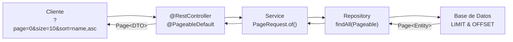

- [10. Negociación de Contenido y Paginación](#10-negociación-de-contenido-y-paginación)
  - [10.1. Paginación y ordenación](#101-paginación-y-ordenación)
    - [10.1.1. Ajustando el repositorio](#1011-ajustando-el-repositorio)
    - [10.1.2. Obteniendo las páginas desde el controlador](#1012-obteniendo-las-páginas-desde-el-controlador)
    - [10.1.3. El resultado como página](#1013-el-resultado-como-página)
      - [10.1.3.1. Simplificando el resultado](#10131-simplificando-el-resultado)
      - [10.1.3.2. Pagination Link en el Header](#10132-pagination-link-en-el-header)
    - [10.2.2. Creando las especificaciones](#1022-creando-las-especificaciones)
    - [10.2.3. Usando las especificaciones](#1023-usando-las-especificaciones)
    - [10.2.4. Paginaciones y Criterios](#1024-paginaciones-y-criterios)
  - [10.3. Práctica de clase, Paginación, Criterios de selección y Ordenación](#103-práctica-de-clase-paginación-criterios-de-selección-y-ordenación)
  - [10.4. Proyecto del curso](#104-proyecto-del-curso)


📝 **Nota del Profesor**
> La paginación es esencial para APIs que manejan grandes cantidades de datos. Nunca devuelvas todos los registros sin paginar.

💡 **Tip del Examinador**
> En el examen suelen pedir implementar paginación. Usa Page<> de Spring Data JPA.

---

# 10. Negociación de Contenido y Paginación
La negociación de contenido es un mecanismo que permite a un cliente especificar el formato de los datos que desea recibir del servidor. En una aplicación Spring Boot, puedes configurar esto para permitir que los clientes soliciten datos en un formato específico, como XML.

Para configurar la negociación de contenido en Spring Boot para recibir datos en XML o JSON, necesitarás seguir estos pasos para XML. El primero es instalar las dependencias

```kotlin
implementation("com.fasterxml.jackson.dataformat:jackson-dataformat-xml")
````

Después, necesitas configurar la negociación de contenido en tu aplicación. Esto se puede hacer en el archivo de configuración de Spring Boot, usualmente `application.properties` o application.yml.

Aquí está un ejemplo de cómo puedes configurar la negociación de contenido en application.properties:
  
```properties
spring.mvc.contentnegotiation.favor-parameter=true
spring.mvc.contentnegotiation.parameter-name=format
```

Ahora podemos obtener el contenido en JSON y XML de varias manera:
- Usando la url: significa que Spring Boot favorecerá un parámetro de consulta en la URL para determinar el formato de los datos. Por ejemplo, un cliente puede solicitar datos en XML usando una URL como esta: http://localhost:8080/api/endpoint?format=xml o http://localhost:8080/api/endpoint?format=json. Si no lo indicas, devuelve en formato por defecto, como puede ser JSON.
- Usando los headers en la petición: Podemos hacer uso de clave `Accept` y de valor `application/xml`

## 10.1. Paginación y ordenación

La paginación y la ordenación son técnicas importantes en el desarrollo de aplicaciones web, especialmente cuando se trata con grandes cantidades de datos:

📊 Flujo de Paginación en Spring Boot



🧠 **Analogía Didáctica**
> Paginación = Páginas de un libro. No lees todo el libro de una vez, sino página por página.

⚠️ **Advertencia**
> Nunca uses findAll() sin paginación en producción. Puede colapsar la aplicación con datos masivos.

**1. Eficiencia de la red:** Cuando tienes una gran cantidad de datos para enviar a través de la red, esto puede consumir mucho ancho de banda y tiempo. Al paginar los datos, sólo envías una pequeña fracción de los datos a la vez, lo que puede hacer que la aplicación sea más rápida y eficiente.

**2. Experiencia del usuario:** Enviar grandes cantidades de datos a la vez puede ser abrumador para los usuarios. Al paginar los datos, puedes proporcionar una experiencia de usuario más manejable y agradable.

**3. Rendimiento del servidor:** Si intentas cargar una gran cantidad de datos a la vez, esto puede poner una gran carga en tu servidor y en tu base de datos. La paginación puede ayudar a aliviar esta carga.

Spring Data JPA en Spring Boot proporciona una forma sencilla de implementar la paginación y la ordenación. Aquí te explico cómo hacerlo:

Claro, aquí te proporciono los mismos ejemplos pero en Java.

### 10.1.1. Ajustando el repositorio

Primero, necesitas modificar tu repositorio para extender  de `JpaRepository` o `PagingAndSortingRepository` en lugar de `CrudRepository` (que ya incluye la funcionalidad de paginación y ordenación pues extiende del segundo). `PagingAndSortingRepository` proporciona métodos para recuperar entidades en un formato paginado y ordenado. 

```java
public interface MyEntityRepository extends JpaRepository<MyEntity, Long> {
}
```

### 10.1.2. Obteniendo las páginas desde el controlador

En tu controlador, puedes aceptar parámetros para la página y el tamaño de la página, así como para la ordenación. Puedes pasar estos parámetros al método de tu repositorio para obtener los datos paginados y ordenados.

```java
@RestController
@RequestMapping("/api/entities")
public class MyEntityController {

    private final MyEntityRepository repository;

    @Autowired
    public MyEntityController(MyEntityRepository repository) {
        this.repository = repository;
    }

    @GetMapping
    public Page<MyEntity> getAll(
        @RequestParam(defaultValue = "0") int page,
        @RequestParam(defaultValue = "10") int size,
        @RequestParam(defaultValue = "id") String sort
        @RequestParam(defaultValue = "asc") String order
    ) {
        Sort sort = direction.equalsIgnoreCase(Sort.Direction.ASC.name()) ? Sort.by(sortBy).ascending() : Sort.by(sortBy).descending();
        // Creamos cómo va a ser la paginación
        Pageable pageable = PageRequest.of(page, size, sort);
        return repository.findAll(pageable);
    }
}
```

En este ejemplo, si un cliente hace una petición GET a `/api/entities?page=1&size=20&sort=name`, el controlador recuperará la segunda página de entidades (la numeración de las páginas comienza desde 0), con 20 entidades por página, ordenadas por el campo `name`.

### 10.1.3. El resultado como página

El resultado de una operación de paginación es un objeto `Page`. Este objeto contiene la lista de entidades para la página solicitada, así como información adicional sobre la paginación, como el número total de páginas, el número total de entidades, si es la primera o la última página, etc. Esto puede ser útil para la lógica de navegación en el lado del cliente. Un objeto `Page` en Spring Data puede contener una gran cantidad de información útil. Aquí te muestro un ejemplo de cómo podría verse un resultado de `Page` en formato JSON:

```json
{
    "content": [
        {
            "id": 1,
            "name": "Entity 1",
            "description": "Description 1"
        },
        {
            "id": 2,
            "name": "Entity 2",
            "description": "Description 2"
        },
        // ... más entidades ...
    ],
    "pageable": {
        "sort": {
            "sorted": true,
            "unsorted": false,
            "empty": false
        },
        "offset": 0,
        "pageNumber": 0,
        "pageSize": 10,
        "paged": true,
        "unpaged": false
    },
    "last": false,
    "totalElements": 50,
    "totalPages": 5,
    "size": 10,
    "number": 0,
    "sort": {
        "sorted": true,
        "unsorted": false,
        "empty": false
    },
    "numberOfElements": 10,
    "first": true,
    "empty": false
}
```

Aquí tienes una descripción de algunos de los campos:

- `content`: Esta es la lista de entidades para la página actual.
- `pageable`: Esta sección contiene detalles sobre la paginación, como el número de página actual (`pageNumber`), el tamaño de la página (`pageSize`), y la información de ordenación (`sort`).
- `last`: Este campo es `true` si esta es la última página de entidades.
- `totalElements`: Este es el número total de entidades en todas las páginas.
- `totalPages`: Este es el número total de páginas.
- `size`: Este es el tamaño de la página, es decir, el número de entidades por página.
- `number`: Este es el número de la página actual (comenzando desde 0).
- `numberOfElements`: Este es el número de entidades en la página actual.
- `first`: Este campo es `true` si esta es la primera página de entidades.
- `empty`: Este campo es `true` si la página actual no tiene ninguna entidad.

#### 10.1.3.1. Simplificando el resultado
Muchas veces no queremos todas esta información y necesitamos simplificarlas. Podemos hacernos nuestro propio PageResponse para usarlo en nuestro controlador.

```java
public record PageResponse<T>(
        List<T> content,
        int totalPages,
        long totalElements,
        int pageSize,
        int pageNumber,
        int totalPageElements,
        boolean empty,
        boolean first,
        boolean last,
        String sortBy,
        String direction
) {
    // Podemos hacer un mapper en este caso
    public static <T> PageResponse<T> of(Page<T> page, String sortBy, String direction) {
        return new PageResponse<>(
                page.getContent(),
                page.getTotalPages(),
                page.getTotalElements(),
                page.getSize(),
                page.getNumber(),
                page.getNumberOfElements(),
                page.isEmpty(),
                page.isFirst(),
                page.isLast(),
                sortBy,
                direction
        );
    }
}
```

De esta manera al llamarlo desde el controlador:
```java
@GetMapping
public ResponseEntity<PageResponse<MyEntity>> getAll(
    @RequestParam(defaultValue = "0") int page,
    @RequestParam(defaultValue = "10") int size,
    @RequestParam(defaultValue = "id") String sort
) {
    Pageable pageable = PageRequest.of(page, size, Sort.by(sort));
    return ResponseEntity.ok(PageResponse.of(repository.findAll(pageable), sort, "ASC"));
}
```
Podrías obtener un JSON similar a este:

```json
{
    "content": [
        {
            "id": 1,
            "name": "Entity 1",
            "description": "Description 1"
        },
        {
            "id": 2,
            "name": "Entity 2",
            "description": "Description 2"
        },
        {
            "id": 3,
            "name": "Entity 3",
            "description": "Description 3"
        }
    ],
    "totalPages": 10,
    "totalElements": 100,
    "pageSize": 10,
    "pageNumber": 0,
    "totalPageElements": 10,
    "empty": false,
    "first": true,
    "last": false,
    "sortBy": "id",
    "direction": "ASC"
}
```

En este ejemplo, `content` es una lista de entidades `MyEntity`. `totalPages` es el número total de páginas disponibles. `totalElements` es el número total de entidades `MyEntity`. `pageSize` es el número de entidades por página. `pageNumber` es el número de la página actual (comenzando desde 0). `totalPageElements` es el número de entidades en la página actual. `empty` es un booleano que indica si la página actual está vacía. `first` y `last` son booleanos que indican si la página actual es la primera o la última página, respectivamente. `sortBy` y `direction` son los criterios de ordenación utilizados.

#### 10.1.3.2. Pagination Link en el Header
Hay varias ventajas de incluir los enlaces de paginación en el encabezado (header) de una respuesta en lugar de incluirlos directamente en el cuerpo (body) de la respuesta:

- Conformidad con estándares: Al colocar los enlaces de paginación en el encabezado, se sigue la convención establecida por el estándar de diseño de API REST llamado HATEOAS (Hypermedia as the Engine of Application State). Este estándar promueve la inclusión de enlaces en el encabezado para proporcionar una navegación más sencilla y descubrible de los recursos.
- Separación de preocupaciones: Al separar los enlaces de paginación en el encabezado, se mantiene el cuerpo de la respuesta limpio y enfocado en los datos específicos de la página actual. Esto mejora la legibilidad y facilita el procesamiento de la información por parte de los clientes.
- Eficiencia en la transferencia de datos: Los encabezados se transfieren en la respuesta HTTP antes del cuerpo, por lo que los enlaces de paginación en el encabezado se envían más rápidamente al cliente. Esto puede ser beneficioso en casos donde los cuerpos de las respuestas son grandes y se desea minimizar el tiempo de transferencia.
- Mejor cacheabilidad: Al colocar los enlaces de paginación en el encabezado, se facilita la cacheabilidad de las respuestas. Los proxies y caches intermedios pueden almacenar y servir respuestas en caché más eficientemente, ya que los enlaces de paginación no cambian con frecuencia y pueden ser compartidos por múltiples solicitudes.
- Flexibilidad para el cliente: Al proporcionar los enlaces de paginación en el encabezado, se permite que el cliente decida si y cómo utilizarlos. El cliente puede elegir seguir los enlaces para navegar por las páginas o simplemente ignorarlos si no los necesita. Esto brinda flexibilidad al cliente y evita tener que incluir enlaces de paginación innecesarios en todas las respuestas.

Podemos hacer esto, como
```java
@Component
public class PaginationLinksUtils {

    public String createLinkHeader(Page<?> page, UriComponentsBuilder uriBuilder) {
        final StringBuilder linkHeader = new StringBuilder();

        if (page.hasNext()) {
            String uri = constructUri(page.getNumber() + 1, page.getSize(), uriBuilder);
            linkHeader.append(buildLinkHeader(uri, "next"));
        }

        if (page.hasPrevious()) {
            String uri = constructUri(page.getNumber() - 1, page.getSize(), uriBuilder);
            appendCommaIfNecessary(linkHeader);
            linkHeader.append(buildLinkHeader(uri, "prev"));
        }

        if (!page.isFirst()) {
            String uri = constructUri(0, page.getSize(), uriBuilder);
            appendCommaIfNecessary(linkHeader);
            linkHeader.append(buildLinkHeader(uri, "first"));
        }

        if (!page.isLast()) {
            String uri = constructUri(page.getTotalPages() - 1, page.getSize(), uriBuilder);
            appendCommaIfNecessary(linkHeader);
            linkHeader.append(buildLinkHeader(uri, "last"));
        }


        return linkHeader.toString();
    }

    private String constructUri(int newPageNumber, int size, UriComponentsBuilder uriBuilder) {
        return uriBuilder.replaceQueryParam("page", newPageNumber).replaceQueryParam("size", size).build().encode().toUriString();
    }


    private String buildLinkHeader(final String uri, final String rel) {
        return "<" + uri + ">; rel=\"" + rel + "\"";
    }

    private void appendCommaIfNecessary(final StringBuilder linkHeader) {
        if (!linkHeader.isEmpty()) {
            linkHeader.append(", ");
        }
    }

}
```

El método createLinkHeader toma un objeto Page<?> y un UriComponentsBuilder como parámetros. El objeto Page<?> representa una página de resultados en una consulta paginada, mientras que UriComponentsBuilder es una clase de Spring Boot utilizada para construir URIs.

El método construye el encabezado de enlaces de paginación verificando las propiedades del objeto Page<?>. Si hay una página siguiente, se construye un enlace para la siguiente página y se agrega al encabezado. Si hay una página anterior, se construye un enlace para la página anterior y se agrega al encabezado. Si la página actual no es la primera, se construye un enlace para la primera página y se agrega al encabezado. Si la página actual no es la última, se construye un enlace para la última página y se agrega al encabezado.

Los enlaces se construyen utilizando el método buildLinkHeader, que recibe una URI y una relación. La URI se construye utilizando el método constructUri, que reemplaza los parámetros de página y tamaño en el UriComponentsBuilder y devuelve la URI resultante.

El encabezado de enlaces se construye utilizando un StringBuilder llamado linkHeader. Se utiliza el método appendCommaIfNecessary para agregar una coma antes de cada enlace adicional, si es necesario.

Finalmente, el método devuelve el encabezado de enlaces como una cadena.

En el controlador, ahora podemos hacer:

```java
@GetMapping()
public ResponseEntity<PageResponse<Categoria>> getAllCategories(
        @RequestParam(required = false) Optional<String> nombre,
        @RequestParam(required = false) Optional<Boolean> isDeleted,
        @RequestParam(defaultValue = "0") int page,
        @RequestParam(defaultValue = "10") int size,
        @RequestParam(defaultValue = "id") String sortBy,
        @RequestParam(defaultValue = "asc") String direction,
        HttpServletRequest request
) {
    log.info("Buscando todos las categorias con nombre: " + nombre + " y borrados: " + isDeleted);
    // Creamos el objeto de ordenación
    Sort sort = direction.equalsIgnoreCase(Sort.Direction.ASC.name()) ? Sort.by(sortBy).ascending() : Sort.by(sortBy).descending();
    // Creamos cómo va a ser la paginación
    Pageable pageable = PageRequest.of(page, size, sort);
    UriComponentsBuilder uriBuilder = UriComponentsBuilder.fromHttpUrl(request.getRequestURL().toString());
    Page<Categoria> pageResult = categoriasService.findAll(nombre, isDeleted, pageable);
    return ResponseEntity.ok()
            .header("link", paginationLinksUtils.createLinkHeader(pageResult, uriBuilder))
            .body(PageResponse.of(pageResult, sortBy, direction));

}
```	

## 10.2. Criterios de búsqueda
Los criterios de búsqueda son útiles en aplicaciones web porque permiten a los usuarios filtrar los datos según sus necesidades. En lugar de devolver todos los datos a la vez, puedes proporcionar a los usuarios una forma de especificar exactamente qué datos están buscando.

Spring Data JPA proporciona una forma de implementar criterios de búsqueda utilizando la interfaz `JpaSpecificationExecutor` y la clase `Specification`.

La interfaz `JpaSpecificationExecutor` proporciona varios métodos que aceptan una `Specification` como parámetro. Una `Specification` es esencialmente un predicado (una función que devuelve un valor booleano) que determina si una entidad en particular debe incluirse en los resultados de la consulta.

Aquí tienes un ejemplo de cómo puedes usar `JpaSpecificationExecutor` y `Specification` para implementar criterios de búsqueda:

### 10.2.1. Ajustando el repositorio

Primero, tu repositorio debe extender `JpaSpecificationExecutor` además de `JpaRepository`.

```java
public interface MyEntityRepository extends JpaRepository<MyEntity, Long>, JpaSpecificationExecutor<MyEntity> {
}
```

### 10.2.2. Creando las especificaciones

A continuación, puedes definir tus especificaciones. 

```java
public class MyEntitySpecifications {

    public static Specification<MyEntity> hasName(Optional<String> name) {
        return (root, query, criteriaBuilder) -> 
            name.map(n -> criteriaBuilder.equal(root.get("name"), n))
                .orElseGet(() -> criteriaBuilder.isTrue(criteriaBuilder.literal(true)));
    }

    public static Specification<MyEntity> hasDescription(Optional<String> description) {
        return (root, query, criteriaBuilder) -> 
            description.map(d -> criteriaBuilder.like(root.get("description"), "%" + d + "%"))
                .orElseGet(() -> criteriaBuilder.isTrue(criteriaBuilder.literal(true)));
    }
}
```

En este código, si `name` o `description` están presentes, se crea una condición de igualdad o de coincidencia (like), respectivamente. Si no están presentes, se devuelve una condición que siempre es verdadera, lo que significa que no se aplicará ningún filtro para ese campo.

### 10.2.3. Usando las especificaciones

Finalmente, puedes usar estas especificaciones en tu controlador para filtrar los resultados de tus consultas.

```java
@RestController
@RequestMapping("/api/entities")
public class MyEntityController {

    private final MyEntityRepository repository;

    @Autowired
    public MyEntityController(MyEntityRepository repository) {
        this.repository = repository;
    }

    @GetMapping
    public ResponseEntity<List<MyEntity>> getAll(
      @RequestParam Optional<String> name,
      @RequestParam Optional<String> description
    ) {
      Specification<MyEntity> spec = MyEntitySpecifications.createSpecification(name, description);
      List<MyEntity> entities = myEntityRepository.findAll(spec);
      return ResponseEntity.ok(entities);
  }
}
```
Este método maneja las solicitudes GET y devuelve una lista de entidades `MyEntity`. Los parámetros `name` y `description` son opcionales y se utilizan para filtrar las entidades que se devuelven `Specification<MyEntity> spec = MyEntitySpecifications.createSpecification(name, description);`: Aquí se crea una especificación basada en los parámetros `name` y `description`. Esta especificación se utiliza para filtrar las entidades que se devuelven. Si uno de ellos existe se utilizará para filtrar, si no se ignora. Posteriormente la llamada `findAll(spec)` se utiliza el repositorio para encontrar todas las entidades que coinciden con la especificación.

### 10.2.4. Paginaciones y Criterios
Te recomiendo que todo lo que hemos visto te lo lleves a un servicio, por ejemplo de la siguiente manera:
```java
@Override
public Page<Categoria> findAll(Optional<String> nombre, Optional<Boolean> isDeleted, Pageable pageable) {
    log.info("Buscando todos las categorias con nombre: " + nombre + " y borrados: " + isDeleted);
    // Criterio de búsqueda por nombre
    Specification<Categoria> specNombreCategoria = (root, query, criteriaBuilder) ->
            nombre.map(m -> criteriaBuilder.like(criteriaBuilder.lower(root.get("nombre")), "%" + m + "%"))
                    .orElseGet(() -> criteriaBuilder.isTrue(criteriaBuilder.literal(true)));

    // Criterio de búsqueda por borrado
    Specification<Categoria> specIsDeleted = (root, query, criteriaBuilder) ->
            isDeleted.map(m -> criteriaBuilder.equal(root.get("isDeleted"), m))
                    .orElseGet(() -> criteriaBuilder.isTrue(criteriaBuilder.literal(true)));

    // Combinamos las especificaciones
    Specification<Categoria> criterio = Specification.where(specNombreCategoria)
            .and(specIsDeleted);

    return categoriasRepository.findAll(criterio, pageable);
}
```

## 10.3. Práctica de clase, Paginación, Criterios de selección y Ordenación

1. Ajusta repositorios, servicios y controladores para que permitan trabajar con paginación y criterios de ordenación.
2. Ajusta repositorios, servicios y controladores para que se pueda consultar paginadamente en base a criterios de selección y poder ordenar además los resultados.
3. Configura la negociación de contenido para que se pueda obtener los datos en formato XML o JSON.
4. Testea los repositorios, servicios y controladores con la nueva funcionalidad.


## 10.4. Proyecto del curso
Puedes encontrar el proyecto con lo visto hasta este punto en la etiqueta: [v.0.0.5 del repositorio del curso: paginacion_seleccion_ordenacion](https://github.com/joseluisgs/DesarrolloWebEntornosServidor-02-Proyecto-SpringBoot/releases/tag/paginacion_seleccion_ordenacion).
