- [11. NoSQL y MongoDB](#11-nosql-y-mongodb)
  - [11.1. MongoDB](#111-mongodb)
    - [11.1.1. Diseñado en MongoDB](#1111-diseñado-en-mongodb)
    - [11.1.2. Consultando en MongoDB](#1112-consultando-en-mongodb)
    - [11.1.3. Comparativa SQL vs NoSQL con MongoDB](#1113-comparativa-sql-vs-nosql-con-mongodb)
    - [11.1.4. Funciones de Búsqueda en MongoDB](#1114-funciones-de-búsqueda-en-mongodb)
    - [11.1.5. Funciones de Creación en MongoDB](#1115-funciones-de-creación-en-mongodb)
    - [11.1.6. Funciones de Actualización en MongoDB](#1116-funciones-de-actualización-en-mongodb)
    - [11.1.7. Funciones de Eliminación en MongoDB](#1117-funciones-de-eliminación-en-mongodb)
  - [11.2. Spring Data MongoDB](#112-spring-data-mongodb)
    - [11.2.1. Configuración](#1121-configuración)
    - [11.2.2. Definiendo los modelos y colecciones](#1122-definiendo-los-modelos-y-colecciones)
      - [11.2.2.1. Trabajando con referencias](#11221-trabajando-con-referencias)
        - [11.2.2.1.1. DBRef](#112211-dbref)
        - [11.2.2.1.2. DocumentReference](#112212-documentreference)
    - [11.2.3. Definiendo el repositorio](#1123-definiendo-el-repositorio)
    - [11.2.4. Desarrollando nuestro Servicio](#1124-desarrollando-nuestro-servicio)
    - [11.2.5. Testeando nuestro código](#1125-testeando-nuestro-código)
      - [11.2.5.1. Testeado repositorios de MongoDB con MongoDB embebido con Flapdoodle](#11251-testeado-repositorios-de-mongodb-con-mongodb-embebido-con-flapdoodle)
      - [Dependencias (build.gradle.kts)](#dependencias-buildgradlekts)
        - [11.2.5.1.2. Configuración (application.properties / application-test.properties)](#112512-configuración-applicationproperties--application-testproperties)
      - [Modelo y Repositorio (Java)](#modelo-y-repositorio-java)
        - [11.2.5.1.4. Tests con MongoDB embebido (Flapdoodle)](#112514-tests-con-mongodb-embebido-flapdoodle)
        - [Test de ejemplo completo](#test-de-ejemplo-completo)
          - [11.2.5.1.4.2. Consideraciones y limitaciones](#1125142-consideraciones-y-limitaciones)
      - [11.2.5.2. Testeando repositorios con Testcontainers](#11252-testeando-repositorios-con-testcontainers)
      - [Dependencias (build.gradle.kts)](#dependencias-buildgradlekts-1)
        - [11.2.5.2.2. Configuración (application-test.properties)](#112522-configuración-application-testproperties)
      - [Modelo y Repositorio (Java)](#modelo-y-repositorio-java-1)
        - [11.2.5.2.4. Tests con MongoDB en contenedor (TestContainers)](#112524-tests-con-mongodb-en-contenedor-testcontainers)
        - [Test de ejemplo completo](#test-de-ejemplo-completo-1)
      - [11.2.5.3. CI: Docker Compose](#11253-ci-docker-compose)
        - [11.2.5.3.1. Replica set y transacciones](#112531-replica-set-y-transacciones)
    - [11.2.6. Testeado servicios](#1126-testeado-servicios)
    - [11.2.7. Testear los controladores](#1127-testear-los-controladores)
  - [11.3. Práctica de clase: MongoDB](#113-práctica-de-clase-mongodb)
  - [11.4. Proyecto del curso](#114-proyecto-del-curso)


 📝 **Nota del Profesor**
> NoSQL representa una alternativa a las bases de datos relacionales. MongoDB es la más popular, basada en documentos JSON.

 💡 **Tip del Examinador**
> MongoDB almacena datos en documentos BSON (JSON binario). Ideal para datos flexibles y escalabilidad horizontal.

---

# 11. NoSQL y MongoDB
**NoSQL** es un término que se utiliza para describir una nueva generación de sistemas de gestión de bases de datos que no están basados en el modelo relacional tradicional, que es el que utiliza SQL. NoSQL significa "no solo SQL", lo que indica que estos sistemas pueden soportar SQL pero también tienen otros métodos de interactuar con los datos.

**Ventajas de NoSQL sobre SQL:**

1. **Escalabilidad:** Las bases de datos NoSQL están diseñadas para expandirse fácilmente y manejar más datos simplemente añadiendo más servidores a la red. Esto se conoce como escalabilidad horizontal. En contraste, las bases de datos SQL a menudo requieren servidores más potentes (escalabilidad vertical) a medida que crecen.

2. **Flexibilidad de los esquemas:** Las bases de datos NoSQL a menudo no requieren un esquema fijo, lo que significa que puedes añadir o cambiar campos en los datos sin tener que modificar toda la base de datos.

3. **Alto rendimiento:** Las bases de datos NoSQL a menudo pueden manejar transacciones de lectura y escritura a alta velocidad, lo que las hace adecuadas para aplicaciones en tiempo real y de big data.

**Desventajas de NoSQL sobre SQL:**

1. **Consistencia:** Aunque las bases de datos NoSQL pueden manejar grandes volúmenes de datos a alta velocidad, a veces lo hacen a expensas de la consistencia, lo que significa que puede haber un retraso antes de que todos los servidores en la red reflejen una actualización de datos.

2. **Madurez:** Las tecnologías NoSQL son relativamente nuevas en comparación con las bases de datos SQL, lo que significa que pueden no tener todas las características de las bases de datos SQL, y puede haber menos expertos disponibles para ayudar en su implementación y mantenimiento.

3. **Interoperabilidad:** Las bases de datos SQL tienen un estándar de lenguaje (SQL) que es coherente entre diferentes sistemas. Las bases de datos NoSQL, por otro lado, pueden tener interfaces de consulta muy diferentes.

 📊 Comparativa SQL vs NoSQL

```mermaid
graph TD
    subgraph "SQL (Relacional)"
        SQL1["Esquema fijo<br/>Tablas, filas, columnas"]
        SQL2["ACID<br/>Consistencia fuerte"]
        SQL3["Joins complejos<br/>Relaciones normalizadas"]
        SQL4["Escalabilidad vertical<br/>Servidor más potente"]
    end
    
    subgraph "NoSQL (MongoDB)"
        NoSQL1["Esquema flexible<br/>Documentos JSON"]
        NoSQL2["BASE<br/>Eventual consistency"]
        NoSQL3["Documentos embebidos<br/>Sin joins"]
        NoSQL4["Escalabilidad horizontal<br/>Más servidores"]
    end
    
    SQL1 -->|"Estructurado"| DB
    NoSQL1 -->|"Flexible"| DB
```



 🧠 **Analogía Didáctica**
> SQL = Librería organizada con estanterías fijas. NoSQL = Caja de zapatos donde metes lo que quieras.

## 11.1. MongoDB

**MongoDB** es un sistema de base de datos NoSQL basado en documentos. En lugar de almacenar los datos en tablas como se hace en un sistema relacional, MongoDB almacena los datos en documentos BSON, que es una representación binaria de JSON.

**Características principales de MongoDB:**

1. **Modelo de datos flexible:** MongoDB no requiere un esquema de datos fijo, lo que significa que los documentos en una colección no necesitan tener la misma estructura.

2. **Escalabilidad horizontal:** MongoDB puede manejar grandes cantidades de datos distribuyendo los datos en muchos servidores.

3. **Alta disponibilidad:** MongoDB tiene soporte para replicación, lo que proporciona redundancia de datos y alta disponibilidad.

4. **Soporte para consultas complejas:** MongoDB admite una rica sintaxis de consulta que puede incluir operaciones de búsqueda, actualización, eliminación, etc.

**¿Qué aporta MongoDB?**

MongoDB es particularmente útil para aplicaciones que necesitan manejar grandes cantidades de datos con estructuras variadas. Es ideal para proyectos que requieren flexibilidad, escalabilidad y rendimiento. También es una buena opción cuando se necesita un modelo de datos más intuitivo y natural que el modelo relacional. Sin embargo, como cualquier tecnología, es importante entender sus limitaciones y asegurarse de que es la elección correcta para las necesidades específicas de tu proyecto.

### 11.1.1. Diseñado en MongoDB
Las bases de datos NoSQL como MongoDB ofrecen varias ventajas en términos de diseño de datos, especialmente cuando se trata de manejar relaciones uno a uno y uno a muchos.

1. **Flexibilidad del esquema**: A diferencia de las bases de datos SQL, las bases de datos NoSQL no requieren un esquema fijo. Esto significa que puedes almacenar documentos con diferentes estructuras en la misma colección. Esta flexibilidad puede ser muy útil cuando los datos tienen una estructura naturalmente irregular o cuando los requisitos de los datos cambian con el tiempo.

2. **Documentos embebidos**: MongoDB permite almacenar documentos embebidos, lo que significa que puedes almacenar datos relacionados directamente dentro de un único documento en lugar de dividirlos en varias tablas como en SQL. Esto puede mejorar el rendimiento al reducir la necesidad de realizar costosas operaciones de unión.

3. **Referencias entre documentos**: Aunque MongoDB es una base de datos no relacional, todavía puedes representar relaciones entre datos utilizando referencias entre documentos. Esto es similar al concepto de claves foráneas en SQL. Sin embargo, a diferencia de SQL, MongoDB no impone la integridad referencial, por lo que tienes más flexibilidad y control.

En términos de diseño de datos, la elección entre utilizar documentos embebidos o referencias entre documentos depende en gran medida de tus necesidades específicas. Los documentos embebidos pueden ser una buena opción si los datos relacionados suelen ser consultados juntos y si no hay demasiados datos para embeber en un único documento. Las referencias entre documentos pueden ser una mejor opción si los datos relacionados son grandes o si necesitas más flexibilidad para consultar los datos de diferentes maneras.

### 11.1.2. Consultando en MongoDB
El lenguaje de consulta de MongoDB es una interfaz de estilo JSON (JavaScript Object Notation) para interactuar con la base de datos. Aunque no es SQL, es bastante expresivo y permite realizar una variedad de operaciones en los datos.

Aquí hay algunos ejemplos de cómo se ve el lenguaje de consulta de MongoDB para un [CRUD](https://www.mongodb.com/docs/manual/crud/):

1. **Consulta básica:** Para encontrar todos los documentos en una colección que cumplan con ciertos criterios, puedes usar el método `find()`. Por ejemplo, para encontrar todos los documentos en la colección "usuarios" donde el campo "nombre" es "Juan", podrías usar:

    ```javascript
    db.usuarios.find({ nombre: "Juan" })
    ```

2. **Inserción de documentos:** Para insertar un nuevo documento en una colección, puedes usar el método `insert()`. Por ejemplo, para insertar un nuevo usuario en la colección "usuarios", podrías usar:

    ```javascript
    db.usuarios.insert({ nombre: "Juan", edad: 30, ciudad: "Madrid" })
    ```

3. **Actualización de documentos:** Para actualizar un documento existente, puedes usar el método `update()`. Por ejemplo, para cambiar la "ciudad" de "Juan" a "Barcelona", podrías usar:

    ```javascript
    db.usuarios.update({ nombre: "Juan" }, { $set: { ciudad: "Barcelona" } })
    ```

4. **Eliminación de documentos:** Para eliminar documentos, puedes usar el método `remove()`. Por ejemplo, para eliminar el usuario "Juan", podrías usar:

    ```javascript
    db.usuarios.remove({ nombre: "Juan" })
    ```

Estos son solo algunos ejemplos de las operaciones básicas que puedes realizar con el lenguaje de consulta de MongoDB. También hay soporte para operaciones más complejas, como consultas de agregación y operaciones de unión.

### 11.1.3. Comparativa SQL vs NoSQL con MongoDB
Podemos ver las [equivalencias entre SQL y NoSQL](https://www.mongodb.com/docs/manual/reference/sql-comparison/) para usarlo con este CRUD:

1. **Create (Crear)**

    - SQL: 
        ```sql
        INSERT INTO productos (id, nombre, precio)
        VALUES (1, 'Producto1', 100);
        ```
    - MongoDB: 
        ```javascript
        db.productos.insert({ _id: 1, nombre: 'Producto1', precio: 100 });
        ```

2. **Read (Leer)**

    - SQL: 
        ```sql
        SELECT * FROM productos WHERE id = 1;
        SELECT * FROM productos WHERE nombre = 'Producto1';
        SELECT * FROM productos WHERE precio <= 100;
        ```
    - MongoDB: 
        ```javascript
        db.productos.find({ _id: 1 });
        db.productos.find({ nombre: 'Producto1' });
        db.productos.find({ precio: { $lte: 100 } });
        ```

3. **Update (Actualizar)**

    - SQL: 
        ```sql
        UPDATE productos SET precio = 120 WHERE id = 1;
        ```
    - MongoDB: 
        ```javascript
        db.productos.update({ _id: 1 }, { $set: { precio: 120 } });
        ```

4. **Delete (Eliminar)**

    - SQL: 
        ```sql
        DELETE FROM productos WHERE id = 1;
        ```
    - MongoDB: 
        ```javascript
        db.productos.remove({ _id: 1 });
        ```

En estos ejemplos, `_id` es el campo de identificación único en MongoDB. En SQL, se asume que `id` es la clave primaria. En las consultas de lectura, `$lte` en MongoDB significa "less than or equal to" (menor o igual a), que es equivalente al operador `<=` en SQL.

### 11.1.4. Funciones de Búsqueda en MongoDB
En MongoDB, las operaciones de búsqueda de datos se realizan principalmente a través de las siguientes funciones:

1. **find()**: Esta función se utiliza para buscar documentos en una colección. Puedes proporcionar un filtro de consulta para especificar las condiciones que los documentos deben cumplir para ser devueltos por la consulta.

2. **findOne()**: Esta función es similar a `find()`, pero solo devuelve el primer documento que coincide con el filtro de consulta.

3. **find().limit()**: Esta combinación de funciones se utiliza para limitar el número de documentos devueltos por una consulta.

4. **find().sort()**: Esta combinación de funciones se utiliza para ordenar los documentos devueltos por una consulta.

5. **find().skip()**: Esta combinación de funciones se utiliza para saltar un número especificado de documentos en el conjunto de resultados de una consulta.

6. **find().count()**: Esta combinación de funciones se utiliza para contar el número de documentos que coinciden con el filtro de consulta.

7. **findOneAndUpdate()**: Esta función se utiliza para buscar un documento y actualizarlo si se encuentra. También devuelve el documento actualizado.

8. **findOneAndDelete()**: Esta función se utiliza para buscar un documento y eliminarlo si se encuentra. También devuelve el documento eliminado.

9. **findOneAndReplace()**: Esta función se utiliza para buscar un documento y reemplazarlo por completo si se encuentra. También devuelve el documento reemplazado.

10. **aggregate()**: Esta función se utiliza para realizar operaciones de agregación en los documentos de una colección, como agrupar por un campo específico, calcular promedios, sumas, etc.

### 11.1.5. Funciones de Creación en MongoDB
En MongoDB, las operaciones de creación de datos se realizan principalmente a través de las siguientes funciones:

1. **insertOne()**: Esta función se utiliza para insertar un nuevo documento en una colección.

2. **insertMany()**: Esta función se utiliza para insertar varios documentos en una colección en una sola operación.

3. **updateOne()** con opción upsert: Esta función se utiliza para actualizar un documento existente o insertar un nuevo documento si el documento que se intenta actualizar no existe. La opción upsert debe establecerse en `true` para que esta función cree un nuevo documento.

4. **updateMany()** con opción upsert: Similar a `updateOne()`, pero esta función se utiliza para actualizar varios documentos o insertar nuevos documentos si los documentos que se intentan actualizar no existen.

5. **findOneAndUpdate()** con opción upsert: Esta función se utiliza para buscar un documento y actualizarlo si se encuentra, o insertar un nuevo documento si el documento que se intenta actualizar no existe.

6. **bulkWrite()**: Esta función se utiliza para realizar varias operaciones de escritura (incluyendo inserciones) en una colección en una sola operación.

### 11.1.6. Funciones de Actualización en MongoDB
En MongoDB, las operaciones de actualización de datos se realizan principalmente a través de las siguientes funciones:

1. **updateOne()**: Esta función se utiliza para actualizar el primer documento que coincide con el filtro de consulta proporcionado.

2. **updateMany()**: Esta función se utiliza para actualizar todos los documentos que coinciden con el filtro de consulta proporcionado.

3. **replaceOne()**: Esta función se utiliza para reemplazar completamente el primer documento que coincide con el filtro de consulta proporcionado.

4. **findOneAndUpdate()**: Esta función se utiliza para buscar un documento y actualizarlo si se encuentra. También devuelve el documento actualizado.

5. **bulkWrite()**: Esta función se utiliza para realizar varias operaciones de escritura (incluyendo actualizaciones) en una colección en una sola operación.

Las operaciones de actualización en MongoDB también pueden incluir operadores de actualización, como `$set`, `$inc`, `$push`, y otros, para modificar de manera más precisa los campos dentro de los documentos.

### 11.1.7. Funciones de Eliminación en MongoDB
En MongoDB, las operaciones de eliminación de datos se realizan principalmente a través de las siguientes funciones:

1. **deleteOne()**: Esta función se utiliza para eliminar el primer documento que coincide con el filtro de consulta proporcionado.

2. **deleteMany()**: Esta función se utiliza para eliminar todos los documentos que coinciden con el filtro de consulta proporcionado.

3. **findOneAndDelete()**: Esta función se utiliza para buscar un documento y eliminarlo si se encuentra. También devuelve el documento eliminado.

4. **drop()**: Esta función se utiliza para eliminar una colección completa, incluyendo todos sus documentos.

5. **bulkWrite()**: Esta función se utiliza para realizar varias operaciones de escritura (incluyendo eliminaciones) en una colección en una sola operación.

También puedes eliminar una colección completa si es necesario.

## 11.2. Spring Data MongoDB
Spring Data JPA es un subproyecto de Spring Data que tiene como objetivo simplificar el acceso a los datos en aplicaciones Spring y mejorar la productividad al reducir el esfuerzo para implementar la capa de acceso a los datos.

Spring Data MongoDB: Es similar a Spring Data JPA en que proporciona interfaces de repositorio que Spring Data MongoDB implementa en tiempo de ejecución. Sin embargo, está diseñado para ser utilizado con MongoDB, que es una base de datos NoSQL orientada a documentos. Spring Data MongoDB ofrece características como la conversión de objetos, soporte para consultas y expresiones regulares, y soporte para índices y geoespaciales, entre otras cosas.

### 11.2.1. Configuración
Para usar SpringData con MongoDB debemos usar su starter
```kotlin
 implementation("org.springframework.boot:spring-boot-starter-data-mongodb")
```
Y configurar el acceso a la base de datos en el fichero `application.properties`
```properties
spring.data.mongodb.host=localhost
spring.data.mongodb.port=27017
spring.data.mongodb.database=prueba
spring.data.mongodb.username=admin
spring.data.mongodb.password=password
```

### 11.2.2. Definiendo los modelos y colecciones
Para definir los modelos y colecciones de MongoDB debemos crear una clase que represente el modelo y anotarla con `@Document` y `@Id` para indicar que es un documento y que campo es el identificador único. Además podemos usar `@TypeAlias`, para indicar con qué clase se van a mapear a la hora de recuperarlos de a base de datos.
```java
@Document("products")
@TypeAlias("Product")
public class Product {

    @Id
    private ObjectId id;
    private String name;
    private double price;

    // Getters and Setters
}
```

#### 11.2.2.1. Trabajando con referencias
Es importante analizar cómo podemos[ modelizar la información y relaciones en MongoDB](https://spring.io/blog/2021/11/29/spring-data-mongodb-relation-modelling).

##### 11.2.2.1.1. DBRef
Aunque podemos trabajar con datos embebidos, otras veces debemos trabajar con referencias.

La anotación `@DBRef` es una anotación de Spring Data MongoDB que se usa para manejar las relaciones entre documentos. MongoDB es una base de datos NoSQL y no soporta las relaciones de la misma manera que las bases de datos relacionales como MySQL o PostgreSQL. Sin embargo, a veces es útil poder referenciar otro documento. La anotación `@DBRef` permite hacer esto.
Aquí hay un ejemplo de cómo puedes usar `@DBRef`:

Supongamos que tienes dos clases de entidad, `Product` y `Category`, y un producto puede pertenecer a una categoría.

```java
@Document(collection = "categories")
public class Category {

    @Id
    private String id;
    private String name;

    // Getters and Setters
}
```

```java
@Document(collection = "products")
public class Product {

    @Id
    private String id;
    private String name;
    private double price;

    @DBRef
    private Category category;

    // Getters and Setters
}
```
En este caso, la anotación `@DBRef` en el campo `category` de la clase `Product` indica que este campo es una referencia a un documento en la colección `categories`. Cuando guardas un producto, solo se guarda el ID de la categoría en la base de datos de MongoDB. Cuando recuperas el producto, Spring Data MongoDB automáticamente carga la categoría asociada utilizando este ID.

##### 11.2.2.1.2. DocumentReference

La anotación `@DocumentReference` es una nueva característica introducida en la versión 3.3.0 de Spring Data MongoDB. Esta anotación permite establecer referencias manuales entre documentos de manera más eficiente y transparente.

Con la anotación `@DocumentReference`, ahora puedes almacenar solo el ID del documento vinculado en MongoDB, y al mismo tiempo, acceder transparentemente al documento de destino en el código sin preocuparte por la consulta adicional. Será nuestra opción preferida para trabajar con referencias.

```java
@Document
public class Customer {

    @Id
    private Long id;

    // ...

    @DocumentReference(lazy = true)
    private Address primaryAddress;

}
```

La anotación `@DocumentReference` se puede especificar en ambos lados de una relación. Para ello, un lado debe extenderse con `@ReadOnlyProperty` y una consulta de búsqueda para resolver la referencia a través del documento fuente. Todos los tipos comunes de relaciones como uno a uno, muchos a uno y muchos a muchos son compatibles. Con muchos a muchos, se almacena una lista de los ID del documento de destino en la base de datos, no se crea una tabla o colección intermedia.

```java
@Document
public class Address {

    @Id
    private Long id;

    // ...

    @DocumentReference(lazy = true, lookup = "{ 'primaryAddress' : ?#{#self._id} }")
    @ReadOnlyProperty
    private Customer customer;

}
```

Establecer `lazy = true` puede ser recomendable para la gran mayoría de los casos. A diferencia de JPA, donde los datos iniciales se cargan con un join, siempre es necesario una nueva consulta contra MongoDB para resolver la relación. Hacer esto solo cuando se accede al documento vinculado puede potencialmente ahorrar la consulta adicional.

Aplicando esto a nuestro ejemplo anterior, podríamos tener algo como esto:

```java
@Document(collection = "categories")
public class Category {

    @Id
    private String id;
    private String name;

    // Getters and Setters
}

@Document(collection = "products")
public class Product {

    @Id
    private String id;
    private String name;
    private double price;

    @DocumentReference(lazy = true)
    private Category category;

    // Getters and Setters
}
```

En este caso, `@DocumentReference(lazy = true)` en el campo `category` de la clase `Product` indica que este campo es una referencia a un documento en la colección `categories`. Cuando guardas un producto, solo se guarda el ID de la categoría en la base de datos de MongoDB. Cuando recuperas el producto, Spring Data MongoDB automáticamente carga la categoría asociada utilizando este ID, pero solo cuando se accede a la categoría.


### 11.2.3. Definiendo el repositorio
Podemos hacer uso del repositorio para manejar nuestras colecciones gracias a `MongoRepository`. Además podemos usar JPQL para la generación de los métodos o usar @Query para realizar consultas usando la sintaxis de MongoDB.

```java
@Repository
public interface ProductRepository extends MongoRepository<Product, String> {
    List<Product> findByName(String name);

    // Ejemplo de consulta en vez de usar JPQL usando MongoDB
    @Query("{ 'price' : { $gt: ?0 } }")
    List<Product> findByPriceGreaterThan(double price);
}
```

### 11.2.4. Desarrollando nuestro Servicio
Para desarrollar nuestro servicio podemos hacer uso del repositorio que hemos creado y usar sus métodos para realizar las operaciones que necesitemos. Podemos usar caché, paginación y ordenación como ya hemos visto con anterioridad.

```java
@Service
public class ProductService {

    private final ProductRepository productRepository;

    @Autowired
    public ProductService(ProductRepository productRepository) {
        this.productRepository = productRepository;
    }

    // Create
    public Product createProduct(Product product) {
        product.setId(new ObjectId());
        return productRepository.save(product);
    }

    // Read
    public List<Product> getAllProducts() {
        return productRepository.findAll();
    }

    // Read a Page
    public Page<Product> getAllProducts(Pageable pageable) {
        return productRepository.findAll(pageable);
    }

    public Optional<Product> getProductById(ObjectId id) {
        return productRepository.findById(id);
    }

    public List<Product> getProductsByName(String name) {
        return productRepository.findByName(name);
    }

    // Update
    public Product updateProduct(ObjectId id, Product product) {
        product.setId(new ObjectId(id));
        return productRepository.save(product);
    }

    // Delete
    public void deleteProduct(ObjectId id) {
        productRepository.deleteById(id);
    }
}
```

Este servicio proporciona los siguientes métodos:
- `createProduct(Product product)`: crea un nuevo producto.
- `getAllProducts()`: obtiene todos los productos.
- `getProductById(ObjectId id)`: obtiene un producto por su ID.
- `getProductsByName(String name)`: obtiene productos por su nombre.
- `updateProduct(ObjectId id, Product product)`: actualiza un producto existente.
- `deleteProduct(ObjectId id)`: elimina un producto por su ID.

### 11.2.5. Testeando nuestro código

#### 11.2.5.1. Testeado repositorios de MongoDB con MongoDB embebido con Flapdoodle

Flapdoodle (MongoDB embebido) es ideal para tests unitarios y de repositorio rápidos, sin necesidad de Docker. Fácil de usar en desarrollo y CI que no dispone de Docker. Úsalo para la mayoría de los tests de repositorio.

#### Dependencias (build.gradle.kts)
```kotlin
plugins {
    id("org.springframework.boot") version "3.2.0"
    id("io.spring.dependency-management") version "1.1.4"
    java
}

group = "dev.joseluisgs"
version = "1.0.0"
java.sourceCompatibility = JavaVersion.VERSION_17

repositories {
    mavenCentral()
}

dependencies {
    // Spring Data MongoDB
    implementation("org.springframework.boot:spring-boot-starter-data-mongodb")

    // Testing: Spring Boot test support
    testImplementation("org.springframework.boot:spring-boot-starter-test")

    // Flapdoodle (MongoDB embebido)
    testImplementation("de.flapdoodle.embed:de.flapdoodle.embed.mongo:4.7.2")
}
```

##### 11.2.5.1.2. Configuración (application.properties / application-test.properties)
`src/main/resources/application.properties`
```properties
spring.application.name=mongodb-testing-tutorial
spring.data.mongodb.uri=mongodb://localhost:27017/devdb
```
`src/test/resources/application-test.properties`
```properties
spring.application.name=mongodb-testing-tutorial-test
spring.data.mongodb.uri=mongodb://localhost:27017/testdb
logging.level.org.springframework.data.mongodb.core=DEBUG
```

#### Modelo y Repositorio (Java)
`src/main/java/dev/joseluisgs/model/Producto.java`
```java
@Document(collection = "productos")
public class Producto {
    @Id
    private String id;
    private String nombre;
    private double precio;
    // ...
}
```
`src/main/java/dev/joseluisgs/repository/ProductoRepository.java`
```java
public interface ProductoRepository extends MongoRepository<Producto, String> {
    List<Producto> findByNombre(String nombre);
}
```

##### 11.2.5.1.4. Tests con MongoDB embebido (Flapdoodle)
Flapdoodle proporciona un MongoDB embebido para tests rápidos sin Docker. Spring Boot lo detecta y configura automáticamente.

##### Test de ejemplo completo
`src/test/java/dev/joseluisgs/repository/ProductoRepositoryEmbeddedTest.java`
```java
@DataMongoTest
class ProductoRepositoryEmbeddedTest {
    @Autowired
    private MongoTemplate mongoTemplate;
    @Autowired
    private ProductoRepository productoRepository;
    @BeforeEach
    void setUp() {
        if (mongoTemplate.collectionExists(Producto.class)) {
            mongoTemplate.dropCollection(Producto.class);
        }
        mongoTemplate.insert(new Producto("Producto 1", 100.0));
        mongoTemplate.insert(new Producto("Producto 2", 200.0));
    }
    @Test
    void testFindByNombre() {
        List<Producto> productos = productoRepository.findByNombre("Producto 1");
        assertEquals(1, productos.size());
        assertEquals("Producto 1", productos.get(0).getNombre());
    }
    // ... más tests de ejemplo en el tutorial completo
}
```

###### 11.2.5.1.4.2. Consideraciones y limitaciones
- Pros: no requiere Docker, rápido, funciona en la mayoría de CI.
- Contras: no replica exactamente el comportamiento de un MongoDB real, replica set y transacciones multi-document no triviales.


#### 11.2.5.2. Testeando repositorios con Testcontainers
TestContainers lanza instancias reales de MongoDB en Docker durante los tests. Útil para validar integraciones y comportamientos dependientes de la versión o configuración real del servidor MongoDB. Ideal para pruebas de integración y cuando necesitas transacciones multi-document o probar replica set.

#### Dependencias (build.gradle.kts)
```kotlin
testImplementation(platform("org.testcontainers:testcontainers-bom:1.19.1"))
testImplementation("org.testcontainers:junit-jupiter")
testImplementation("org.testcontainers:mongodb")
```

##### 11.2.5.2.2. Configuración (application-test.properties)
`src/test/resources/application-test.properties`
```properties
spring.application.name=mongodb-testing-tutorial-test
spring.data.mongodb.uri=mongodb://localhost:27017/testdb
logging.level.org.springframework.data.mongodb.core=DEBUG
```

#### Modelo y Repositorio (Java)
`src/main/java/dev/joseluisgs/model/Producto.java`
```java
@Document(collection = "productos")
public class Producto {
    @Id
    private String id;
    private String nombre;
    private double precio;
    // ...
}
```
`src/main/java/dev/joseluisgs/repository/ProductoRepository.java`
```java
public interface ProductoRepository extends MongoRepository<Producto, String> {
    List<Producto> findByNombre(String nombre);
}
```

##### 11.2.5.2.4. Tests con MongoDB en contenedor (TestContainers)
TestContainers arranca una instancia real de MongoDB en Docker durante los tests. Así validas el comportamiento real del servidor y puedes probar transacciones y replica set.

##### Test de ejemplo completo
`src/test/java/dev/joseluisgs/repository/ProductoRepositoryTestContainersTest.java`
```java
@DataMongoTest
@Testcontainers
@ActiveProfiles("test")
class ProductoRepositoryTestContainersTest {
    @Container
    static MongoDBContainer mongo = new MongoDBContainer("mongo:6.0.6");
    @DynamicPropertySource
    static void setProperties(DynamicPropertyRegistry registry) {
        registry.add("spring.data.mongodb.uri", mongo::getReplicaSetUrl);
    }
    @Autowired
    private MongoTemplate mongoTemplate;
    @Autowired
    private ProductoRepository productoRepository;
    @BeforeEach
    void setUp() {
        if (mongoTemplate.collectionExists(Producto.class)) {
            mongoTemplate.dropCollection(Producto.class);
        }
        mongoTemplate.insert(new Producto("Producto 1", 100.0));
        mongoTemplate.insert(new Producto("Producto 2", 200.0));
    }
    @Test
    void testFindByNombreUsingContainer() {
        List<Producto> productos = productoRepository.findByNombre("Producto 1");
        assertEquals(1, productos.size());
        assertEquals("Producto 1", productos.get(0).getNombre());
    }
}
```

#### 11.2.5.3. CI: Docker Compose
Puedes usar Docker Compose para levantar MongoDB en un entorno de CI (local, GitHub Actions, etc.) si lo prefieres. Ejemplo de archivo `docker-compose.yml`:

`docker-compose.yml`
```yaml
version: '3.8'
services:
  mongodb:
    image: mongo:6.0.6
    ports:
      - "27017:27017"
    environment:
      MONGO_INITDB_ROOT_USERNAME: root
      MONGO_INITDB_ROOT_PASSWORD: example
    # Para replica set y transacciones, puedes añadir:
       command: --replSet rs0
```

##### 11.2.5.3.1. Replica set y transacciones
- Para transacciones multi-document necesitas Mongo ejecutando como replica set.
- TestContainers lo soporta vía `getReplicaSetUrl`. Si necesitas customización avanzada, consulta la documentación.

### 11.2.6. Testeado servicios
Para testear los servicios, podemos hacer uso de Mockito y proceder como ya hemos visto en anteriores ocasiones.


```java
@SpringBootTest
@ExtendWith(MockitoExtension.class)
public class ProductoServiceTest {

    @Mock
    private ProductoRepository productoRepository;

    @InjectMocks
    private ProductoService productoService;

    @BeforeEach
    public void setUp() {
        productoService = new ProductoService(productoRepository);

        Producto producto = new Producto();
        producto.setNombre("Producto 1");
        producto.setPrecio(100.0);

        when(productoRepository.findById(anyString())).thenReturn(Optional.of(producto));
        when(productoRepository.save(any(Producto.class))).thenReturn(producto);
    }

    @Test
    public void testGetProducto() {
        String id = "someId";
        Producto producto = productoService.getProducto(id);

        assertNotNull(producto);
        assertEquals("Producto 1", producto.getNombre());
        assertEquals(100.0, producto.getPrecio());

        verify(productoRepository, times(1)).findById(id);
    }

    @Test
    public void testSaveProducto() {
        Producto producto = new Producto();
        producto.setNombre("Producto 2");
        producto.setPrecio(200.0);

        Producto savedProducto = productoService.saveProducto(producto);

        assertNotNull(savedProducto);
        assertEquals("Producto 2", savedProducto.getNombre());
        assertEquals(200.0, savedProducto.getPrecio());

        verify(productoRepository, times(1)).save(producto);
    }

    // Agrega más pruebas para otros métodos del servicio
}
```

### 11.2.7. Testear los controladores
En este caso todo sigue siendo igual tal y como hemos visto en anteriores ocasiones. Se recomienda mockear el servicio.


## 11.3. Práctica de clase: MongoDB

1. Crea un Pedido que estará compuesto de un Cliente con su dirección y de distintas Líneas de Pedido. El pedido debe calcular el total de items y el precio total. Se debe almacenar en MongoDB.
2. Crea un repositorios y servicio que permita crear, leer, actualizar y eliminar pedidos.
3. Se debe tener en cuenta que no se puede añadir un Funko si no hay stock suficiente y que al devolverlo, se debe ajustar el stock.
4. Crea los test necesarios de repositorio (si los hay), servicio y controlador.

## 11.4. Proyecto del curso
Puedes encontrar el proyecto con lo visto hasta este punto en la etiqueta: [v.0.0.6 del repositorio del curso: pedidos](https://github.com/joseluisgs/DesarrolloWebEntornosServidor-02-Proyecto-SpringBoot/releases/tag/pedidos).