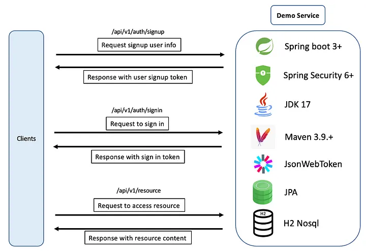
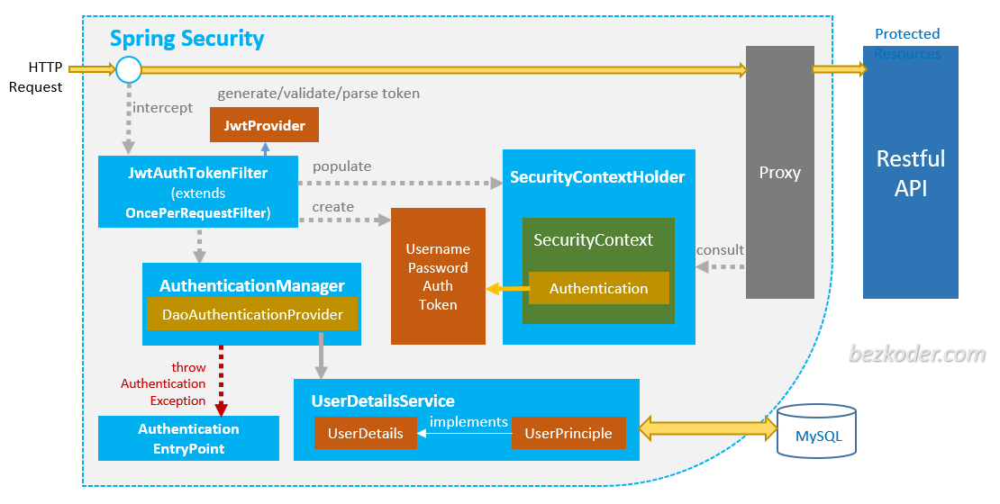
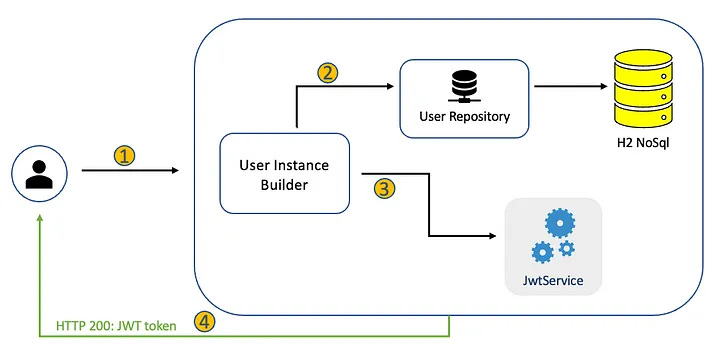
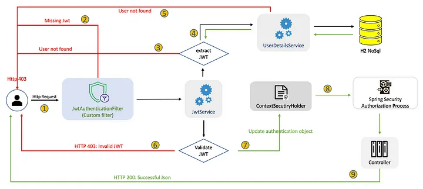

- [12. Autenticación y Autorización con JWT y Spring Security](#12-autenticación-y-autorización-con-jwt-y-spring-security)
  - [12.1. Autenticación y Autorización](#121-autenticación-y-autorización)
    - [12.1.1. Configurando Spring Security](#1211-configurando-spring-security)
    - [12.1.2. Registro](#1212-registro)
    - [12.1.3. Iniciar Sesión](#1213-iniciar-sesión)
    - [12.1.4. Accesos a recursos](#1214-accesos-a-recursos)
  - [12.2. Implementación](#122-implementación)
    - [12.2.1. Entidad de Usuario](#1221-entidad-de-usuario)
    - [12.2.2. Repositorio de Usuario](#1222-repositorio-de-usuario)
    - [12.2.3. Servicio de Usuario](#1223-servicio-de-usuario)
    - [12.2.4. Servicio para JWT](#1224-servicio-para-jwt)
    - [12.2.5. Servicio de Autenticación](#1225-servicio-de-autenticación)
    - [12.2.6. Filtro de autenticación JWT](#1226-filtro-de-autenticación-jwt)
      - [12.2.6.1. Tipos de filtro](#12261-tipos-de-filtro)
    - [12.2.7. Configuración de la seguridad](#1227-configuración-de-la-seguridad)
      - [12.2.7.1. PasswordEncoder](#12271-passwordencoder)
      - [12.2.7.2. AuthenticationProvider](#12272-authenticationprovider)
      - [12.2.7.3. AuthenticationManager](#12273-authenticationmanager)
  - [12.3. Configuración de la autorización](#123-configuración-de-la-autorización)
      - [12.2.7.4. SecurityFilterChain](#12274-securityfilterchain)
      - [12.2.7.5. Anotaciones en controladores o métodos de controladores](#12275-anotaciones-en-controladores-o-métodos-de-controladores)
      - [12.3.1. AuthenticationPrincipal](#1231-authenticationprincipal)
  - [12.4. Test de la Autenticación y Autorización](#124-test-de-la-autenticación-y-autorización)
  - [12.5. SSL y TSL](#125-ssl-y-tsl)
  - [12.6. Práctica de clase: Seguridad](#126-práctica-de-clase-seguridad)
  - [12.7. Proyecto del curso](#127-proyecto-del-curso)


 📝 **Nota del Profesor**
> Spring Security es fundamental para aplicaciones profesionales. Dominar JWT, autenticación y autorización es esencial para el examen y el mercado laboral.

 💡 **Tip del Examinador**
> En el examen preguntan sobre la diferencia entre autenticación (quién eres) y autorización (qué puedes hacer). ¡No los confundas!

---

# 12. Autenticación y Autorización con JWT y Spring Security

[Spring Security](https://spring.io/projects/spring-security) es un framework de seguridad de aplicaciones para aplicaciones Java basadas en Spring Framework. Proporciona una capa de seguridad a nivel de aplicación que se integra fácilmente con otras tecnologías de Spring, como Spring MVC, Spring Boot y Spring Data.

La seguridad es un aspecto crítico en el desarrollo de aplicaciones web, y Spring Security ofrece una amplia gama de características y funcionalidades para proteger las aplicaciones contra amenazas y ataques. Algunas de las características principales de Spring Security incluyen:

1. Autenticación: Spring Security permite autenticar a los usuarios en la aplicación, verificando sus credenciales, como nombre de usuario y contraseña. Proporciona opciones para autenticar usuarios en una base de datos, LDAP, servicios web, entre otros.

2. Autorización: Spring Security permite controlar el acceso a diferentes partes de la aplicación en función de los roles y permisos de los usuarios autenticados. Esto se logra mediante la configuración de reglas de autorización que determinan qué usuarios tienen acceso a qué recursos.

3. Protección contra ataques: Spring Security proporciona protección integrada contra ataques comunes, como ataques de inyección SQL, ataques de secuencias de comandos entre sitios (XSS), ataques de falsificación de solicitudes entre sitios (CSRF) y muchos más.

4. Gestión de sesiones: Spring Security gestiona las sesiones de usuario de manera segura, lo que permite realizar un seguimiento de los usuarios autenticados y controlar su estado de sesión.

5. Integración con otras tecnologías de Spring: Spring Security se integra sin problemas con otras tecnologías de Spring, como Spring MVC, Spring Boot y Spring Data. Esto facilita la implementación de la seguridad en aplicaciones existentes o nuevas.

## 12.1. Autenticación y Autorización
Imaginemos que queremos conseguir que: 
- El usuario hace una solicitud al servicio, buscando crear una cuenta.
- Un usuario envía una solicitud al servicio para autenticar su cuenta.
- Un usuario autenticado envía una solicitud para acceder a recursos, y solo lo hará dependiendo de su rol.



### 12.1.1. Configurando Spring Security

Lo primero que debemos hacer es añadir las dependencias de Spring Security a nuestro proyecto. 

Usando Gradle
```kotlin
implementation("org.springframework.boot:spring-boot-starter-security")
// Dependencia para test
testImplementation("org.springframework.security:spring-security-test")
```

**Desde este momento no podrás acceder a tus endpoints porque se configuran "cerrados" por defecto, por lo que ten paciencia y sigue los pasos que mostramos**

Pero si te urge ver algo, y no recibir el error 401 o 403, debes crear una clase configuración de srping donde definas el filtro de acciones permitidas. Esto es lo mínim que deberáis hacer en una clase `SecurityConfiguration`:

```java
@Configuration
@EnableWebSecurity
public class SecurityConfiguration {
    @Bean
    public SecurityFilterChain securityFilterChain(HttpSecurity http) throws Exception {
        http.csrf(AbstractHttpConfigurer::disable)
                // Dar permiso a los errores
                .authorizeHttpRequests(request -> request.requestMatchers("/error/**")
                        .permitAll())
                .authorizeHttpRequests(request -> request.requestMatchers("/saludo/**")
                        .permitAll())
                // Resto de peticiones
                .authorizeHttpRequests(request -> request.anyRequest()
                        .authenticated());

        return http.build();
    }
}
```

La arquitectura de nuestro proceso es la siguiente (la iremos desgranando paso a paso)



### 12.1.2. Registro
El proceso de registro se ha simplificado mucho en las últimas versiones. Un componente notable es el `JwtService`, un servicio personalizado utilizado para manejar las operaciones JWT. Los detalles de implementación adicionales se pueden encontrar en la sección de codificación a continuación.



1. El proceso comienza cuando un usuario envía una solicitud al servicio. Se genera un objeto de usuario (User) a partir de los datos de la solicitud, con la contraseña siendo codificada usando el `PasswordEncoder`. 
2. El objeto de usuario se almacena en la base de datos utilizando el `UserRepository`, que aprovecha Spring Data JPA. 
3. El `JwtService` se invoca para generar un JWT para el objeto User. 
4. El JWT se encapsula dentro de una respuesta JSON y posteriormente se devuelve al usuario. 

Es importante recordar que debemos informar a Spring sobre el codificador de contraseñas específico utilizado en la aplicación, en este caso, estamos utilizando `PasswordEncoder` con BCrypt. Esta información es necesaria para que Spring pueda autenticar correctamente a los usuarios descodificando sus contraseñas.

### 12.1.3. Iniciar Sesión
El proceso comienza cuando un usuario envía una solicitud de inicio de sesión al Servicio. 

![auth]

1. Se genera un objeto de `autenticación` llamado `UsernamePasswordAuthenticationToken`, utilizando el nombre de usuario y la contraseña proporcionados. 
2. El `AuthenticationManager` es responsable de autenticar el objeto de autenticación, manejando todas las tareas necesarias. Si el nombre de usuario o la contraseña son incorrectos, se lanza una excepción, y se devuelve una respuesta con el estado HTTP 403 al usuario. 
3. Después de una autenticación exitosa, se intenta recuperar al usuario de la base de datos. Si el usuario no existe en la base de datos, se envía una respuesta con el estado HTTP 403 al usuario. Sin embargo, ya que hemos pasado el paso 2 (autenticación), este paso no es crucial, ya que el usuario ya debería estar en la base de datos. 
4. Una vez que tenemos la información del usuario, llamamos al `JwtService` para generar el JWT. 
5. El JWT se encapsula en una respuesta JSON y se devuelve al usuario. 

Se introducen dos conceptos nuevos en este proceso:
- `UsernamePasswordAuthenticationToken`: un tipo de objeto de autenticación que puede ser creado a partir de un nombre de usuario y una contraseña que se envían.
- `AuthenticationManager`: procesa el objeto de autenticación y realizará todos los trabajos de autenticación por nosotros.

### 12.1.4. Accesos a recursos
Este proceso está asegurado por Spring Security de la siguiente manera:



1. El proceso comienza cuando el usuario envía una solicitud al Servicio. La solicitud es interceptada primero por `JwtAuthenticationFilter`, que es un filtro personalizado integrado en la `SecurityFilterChain`. 
2. Como la API está asegurada, si falta el JWT, se envía una respuesta con el estado HTTP 403 al usuario. 
3. Cuando se recibe un JWT existente, se llama al `JwtService` para extraer el el dato clave que identifica al usuario y está encapsulado, por el ejemplo el username o usermail del JWT.  Si no se puede extraer el username, se envía una respuesta con el estado HTTP 403 al usuario. 
4. Si se puede extraer el username/useremail, se utilizará para consultar la información de autenticación y autorización del usuario a través de `UserDetailsService`. 
5. Si la información de autenticación y autorización del usuario no existe en la base de datos, se envía una respuesta con el estado HTTP 403 al usuario. 
6. Si el JWT ha expirado, se envía una respuesta con el estado HTTP 403 al usuario. 
7. Tras una autenticación exitosa, los detalles del usuario se encapsulan en un objeto `UsernamePasswordAuthenticationToken` y se almacenan en el `SecurityContextHolder`. 
8. El proceso de Autorización de Spring Security se invoca automáticamente. 
9. La solicitud se envía al controlador, y se devuelve una respuesta JSON exitosa al usuario. 

Este proceso es un poco más complicado, involucra algunos conceptos nuevos:
- `SecurityFilterChain`: una cadena de filtros que es capaz de ser comparada con un `HttpServletRequest` para decidir si se aplica a esa solicitud.
- `SecurityContextHolder`: es donde Spring Security almacena los detalles de quién está autenticado. Spring Security utiliza esa información para la autorización.
- `UserDetailsService`: Servicio para obtener datos específicos del usuario.

## 12.2. Implementación


### 12.2.1. Entidad de Usuario
Los usuarios y los permisos son conceptos fundamentales en la gestión de la seguridad de una aplicación. En Spring Security, los usuarios y los permisos se definen mediante la configuración de la autenticación y la autorización respectivamente. Al utilizar Spring Security para la autenticación y autorización en nuestra aplicación, los datos específicos del usuario deben ser proporcionados a la API de Spring Security y utilizados durante el proceso de autenticación. Estos datos específicos del usuario están encapsulados en el objeto `[UserDetails](https://docs.spring.io/spring-security/site/docs/current/api/org/springframework/security/core/userdetails/UserDetails.html)`. `UserDetails` es una interfaz que incluye varios métodos. La implementación de estos métodos proporciona información sobre el usuario, como su nombre de usuario, contraseña, roles, etc.

Hay varias razones por las que es importante utilizar `UserDetails` en Spring Security:

Representación de los detalles de usuario: UserDetails proporciona una estructura de datos estandarizada para representar los detalles de un usuario autenticado. Esto incluye su nombre de usuario, contraseña, roles, autorizaciones y cualquier otro detalle que necesites.

Configuración personalizada de la autenticación: Puedes crear una implementación personalizada de UserDetails para almacenar detalles de usuario adicionales, como información de perfil o datos de contacto. Esto permite personalizar la autenticación y la autorización de la aplicación según las necesidades específicas de tu proyecto.

Integración con proveedores de autenticación: UserDetails se integra con los proveedores de autenticación en Spring Security, lo que permite que los detalles de usuario se almacenen y recuperen de forma segura y eficiente. Esto simplifica el proceso de autenticación y autorización y permite la integración con diferentes sistemas de autenticación, como LDAP, base de datos, JWT, OAuth, entre otros.

Control de acceso granular: UserDetails proporciona la información necesaria para que los sistemas de autorización puedan tomar decisiones de acceso granulares. Por ejemplo, puedes utilizar los roles y las autorizaciones definidos en UserDetails para permitir o denegar el acceso a recursos específicos de la aplicación en función de los permisos de usuario.

UserDetails es un componente crítico en la arquitectura de autenticación y autorización en Spring Security. Proporciona una estructura de datos estandarizada para representar los detalles de usuario, permite la personalización de la autenticación y la integración con diferentes proveedores de autenticación, y permite un control de acceso granular en la aplicación.

En nuestro caso definiremos User y Rol y estos roles tendrán una serie de permisos de usuario. De esta manera podremos definir los permisos de acceso a los recursos de nuestra aplicación con total libertad y respondiendo a las pliticas de acceso que tengamos en nuestro problema.

Antes de nada definiremos los roles.

```java
public enum Role {
    USER,
    ADMIN
}
```
```java
@Data
@Builder
@NoArgsConstructor
@AllArgsConstructor
@Entity
@Table(name = "USER")
public class User implements UserDetails {
    @Id
    @GeneratedValue(strategy = GenerationType.IDENTITY)
    private Integer id;
    private String firstName;
    private String lastName;
    private String email;
    private String password;
    @Enumerated(EnumType.STRING)
    private Role role;
    @Override
    public Collection<? extends GrantedAuthority> getAuthorities() {
        return List.of(new SimpleGrantedAuthority(role.name()));
    }

    @Override
    public String getUsername() {
        // email in our case o username if we have a username
        return email;
    }

    @Override
    public boolean isAccountNonExpired() {
        return true;
    }

    @Override
    public boolean isAccountNonLocked() {
        return true;
    }

    @Override
    public boolean isCredentialsNonExpired() {
        return true;
    }

    @Override
    public boolean isEnabled() {
        return true;
    }
}
```

### 12.2.2. Repositorio de Usuario
En este caso no hay problemas ya que usamos Spring Data con JPA para su implementación. Se añaden métodos para buscarlo por username o usermail.

### 12.2.3. Servicio de Usuario
`UserDetailsService` es una interfaz en Spring Security que se utiliza para cargar los detalles de un usuario en la aplicación a partir de un origen de datos, como una base de datos o un servicio web. Es un componente esencial en el proceso de autenticación y autorización en Spring Security, ya que proporciona los detalles necesarios del usuario para la autenticación y la autorización.

En concreto, UserDetailsService es responsable de cargar los detalles del usuario a partir de una fuente de datos y devolverlos como un objeto UserDetails, que contiene la información del usuario, como su nombre de usuario, contraseña, roles y autorizaciones. Estos detalles son utilizados por el AuthenticationManager para autenticar al usuario y por el sistema de autorización para determinar los permisos del usuario.

Es importante destacar que UserDetailsService no se utiliza para autenticar al usuario en sí mismo, sino para cargar sus detalles de usuario para que el AuthenticationManager pueda autenticar al usuario. La autenticación en sí se realiza en el AuthenticationManager, que utiliza los detalles del usuario devueltos por UserDetailsService para autenticar al usuario.

UserDetailsService es una interfaz en Spring Security que se utiliza para cargar los detalles de un usuario en la aplicación a partir de un origen de datos. Proporciona los detalles necesarios del usuario para la autenticación y la autorización, y es esencial en el proceso de autenticación y autorización en Spring Security.

Debemos tener en cuenta que necesitamos que nuestro servicio de usuario implemente o use la interfaz `UserDetailsService` de Spring Security. Esto es necesario para que Spring Security pueda cargar la información del usuario durante el proceso de autenticación.

`UserDetailsService` es una interfaz que recupera la información de autenticación y autorización del usuario. Solo tiene un método `loadUserByUsername()`, que puede ser implementado para suministrar información del usuario a la API de Spring Security. El DaoAuthenticationProvider utiliza este método para cargar la información del usuario cuando realiza el proceso de autenticación.


```java
public interface UserService {
    UserDetailsService userDetailsService();
}
```
```java
@Service
@RequiredArgsConstructor
public class UserServiceImpl implements UserService {
    private final UserRepository userRepository;
    @Override
    public UserDetailsService userDetailsService() {
        return new UserDetailsService() {
            @Override
            public UserDetails loadUserByUsername(String username) {
              // Elegimos el métdo que queramos para buscar el usuario
                return userRepository.findByEmail(username)
                        .orElseThrow(() -> new UsernameNotFoundException("User not found"));
            }
        };
    }
}
```


### 12.2.4. Servicio para JWT
El siguiente paso es crear el servicio para Manejar los [JSON Web Token](https://jwt.io/introduction/). Es importante que agreguemos las dependencias:
```kotlin
implementation("com.auth0:java-jwt:4.4.0")
```

JWT (JSON Web Token) es un estándar abierto (RFC 7519) que define un formato compacto y seguro para transmitir información entre partes como un objeto JSON. Los tokens JWT se utilizan comúnmente como un mecanismo de autenticación en aplicaciones web y móviles.

Un token JWT consta de tres partes separadas por un punto (.): el encabezado (header), el cuerpo (payload) y la firma (signature). El encabezado contiene información sobre el tipo de token y el algoritmo de cifrado utilizado para firmar el token. El cuerpo contiene los datos del usuario o cualquier otra información relevante que se desee transmitir. La firma se utiliza para verificar la integridad del token y garantizar que no ha sido manipulado durante la transmisión.

Para utilizar JWT en una aplicación, primero se debe generar un token y enviarlo al cliente como respuesta a una solicitud de inicio de sesión válida. El cliente debe almacenar el token, por ejemplo en la memoria local del navegador o en una cookie segura, y enviarlo en cada solicitud subsiguiente como una cabecera de autorización.

Cuando el servidor recibe una solicitud con un token JWT, primero verifica la firma del token para asegurarse de que no ha sido manipulado durante la transmisión. Si la firma es válida, el servidor decodifica el token y extrae la información necesaria del cuerpo del token para autenticar al usuario y autorizar la solicitud.

JWT ofrece varias ventajas sobre otros mecanismos de autenticación, como las cookies de sesión o los tokens de autenticación basados en servidores. Algunas de las ventajas incluyen:

Portabilidad: Los tokens JWT se pueden transmitir en cualquier medio, como URL, POST, encabezados HTTP, etc., lo que hace que sean ideales para aplicaciones web y móviles. Seguridad: Los tokens JWT están firmados y cifrados, lo que garantiza que la información transmitida no haya sido manipulada durante la transmisión. Escalabilidad: Los tokens JWT se pueden validar en cualquier servidor que tenga la clave secreta para verificar la firma, lo que los hace ideales para aplicaciones distribuidas y escalables. En resumen, JWT es un estándar de autenticación basado en tokens que se utiliza para transmitir información entre partes de forma segura y eficiente. Los tokens JWT constan de un encabezado, un cuerpo y una firma, y se utilizan para autenticar y autorizar a los usuarios en aplicaciones web y móviles.

El uso y manejo de tokens lo tendremos en nuestra JwtService.

Además, para almacenar los tokens y asociarlos a los usuarios crearemos las relaciones pertinentes en el modelo de Usuario y Token (para almacenar los tokens válidos y activos de cada usuario).

Para configurar el token hemos añadido unos campos en nuestro fichero de propiedades.
  
  ```properties
  # JWT
  token.signing.key=secret
  token.expiration.time=86400
  ```

```java
public interface JwtService {
    String extractUserName(String token);

    String generateToken(UserDetails userDetails);

    boolean isTokenValid(String token, UserDetails userDetails);
}
```
```java
@Service
@Slf4j
public class JwtServiceImpl implements JwtService {
    @Value("${jwt.secret}")
    private String jwtSigningKey;

    @Value("${jwt.expiration}")
    private Long jwtExpiration;

    @Override
    public String extractUserName(String token) {
        log.info("Extracting username from token " + token);
        return extractClaim(token, DecodedJWT::getSubject);
    }

    @Override
    public String generateToken(UserDetails userDetails) {
        log.info("Generating token for user " + userDetails.getUsername());
        return generateToken(new HashMap<>(), userDetails);
    }

    @Override
    public boolean isTokenValid(String token, UserDetails userDetails) {
        log.info("Validating token " + token + " for user " + userDetails.getUsername());
        final String userName = extractUserName(token);
        return (userName.equals(userDetails.getUsername())) && !isTokenExpired(token);
    }

    private <T> T extractClaim(String token, Function<DecodedJWT, T> claimsResolvers) {
        log.info("Extracting claim from token " + token);
        final DecodedJWT decodedJWT = JWT.decode(token);
        return claimsResolvers.apply(decodedJWT);
    }

    private String generateToken(Map<String, Object> extraClaims, UserDetails userDetails) {
        // Preparamos el token
        Algorithm algorithm = Algorithm.HMAC512(getSigningKey());
        Date now = new Date();
        Date expirationDate = new Date(now.getTime() + (1000 * jwtExpiration));

        return JWT.create()
                .withHeader(createHeader())
                .withSubject(userDetails.getUsername())
                .withIssuedAt(now)
                .withExpiresAt(expirationDate)
                .withClaim("extraClaims", extraClaims)
                .sign(algorithm);
    }

    private boolean isTokenExpired(String token) {
        Date expirationDate = extractExpiration(token);
        return expirationDate.before(new Date());
    }

    private Date extractExpiration(String token) {
        return extractClaim(token, DecodedJWT::getExpiresAt);
    }

    private Map<String, Object> createHeader() {
        Map<String, Object> header = new HashMap<>();
        header.put("typ", "JWT");
        return header;
    }

    private byte[] getSigningKey() {
        return Base64.getEncoder().encode(jwtSigningKey.getBytes());

    }
```

### 12.2.5. Servicio de Autenticación
Será el encargado de realizar la lógica de negocio para registrarse y loguearse.

Servicio de Autenticación
```java
public interface AuthenticationService {
    JwtAuthenticationResponse signup(SignUpRequest request);

    JwtAuthenticationResponse signin(SigninRequest request);
}
@Service
@RequiredArgsConstructor
public class AuthenticationServiceImpl implements AuthenticationService {
    private final UserRepository userRepository;
    private final PasswordEncoder passwordEncoder;
    private final JwtService jwtService;
    private final AuthenticationManager authenticationManager;
    @Override
    public JwtAuthenticationResponse signup(SignUpRequest request) {
        var user = User.builder().firstName(request.getFirstName()).lastName(request.getLastName())
                .email(request.getEmail()).password(passwordEncoder.encode(request.getPassword()))
                .role(Role.USER).build();
        userRepository.save(user);
        var jwt = jwtService.generateToken(user);
        return JwtAuthenticationResponse.builder().token(jwt).build();
    }

    @Override
    public JwtAuthenticationResponse signin(SigninRequest request) {
        authenticationManager.authenticate(
                new UsernamePasswordAuthenticationToken(request.getEmail(), request.getPassword()));
        var user = userRepository.findByEmail(request.getEmail())
                .orElseThrow(() -> new IllegalArgumentException("Invalid email or password"));
        var jwt = jwtService.generateToken(user);
        return JwtAuthenticationResponse.builder().token(jwt).build();
    }
}
```
### 12.2.6. Filtro de autenticación JWT

Un authentication filter en Spring Boot es un tipo de filtro de seguridad que se utiliza para autenticar las solicitudes de los usuarios en una aplicación web. Los filtros de autenticación en Spring Boot se ejecutan antes de que se procese la solicitud del usuario y se utilizan para validar la identidad del usuario y determinar si se le permite acceder a los recursos protegidos por la aplicación. En definitiva es un middleware que actúa por cada request para decir si debe o no ser atendida la petición.

El filtro personalizado extiende [OncePerRequestFilter](https://docs.spring.io/spring-framework/docs/current/javadoc-api/org/springframework/web/filter/OncePerRequestFilter.html) para asegurar que nuestro filtro sea invocado solo una vez por cada petición. Define las siguientes funcionalidades:

- Recuperar el userEmail/username parseando el Token Bearer y posteriormente buscar la información del usuario correspondiente en la base de datos.
- Verificar la autenticidad del JWT.
- Generar un objeto de Autenticación usando el nombre de usuario y la contraseña proporcionados, y posteriormente almacenarlo en el SecurityContextHolder.

#### 12.2.6.1. Tipos de filtro

Un authentication filter en Spring Boot puede ser personalizado para incluir lógica de autenticación específica de la aplicación, como la verificación de credenciales, el control de acceso y la autorización basada en roles. Algunos ejemplos de filtros de autenticación comunes en Spring Boot incluyen:

- OncePerRequestFilter: un filtro que se ejecuta una vez por cada solicitud. Podemos programar su comportamiento. Será el que usemos por ser el más genérico, ya que lo podemos llevar a cabo en cualquier petición y castearlo a los desmás.
- UsernamePasswordAuthenticationFilter: un filtro que autentica a los usuarios utilizando un nombre de usuario y una contraseña.
- JwtAuthenticationFilter: un filtro que autentica a los usuarios utilizando tokens JWT.
- OAuth2AuthenticationFilter: un filtro que autentica a los usuarios utilizando el protocolo OAuth 2.0.
De esta manera si las condiciones son correctas, por ejemplo que el token sea correcto, esté validado y exista el usuario, podemos pasar a la etapa siguiente gracias al método doFilterInternal: `filterChain.doFilter(request, response)`;


```java
@Component
@RequiredArgsConstructor
public class JwtAuthenticationFilter extends OncePerRequestFilter {
    private final JwtService jwtService;
    private final UserService userService;
    @Override
    protected void doFilterInternal(@NonNull HttpServletRequest request,
            @NonNull HttpServletResponse response, @NonNull FilterChain filterChain)
            throws ServletException, IOException {
        final String authHeader = request.getHeader("Authorization");
        final String jwt;
        final String userEmail;
        if (StringUtils.isEmpty(authHeader) || !StringUtils.startsWith(authHeader, "Bearer ")) {
            filterChain.doFilter(request, response);
            return;
        }
        jwt = authHeader.substring(7);
        userEmail = jwtService.extractUserName(jwt);
        if (StringUtils.isNotEmpty(userEmail)
                && SecurityContextHolder.getContext().getAuthentication() == null) {
            UserDetails userDetails = userService.userDetailsService()
                    .loadUserByUsername(userEmail);
            if (jwtService.isTokenValid(jwt, userDetails)) {
                SecurityContext context = SecurityContextHolder.createEmptyContext();
                UsernamePasswordAuthenticationToken authToken = new UsernamePasswordAuthenticationToken(
                        userDetails, null, userDetails.getAuthorities());
                authToken.setDetails(new WebAuthenticationDetailsSource().buildDetails(request));
                context.setAuthentication(authToken);
                SecurityContextHolder.setContext(context);
            }
        }
        filterChain.doFilter(request, response);
    }
}
```
### 12.2.7. Configuración de la seguridad
La anotación `@EnableWebSecurity` habilita la seguridad web de Spring.
Si queremos luego la autorización usando anotaciones por método debes usar `@EnableMethodSecurity`.

En esta clase cargamos toda la lógica de Seguridad definiendo `SecurityFilterChain` donde combinamos los filtros de seguridad que hemos definido anteriormente. Además, podemos definir prevención de ataques, que podemos acceder a determinadas rutas mediante autenticación, o autorizar la entrada a determinados recursos en base a roles y permisos definidos.

Por otro lado, además le cargaremos nuestro filtro de autenticación personalizado, que será el que se encargue de validar el token y autenticar al usuario.

De esta manera tendremos nuestro middleware de seguridad configurado y listo para ser usado:

- Definiendo el bean `authenticationProvider` que se utiliza durante el proceso de autenticación.
- Definiendo el bean `passwordEncoder` que Spring utilizará al decodificar contraseñas.
- Definiendo el bean del `authenticationManager` que se utiliza durante el proceso de autenticación.
- Definiendo el bean de la **cadena de filtros de seguridad**. Configurar algunas reglas como:
  - Una **lista blanca de peticiones** {/api/v1/auth/**}, cualquier otra petición debe ser autenticada.
  - **Gestión sin estado**, lo que significa que no debemos almacenar el estado de autenticación.
  - Añadir un tipo de **proveedor de objeto de acceso a datos**: ` [DaoAuthenticationProvider](https://docs.spring.io/spring-security/site/docs/current/api/org/springframework/security/authentication/dao/DaoAuthenticationProvider.html)` que es responsable de buscar información del usuario y codificar/descodificar contraseñas.
- Añadir `JwtAuthenticationFilter` antes de `[UsernamePasswordAuthenticationFilter](https://docs.spring.io/spring-security/site/docs/current/api/org/springframework/security/web/authentication/UsernamePasswordAuthenticationFilter.html)` porque extraemos el nombre de usuario y la contraseña y luego los actualizamos en `SecurityContextHolder` en `JwtAuthenticationFilter`.

Ten en cuenta que:
- `DaoAuthenticationProvider`: Este es un proveedor de autenticación que utiliza Spring Security para autenticar a los usuarios. Utiliza un `UserDetailsService` para recuperar información de usuario basada en un nombre de usuario proporcionado durante la autenticación. Esta información de usuario es luego utilizada para verificar que las credenciales proporcionadas por el usuario durante el proceso de autenticación coinciden con las credenciales almacenadas en el sistema. El `DaoAuthenticationProvider` también maneja la codificación de contraseñas utilizando un `PasswordEncoder`.
- `UsernamePasswordAuthenticationFilter`: Este es un filtro proporcionado por Spring Security que maneja el proceso de autenticación para formularios basados en nombre de usuario y contraseña. El filtro intercepta las solicitudes de autenticación, extrae los parámetros del nombre de usuario y la contraseña de la solicitud, y luego utiliza un `AuthenticationManager` para autenticar al usuario. Si la autenticación es exitosa, el filtro coloca un objeto `Authentication` en el `SecurityContextHolder`.

En el contexto de la configuración de seguridad proporcionada, `JwtAuthenticationFilter` se añade antes de `UsernamePasswordAuthenticationFilter` en la cadena de filtros. Esto se hace porque `JwtAuthenticationFilter` extrae el nombre de usuario y la contraseña del token JWT y los utiliza para autenticar al usuario. Esto debe hacerse antes de que `UsernamePasswordAuthenticationFilter` intente autenticar al usuario utilizando los parámetros de nombre de usuario y contraseña de la solicitud.

```java
@Configuration
@EnableWebSecurity
@RequiredArgsConstructor
public class SecurityConfiguration {
    private final JwtAuthenticationFilter jwtAuthenticationFilter;
    private final UserService userService;
    @Bean
    public SecurityFilterChain securityFilterChain(HttpSecurity http) throws Exception {
        http.csrf(AbstractHttpConfigurer::disable)
                .authorizeHttpRequests(request -> request.requestMatchers("/api/v1/auth/**")
                        .permitAll().anyRequest().authenticated())
                .sessionManagement(manager -> manager.sessionCreationPolicy(STATELESS))
                .authenticationProvider(authenticationProvider()).addFilterBefore(
                        jwtAuthenticationFilter, UsernamePasswordAuthenticationFilter.class);
        return http.build();
    }

    @Bean
    public PasswordEncoder passwordEncoder() {
        return new BCryptPasswordEncoder();
    }

    @Bean
    public AuthenticationProvider authenticationProvider() {
        DaoAuthenticationProvider authProvider = new DaoAuthenticationProvider();
        authProvider.setUserDetailsService(userService.userDetailsService());
        authProvider.setPasswordEncoder(passwordEncoder());
        return authProvider;
    }

    @Bean
    public AuthenticationManager authenticationManager(AuthenticationConfiguration config)
            throws Exception {
        return config.getAuthenticationManager();
    }
}
```

#### 12.2.7.1. PasswordEncoder
PasswordEncoder es una interfaz en Spring Security que se utiliza para codificar y descifrar contraseñas. La codificación de contraseñas es una práctica importante en seguridad de aplicaciones web, ya que las contraseñas se almacenan generalmente en bases de datos y, por lo tanto, es importante protegerlas de posibles amenazas externas, como ataques de hackers.

En concreto, PasswordEncoder se utiliza para codificar la contraseña proporcionada por el usuario antes de almacenarla en la base de datos. La codificación de contraseñas se realiza utilizando algoritmos de cifrado hash, como BCrypt, que toman la contraseña en texto claro y la convierten en una cadena de texto cifrada.

Spring Security proporciona varias implementaciones de PasswordEncoder. En resumen, PasswordEncoder es una interfaz en Spring Security que se utiliza para codificar y descifrar contraseñas. Se utiliza para proteger las contraseñas de posibles amenazas externas y es esencial en la seguridad de las aplicaciones web.

En nuestro caso usaremos BCrypt y usaremos un Bean de configuración para crear un PasswordEncoder y tenerlo disponible inyectándolo en toda la aplicación.

#### 12.2.7.2. AuthenticationProvider
AuthenticationProvider es una interfaz en Spring Security que se utiliza para autenticar a un usuario en la aplicación. Es una parte clave del proceso de autenticación en Spring Security y permite a los desarrolladores personalizar el proceso de autenticación para satisfacer las necesidades específicas de su aplicación.

En concreto, AuthenticationProvider se utiliza para procesar y autenticar una solicitud de autenticación, que incluye el nombre de usuario y la contraseña proporcionados por el usuario. AuthenticationProvider toma esta información y la compara con la información de autenticación almacenada en la base de datos o en otro origen de datos. Si la información es correcta, el usuario se autentica y se le otorga acceso a la aplicación. Si no, se deniega el acceso.

AuthenticationProvider se utiliza típicamente en conjunto con UserDetailsService y PasswordEncoder en Spring Security. UserDetailsService se utiliza para cargar los detalles del usuario desde la base de datos, incluyendo su nombre de usuario y contraseña cifrada. PasswordEncoder se utiliza para cifrar la contraseña proporcionada por el usuario durante el proceso de autenticación. AuthenticationProvider utiliza esta información para autenticar al usuario.

En resumen, AuthenticationProvider es una interfaz en Spring Security que se utiliza para autenticar a un usuario en la aplicación. Es una parte clave del proceso de autenticación en Spring Security y permite a los desarrolladores personalizar el proceso de autenticación para satisfacer las necesidades específicas de su aplicación. Se utiliza típicamente en conjunto con UserDetailsService y PasswordEncoder.

En nuestro caso, crearemos un Bean de configuración que nos devuelva un objeto de tipo `DaoAuthenticationProvider`, que es una implementación de AuthenticationProvider. Este objeto tendrá como atributos el UserDetailsService y el PasswordEncoder que hemos creado anteriormente.

`DaoAuthenticationProvider` es una implementación de la interfaz AuthenticationProvider en Spring Security que utiliza una instancia de UserDetailsService y una implementación de PasswordEncoder para autenticar a un usuario en la aplicación tal y como hemos dicho.

En concreto, DaoAuthenticationProvider utiliza UserDetailsService para cargar los detalles del usuario desde la base de datos, incluyendo su nombre de usuario y contraseña cifrada. PasswordEncoder se utiliza para cifrar la contraseña proporcionada por el usuario durante el proceso de autenticación. DaoAuthenticationProvider utiliza esta información para autenticar al usuario.

`DaoAuthenticationProvider` es una implementación popular y ampliamente utilizada de AuthenticationProvider en Spring Security debido a su facilidad de uso y flexibilidad. Es fácil de configurar y se integra bien con otras funcionalidades de Spring Security, como el manejo de roles y permisos.

#### 12.2.7.3. AuthenticationManager
El Authentication Manager es una interfaz en Spring Security que proporciona un mecanismo para autenticar a un usuario en la aplicación. Es responsable de tomar las credenciales del usuario, como el nombre de usuario y la contraseña, y validarlas para determinar si el usuario está autorizado para acceder a los recursos protegidos por la aplicación.

El Authentication Manager se utiliza típicamente en conjunto con los proveedores de autenticación en Spring Security, que son responsables de almacenar y recuperar los detalles de usuario necesarios para autenticar al usuario. Por ejemplo, un proveedor de autenticación puede almacenar detalles de usuario en una base de datos y el Authentication Manager puede utilizar estos detalles para autenticar al usuario.

El Authentication Manager se utiliza en el proceso de autenticación de Spring Security. Cuando un usuario intenta acceder a un recurso protegido, Spring Security intercepta la solicitud y comprueba si el usuario está autenticado. Si el usuario no está autenticado, se le redirige al proceso de autenticación, donde el Authentication Manager intenta autenticar al usuario utilizando las credenciales proporcionadas.

Si la autenticación es exitosa, se crea un objeto de autenticación que contiene los detalles del usuario autenticado y se almacena en el contexto de seguridad de la aplicación. Este objeto de autenticación se utiliza posteriormente en el proceso de autorización para permitir o denegar el acceso a los recursos protegidos por la aplicación en función de los permisos del usuario.

En nuestro caso para crearlo, en base al `AutenticationProvider` usado, usaremos un Bean de configuración para crear un AuthenticationManager y tenerlo disponible inyectándolo en toda la aplicación.

## 12.3. Configuración de la autorización

Podemos otorgar permisos de dos maneras para acceder a un recurso o endpoint de varias maneras, configurando el `SecurityFilterChain` o usando anotaciones en los métodos de los controladores.

Para ello debemos tener en cuenta que tenemos dos tipos de permisos:
- Por rol: hasRole(ADMIN.name()) o hasAnyRole(ADMIN.name(), MANAGER.name()) .
- Por auth: hasAuthority(ADMIN_READ.name()) o hasAnyAuthority(ADMIN_READ.name(), MANAGER_READ.name())

#### 12.2.7.4. SecurityFilterChain

En el `SecurityFilterChain`: De esta manera centralizamos en un solo lugar, del [middleware como si fuese nuestro "firewall"](https://docs.spring.io/spring-security/reference/servlet/authorization/authorize-http-requests.html).


En el método authorizeHttpRequests de la configuración de la seguridad, pudiendo hacer uso de los permisos o roles que hemos creado en base a etiquetas con @. ***Para poder hacerlo necesitas anotar tu clase de configuración de seguridad con @EnableGlobalMethodSecurity(prePostEnabled = true)***
    - Permitir el acceso a un recurso a todos los usuarios: .authorizeHttpRequests(request -> request.requestMatchers("/storage/**").permitAll())
    - Denegar el acceso a un recurso a todos los usuarios: .authorizeHttpRequests(request -> request.requestMatchers("/storage/**").denyAll())
    - Que solo pasen si están autenticados: .authorizeHttpRequests(request -> request.requestMatchers("/storage/**").authenticated())
    - Que solo pasen si tienen un rol: .authorizeHttpRequests(request -> request.requestMatchers("/storage/**").hasRole(ADMIN.name()))
    - O si tienen varios roles: .authorizeHttpRequests(request -> request.requestMatchers("/storage/**").hasAnyRole(ADMIN.name(), MANAGER.name()))
    - Que solo pasen si tienen un permiso: .authorizeHttpRequests(request -> request.requestMatchers("/storage/**").hasAuthority(ADMIN_READ.name()))
    - Que solo pasen si tienen varios permisos: .authorizeHttpRequests(request -> request.requestMatchers("/storage/**").hasAnyAuthority(ADMIN_READ.name(), MANAGER_READ.name()))
    - Podemos acotar un poco más el acceso a los recursos en base a los métodos HTTP y lo visto anteriormente: .authorizeHttpRequests(request -> request.requestMatchers(GET, "/storage/**").hasAnyAuthority(ADMIN_READ.name(), MANAGER_READ.name()))
    
#### 12.2.7.5. Anotaciones en controladores o métodos de controladores

En los c[ontroladores o métodos del controlador](https://www.baeldung.com/spring-security-method-security), pudiendo hacer uso de los permisos o roles que hemos creado en base a etiquetas con @. ***Para poder hacerlo necesitas anotar tu clase de configuración de seguridad con @EnableMethodSecurity***
  - Por rol: @PreAuthorize("hasRole('ROLE_ADMIN')") o @PreAuthorize("hasAnyRole('ROLE_ADMIN', 'ROLE_MANAGER')")
  - Por permisos: @PreAuthorize("hasAuthority('ADMIN_READ')") o @PreAuthorize("hasAnyAuthority('ADMIN_READ', 'MANAGER_READ')")

```java
@RestController
@RequestMapping("/api/demo")
@PreAuthorize("hasAnyRole('ADMIN', 'MANAGER', 'USER')") // Solo los usuarios autenticados pueden acceder a este controlador
public class DemoController {

    @GetMapping("/todos")
    public ResponseEntity<String> todos() {
        return ResponseEntity.ok("Hola a todos desde un endpoint abierto");
    }

    @GetMapping("/admin")
    @PreAuthorize("hasRole('ADMIN')") // Solo los administradores pueden acceder a este recurso
    public ResponseEntity<String> admin() {
        return ResponseEntity.ok("Hola a todos desde un endpoint seguro solo para administradores");
    }

    @GetMapping("/manager")
    @PreAuthorize("hasRole('MANAGER')") // Solo los managers pueden acceder a este recurso
    public ResponseEntity<String> manager() {
        return ResponseEntity.ok("Hola a todos desde un endpoint seguro solo para managers");
    }

    @GetMapping("/user")
    @PreAuthorize("hasRole('USER')") // Solo los users pueden acceder a este recurso
    public ResponseEntity<String> user() {
        return ResponseEntity.ok("Hola a todos desde un endpoint seguro solo para usuarios");
    }

    @GetMapping("/auth")
    @PreAuthorize("hasAnyRole('ADMIN', 'MANAGER', 'USER')")
    public ResponseEntity<String> auth() {
        return ResponseEntity.ok("Hola a todos desde un endpoint seguro solo administradores, managers y usuarios");
    }

    // Una de las cosas que podemos hacer es obtener el usuario que está en el contexto de seguridad
    // Es decir el usuario que está logueado en ese momento en el sistema
    // en base a su token
    @GetMapping("/me")
    @PreAuthorize("hasAnyRole('ADMIN', 'MANAGER', 'USER')")
    public ResponseEntity<String> me(
            @AuthenticationPrincipal User user) {
        return ResponseEntity.ok(
                "Hola a todos desde un endpoint seguro. Soy: "
                        + user.getUsername()
                        + " con email: "
                        + user.getEmail()
                        + " y roles: "
                        + user.getAuthorities()
        );
    }
}
```

#### 12.3.1. AuthenticationPrincipal
Una de las cosas que podemos hacer es obtener el usuario que está en el contexto de seguridad. Para ello vamos a usar la anotación `@AuthenticationPrincipal` en el método del controlador que queramos obtener el usuario que está logueado en ese momento en el sistema en base a su token.

```java
    @GetMapping("/me")
    @PreAuthorize("hasAnyRole('ADMIN', 'MANAGER', 'USER')")
    public ResponseEntity<String> me(
            @AuthenticationPrincipal User user) {
        return ResponseEntity.ok(
                "Hola a todos desde un endpoint seguro. Soy: "
                        + user.getUsername()
                        + " con email: "
                        + user.getEmail()
                        + " y roles: "
                        + user.getAuthorities()
        );
    }
```

## 12.4. Test de la Autenticación y Autorización
Para test de los [controladores podemos basarnos ](https://www.baeldung.com/spring-security-method-security) en los diferente mecanismos para testear con anotaciones en [métodos](https://docs.spring.io/spring-security/reference/servlet/test/method.html). En este caso vamos a usar `@WithMockUser` para simular un usuario logueado en el sistema.

Es recomendable que nuestras clases de controladores estén anotadas como

```java
@ExtendWith(SpringExtension.class) 
@ContextConfiguration 
public class WithMockUserTests {
	// ...
}
``` 
Podemos usar `@WithMockUser` para simular un usuario logueado en el sistema. Podemos usarlo a nivel de método o de clase. En el caso de que lo usemos a nivel de clase, todos los métodos de la clase tendrán un usuario logueado. 
- El usuario con un nombre de usuario de "user" no tiene que existir, ya que simulamos el objeto de usuario.
- La autenticación que se encuentra en el SecurityContext es del tipo UsernamePasswordAuthenticationToken.
- El principal en la autenticación es el objeto User de Spring Security.
- El User tiene un nombre de usuario de "user".
- El User tiene una contraseña de "password".
- Se utiliza una sola GrantedAuthority llamada ROLE_USER.

Además podemos parametrizarlo a nuestras necesidades, como que se llame admin o definir sus roles

```java
@Test
@WithMockUser
public void getMessageWithMockUser() {
String message = messageService.getMessage();
...
}
```

```java
@Test
@WithMockUser(username="admin",roles={"USER","ADMIN"})
public void getMessageWithMockUserCustomUser() {
	String message = messageService.getMessage();
	...
}
```
Podemos usar `@WithAnonymousUser`, para simular un usuario anónimo. Podemos usarlo a nivel de método o de clase. En el caso de que lo usemos a nivel de clase, todos los métodos de la clase tendrán un usuario anónimo.

```java
@Test
@WithAnonymousUser
public void getMessageWithAnonymousUser() {
    String message = messageService.getMessage();
    ...
}
```

Con `@WithUserDetails` podemos simular un usuario logueado en el sistema. Podemos usarlo a nivel de método o de clase. En el caso de que lo usemos a nivel de clase, todos los métodos de la clase tendrán un usuario logueado. podemos indicar el contexto de seguridad y el UserDetailsService.

Si bien` @WithMockUser` es una forma conveniente de comenzar, puede que no funcione en todas las instancias. Por ejemplo, algunas aplicaciones esperan que el principal de autenticación sea de un tipo específico. Esto se hace para que la aplicación pueda referirse al principal como el tipo personalizado y reducir el acoplamiento en Spring Security.

El Authentication Principal a menudo es devuelto por un `UserDetailsService` personalizado que devuelve un objeto que implementa tanto UserDetails como el tipo personalizado. Para situaciones como esta, es útil crear el usuario de prueba utilizando un UserDetailsService personalizado. Eso es exactamente lo que hace `@WithUserDetails`.

Suponiendo que tenemos un `UserDetailsService` expuesto como un bean, el siguiente test se invoca con una autenticación del tipo UsernamePasswordAuthenticationToken y un principal que es devuelto por el UserDetailsService con el nombre de usuario "user":

```java
@Test
@WithUserDetails("admin") // admin es el nombre de usuario a buscar y debe existir, si es vacío es user
public void getMessageWithUserDetailsCustomUsername() {
	String message = messageService.getMessage();
	...
}
```

```java
@Test
@WithUserDetails(value="customUsername", userDetailsServiceBeanName="myUserDetailsService")
public void getMessageWithUserDetailsServiceBeanName() {
	String message = messageService.getMessage();
	...
}
```

## 12.5. SSL y TSL
Podemos configurar nuestro servidor para que use SSL y TSL para que las comunicaciones sean seguras. Para ello vamos a necesitar un certificado y una clave privada. Para ello es importante saber el nombre del llavero, el alias y la clave de acceso al mismo. Podemos generarlos con el siguiente comando:

```bash
## Llavero Servidor: Par de claves del servidor (privada y pública) formato PEM
keytool -genkeypair -alias serverKeyPair -keyalg RSA -keysize 4096 -validity 365 -storetype PKCS12 -keystore server_keystore.p12 -storepass 1234567
```

Este certificado lo podremos en la carpeta cert de resources. Posteriormente podemos acceder a él desde el application.properties.

```properties
## 12.6. SSL
server.ssl.key-store-type=PKCS12
server.ssl.key-store=classpath:cert/server_keystore.p12
# La contraseñaa usada para generar el certificado
server.ssl.key-store-password=1234567
# El alias usado para mapear o referenciar el certificado
server.ssl.key-alias=serverKeyPair
server.ssl.enabled=true
```

Por defecto el servidor arranca en modo SSL/TSL (HTTPS), por lo que si queremos operar de los dos modos, debemos hacer un Bean de configuración para que arranque en modo HTTP y HTTPS de acuerdo los puertos que le indiquemos. ***Si no queremos usar el modo normal, y solo te interesa HTTPS, no añadas este código***

```java
// Por defecto la conexion es con SSL, por lo que vamos a decirle que use el puerto 3080
// para la conexión sin SSL
@Configuration
public class SSLConfig {
    // (User-defined Property)
    @Value("${server.http.port}")
    private int httpPort;

    // Creamos un bean que nos permita configurar el puerto de conexión sin SSL
    @Bean
    ServletWebServerFactory servletContainer() {
        var connector = new Connector(TomcatServletWebServerFactory.DEFAULT_PROTOCOL);
        connector.setPort(httpPort);
        var tomcat = new TomcatServletWebServerFactory();
        tomcat.addAdditionalTomcatConnectors(connector);
        return tomcat;
    }
}
```

## 12.6. Práctica de clase: Seguridad
1. Crea todo el modelo de seguridad para que un usuario pueda registrarse y loguearse en el sistema.
2. Los funkos solo pueden ser creados, modificados y eliminados por un usuario administrador. Pueden verse por todo el mundo.
3. Las colecciones solo pueden ser creadas, modificadas y eliminadas por un usuario administrador.
4. Los pedidos solo pueden ser creados, modificados y eliminados por un usuario administrador.
5. Un usuario puede ver y modificar su perfil y sus pedidos.

## 12.7. Proyecto del curso
Puedes encontrar el proyecto con lo visto hasta este punto en la etiqueta: [v.0.0.8 del repositorio del curso: autorización_autenticacion_jwt](https://github.com/joseluisgs/DesarrolloWebEntornosServidor-02-Proyecto-SpringBootDesarrolloWebEntornosServidor-02-Proyecto-SpringBoot/releases/tag/autorizaci%C3%B3n_autenticacion_jwt).

