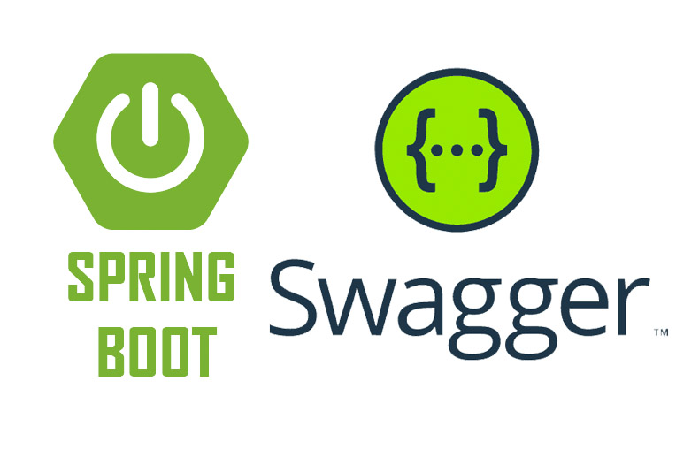

- [13. CORS y Documentación API](#13-cors-y-documentación-api)
  - [13.2. Documentación con Swagger y OpenAPI](#132-documentación-con-swagger-y-openapi)
      - [13.2.1. Documentando nuestros endpoints](#1321-documentando-nuestros-endpoints)
      - [13.2.2. Documentando nuestras entidades, modelos o DTOs](#1322-documentando-nuestras-entidades-modelos-o-dtos)
  - [13.3. Práctica de clase: Swagger y OpenAPI](#133-práctica-de-clase-swagger-y-openapi)
  - [13.4. Proyecto del curso](#134-proyecto-del-curso)



📝 **Nota del Profesor**
> La documentación API con Swagger/OpenAPI es esencial para que otros desarrolladores puedan consumir tu API. Siempre documenta tus endpoints.

💡 **Tip del Examinador**
> En el examen valoran saber qué es CORS y cómo configurarlo. Es un tema frecuente.

---

# 13. CORS y Documentación API

Los navegadores web implementan una política de seguridad llamada [Cross-Origin Resource Sharing](https://developer.mozilla.org/es/docs/Web/Security/Same-origin_policy), que impide que una página web pueda acceder a recursos de otro dominio. Por ejemplo, si tenemos una página web en el dominio `https://www.midominio.com`, no podremos acceder a recursos de otro dominio, como por ejemplo `https://www.otrodominio.com`. Esto es así por seguridad, para evitar que una página web pueda acceder a recursos de otro dominio sin nuestro consentimiento.

CORS (Cross-Origin Resource Sharing) es un mecanismo de seguridad implementado en los navegadores web para controlar las solicitudes HTTP entre diferentes dominios o recursos de origen cruzado. En términos más sencillos, CORS permite que un servidor especifique a qué dominios o recursos externos se les permite acceder a sus recursos.

Cuando un navegador realiza una solicitud HTTP a un dominio diferente al del sitio web actual, el navegador normalmente bloquea la respuesta debido a las políticas de seguridad del mismo origen. CORS proporciona una forma de superar esta restricción y permite que los navegadores realicen solicitudes a recursos de origen cruzado de manera controlada.

La importancia de CORS radica en la seguridad y la protección de los datos del usuario. Sin CORS, un sitio web malicioso podría realizar solicitudes a recursos en otros dominios sin restricciones, lo que podría conducir a ataques de suplantación de identidad (CSRF) y la exposición de información sensible.

Al habilitar y configurar CORS correctamente en el servidor, se puede controlar qué dominios o recursos externos tienen permiso para acceder a los recursos del servidor. Esto permite que los sitios web legítimos accedan a los recursos necesarios mientras se protege contra posibles ataques de seguridad.

En resumen, CORS es un mecanismo de seguridad que permite controlar y permitir el acceso a recursos de origen cruzado en los navegadores web. Su importancia radica en la protección de datos y la prevención de ataques maliciosos. Al implementar y configurar CORS adecuadamente, puedes garantizar que solo los dominios o recursos autorizados tengan acceso a tus recursos del servidor.

Aquí tienes algunos ejemplos que ilustran la importancia de CORS:

- Protección contra ataques CSRF (Cross-Site Request Forgery): Supongamos que tienes un sitio web donde los usuarios inician sesión y realizan acciones sensibles, como cambiar la contraseña o realizar transacciones financieras. Si no se implementa CORS correctamente, un atacante podría crear un sitio web malicioso y engañar a los usuarios para que visiten ese sitio mientras están autenticados en tu sitio legítimo. El sitio malicioso podría enviar solicitudes falsificadas a tu servidor en nombre del usuario, realizando acciones no deseadas. Al habilitar CORS y configurarlo adecuadamente, puedes evitar que los sitios no autorizados realicen solicitudes a tus recursos, protegiendo así a tus usuarios contra ataques CSRF.
- Compartir recursos entre dominios: CORS también es útil cuando deseas compartir recursos entre diferentes dominios. Por ejemplo, si tienes una API REST en un dominio y deseas permitir que una aplicación web en otro dominio acceda a esos recursos, puedes habilitar CORS para permitir solicitudes desde el dominio de la aplicación web. Esto permite que la aplicación web consuma datos o servicios de tu API de manera segura y controlada.
- Acceso a recursos de terceros: CORS también es relevante cuando tu sitio web necesita acceder a recursos de terceros, como una API de redes sociales o un servicio de mapas. Sin CORS, el navegador bloquearía las solicitudes a esos recursos debido a las políticas de seguridad del mismo origen. Al configurar CORS correctamente, puedes permitir que tu sitio web acceda a esos recursos externos y proporcione una experiencia rica e integrada para tus usuarios.

```java
@Configuration
public class CorsConfig {
    /**
     * CORS: Configuración más ajustada.
     */
    @Bean
    public WebMvcConfigurer corsConfigurer() {
        return new WebMvcConfigurer() {

            @Override
            // Ajustamos una configuración específica para cada serie de métodos
            // Así por cada fuente podemos permitir lo que queremos
            // Por ejemplo ene esta configuración solo permitirmos el dominio producto
            // Permitimos solo un dominio
            // e indicamos los verbos que queremos usar
            // Debes probar con uncliente desde ese puerto
            public void addCorsMappings(CorsRegistry registry) {
                registry.addMapping("/rest/producto/**")
                        //.allowedOrigins("http://localhost:6980")
                        .allowedMethods("GET", "POST", "PUT", "DELETE")
                        .maxAge(3600);
            }

        };
    }
}
```

## 13.2. Documentación con Swagger y OpenAPI
OpenAPI es una especificación para describir APIs REST. Swagger es una herramienta que nos permite generar documentación de APIs REST a partir de la especificación OpenAPI. 
- [OpenAPI](https://www.openapis.org/): OpenAPI Specification (anteriormente conocido como Swagger Specification) es una especificación de lenguaje agnóstico y basado en JSON o YAML que describe una API RESTful. Proporciona una forma estándar de describir la estructura de las solicitudes y respuestas, los parámetros, los esquemas de datos, las operaciones disponibles y otra información relevante de una API.
La especificación OpenAPI permite a los desarrolladores y equipos de desarrollo documentar, diseñar y construir APIs de manera consistente y colaborativa. Además, facilita la generación automática de documentación interactiva, la creación de clientes y servidores de API, y la validación y prueba de la API.
- [Swagger](https://swagger.io/): Swagger es una suite de herramientas de código abierto que se utiliza para diseñar, construir, documentar y consumir APIs RESTful basadas en la especificación OpenAPI. Swagger proporciona un conjunto de bibliotecas y herramientas que permiten a los desarrolladores generar automáticamente documentación interactiva, generar clientes de API en varios lenguajes de programación y realizar pruebas de API.
Swagger incluye componentes clave, como Swagger UI (una interfaz de usuario interactiva para visualizar y probar API), Swagger Editor (un editor en línea para escribir y validar la especificación OpenAPI) y Swagger Codegen (una herramienta para generar clientes y servidores de API a partir de la especificación OpenAPI).

Para ello, debemos añadir la [dependencia de Swagger en nuestro proyecto](https://springdoc.org/#Introduction):

```kotlin
implementation("org.springdoc:springdoc-openapi-starter-webmvc-ui:2.2.0")
```

El primer paso es configurar Swagger en nuestra aplicación. Para ello, debemos crear una clase de configuración, añadirle los metadatos de Swagger e indicar los endpoints que queremos documentar. Por ejemplo:

```java
@Configuration
class SwaggerConfig {
    @Bean
    OpenAPI apiInfo() {
        return new OpenAPI()
                .info(
                        new Info()
                                .title("API REST Tenistas Spring Boot 2023")
                                .version("1.0.0")
                                .description("API de ejemplo del curso Desarrollo de un API REST con Spring Boot para Profesores/as. 2022/2023")
                                .termsOfService("https://joseluisgs.dev/docs/license/")
                                .license(
                                        new License()
                                                .name("CC BY-NC-SA 4.0")
                                                .url("https://joseluisgs.dev/docs/license/")
                                )
                                .contact(
                                        new Contact()
                                                .name("José Luis González Sánchez")
                                                .email("joseluis.gonzales@iesluisvives.org")
                                                .url("https://joseluisgs.dev")
                                )

                )
                .externalDocs(
                        new ExternalDocumentation()
                                .description("Repositorio y Documentación del Proyecto y API")
                                .url("https://github.com/joseluisgs/tenistas-rest-springboot-2022-2023")
                );
    }


    @Bean
    GroupedOpenApi httpApi() {
        return GroupedOpenApi.builder()
                .group("http")
                //.pathsToMatch("/api/**") // Todas las rutas
                .pathsToMatch("/api/tenistas/**") 
                //.pathsToMatch("/api/test/**")
                .displayName("HTTP-API Tenistas Test")
                .build();
    }
}
```

Finalmente podemos acceder a la ruta en: http://localhost:XXXX/swagger-ui/index.html (XXXX es el puerto de nuestra aplicación). Por ejemplo: http://localhost:3000/swagger-ui/index.html

***NOTA***: No olvides abrir el endpoint de Swagger en el fichero de configuración de Spring Security.

```java
 // Abrimos a Swagger
.requestMatchers("/swagger-ui/**", "/v3/api-docs/**").permitAll()
```

#### 13.2.1. Documentando nuestros endpoints
Para ello usaremos las anotaciones
- `@Operation`: Para documentar un método
- `@Parameter`: Para documentar un parámetro o `@Parameters` para documentar varios parámetros
- `@RequestBody`: Para documentar el cuerpo de una petición
- `@ApiResponse`: Para documentar una respuesta o `@ApiResponses` para documentar varias respuestas

Un ejemplo de documentación de un método:

```java
/**
     * Actualizar un producto
     *
     * @param id                    del producto a actualizar, se pasa como parámetro de la URL /{id}
     * @param productoUpdateRequest a actualizar
     * @return Producto actualizado
     * @throws ProductoNotFound                    si no existe el producto (404)
     * @throws HttpClientErrorException.BadRequest si el producto no es correcto (400)
     */
    @Operation(summary = "Actualiza un producto", description = "Actualiza un producto")
    @Parameters({
            @Parameter(name = "id", description = "Identificador del producto", example = "1", required = true)
    })
    @io.swagger.v3.oas.annotations.parameters.RequestBody(description = "Producto a actualizar", required = true)
    @ApiResponses(value = {
            @ApiResponse(responseCode = "200", description = "Producto actualizado"),
            @ApiResponse(responseCode = "400", description = "Producto no válido"),
            @ApiResponse(responseCode = "404", description = "Producto no encontrado"),
    })
    @PutMapping("/{id}")
    @PreAuthorize("hasRole('ADMIN')") // Solo los administradores pueden acceder
    public ResponseEntity<ProductoResponse> updateProduct(@PathVariable Long id, @Valid @RequestBody ProductoUpdateRequest productoUpdateRequest) {
        log.info("Actualizando producto por id: " + id + " con producto: " + productoUpdateRequest);
        return ResponseEntity.ok(productosService.update(id, productoUpdateRequest));
    } );
}
```

#### 13.2.2. Documentando nuestras entidades, modelos o DTOs
Para ello usaremos la anotación `@Schema`:

```java
/**
 * Modelo de datos de un producto
 */
@Data
@NoArgsConstructor
@AllArgsConstructor
@Builder
@Schema(description = "Modelo de datos de un producto")
public class ProductoResponse {
    @Schema(description = "Identificador del producto", example = "1", required = true)
    private Long id;
    @Schema(description = "Nombre del producto", example = "Producto 1", required = true)
    private String nombre;
    @Schema(description = "Descripción del producto", example = "Descripción del producto 1", required = true)
    private String descripcion;
    @Schema(description = "Precio del producto", example = "10.0", required = true)
    private Double precio;
    @Schema(description = "Fecha de creación del producto", example = "2021-09-01T00:00:00.000Z", required = true)
    private Date fechaCreacion;
    @Schema(description = "Fecha de actualización del producto", example = "2021-09-01T00:00:00.000Z", required = true)
    private Date fechaActualizacion;
}
```

Finalmente entrando en la ruta de Swagger podemos ver la documentación de nuestros endpoints.


## 13.3. Práctica de clase: Swagger y OpenAPI
1. Configura Swagger en tu proyecto
2. Documenta los modelos, DTOs y endpoints de tu API para el endpoint de funkos.

## 13.4. Proyecto del curso
Puedes encontrar el proyecto con lo visto hasta este punto en la etiqueta: [v.0.0.9 del repositorio del curso: documentacion_swagger](https://github.com/joseluisgs/DesarrolloWebEntornosServidor-02-Proyecto-SpringBoot/releases/tag/documentacion_swagger).

