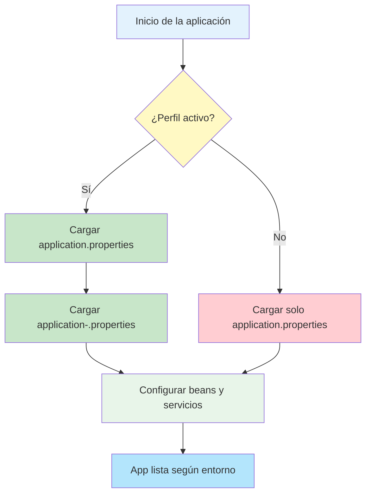

- [14. Perfiles de Spring Boot](#14-perfiles-de-spring-boot)
  - [14.1. ¿Qué son los perfiles en Spring Boot?](#141-qué-son-los-perfiles-en-spring-boot)
    - [14.1.1. ¿Por qué usar perfiles?](#1411-por-qué-usar-perfiles)
    - [14.1.2. ¿Cómo funcionan los perfiles?](#1412-cómo-funcionan-los-perfiles)
    - [14.1.3. Activación de perfiles](#1413-activación-de-perfiles)
    - [14.1.4. Uso de anotaciones con perfiles](#1414-uso-de-anotaciones-con-perfiles)
    - [14.1.5. Buenas prácticas](#1415-buenas-prácticas)
  - [14.2. Ejemplo didáctico](#142-ejemplo-didáctico)
  - [Práctica de clase: Perfiles y configuración de entorno](#práctica-de-clase-perfiles-y-configuración-de-entorno)


📝 **Nota del Profesor**
> Los perfiles permiten configurar diferentes comportamientos para desarrollo, pruebas y producción. Es fundamental para el despliegue.

💡 **Tip del Examinador**
> Usa variables de entorno para la configuración de producción. Nunca almacenes contraseñas en el código.

---

# 14. Perfiles de Spring Boot
Podemos definir perfiles de Spring Boot para que se ejecuten en función del entorno en el que se encuentre la aplicación. Por ejemplo, podemos tener un perfil para desarrollo y otro para producción. Para ello, debemos crear un fichero de propiedades para cada perfil, con el nombre `application-{nombre_perfil}.properties`. Por ejemplo, si tenemos un perfil de desarrollo, el fichero se llamará `application-dev.properties`. En este fichero, podemos definir las propiedades que queramos, que sobreescribirán a las definidas en el fichero `application.properties`. Para activar un perfil, debemos añadir la propiedad `spring.profiles.active={nombre_perfil}` en el fichero `application.properties`. Si no se define esta propiedad, se ejecutará el perfil por defecto, que es el que no tiene nombre.

De esta manera podemos tener distintos perfiles para distintos entornos, y que se ejecuten en función de la propiedad `spring.profiles.active`.

Por ejemplo, si tenemos el siguiente fichero `application.properties`:

```properties
# PERFIL GLOBAL
## Puerto de la aplicaci�n
# (si has activado https, es por defecto el del SSL)
# Tomamos el puerto de la variable de entorno PORT
server.port=${PORT:6983}
## INDICAMOS EL PERFIL ACTIVO
#Indicamos el perfil por defecto (Base de datos y otros)
# dev: developmet. application-dev.properties
# prod: production. application-prod.properties
spring.profiles.active=dev
```
Y el siguiente fichero `application-dev.properties`:

```properties
# PERFIL DE DESARROLLO
# Por ejemplo vamos a meter la base de datos
## Base de datos de desarrollo
# En fichero embebida o en memoria, t� eliges
# spring.datasource.url=jdbc:h2:./productosapirest
spring.datasource.url=jdbc:h2:mem:raquetas
# Usuario y contrase�a de la base de datos
spring.datasource.username=sa
#spring.datasource.password=password
# Habilitamos la consola de H2
http=//localhost:{server.port}/h2-console
# En nuestro caso http://localhost:69680/h2-console
spring.h2.console.enabled=true
# Habilitamos los mensajes sql en el log para ver las consultas
spring.jpa.show-sql=true
# Habilitamos que cargue los datos de prueba en la base de datos
# estos datos los carga del fichero data.sql del directorio resources
spring.jpa.defer-datasource-initialization=true
spring.jpa.hibernate.ddl-auto=create-drop
spring.sql.init.mode=always
spring.jpa.database-platform=org.hibernate.dialect.H2Dialect
```

Y tener el siguiente fichero `application-prod.properties`:

```properties
# PERFIL DE PRODUCCION
# Por ejemplo vamos a meter la base de datos
spring.datasource.url=jdbc:mysql://localhost:3306/raquetas
spring.datasource.username=root
spring.datasource.password=password
# Driver y opciones
spring.jpa.properties.hibernate.dialect=org.hibernate.dialect.MySQL5Dialect
spring.jpa.hibernate.ddl-auto=update
```

Podemos cambiar el perfil llamando a la aplicación con el parámetro `--spring.profiles.active={nombre_perfil}`. Por ejemplo, si queremos ejecutar el perfil de producción, ejecutaremos la aplicación de la siguiente manera:

```bash
java -jar productosapirest-0.0.1-SNAPSHOT.jar --spring.profiles.active=prod
```

## 14.1. ¿Qué son los perfiles en Spring Boot?

Los perfiles en Spring Boot permiten definir diferentes configuraciones y comportamientos para distintos entornos (desarrollo, test, producción, integración continua, etc.). Esto es esencial para adaptar la aplicación a las necesidades de cada entorno sin modificar el código fuente.

### 14.1.1. ¿Por qué usar perfiles?
- **Separación de entornos:** Permite tener configuraciones específicas para cada entorno (por ejemplo, usar una base de datos en memoria en desarrollo y una real en producción).
- **Seguridad:** Evita exponer datos sensibles (como contraseñas) en entornos de desarrollo.
- **Flexibilidad:** Facilita el despliegue y la automatización, ya que puedes cambiar el comportamiento de la app solo cambiando el perfil activo.

### 14.1.2. ¿Cómo funcionan los perfiles?
- Spring Boot carga primero `application.properties` (o `application.yml`).
- Si hay un perfil activo, carga también `application-{perfil}.properties` y sobreescribe las propiedades que coincidan.
- Puedes tener tantos perfiles como necesites: `dev`, `test`, `prod`, `ci`, etc.

### 14.1.3. Activación de perfiles
- **Por fichero:** Añadiendo `spring.profiles.active=dev` en `application.properties`.
- **Por línea de comandos:**
  ```bash
  java -jar app.jar --spring.profiles.active=prod
  ```
- **Por variable de entorno:**
  ```bash
  export SPRING_PROFILES_ACTIVE=prod
  ```

### 14.1.4. Uso de anotaciones con perfiles
Puedes usar la anotación `@Profile` para indicar que un bean solo debe crearse en un perfil concreto:

```java
@Service
@Profile("dev")
public class DevMailService implements MailService {
    // Solo se crea si el perfil activo es dev
}
```

Esto es útil para definir implementaciones alternativas de servicios según el entorno.

### 14.1.5. Buenas prácticas
- Nunca subas a producción ficheros de configuración con contraseñas o datos sensibles de desarrollo.
- Usa variables de entorno para datos críticos en producción.
- Documenta qué perfiles existen y para qué sirve cada uno.

---

## 14.2. Ejemplo didáctico
Supón que tienes una aplicación que necesita conectarse a una base de datos y enviar emails. Puedes tener:
- Un perfil `dev` que usa H2 y un servicio de email simulado.
- Un perfil `prod` que usa MySQL y un servicio de email real.

Así puedes probar todo en local sin riesgos y luego desplegar seguro en producción.

---

## Práctica de clase: Perfiles y configuración de entorno
1. Configura los perfiles de desarrollo y producción de tu servicio
2. Configura Swagger para que se ejecute en el perfil de desarrollo



*Diagrama: Flujo de carga de perfiles y configuración en Spring Boot.*
