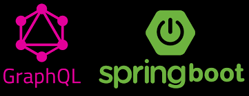
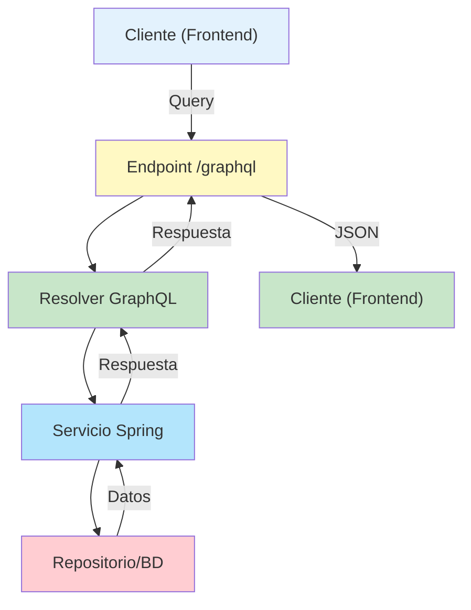

- [16. GraphQL en Spring Boot](#16-graphql-en-spring-boot)
  - [16.1. ¿Qué es GraphQL? ¿Por qué es especial?](#161-qué-es-graphql-por-qué-es-especial)
    - [16.1.1. Ventajas y Características](#1611-ventajas-y-características)
    - [16.1.2. Comparación con REST](#1612-comparación-con-rest)
  - [16.2. Sintaxis básica de GraphQL](#162-sintaxis-básica-de-graphql)
    - [16.2.1. Elementos del esquema](#1621-elementos-del-esquema)
    - [16.2.2. Tipos soportados](#1622-tipos-soportados)
    - [16.2.3. Ejemplo de sintaxis](#1623-ejemplo-de-sintaxis)
  - [16.3. Instalación y configuración en Spring Boot](#163-instalación-y-configuración-en-spring-boot)
    - [16.3.1. Dependencias Gradle](#1631-dependencias-gradle)
    - [16.3.2. Configuración básica](#1632-configuración-básica)
  - [16.4. Definiendo el esquema GraphQL](#164-definiendo-el-esquema-graphql)
    - [16.4.1. Esquema de ejemplo: Producto y Categoría (queries, mutaciones y suscripciones)](#1641-esquema-de-ejemplo-producto-y-categoría-queries-mutaciones-y-suscripciones)
  - [16.5. Ejemplo de Controlador GraphQL en Spring Boot (queries, mutaciones y suscripciones)](#165-ejemplo-de-controlador-graphql-en-spring-boot-queries-mutaciones-y-suscripciones)
    - [16.5.1. ¿Cómo funciona la suscripción?](#1651-cómo-funciona-la-suscripción)
  - [16.6. Ejemplos de consultas, mutaciones y suscripciones](#166-ejemplos-de-consultas-mutaciones-y-suscripciones)
    - [16.6.1. Obtener todos los productos con su categoría](#1661-obtener-todos-los-productos-con-su-categoría)
    - [16.6.2. Crear un producto](#1662-crear-un-producto)
    - [16.6.3. Actualizar un producto](#1663-actualizar-un-producto)
    - [16.6.4. Eliminar un producto](#1664-eliminar-un-producto)
    - [16.6.5. Consulta de una categoría y sus productos](#1665-consulta-de-una-categoría-y-sus-productos)
    - [16.6.6. Ejemplo de suscripción (en el playground o Apollo Client)](#1666-ejemplo-de-suscripción-en-el-playground-o-apollo-client)
  - [16.7. Consejos y buenas prácticas](#167-consejos-y-buenas-prácticas)
  - [16.8. Ejercicio propuesto: API GraphQL de Funkos](#168-ejercicio-propuesto-api-graphql-de-funkos)
    - [16.8.1. Requisitos](#1681-requisitos)
  - [16.9. Diagrama didáctico: Flujo de una consulta GraphQL](#169-diagrama-didáctico-flujo-de-una-consulta-graphql)
  - [16.10. Resumen didáctico](#1610-resumen-didáctico)
  - [16.11. Recursos y enlaces útiles](#1611-recursos-y-enlaces-útiles)



📝 **Nota del Profesor**
> GraphQL es una alternativa a REST que permite al cliente solicitar exactamente los datos que necesita. Es ideal para aplicaciones móviles y SPA.

💡 **Tip del Examinador**
> GraphQL usa "queries" para leer y "mutations" para escribir, similar a GET y POST en REST.

---


# 16. GraphQL en Spring Boot


## 16.1. ¿Qué es GraphQL? ¿Por qué es especial?

**GraphQL** es un lenguaje de consulta para APIs y un entorno de ejecución para tus datos. Fue creado por Facebook en 2012 y liberado en 2015.


### 16.1.1. Ventajas y Características

- **Consulta flexible:** El cliente pide exactamente los datos que necesita.
- **Un solo endpoint:** Se accede siempre a `/graphql`.
- **Tipo fuerte:** El esquema define los tipos y validaciones.
- **Consultas anidadas y relaciones:** Puedes obtener objetos relacionados y jerarquía de datos en una sola petición.
- **Introspección:** El cliente puede explorar el esquema y autocompletar queries desde el playground.
- **Mutaciones:** Permite modificar datos de forma estructurada y tipada.
- **Suscripciones:** Permite recibir notificaciones en tiempo real (como WebSockets).
- **Evolución sin versionado:** El esquema puede crecer sin romper clientes antiguos.


### 16.1.2. Comparación con REST

| REST             | GraphQL                               |
| ---------------- | ------------------------------------- |
| Múltiples URLs   | Un solo endpoint                      |
| Respuestas fijas | El cliente elige los campos           |
| Overfetching     | Solo lo que pides                     |
| Underfetching    | Consultas anidadas y relaciones       |
| Versionado       | No es necesario, evoluciona el schema |
| Difícil de tipar | Tipado fuerte y validación automática |

---


## 16.2. Sintaxis básica de GraphQL


### 16.2.1. Elementos del esquema

- **type**: Define un objeto (como una clase Java).
- **input**: Define tipos de entrada para mutaciones.
- **enum**: Un conjunto finito de valores posibles.
- **Query**: Operaciones de lectura.
- **Mutation**: Operaciones de escritura (crear, modificar, borrar).
- **Subscription**: Operaciones en tiempo real (push de eventos).
- **interface**: Contrato que deben implementar varios tipos.
- **union**: Un campo puede ser uno de varios tipos.


### 16.2.2. Tipos soportados

- **Escalares**:  
  - `Int` (número entero)
  - `Float` (número decimal)
  - `String` (texto)
  - `Boolean` (true/false)
  - `ID` (identificador único, string o int)
- **Enum**: Enumerados.
- **Objetos**: Definidos con `type`.
- **Listas**: `[Tipo]`  
  Ejemplo: `[Producto!]!` (lista obligatoria de productos obligatorios)
- **Campos obligatorios**: `!`  
  Ejemplo: `nombre: String!` (el campo no puede ser nulo)
- **Campos opcionales**: sin `!`  
  Ejemplo: `descripcion: String`
- **Relaciones**: Un campo puede ser otro tipo o una lista de otro tipo.


### 16.2.3. Ejemplo de sintaxis

```graphql
type Producto {
    id: ID!
    nombre: String!
    precio: Float!
    categoria: Categoria!
    etiquetas: [String!]! # lista obligatoria de strings obligatorios
}

type Categoria {
    id: ID!
    nombre: String!
    productos: [Producto!]!
}
```

- `[Producto!]!` significa:
    - Lista no nula (`!` al final)
    - De elementos no nulos (`!` tras el tipo)
    - Es decir: la lista siempre existe y no puede tener elementos nulos.

---


## 16.3. Instalación y configuración en Spring Boot


### 16.3.1. Dependencias Gradle

```kotlin
implementation("org.springframework.boot:spring-boot-starter-graphql")
implementation("org.springframework.boot:spring-boot-starter-web") // Para playground web
implementation("org.springframework.boot:spring-boot-starter-webflux") // Para suscripciones (opcional, pero necesario si usas Subscription)
```


### 16.3.2. Configuración básica

En `src/main/resources/application.properties`:

```properties
spring.graphql.graphiql.enabled=true         # Activa el playground web
spring.graphql.graphiql.path=/graphiql       # Ruta del playground
spring.graphql.path=/graphql                 # Ruta del endpoint principal
```

---


## 16.4. Definiendo el esquema GraphQL

El esquema se escribe en un archivo:  
`src/main/resources/graphql/schema.graphqls`


### 16.4.1. Esquema de ejemplo: Producto y Categoría (queries, mutaciones y suscripciones)

```graphql
# ==== TIPOS ====
type Producto {
    id: ID!
    nombre: String!
    precio: Float!
    stock: Int!
    categoria: Categoria!
}

type Categoria {
    id: ID!
    nombre: String!
    productos: [Producto!]!
}

# ==== TIPOS DE ENTRADA PARA MUTACIONES ====
input ProductoInput {
    nombre: String!
    precio: Float!
    stock: Int!
    categoriaId: ID!
}

input CategoriaInput {
    nombre: String!
}

# ==== QUERIES ====
type Query {
    productos: [Producto!]!
    productoById(id: ID!): Producto
    categorias: [Categoria!]!
    categoriaById(id: ID!): Categoria
}

# ==== MUTACIONES ====
type Mutation {
    crearProducto(input: ProductoInput!): Producto!
    actualizarProducto(id: ID!, input: ProductoInput!): Producto!
    eliminarProducto(id: ID!): Boolean!

    crearCategoria(input: CategoriaInput!): Categoria!
    actualizarCategoria(id: ID!, input: CategoriaInput!): Categoria!
    eliminarCategoria(id: ID!): Boolean!
}

# ==== SUSCRIPCIONES (notificaciones en tiempo real) ====
type Subscription {
    # Notifica cuando se crea un producto
    productoCreado: Producto!
    # Notifica cuando se actualiza un producto
    productoActualizado: Producto!
    # Notifica cuando se elimina un producto
    productoEliminado: ID!
}
```

---


## 16.5. Ejemplo de Controlador GraphQL en Spring Boot (queries, mutaciones y suscripciones)

*Recuerda: los servicios y repositorios ya existen. Aquí solo resolvers y lógica GraphQL.*

```java
package com.ejemplo.demo.graphql;

import com.ejemplo.demo.model.Producto;
import com.ejemplo.demo.model.Categoria;
import com.ejemplo.demo.service.ProductoService;
import com.ejemplo.demo.service.CategoriaService;
import org.springframework.beans.factory.annotation.Autowired;
import org.springframework.graphql.data.method.annotation.*;
import org.springframework.stereotype.Controller;
import reactor.core.publisher.Flux;
import reactor.core.publisher.Sinks;

import java.util.List;

@Controller
public class ProductoCategoriaGraphQLController {

    private final ProductoService productoService;
    private final CategoriaService categoriaService;

    // Sinks para suscripciones en tiempo real
    private final Sinks.Many<Producto> productoCreadoSink = Sinks.many().multicast().onBackpressureBuffer();
    private final Sinks.Many<Producto> productoActualizadoSink = Sinks.many().multicast().onBackpressureBuffer();
    private final Sinks.Many<Long> productoEliminadoSink = Sinks.many().multicast().onBackpressureBuffer();

    @Autowired
    public ProductoCategoriaGraphQLController(ProductoService productoService, CategoriaService categoriaService) {
        this.productoService = productoService;
        this.categoriaService = categoriaService;
    }

    // === Queries ===
    @QueryMapping
    public List<Producto> productos() {
        return productoService.findAll();
    }

    @QueryMapping
    public Producto productoById(@Argument Long id) {
        return productoService.findById(id).orElse(null);
    }

    @QueryMapping
    public List<Categoria> categorias() {
        return categoriaService.findAll();
    }

    @QueryMapping
    public Categoria categoriaById(@Argument Long id) {
        return categoriaService.findById(id).orElse(null);
    }

    // === Mutaciones ===
    @MutationMapping
    public Producto crearProducto(@Argument ProductoInput input) {
        Producto producto = productoService.save(input);
        productoCreadoSink.tryEmitNext(producto); // Notifica a suscriptores
        return producto;
    }

    @MutationMapping
    public Producto actualizarProducto(@Argument Long id, @Argument ProductoInput input) {
        Producto producto = productoService.update(id, input);
        productoActualizadoSink.tryEmitNext(producto); // Notifica a suscriptores
        return producto;
    }

    @MutationMapping
    public Boolean eliminarProducto(@Argument Long id) {
        productoService.deleteById(id);
        productoEliminadoSink.tryEmitNext(id); // Notifica a suscriptores
        return true;
    }

    @MutationMapping
    public Categoria crearCategoria(@Argument CategoriaInput input) {
        return categoriaService.save(input);
    }

    @MutationMapping
    public Categoria actualizarCategoria(@Argument Long id, @Argument CategoriaInput input) {
        return categoriaService.update(id, input);
    }

    @MutationMapping
    public Boolean eliminarCategoria(@Argument Long id) {
        categoriaService.deleteById(id);
        return true;
    }

    // === Suscripciones ===
    @SubscriptionMapping
    public Flux<Producto> productoCreado() {
        return productoCreadoSink.asFlux();
    }

    @SubscriptionMapping
    public Flux<Producto> productoActualizado() {
        return productoActualizadoSink.asFlux();
    }

    @SubscriptionMapping
    public Flux<Long> productoEliminado() {
        return productoEliminadoSink.asFlux();
    }
}
```


### 16.5.1. ¿Cómo funciona la suscripción?
- Cada vez que se crea, actualiza o elimina un producto, se emite una notificación.
- Los clientes suscritos (por ejemplo, desde el playground o desde una app usando Apollo Client) reciben el evento en tiempo real.
- Para usar suscripciones necesitas tener configurado WebFlux y usar el playground o cliente compatible con WebSocket.

---


## 16.6. Ejemplos de consultas, mutaciones y suscripciones


### 16.6.1. Obtener todos los productos con su categoría
```graphql
query {
  productos {
    id
    nombre
    precio
    categoria {
      id
      nombre
    }
  }
}
```


### 16.6.2. Crear un producto
```graphql
mutation {
  crearProducto(input: {
    nombre: "Raqueta Pro",
    precio: 120.5,
    stock: 10,
    categoriaId: "1"
  }) {
    id
    nombre
    precio
    categoria {
      nombre
    }
  }
}
```


### 16.6.3. Actualizar un producto
```graphql
mutation {
  actualizarProducto(id: "1", input: {
    nombre: "Raqueta Ultra Pro",
    precio: 150.0,
    stock: 20,
    categoriaId: "1"
  }) {
    id
    nombre
    precio
  }
}
```


### 16.6.4. Eliminar un producto
```graphql
mutation {
  eliminarProducto(id: "1")
}
```


### 16.6.5. Consulta de una categoría y sus productos
```graphql
query {
  categoriaById(id: "1") {
    id
    nombre
    productos {
      id
      nombre
      precio
    }
  }
}
```


### 16.6.6. Ejemplo de suscripción (en el playground o Apollo Client)

```graphql
subscription {
  productoCreado {
    id
    nombre
    precio
  }
}
```

Al ejecutar esta suscripción, cualquier cliente conectado recibirá en tiempo real el producto que se cree en el sistema.

---


## 16.7. Consejos y buenas prácticas

- Usa tipos `input` para mutaciones: más claro, extensible y tipado.
- Las relaciones se muestran como campos de otro tipo o listas.
- Usa el autocompletado y la introspección del playground: ayuda mucho a descubrir el esquema.
- Valida los datos en los resolvers; GraphQL valida tipos, pero no lógica de negocio.
- Añade comentarios en el esquema, los clientes los verán en la documentación automática.
- Si tienes muchas entidades, añade paginación y filtros.
- Las suscripciones requieren WebFlux y configuración especial, pero son potentes para tiempo real.
- Recuerda: `[Tipo!]!` -> lista no nula de elementos no nulos; `!` indica campo obligatorio.

---


## 16.8. Ejercicio propuesto: API GraphQL de Funkos

**Enunciado:**

Crea una API GraphQL para gestionar una colección de Funkos y sus categorías.


### 16.8.1. Requisitos

1. **Entidades**:
    - Funko: id, nombre, precio, stock, imagen, categoría.
    - Categoria: id, nombre, lista de funkos.
2. **Operaciones**:
    - Queries para obtener todos los funkos, un funko por id, todas las categorías, una categoría por id, los funkos de una categoría.
    - Mutaciones para crear, actualizar y borrar funkos y categorías.
    - Suscripciones para notificar cuando se crea un funko.
3. **Relaciones**:
    - Cada Funko pertenece a una categoría.
    - Cada categoría puede tener muchos Funkos.
4. **Extras** (opcional):
    - Añadir paginación.
    - Permitir buscar funkos por nombre o por rango de precio.
    - Validaciones (por ejemplo: precio > 0, stock >= 0).
    - Documentar el esquema con comentarios.
5. **Entrega**:
    - Implementa el schema en `schema.graphqls`.
    - Implementa los resolvers en el controlador (puedes asumir que los servicios y repositorios ya existen).
    - Incluye ejemplos de queries, mutaciones y suscripciones en un archivo markdown de ejemplos.
    - (Opcional) Añade tests automatizados para los resolvers.


---


## 16.9. Diagrama didáctico: Flujo de una consulta GraphQL



*Diagrama: Flujo de una consulta GraphQL en Spring Boot.*


## 16.10. Resumen didáctico

- **GraphQL** permite a los clientes pedir exactamente los datos que necesitan, optimizando el tráfico y la experiencia.
- El endpoint `/graphql` centraliza todas las operaciones (queries, mutaciones, suscripciones).
- Los resolvers son responsables de transformar las peticiones en llamadas a servicios y repositorios.
- El uso de suscripciones permite notificaciones en tiempo real.
- Spring Boot integra GraphQL de forma sencilla y productiva.

---

## 16.11. Recursos y enlaces útiles

- [Documentación oficial de GraphQL](https://graphql.org/learn/)
- [Spring Boot GraphQL Reference](https://docs.spring.io/spring-graphql/docs/current/reference/html/)
- [Ejemplo de Playground online](https://graphqlbin.com/v2/new)
- [Ejemplo avanzado de API GraphQL con Spring Boot](https://github.com/spring-projects/spring-graphql-samples)

