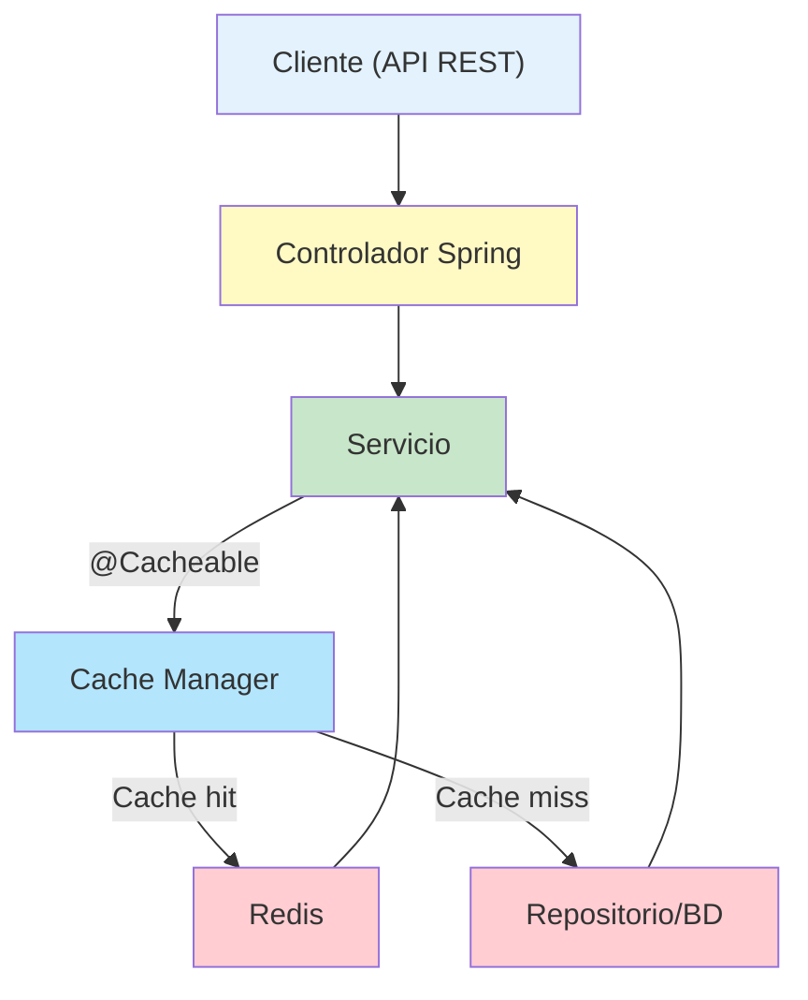

- [17. Redis con Spring Boot](#17-redis-con-spring-boot)
  - [17.1. Introducción](#171-introducción)
    - [17.1.1. ¿Qué es Redis?](#1711-qué-es-redis)
    - [17.1.2. ¿Para qué se usa Redis?](#1712-para-qué-se-usa-redis)
    - [17.1.3. ¿Por qué usar Redis como caché?](#1713-por-qué-usar-redis-como-caché)
      - [17.1.3.1. Ventajas de Redis vs Caché en memoria local:](#17131-ventajas-de-redis-vs-caché-en-memoria-local)
  - [17.2. Configuración Inicial del Proyecto](#172-configuración-inicial-del-proyecto)
    - [17.2.1. Dependencias de Gradle](#1721-dependencias-de-gradle)
    - [17.2.2. Variables de entorno](#1722-variables-de-entorno)
  - [17.3. Configuración de Docker](#173-configuración-de-docker)
    - [17.3.1. Docker Compose para Desarrollo](#1731-docker-compose-para-desarrollo)
    - [17.3.2. Docker Compose para Producción](#1732-docker-compose-para-producción)
  - [17.4. Configuración de Spring Boot](#174-configuración-de-spring-boot)
    - [17.4.1. Configuración para Desarrollo](#1741-configuración-para-desarrollo)
  - [17.5. Configuración Avanzada (Opcional)](#175-configuración-avanzada-opcional)
    - [17.5.1. Clase de Configuración Java](#1751-clase-de-configuración-java)
    - [17.5.2. Uso en los Servicios](#1752-uso-en-los-servicios)
  - [17.6. Monitoreo y Logs](#176-monitoreo-y-logs)
    - [17.6.1. Configuración de Logs](#1761-configuración-de-logs)
    - [17.6.2. Ejemplo de Logs](#1762-ejemplo-de-logs)
    - [17.6.3. Herramientas de Monitoreo](#1763-herramientas-de-monitoreo)
  - [17.7. Ejecución y Pruebas](#177-ejecución-y-pruebas)
    - [17.7.1. Levantar el entorno](#1771-levantar-el-entorno)
    - [17.7.2. Probar la aplicación](#1772-probar-la-aplicación)
    - [17.7.3. Verificar funcionamiento](#1773-verificar-funcionamiento)
  - [17.8. Resumen de Beneficios](#178-resumen-de-beneficios)
    - [17.8.1. ✅ Lo que conseguimos](#1781--lo-que-conseguimos)
    - [17.8.2. ⚡ Mejoras de rendimiento esperadas](#1782--mejoras-de-rendimiento-esperadas)
    - [17.8.3. 🎯 Casos de uso ideales para Redis](#1783--casos-de-uso-ideales-para-redis)
  - [17.9. Conclusión](#179-conclusión)
  - [17.10. Diagrama didáctico: Arquitectura de caché con Redis](#1710-diagrama-didáctico-arquitectura-de-caché-con-redis)
  - [17.11. Resumen didáctico](#1711-resumen-didáctico)
  - [17.12. Ejercicio propuesto: Redis para Funkos](#1712-ejercicio-propuesto-redis-para-funkos)


📝 **Nota del Profesor**
> Redis es una base de datos en memoria extremadamente rápida. Se usa principalmente como caché y para datos que requieren acceso ultrarrápido.

💡 **Tip del Examinador**
> Redis es ideal para sesiones, caché de API, y contadores en tiempo real. Conoce sus tipos de datos: String, Hash, List, Set, Sorted Set.

---

# 17. Redis con Spring Boot
 


## 17.1. Introducción

### 17.1.1. ¿Qué es Redis?

**Redis** (Remote Dictionary Server) es una base de datos NoSQL en memoria de código abierto que funciona como almacén de estructuras de datos clave-valor. Es extremadamente rápida ya que mantiene todos los datos en memoria RAM.

### 17.1.2. ¿Para qué se usa Redis?

Redis se utiliza principalmente para:

- **🚀 Caché de aplicaciones**: Almacenar datos frecuentemente accedidos
- **📦 Almacenamiento de datos en memoria**: Para acceso rápido y compartido entre servicios
- **📊 Sesiones de usuario**: Mantener estado de sesiones web
- **📈 Contadores en tiempo real**: Likes, visitas, estadísticas
- **🔔 Pub/Sub**: Sistema de mensajería
- **⏰ Datos temporales**: Con TTL (Time To Live)
- **🎯 Colas de tareas**: Para procesamiento asíncrono

### 17.1.3. ¿Por qué usar Redis como caché?

#### 17.1.3.1. Ventajas de Redis vs Caché en memoria local:

| Aspecto           | Caché Local (Simple)     | Redis                         |
| ----------------- | ------------------------ | ----------------------------- |
| **Persistencia**  | ❌ Se pierde al reiniciar | ✅ Persiste datos              |
| **Escalabilidad** | ❌ Una instancia          | ✅ Múltiples instancias        |
| **Memoria**       | ❌ Limitada por JVM       | ✅ Memoria dedicada            |
| **TTL**           | ❌ Básico                 | ✅ Avanzado y flexible         |
| **Distribución**  | ❌ No compartida          | ✅ Compartida entre apps       |
| **Monitoreo**     | ❌ Limitado               | ✅ Herramientas especializadas |

---

## 17.2. Configuración Inicial del Proyecto

### 17.2.1. Dependencias de Gradle

Añade las dependencias necesarias en tu `build.gradle.kts`:

```kotlin
dependencies {
    // Caché base de Spring Boot
    implementation("org.springframework.boot:spring-boot-starter-cache")
    
    // Redis para Spring Boot
    implementation("org.springframework.boot:spring-boot-starter-data-redis")
}
```

### 17.2.2. Variables de entorno

Configura tu archivo `.env` con las variables de Redis:

```bash
# Redis Configuration
REDIS_HOST=redis-db
REDIS_PORT=6379
REDIS_PASSWORD=redisPassword123
REDIS_DATABASE=0
REDIS_SSL=false
REDIS_TIMEOUT=3000
REDIS_POOL_MAX_ACTIVE=20
REDIS_POOL_MAX_IDLE=10
REDIS_POOL_MIN_IDLE=5
```

---

## 17.3. Configuración de Docker

### 17.3.1. Docker Compose para Desarrollo

Archivo `docker-compose-dev.yml` con datos temporales:

```yaml
services:
  
  # Redis (sin persistencia para desarrollo)
  redis-db:
    container_name: tienda-db_redis
    image: redis:7-alpine
    restart: always
    env_file: .env
    command: redis-server --requirepass ${REDIS_PASSWORD}
    ports:
      - ${REDIS_PORT}:6379
    networks:
      - tienda-network
    
  # Redis Commander para administración web
  redis-commander:
    container_name: tienda-db_redis-commander
    image: rediscommander/redis-commander:latest
    restart: always
    env_file: .env
    ports:
      - 8082:8081
    environment:
      REDIS_HOSTS: local:redis-db:${REDIS_PORT}:${REDIS_DATABASE}:${REDIS_PASSWORD}
    depends_on:
      - redis-db
    networks:
      - tienda-network

networks:
  tienda-network:
    driver: bridge
```

### 17.3.2. Docker Compose para Producción

Archivo `docker-compose.yml` con persistencia:

```yaml
# Lo necesario para ejecutar la aplicación en producción
services:
  # Redis (con persistencia para producción)
  redis-db:
    container_name: tienda-db_redis
    image: redis:7-alpine
    restart: always
    env_file: .env
    command: redis-server --requirepass ${REDIS_PASSWORD} --appendonly yes
    ports:
      - ${REDIS_PORT}:6379
    volumes:
      - redis-data:/data
    networks:
      - tienda-network
# Volúmenes para persistencia de datos
volumes:
  redis-data:

# Red para conectar los contenedores
networks:
  tienda-network:
    driver: bridge
```

---

## 17.4. Configuración de Spring Boot

### 17.4.1. Configuración para Desarrollo

Archivo `application-dev.properties`:

```properties
# PERFIL DE DESARROLLO
## CACHE
# Configuración de caché en memoria para desarrollo
spring.cache.type=simple
#spring.cache.cache-names=categorias,pedidos,productos,users
# Logging de caché para desarrollo (ver qué se cachea)
logging.level.org.springframework.cache=DEBUG
logging.level.es.joseluisgs.tienda=DEBUG


### 17.4.2. Configuración para Producción

Archivo `application-prod.properties`:

```properties
# PERFIL DE PRODUCCION
## REDIS CACHE
# Configuración de Redis para producción
spring.cache.type=redis
spring.data.redis.host=${REDIS_HOST:localhost}
spring.data.redis.port=${REDIS_PORT:6379}
spring.data.redis.password=${REDIS_PASSWORD:}
spring.data.redis.database=${REDIS_DATABASE:0}
spring.data.redis.timeout=${REDIS_TIMEOUT:3000ms}
# Pool de conexiones Redis
spring.data.redis.lettuce.pool.max-active=${REDIS_POOL_MAX_ACTIVE:20}
spring.data.redis.lettuce.pool.max-idle=${REDIS_POOL_MAX_IDLE:10}
spring.data.redis.lettuce.pool.min-idle=${REDIS_POOL_MIN_IDLE:5}
spring.data.redis.lettuce.pool.max-wait=2000ms
# Cachés predefinidos
# spring.cache.cache-names=categorias,pedidos,productos,users
# Logging de caché para producción (menos verbose)
logging.level.org.springframework.cache=WARN
```

---

## 17.5. Configuración Avanzada (Opcional)

### 17.5.1. Clase de Configuración Java

> **NOTA**: Esta clase es **OPCIONAL** si ya tienes la configuración en `application.properties`. Solo es útil si necesitas TTL específicos por caché.

```java

/**
 * Configuración de caché por perfiles
 * 
 * OPCIONAL: Solo necesaria si quieres TTL específicos por caché
 * Sin esta clase, la configuración de application.properties es suficiente
 * 
 * @author joseluisgs
 * @since 2025-10-21
 */
@Configuration
@EnableCaching
public class CacheConfig {

    /**
     * Caché en memoria para desarrollo
     * TTL por defecto (sin expiración)
     * Este bean se activa solo en el perfil "dev"
     * No es necesario configurar TTL aquí ya que es caché simple
     * Todo se maneja en memoria local
     * podríamos suprimir esta clase y usar solo application-dev.properties
     */
    @Bean
    @Profile("dev")
    public CacheManager devCacheManager() {
      // Caché simple en memoria de los que hemos puesto en cache-names de los servicios
        return new ConcurrentMapCacheManager("categorias", "pedidos", "productos", "users");
    }

    /**
     * Redis para producción con TTL específicos por servicio
     */
    @Bean
    @Profile("prod")
    public RedisCacheManager prodCacheManager(RedisConnectionFactory connectionFactory) {
        // Clave en String y valor serializado en JSON
        RedisCacheConfiguration defaultConfig = RedisCacheConfiguration.defaultCacheConfig()
            .serializeKeysWith(RedisSerializationContext.SerializationPair
                .fromSerializer(new StringRedisSerializer()))
            .serializeValuesWith(RedisSerializationContext.SerializationPair
                .fromSerializer(new GenericJackson2JsonRedisSerializer()));

        // TTL específicos para cada servicio
        Map<String, RedisCacheConfiguration> cacheConfigurations = Map.of(
            // Categorías: TTL largo (24 horas) - casi nunca cambian
            "categorias", defaultConfig.entryTtl(Duration.ofHours(24)),
            
            // Usuarios: TTL medio (2 horas) - cambian ocasionalmente
            "users", defaultConfig.entryTtl(Duration.ofHours(2)),
            
            // Productos: TTL medio (1 hora) - cambian regularmente
            "productos", defaultConfig.entryTtl(Duration.ofHours(1)),
            
            // Pedidos: TTL corto (30 minutos) - cambian frecuentemente
            "pedidos", defaultConfig.entryTtl(Duration.ofMinutes(30))
        );

        return RedisCacheManager.builder(connectionFactory)
            .cacheDefaults(defaultConfig.entryTtl(Duration.ofHours(1)))
            .withInitialCacheConfigurations(cacheConfigurations)
            .build();
    }
}
```

### 17.5.2. Uso en los Servicios

Las anotaciones de caché funcionan igual independientemente del proveedor:

```java
@Service
@CacheConfig(cacheNames = {"users"})
@Slf4j
public class UsuarioService {

    @Cacheable(key = "#id")
    public Usuario findById(Long id) {
        log.info("🔍 Buscando usuario con ID: {} (si ves esto, NO viene de caché)", id);
        return usuarioRepository.findById(id);
    }

    @CacheEvict(key = "#id")
    public void deleteById(Long id) {
        usuarioRepository.deleteById(id);
    }

    @CachePut(key = "#usuario.id")
    public Usuario save(Usuario usuario) {
        return usuarioRepository.save(usuario);
    }
}
```

```java
@Service
@CacheConfig(cacheNames = {"categorias"})
public class CategoriaService {
    // Tus métodos con @Cacheable, @CacheEvict, etc.
}

@Service
@CacheConfig(cacheNames = {"productos"})
public class ProductoService {
    // Tus métodos con @Cacheable, @CacheEvict, etc.
}

@Service
@CacheConfig(cacheNames = {"pedidos"})
public class PedidoService {
    // Tus métodos con @Cacheable, @CacheEvict, etc.
}
```

---

## 17.6. Monitoreo y Logs

### 17.6.1. Configuración de Logs

Para ver si los datos vienen de caché, configura el logging en `application.properties`:

```properties
# Para desarrollo - ver hits/miss de caché
logging.level.org.springframework.cache=DEBUG
logging.level.es.joseluisgs.tienda=DEBUG

# Pattern personalizado para mejor visualización
logging.pattern.console=%d{HH:mm:ss.SSS} [%thread] %-5level %logger{36} - %msg%n
```

### 17.6.2. Ejemplo de Logs

```bash
# Cache hit (viene de caché)
14:20:18.123 DEBUG o.s.cache.interceptor.CacheInterceptor - Cache hit: key 'users::1' for cache(s) [users]

# Cache miss (va a base de datos)
14:20:25.456 DEBUG o.s.cache.interceptor.CacheInterceptor - Cache miss: key 'users::2' for cache(s) [users] 
14:20:25.457 INFO  es.joseluisgs.tienda.service - 🔍 Buscando usuario con ID: 2 (NO viene de caché)
```

### 17.6.3. Herramientas de Monitoreo

- **Desarrollo**: Redis Commander en `http://localhost:8082`
- **Producción**: Integrar con herramientas como Redis Insight o monitoring de Spring Boot Actuator

---

## 17.7. Ejecución y Pruebas

### 17.7.1. Levantar el entorno

```bash
# Desarrollo
docker-compose -f docker-compose-dev.yml up -d

# Producción  
docker-compose up -d
```

### 17.7.2. Probar la aplicación

```bash
# Desarrollo con caché en memoria
mvn spring-boot:run -Dspring-boot.run.profiles=dev

# Producción con Redis
mvn spring-boot:run -Dspring-boot.run.profiles=prod
```

### 17.7.3. Verificar funcionamiento

1. **Primera consulta**: Debería ir a BD y guardar en caché
2. **Segunda consulta**: Debería venir de caché (más rápida)
3. **Logs**: Deberían mostrar "Cache hit" vs "Cache miss"

---

## 17.8. Resumen de Beneficios

### 17.8.1. ✅ Lo que conseguimos

- **🔄 Fácil migración**: Solo cambios en configuración
- **🏃‍♂️ Mayor rendimiento**: Datos en memoria ultra-rápidos
- **📈 Escalabilidad**: Redis compartido entre múltiples instancias
- **⏰ Control de TTL**: Datos expiran automáticamente
- **🔧 Flexibilidad**: Diferentes configuraciones por entorno
- **📊 Monitoreo**: Herramientas visuales para gestionar caché

### 17.8.2. ⚡ Mejoras de rendimiento esperadas

- **Consultas de BD**: De ~100ms a ~1ms
- **APIs REST**: Respuesta 10-100x más rápida para datos cacheados
- **Carga del servidor**: Reducción significativa de consultas a BD

### 17.8.3. 🎯 Casos de uso ideales para Redis

- **Datos que se leen mucho y cambian poco**: Categorías, configuraciones
- **Sesiones de usuario**: Mantener estado entre requests
- **Resultados de consultas complejas**: Reportes, estadísticas
- **APIs externas**: Cachear respuestas de servicios externos

---

## 17.9. Conclusión

Con esta configuración tienes:

- **Desarrollo**: Caché simple para pruebas rápidas
- **Producción**: Redis robusto y escalable
- **Código**: Sin cambios en tu lógica de negocio
- **Monitoring**: Logs detallados para troubleshooting

La migración de caché en memoria a Redis es transparente para tu aplicación, pero ofrece beneficios significativos en rendimiento, escalabilidad y funcionalidades avanzadas.


## 17.10. Diagrama didáctico: Arquitectura de caché con Redis




*Diagrama: Arquitectura de caché con Redis en Spring Boot.*

## 17.11. Resumen didáctico

- Redis permite acelerar el acceso a datos mediante almacenamiento en memoria.
- El uso de anotaciones como `@Cacheable` y `@CacheEvict` facilita la integración.
- Spring Boot permite cambiar de caché local a Redis solo con configuración.
- El monitoreo y logs ayudan a verificar el funcionamiento y rendimiento.

---
## 17.12. Ejercicio propuesto: Redis para Funkos
Implementa caché con Redis para el servicio de Funkos en tu aplicación solo en el modo de producción. Configura TTL adecuados para los datos de Funkos y verifica mediante logs que las consultas se están sirviendo desde Redis después de la primera carga.