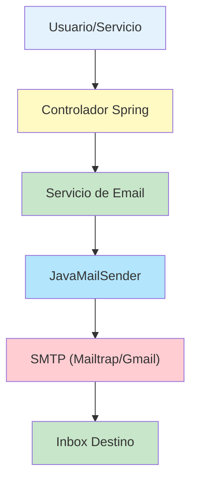

- [18. Servicios de Email con Spring Boot](#18-servicios-de-email-con-spring-boot)
  - [18.1. ¿Por qué necesitamos un servicio de email?](#181-por-qué-necesitamos-un-servicio-de-email)
    - [18.1.1. Casos de uso comunes](#1811-casos-de-uso-comunes)
    - [18.1.2. Beneficios](#1812-beneficios)
  - [18.2. Configuración inicial](#182-configuración-inicial)
    - [18.2.1. Dependencia en build.gradle.kts](#1821-dependencia-en-buildgradlekts)
    - [18.2.2. Variables de entorno (.env)](#1822-variables-de-entorno-env)
    - [18.2.3. Configuración en application.properties](#1823-configuración-en-applicationproperties)
      - [18.2.3.1. Desarrollo (con Mailtrap)](#18231-desarrollo-con-mailtrap)
      - [18.2.3.2. Producción (con Gmail)](#18232-producción-con-gmail)
  - [18.3. Configuración de Mailtrap para desarrollo](#183-configuración-de-mailtrap-para-desarrollo)
    - [18.3.1. ¿Qué es Mailtrap?](#1831-qué-es-mailtrap)
    - [18.3.2. Ventajas de Mailtrap](#1832-ventajas-de-mailtrap)
    - [18.3.3. Cómo configurar Mailtrap](#1833-cómo-configurar-mailtrap)
      - [18.3.3.1. Paso 1: Crear cuenta](#18331-paso-1-crear-cuenta)
      - [18.3.3.2. Paso 2: Crear un inbox](#18332-paso-2-crear-un-inbox)
      - [18.3.3.3. Paso 3: Obtener credenciales](#18333-paso-3-obtener-credenciales)
      - [18.3.3.4. Paso 4: Configurar en tu aplicación](#18334-paso-4-configurar-en-tu-aplicación)
  - [18.4. Arquitectura del servicio](#184-arquitectura-del-servicio)
    - [18.4.1. Patrón de diseño utilizado](#1841-patrón-de-diseño-utilizado)
    - [18.4.2. ¿Por qué esta arquitectura?](#1842-por-qué-esta-arquitectura)
  - [18.5. Implementación paso a paso](#185-implementación-paso-a-paso)
    - [18.5.1. Paso 1: Interfaz genérica de Email](#1851-paso-1-interfaz-genérica-de-email)
    - [18.5.2. Paso 2: Implementación del servicio genérico](#1852-paso-2-implementación-del-servicio-genérico)
    - [18.5.3. Paso 3: Servicio específico para pedidos](#1853-paso-3-servicio-específico-para-pedidos)
    - [18.5.4. Paso 4: Implementación con templates HTML](#1854-paso-4-implementación-con-templates-html)
  - [18.6. Integración con el servicio de pedidos](#186-integración-con-el-servicio-de-pedidos)
    - [18.6.1. Inyección de dependencia](#1861-inyección-de-dependencia)
    - [18.6.2. Envío asíncrono con Thread](#1862-envío-asíncrono-con-thread)
  - [18.7. Testing con Mailtrap](#187-testing-con-mailtrap)
    - [18.7.1. ¿Cómo probar nuestro servicio de emails?](#1871-cómo-probar-nuestro-servicio-de-emails)
    - [18.7.2. Paso 1: Configurar el entorno de desarrollo](#1872-paso-1-configurar-el-entorno-de-desarrollo)
    - [18.7.3. Paso 2: Crear un pedido de prueba](#1873-paso-2-crear-un-pedido-de-prueba)
    - [18.7.4. Paso 3: Probar el endpoint](#1874-paso-3-probar-el-endpoint)
    - [18.7.5. Paso 4: Verificar en Mailtrap](#1875-paso-4-verificar-en-mailtrap)
      - [18.7.5.1. ¿Qué puedes hacer en Mailtrap?](#18751-qué-puedes-hacer-en-mailtrap)
    - [18.7.6. Paso 5: Logs de seguimiento](#1876-paso-5-logs-de-seguimiento)
    - [18.7.7. Escenarios de prueba adicionales](#1877-escenarios-de-prueba-adicionales)
      - [18.7.7.1. Probar diferentes tipos de email](#18771-probar-diferentes-tipos-de-email)
      - [18.7.7.2. Probar manejo de errores](#18772-probar-manejo-de-errores)
    - [18.7.8. ¿Qué verificar en Mailtrap?](#1878-qué-verificar-en-mailtrap)
  - [18.8. Manejo de errores y buenas prácticas](#188-manejo-de-errores-y-buenas-prácticas)
    - [18.8.1. Principio de "Fail gracefully"](#1881-principio-de-fail-gracefully)
    - [18.8.2. Logging detallado](#1882-logging-detallado)
    - [18.8.3. Configuración por entornos](#1883-configuración-por-entornos)
  - [18.9. Debugging común](#189-debugging-común)
    - [18.9.1. Problema 1: "No beans of type JavaMailSender"](#1891-problema-1-no-beans-of-type-javamailsender)
    - [18.9.2. Problema 2: "Mail server connection failed"](#1892-problema-2-mail-server-connection-failed)
    - [18.9.3. Problema 3: "Email no aparece en Mailtrap"](#1893-problema-3-email-no-aparece-en-mailtrap)
    - [18.9.4. Problema 4: "Thread no se ejecuta"](#1894-problema-4-thread-no-se-ejecuta)
  - [18.10. Resumen de beneficios implementados](#1810-resumen-de-beneficios-implementados)
    - [18.10.1. Lo que hemos conseguido](#18101-lo-que-hemos-conseguido)
    - [18.10.2. Flujo completo implementado](#18102-flujo-completo-implementado)
    - [18.10.3. Casos de testing cubiertos](#18103-casos-de-testing-cubiertos)
  - [18.11. Próximos pasos recomendados](#1811-próximos-pasos-recomendados)
    - [18.11.1. Para el curso](#18111-para-el-curso)
    - [18.11.2. Para producción](#18112-para-producción)
  - [18.12. Práctica de clase](#1812-práctica-de-clase)
  - [18.13. Diagrama didáctico: Flujo de envío de emails](#1813-diagrama-didáctico-flujo-de-envío-de-emails)
  - [18.14. Resumen didáctico](#1814-resumen-didáctico)
    - [18.14.1. Recursos adicionales](#18141-recursos-adicionales)


📝 **Nota del Profesor**
> El servicio de email es esencial para notificaciones, recuperación de contraseña y confirmación de registro. Spring Boot facilita su implementación.

💡 **Tip del Examinador**
> Usa emails asíncronos para no bloquear las peticiones HTTP. Configura Mailtrap para desarrollo y servicios reales para producción.

---

# 18. Servicios de Email con Spring Boot
Los servicios de email son fundamentales en muchas aplicaciones web para enviar notificaciones, confirmaciones de pedidos, restablecimiento de contraseñas, entre otros. En esta sección, aprenderemos a configurar y utilizar un servicio de email en una aplicación Spring Boot.


---

## 18.1. ¿Por qué necesitamos un servicio de email?

### 18.1.1. Casos de uso comunes
- ✅ **Confirmación de pedidos** (nuestro caso)
- 🔐 **Verificación de cuentas**
- 🔄 **Recuperación de contraseñas**
- 📊 **Notificaciones de estado**
- 📈 **Reportes automáticos**

### 18.1.2. Beneficios
- **Mejor experiencia de usuario**: El cliente recibe confirmación inmediata
- **Profesionalidad**: Emails bien formateados dan confianza
- **Trazabilidad**: Registro de todas las comunicaciones
- **Automatización**: Reduce trabajo manual del equipo

---

## 18.2. Configuración inicial

### 18.2.1. Dependencia en build.gradle.kts

```kotlin
dependencies {
    implementation("org.springframework.boot:spring-boot-starter-mail")
    // ... otras dependencias
}
```

**¿Por qué esta dependencia?**
- Incluye todas las librerías necesarias para enviar emails
- Proporciona auto-configuración de Spring Boot
- Incluye soporte para JavaMail API

### 18.2.2. Variables de entorno (.env)

```bash
# Email Configuration - DESARROLLO con Mailtrap
MAIL_HOST=sandbox.smtp.mailtrap.io
MAIL_PORT=2525
MAIL_USERNAME=tu-mailtrap-username
MAIL_PASSWORD=tu-mailtrap-password
MAIL_FROM=noreply@tienda.dev

# Email Configuration - PRODUCCIÓN con Gmail (comentado)
# MAIL_HOST=smtp.gmail.com
# MAIL_PORT=587
# MAIL_USERNAME=tu-email@gmail.com
# MAIL_PASSWORD=tu-app-password-de-gmail
# MAIL_FROM=noreply@tienda.com
```

**¿Por qué usar variables de entorno?**
- **Seguridad**: No exponer credenciales en el código
- **Flexibilidad**: Diferentes configuraciones por entorno
- **Buenas prácticas**: Separar configuración del código

### 18.2.3. Configuración en application.properties

#### 18.2.3.1. Desarrollo (con Mailtrap)
```properties
## EMAIL CONFIGURATION - DESARROLLO CON MAILTRAP
spring.mail.host=${MAIL_HOST:sandbox.smtp.mailtrap.io}
spring.mail.port=${MAIL_PORT:2525}
spring.mail.username=${MAIL_USERNAME:}
spring.mail.password=${MAIL_PASSWORD:}
# Mailtrap no requiere autenticación SSL/TLS
spring.mail.properties.mail.smtp.auth=true
spring.mail.properties.mail.smtp.starttls.enable=false
spring.mail.properties.mail.smtp.ssl.enable=false
spring.mail.properties.mail.debug=true

# Email desde donde se envían los correos
app.mail.from=${MAIL_FROM:noreply@tienda.dev}

# Logging para emails en desarrollo
logging.level.org.springframework.mail=DEBUG
logging.level.es.joseluisgs.tienda.services.email=DEBUG
```

#### 18.2.3.2. Producción (con Gmail)
```properties
## EMAIL CONFIGURATION - PRODUCCIÓN CON GMAIL
spring.mail.host=${MAIL_HOST:smtp.gmail.com}
spring.mail.port=${MAIL_PORT:587}
spring.mail.username=${MAIL_USERNAME:}
spring.mail.password=${MAIL_PASSWORD:}
spring.mail.properties.mail.smtp.auth=true
spring.mail.properties.mail.smtp.starttls.enable=true
spring.mail.properties.mail.smtp.connectiontimeout=5000
spring.mail.properties.mail.smtp.timeout=3000
spring.mail.properties.mail.smtp.writetimeout=5000
spring.mail.properties.mail.debug=false

app.mail.from=${MAIL_FROM:noreply@tienda.com}
logging.level.org.springframework.mail=WARN
```

---

## 18.3. Configuración de Mailtrap para desarrollo

### 18.3.1. ¿Qué es Mailtrap?

Mailtrap es un **servicio de testing de emails** que intercepta todos los emails enviados desde tu aplicación y los muestra en una interfaz web, **sin enviarlos realmente**.

### 18.3.2. Ventajas de Mailtrap

- **🛡️ Seguro**: No envía emails reales por error
- **👀 Visual**: Interfaz web para ver todos los emails
- **📱 Responsive testing**: Previsualización en diferentes dispositivos
- **🆓 Gratuito**: Plan gratuito suficiente para desarrollo
- **🔍 Debugging**: Headers, HTML, texto plano todo visible
- **⚡ Rápido**: Setup en menos de 5 minutos

### 18.3.3. Cómo configurar Mailtrap

#### 18.3.3.1. Paso 1: Crear cuenta
1. Ve a [mailtrap.io](https://mailtrap.io/)
2. Crea una cuenta gratuita
3. Verifica tu email

#### 18.3.3.2. Paso 2: Crear un inbox
1. En el dashboard, clic en **"Add Inbox"**
2. Ponle nombre: `Tienda-Dev`
3. Selecciona el plan gratuito

#### 18.3.3.3. Paso 3: Obtener credenciales
1. Entra en tu inbox creado
2. Ve a la pestaña **"SMTP Settings"**
3. Selecciona **"Spring Boot"** en el dropdown
4. Copia las credenciales:

```
Host: sandbox.smtp.mailtrap.io
Port: 2525
Username: [tu-username]
Password: [tu-password]
```

#### 18.3.3.4. Paso 4: Configurar en tu aplicación
Actualiza tu archivo `.env`:

```bash
# Mailtrap Configuration
MAIL_HOST=sandbox.smtp.mailtrap.io
MAIL_PORT=2525
MAIL_USERNAME=a1b2c3d4e5f6g7    # El que te da Mailtrap
MAIL_PASSWORD=h8i9j0k1l2m3n4    # El que te da Mailtrap
MAIL_FROM=noreply@tienda.dev
```

---

## 18.4. Arquitectura del servicio

### 18.4.1. Patrón de diseño utilizado
```
PedidosController → PedidosService → PedidoEmailService → EmailService → JavaMailSender → Mailtrap
       ↓                ↓                 ↓                ↓             ↓            ↓
     HTTP         Lógica de        Emails de       Envío       Protocolo    Inbox de
                  pedidos         pedidos        genérico       SMTP       desarrollo
```

### 18.4.2. ¿Por qué esta arquitectura?

1. **Separación de responsabilidades**: Cada capa tiene una función específica
2. **Testabilidad**: Podemos testear cada componente por separado
3. **Reutilización**: El servicio de email se puede usar en otros lugares
4. **Mantenibilidad**: Cambios en el email no afectan la lógica de negocio

---

## 18.5. Implementación paso a paso

### 18.5.1. Paso 1: Interfaz genérica de Email

```java name=EmailService.java
package es.joseluisgs.tienda.services.email;

public interface EmailService {
    /**
     * Envía un email simple (texto plano)
     */
    void sendSimpleEmail(String to, String subject, String body);
    
    /**
     * Envía un email con HTML
     */
    void sendHtmlEmail(String to, String subject, String htmlBody);
}
```

**¿Por qué una interfaz?**
- **Abstracción**: El cliente no necesita saber cómo se implementa
- **Flexibilidad**: Podemos cambiar la implementación sin afectar el código cliente
- **Testing**: Podemos crear mocks fácilmente
- **Principios SOLID**: Dependency Inversion Principle

### 18.5.2. Paso 2: Implementación del servicio genérico

```java name=EmailServiceImpl.java
package es.joseluisgs.tienda.services.email.impl;

import es.joseluisgs.tienda.services.email.EmailService;
import jakarta.mail.MessagingException;
import org.slf4j.Logger;
import org.slf4j.LoggerFactory;
import org.springframework.beans.factory.annotation.Value;
import org.springframework.mail.SimpleMailMessage;
import org.springframework.mail.javamail.JavaMailSender;
import org.springframework.mail.javamail.MimeMessageHelper;
import org.springframework.stereotype.Service;

@Service
public class EmailServiceImpl implements EmailService {
    
    private final Logger logger = LoggerFactory.getLogger(EmailServiceImpl.class);
    private final JavaMailSender mailSender; // Spring lo inyecta automáticamente
    private final String fromEmail;
    
    public EmailServiceImpl(JavaMailSender mailSender, 
                           @Value("${app.mail.from:noreply@tienda.dev}") String fromEmail) {
        this.mailSender = mailSender;
        this.fromEmail = fromEmail;
    }
    
    @Override
    public void sendSimpleEmail(String to, String subject, String body) {
        try {
            logger.info("📧 Enviando email simple a: {}", to);
            
            SimpleMailMessage message = new SimpleMailMessage();
            message.setTo(to);
            message.setSubject(subject);
            message.setText(body);
            message.setFrom(fromEmail);
            
            mailSender.send(message);
            logger.info("✅ Email simple enviado correctamente a: {}", to);
            
        } catch (Exception e) {
            logger.error("❌ Error enviando email simple a {}: {}", to, e.getMessage(), e);
            throw new RuntimeException("Error enviando email: " + e.getMessage(), e);
        }
    }
    
    @Override
    public void sendHtmlEmail(String to, String subject, String htmlBody) {
        try {
            logger.info("📧 Enviando email HTML a: {}", to);
            
            var message = mailSender.createMimeMessage();
            var helper = new MimeMessageHelper(message, true, "UTF-8");
            
            helper.setTo(to);
            helper.setSubject(subject);
            helper.setText(htmlBody, true); // true = es HTML
            helper.setFrom(fromEmail);
            
            mailSender.send(message);
            logger.info("✅ Email HTML enviado correctamente a: {}", to);
            
        } catch (MessagingException e) {
            logger.error("❌ Error enviando email HTML a {}: {}", to, e.getMessage(), e);
            throw new RuntimeException("Error enviando email HTML: " + e.getMessage(), e);
        }
    }
}
```

**Puntos clave:**
- **JavaMailSender**: Spring Boot lo autoconfigura basándose en las propiedades
- **@Value**: Inyecta el valor de configuración
- **Logging con emojis**: Para debugging y monitoreo más visual
- **Exception handling**: Convierte excepciones checked en unchecked

### 18.5.3. Paso 3: Servicio específico para pedidos

```java name=PedidoEmailService.java
package es.joseluisgs.tienda.services.email;

import es.joseluisgs.tienda.models.Pedido;

/**
 * Servicio para el envío de emails relacionados con pedidos
 */
public interface PedidoEmailService {
    
    /**
     * Envía email de confirmación de pedido en HTML simple
     * @param pedido El pedido para el cual enviar la confirmación
     */
    void enviarConfirmacionPedido(Pedido pedido);
    
    /**
     * Envía email de confirmación de pedido en formato HTML completo
     * @param pedido El pedido para el cual enviar la confirmación
     */
    void enviarConfirmacionPedidoHtml(Pedido pedido);
}
```

**¿Por qué un servicio específico?**
- **Single Responsibility**: Se encarga solo de emails de pedidos
- **Reutilización**: Puede usarse desde diferentes partes de la aplicación
- **Mantenibilidad**: Cambios en el formato de emails no afectan otros servicios

### 18.5.4. Paso 4: Implementación con templates HTML

```java name=PedidoEmailServiceImpl.java
package es.joseluisgs.tienda.services.email.impl;

import es.joseluisgs.tienda.models.Pedido;
import es.joseluisgs.tienda.services.email.EmailService;
import es.joseluisgs.tienda.services.email.PedidoEmailService;
import org.slf4j.Logger;
import org.slf4j.LoggerFactory;
import org.springframework.stereotype.Service;

import java.text.NumberFormat;
import java.time.format.DateTimeFormatter;
import java.util.Locale;
import java.util.stream.Collectors;

@Service
public class PedidoEmailServiceImpl implements PedidoEmailService {
    
    private final Logger logger = LoggerFactory.getLogger(PedidoEmailServiceImpl.class);
    private final EmailService emailService;
    
    public PedidoEmailServiceImpl(EmailService emailService) {
        this.emailService = emailService;
    }
    
    @Override
    public void enviarConfirmacionPedido(Pedido pedido) {
        try {
            logger.info("📧 Enviando confirmación HTML simple de pedido {} al cliente {}", 
                       pedido.get_id(), pedido.getCliente().getEmail());
            
            String subject = "Confirmación de tu pedido #" + pedido.get_id();
            String htmlBody = crearCuerpoEmailPedidoHtmlSimple(pedido);
            
            emailService.sendHtmlEmail(
                pedido.getCliente().getEmail(),
                subject,
                htmlBody
            );
            
            logger.info("✅ Email HTML simple de confirmación enviado correctamente para el pedido {}", pedido.get_id());
            
        } catch (Exception e) {
            logger.error("❌ Error enviando email de confirmación para el pedido {}: {}", 
                        pedido.get_id(), e.getMessage());
        }
    }
    
    @Override
    public void enviarConfirmacionPedidoHtml(Pedido pedido) {
        try {
            logger.info("📧 Enviando confirmación HTML completa de pedido {} al cliente {}", 
                       pedido.get_id(), pedido.getCliente().getEmail());
            
            String subject = "✅ Confirmación de tu pedido #" + pedido.get_id();
            String htmlBody = crearCuerpoEmailPedidoHtmlCompleto(pedido);
            
            emailService.sendHtmlEmail(
                pedido.getCliente().getEmail(),
                subject,
                htmlBody
            );
            
            logger.info("✅ Email HTML completo de confirmación enviado correctamente para el pedido {}", pedido.get_id());
            
        } catch (Exception e) {
            logger.error("❌ Error enviando email HTML de confirmación para el pedido {}: {}", 
                        pedido.get_id(), e.getMessage());
        }
    }
    
    /**
     * Crea el cuerpo del email en HTML simple
     */
    private String crearCuerpoEmailPedidoHtmlSimple(Pedido pedido) {
        DateTimeFormatter formatter = DateTimeFormatter.ofPattern("dd/MM/yyyy HH:mm");
        NumberFormat currencyFormatter = NumberFormat.getCurrencyInstance(new Locale("es", "ES"));
        
        String lineasPedidoHtml = pedido.getLineasPedido().stream()
            .map(linea -> String.format("""
                <li>
                    <strong>Producto ID:</strong> %d | 
                    <strong>Cantidad:</strong> %d | 
                    <strong>Precio:</strong> %s | 
                    <strong>Total:</strong> %s
                </li>
                """,
                linea.getIdProducto(),
                linea.getCantidad(),
                currencyFormatter.format(linea.getPrecioProducto()),
                currencyFormatter.format(linea.getTotal())))
            .collect(Collectors.joining(""));
        
        return String.format("""
            <!DOCTYPE html>
            <html lang="es">
            <head>
                <meta charset="UTF-8">
                <meta name="viewport" content="width=device-width, initial-scale=1.0">
                <title>Confirmación de Pedido</title>
            </head>
            <body style="font-family: Arial, sans-serif; line-height: 1.6; color: #333; margin: 0; padding: 20px;">
                <div style="max-width: 600px; margin: 0 auto;">
                    
                    <h1 style="color: #4CAF50; text-align: center;">¡Pedido Confirmado! 🎉</h1>
                    
                    <p><strong>¡Hola %s!</strong></p>
                    <p>Tu pedido ha sido confirmado y está siendo procesado.</p>
                    
                    <hr style="border: 1px solid #ddd; margin: 20px 0;">
                    
                    <h2 style="color: #4CAF50;">📝 Información del Pedido</h2>
                    <ul>
                        <li><strong>Número:</strong> #%s</li>
                        <li><strong>Fecha:</strong> %s</li>
                        <li><strong>Estado:</strong> <span style="color: #4CAF50;">Confirmado</span></li>
                    </ul>
                    
                    <h2 style="color: #4CAF50;">👤 Datos del Cliente</h2>
                    <ul>
                        <li><strong>Nombre:</strong> %s</li>
                        <li><strong>Email:</strong> %s</li>
                        <li><strong>Teléfono:</strong> %s</li>
                    </ul>
                    
                    <h2 style="color: #4CAF50;">🚚 Dirección de Entrega</h2>
                    <p>
                        %s, %s<br>
                        %s %s<br>
                        %s, %s
                    </p>
                    
                    <h2 style="color: #4CAF50;">🛒 Detalles del Pedido</h2>
                    <ul>
                        %s
                    </ul>
                    
                    <div style="background-color: #4CAF50; color: white; padding: 15px; text-align: center; border-radius: 5px; margin: 20px 0;">
                        <h3 style="margin: 0;">Total de artículos: %d | TOTAL: %s</h3>
                    </div>
                    
                    <p><strong>🕐 Tu pedido será procesado en las próximas 24-48 horas.</strong></p>
                    <p>📧 Te mantendremos informado sobre el estado de tu envío.</p>
                    
                    <hr style="border: 1px solid #ddd; margin: 20px 0;">
                    
                    <p style="text-align: center;">
                        <strong>¡Gracias por confiar en nosotros!</strong><br>
                        <em>El equipo de Tienda</em>
                    </p>
                    
                    <p style="text-align: center; font-size: 12px; color: #666;">
                        Este es un email automático, por favor no respondas a este mensaje.
                    </p>
                    
                </div>
            </body>
            </html>
            """,
            pedido.getCliente().getNombreCompleto(),
            pedido.get_id(),
            pedido.getCreatedAt().format(formatter),
            pedido.getCliente().getNombreCompleto(),
            pedido.getCliente().getEmail(),
            pedido.getCliente().getTelefono(),
            pedido.getCliente().getDireccion().getCalle(),
            pedido.getCliente().getDireccion().getNumero(),
            pedido.getCliente().getDireccion().getCodigoPostal(),
            pedido.getCliente().getDireccion().getCiudad(),
            pedido.getCliente().getDireccion().getProvincia(),
            pedido.getCliente().getDireccion().getPais(),
            lineasPedidoHtml,
            pedido.getTotalItems(),
            currencyFormatter.format(pedido.getTotal())
        );
    }
    
    /**
     * Crea el cuerpo del email en HTML completo y estilizado
     * (Versión completa con CSS avanzado - por brevedad, usar el anterior como base)
     */
    private String crearCuerpoEmailPedidoHtmlCompleto(Pedido pedido) {
        // Implementación similar pero con CSS más avanzado
        // Ver implementación completa en la sección anterior del tutorial
        return crearCuerpoEmailPedidoHtmlSimple(pedido); // Simplificado para este ejemplo
    }
}
```

---

## 18.6. Integración con el servicio de pedidos

### 18.6.1. Inyección de dependencia

```java name=PedidosServiceImpl.java
@Service
public class PedidosServiceImpl implements PedidosService {
    
    private final PedidosRepository pedidosRepository;
    private final PedidoEmailService pedidoEmailService; // Nueva dependencia
    
    public PedidosServiceImpl(
        PedidosRepository pedidosRepository,
        PedidoEmailService pedidoEmailService
    ) {
        this.pedidosRepository = pedidosRepository;
        this.pedidoEmailService = pedidoEmailService;
    }
    
    @Override
    public Pedido save(Pedido pedido) {
        log.info("💾 Guardando pedido: {}", pedido);

        // 1. Validar y procesar pedido
        checkPedido(pedido);
        var pedidoToSave = reserveStockPedidos(pedido);
        pedidoToSave.setCreatedAt(LocalDateTime.now());
        pedidoToSave.setUpdatedAt(LocalDateTime.now());
        
        // 2. Guardar en base de datos
        var pedidoGuardado = pedidosRepository.save(pedidoToSave);
        log.info("✅ Pedido guardado correctamente: {}", pedidoGuardado.get_id());
        
        // 3. Enviar email de confirmación
        enviarEmailConfirmacionAsync(pedidoGuardado);
        
        return pedidoGuardado;
    }
}
```

### 18.6.2. Envío asíncrono con Thread

```java name=PedidosServiceImpl.java
/**
 * Envía email de confirmación en un hilo separado
 * ¿Por qué asíncrono?
 * - No bloquea la respuesta al usuario
 * - Si falla el email, no afecta al pedido
 * - Mejor experiencia de usuario
 */
private void enviarEmailConfirmacionAsync(Pedido pedido) {
    Thread emailThread = new Thread(() -> {
        try {
            logger.info("🚀 Iniciando envío de email en hilo separado para pedido: {}", pedido.get_id());
            
            // Enviar el email (irá a Mailtrap en desarrollo)
            pedidoEmailService.enviarConfirmacionPedidoHtml(pedido);
            
            logger.info("✅ Email de confirmación enviado correctamente para pedido: {}", pedido.get_id());
            
        } catch (Exception e) {
            logger.warn("❌ Error enviando email de confirmación para pedido {}: {}", 
                       pedido.get_id(), e.getMessage());
            
            // El error no se propaga - el pedido ya está guardado
        }
    });
    
    // Configurar el hilo
    emailThread.setName("EmailSender-Pedido-" + pedido.get_id());
    emailThread.setDaemon(true); // No impide que la aplicación se cierre
    
    // Iniciar el hilo (no bloqueante)
    emailThread.start();
    
    logger.info("🧵 Hilo de email iniciado para pedido: {}", pedido.get_id());
}
```

---

## 18.7. Testing con Mailtrap

### 18.7.1. ¿Cómo probar nuestro servicio de emails?

### 18.7.2. Paso 1: Configurar el entorno de desarrollo

Asegúrate de tener Mailtrap configurado como se mostró anteriormente.

### 18.7.3. Paso 2: Crear un pedido de prueba

```java name=TestController.java
package es.joseluisgs.tienda.controllers.test;

import es.joseluisgs.tienda.models.*;
import es.joseluisgs.tienda.services.pedidos.PedidosService;
import org.springframework.web.bind.annotation.*;
import org.springframework.http.ResponseEntity;

import java.time.LocalDateTime;
import java.util.List;

@RestController
@RequestMapping("/api/test")
public class TestController {
    
    private final PedidosService pedidosService;
    
    public TestController(PedidosService pedidosService) {
        this.pedidosService = pedidosService;
    }
    
    /**
     * Endpoint para crear un pedido de prueba y probar el email
     */
    @PostMapping("/pedido-email")
    public ResponseEntity<String> crearPedidoPrueba() {
        
        // Crear cliente de prueba
        Direccion direccion = new Direccion(
            "Calle Falsa", 
            "123", 
            "Madrid", 
            "Madrid", 
            "España", 
            "28001"
        );
        
        Cliente cliente = new Cliente(
            "Juan Pérez Estudiante",
            "juan.perez@estudiante.com", // 📧 Cambia por tu email para verlo en Mailtrap
            "+34 666 777 888",
            direccion
        );
        
        // Crear líneas de pedido de prueba
        LineaPedido linea1 = LineaPedido.builder()
            .idProducto(1L)
            .cantidad(2)
            .precioProducto(29.99)
            .total(59.98)
            .build();
            
        LineaPedido linea2 = LineaPedido.builder()
            .idProducto(2L)
            .cantidad(1)
            .precioProducto(15.50)
            .total(15.50)
            .build();
        
        // Crear pedido de prueba
        Pedido pedidoPrueba = Pedido.builder()
            .idUsuario(1L)
            .cliente(cliente)
            .lineasPedido(List.of(linea1, linea2))
            .totalItems(2)
            .total(75.48)
            .createdAt(LocalDateTime.now())
            .updatedAt(LocalDateTime.now())
            .isDeleted(false)
            .build();
        
        // Guardar pedido (esto disparará el email)
        Pedido pedidoGuardado = pedidosService.save(pedidoPrueba);
        
        return ResponseEntity.ok(String.format(
            "✅ Pedido de prueba creado: %s. Revisa tu inbox de Mailtrap!", 
            pedidoGuardado.get_id()
        ));
    }
}
```

### 18.7.4. Paso 3: Probar el endpoint

```bash
# Hacer request al endpoint de prueba
curl -X POST http://localhost:3000/api/test/pedido-email

# Respuesta esperada:
# ✅ Pedido de prueba creado: 507f1f77bcf86cd799439011. Revisa tu inbox de Mailtrap!
```

### 18.7.5. Paso 4: Verificar en Mailtrap

1. **Ve a tu dashboard de Mailtrap**
2. **Abre tu inbox "Tienda-Dev"**
3. **Deberías ver el email recibido**

#### 18.7.5.1. ¿Qué puedes hacer en Mailtrap?

**📧 Ver el email:**
- Subject: "✅ Confirmación de tu pedido #507f1f77bcf86cd799439011"
- From: noreply@tienda.dev
- To: juan.perez@estudiante.com

**🔍 Analizar el email:**
- **HTML Tab**: Ver el email renderizado
- **Text Tab**: Ver la versión texto plano
- **Raw Tab**: Ver el email crudo con headers
- **Check Spam**: Verificar score de spam

**📱 Testing responsive:**
- **Desktop preview**
- **Mobile preview** 
- **Tablet preview**

**🔗 Verificar enlaces:**
- Mailtrap puede verificar si los enlaces funcionan

### 18.7.6. Paso 5: Logs de seguimiento

En tu aplicación verás logs como:

```
2025-10-23 08:43:16 INFO  --- [main] PedidosServiceImpl : 💾 Guardando pedido: Pedido(id=null, ...)
2025-10-23 08:43:16 INFO  --- [main] PedidosServiceImpl : ✅ Pedido guardado correctamente: 507f1f77bcf86cd799439011
2025-10-23 08:43:16 INFO  --- [main] PedidosServiceImpl : 🧵 Hilo de email iniciado para pedido: 507f1f77bcf86cd799439011
2025-10-23 08:43:16 INFO  --- [EmailSender-Pedido-507f1f77bcf86cd799439011] PedidoEmailServiceImpl : 📧 Enviando confirmación HTML completa de pedido 507f1f77bcf86cd799439011 al cliente juan.perez@estudiante.com
2025-10-23 08:43:17 INFO  --- [EmailSender-Pedido-507f1f77bcf86cd799439011] EmailServiceImpl : 📧 Enviando email HTML a: juan.perez@estudiante.com
2025-10-23 08:43:17 INFO  --- [EmailSender-Pedido-507f1f77bcf86cd799439011] EmailServiceImpl : ✅ Email HTML enviado correctamente a: juan.perez@estudiante.com
2025-10-23 08:43:17 INFO  --- [EmailSender-Pedido-507f1f77bcf86cd799439011] PedidoEmailServiceImpl : ✅ Email HTML completo de confirmación enviado correctamente para el pedido 507f1f77bcf86cd799439011
```

### 18.7.7. Escenarios de prueba adicionales

#### 18.7.7.1. Probar diferentes tipos de email

```java
@PostMapping("/test-email-simple")
public ResponseEntity<String> probarEmailSimple() {
    // Usar enviarConfirmacionPedido() en lugar de enviarConfirmacionPedidoHtml()
    return ResponseEntity.ok("Email simple enviado");
}

@PostMapping("/test-email-html")
public ResponseEntity<String> probarEmailHtml() {
    // Usar enviarConfirmacionPedidoHtml()
    return ResponseEntity.ok("Email HTML enviado");
}
```

#### 18.7.7.2. Probar manejo de errores

```java
@PostMapping("/test-email-error")
public ResponseEntity<String> probarEmailError() {
    // Crear pedido con email inválido para probar el manejo de errores
    Cliente clienteError = new Cliente(
        "Error Test",
        "email-invalido", // Email inválido a propósito
        "+34 666 777 888",
        direccion
    );
    // ... resto del código
}
```

### 18.7.8. ¿Qué verificar en Mailtrap?

✅ **Contenido correcto:**
- Datos del pedido están bien
- Formato de fecha es correcto  
- Precios formateados en euros
- Información del cliente completa

✅ **Diseño responsive:**
- Se ve bien en móvil
- Se ve bien en escritorio
- Enlaces funcionan (si los hay)

✅ **Headers correctos:**
- From correcto
- Subject descriptivo
- Content-Type: text/html

✅ **No spam:**
- Score de spam bajo
- No palabras sospechosas

---

## 18.8. Manejo de errores y buenas prácticas

### 18.8.1. Principio de "Fail gracefully"

```java
try {
    pedidoEmailService.enviarConfirmacionPedidoHtml(pedido);
} catch (Exception e) {
    // NO relanzamos la excepción
    // El pedido ya está guardado y es lo importante
    logger.warn("❌ Error enviando email: {}", e.getMessage());
    
    // Opcional: guardar en tabla de emails fallidos para reintentar
}
```

**¿Por qué no fallar si falla el email?**
- El pedido es más importante que la notificación
- El usuario ya tiene su pedido procesado
- Podemos reintentar el email más tarde

### 18.8.2. Logging detallado

```java
logger.info("🚀 Iniciando envío de email para pedido: {}", pedido.get_id());
logger.info("✅ Email enviado correctamente");
logger.warn("❌ Error en email: {}", e.getMessage());
```

**Beneficios del logging con emojis:**
- **Visual**: Más fácil de leer en logs
- **Debugging**: Facilita encontrar problemas
- **Monitoreo**: Podemos crear alertas
- **Auditoría**: Registro de todas las acciones

### 18.8.3. Configuración por entornos

| Aspecto       | Desarrollo (Mailtrap)    | Producción (Gmail/SendGrid) |
| ------------- | ------------------------ | --------------------------- |
| Host          | sandbox.smtp.mailtrap.io | smtp.gmail.com              |
| Puerto        | 2525                     | 587                         |
| SSL/TLS       | No requerido             | Requerido                   |
| Debug         | ✅ Activado               | ❌ Desactivado               |
| Logging       | DEBUG                    | WARN                        |
| Emails reales | ❌ No se envían           | ✅ Se envían realmente       |

---

## 18.9. Debugging común

### 18.9.1. Problema 1: "No beans of type JavaMailSender"

**Error:**
```
No qualifying bean of type 'org.springframework.mail.javamail.JavaMailSender'
```

**Solución:**
```java
// Crear configuración manual si es necesario
@Configuration
public class EmailConfig {
    
    @Bean
    public JavaMailSender javaMailSender(
        @Value("${spring.mail.host}") String host,
        @Value("${spring.mail.port}") int port,
        @Value("${spring.mail.username}") String username,
        @Value("${spring.mail.password}") String password
    ) {
        JavaMailSenderImpl mailSender = new JavaMailSenderImpl();
        mailSender.setHost(host);
        mailSender.setPort(port);
        mailSender.setUsername(username);
        mailSender.setPassword(password);
        return mailSender;
    }
}
```

### 18.9.2. Problema 2: "Mail server connection failed"

**Posibles causas:**
- Credenciales incorrectas de Mailtrap
- Host o puerto equivocado
- Variables de entorno no cargadas

**Verificación:**
```java
@PostMapping("/test-config")
public ResponseEntity<String> testConfig(
    @Value("${spring.mail.host}") String host,
    @Value("${spring.mail.port}") String port,
    @Value("${spring.mail.username}") String username
) {
    return ResponseEntity.ok(String.format(
        "Host: %s, Port: %s, Username: %s", 
        host, port, username
    ));
}
```

### 18.9.3. Problema 3: "Email no aparece en Mailtrap"

**Checklist:**
1. ✅ Credenciales correctas en `.env`
2. ✅ Variables cargadas en `application.properties`
3. ✅ Inbox correcto en Mailtrap
4. ✅ Logs muestran "Email enviado correctamente"
5. ✅ Sin errores en consola

**Debug adicional:**
```properties
# Activar debug completo de JavaMail
logging.level.com.sun.mail=DEBUG
logging.level.jakarta.mail=DEBUG
```

### 18.9.4. Problema 4: "Thread no se ejecuta"

**Verificar:**
```java
// Añadir más logging en el thread
Thread emailThread = new Thread(() -> {
    logger.info("🧵 Thread iniciado correctamente");
    try {
        // ... código del email
        logger.info("🎯 Email processing completed");
    } catch (Exception e) {
        logger.error("💥 Exception in thread: {}", e.getMessage(), e);
    }
});
```

---

## 18.10. Resumen de beneficios implementados

### 18.10.1. Lo que hemos conseguido

1. **🔧 Setup completo**: Mailtrap configurado para desarrollo seguro
2. **🎯 Automatización completa**: Email automático con cada pedido
3. **🎨 Experiencia profesional**: HTML estilizado y responsive
4. **⚡ Rendimiento**: Envío asíncrono sin bloquear la aplicación
5. **🛡️ Robustez**: Manejo de errores sin afectar el negocio principal
6. **📈 Escalabilidad**: Arquitectura preparada para más tipos de email
7. **🧪 Testing fácil**: Mailtrap para probar sin enviar emails reales
8. **🔍 Debugging**: Logs detallados con emojis para fácil seguimiento
9. **⚙️ Configurabilidad**: Diferentes configuraciones por entorno

### 18.10.2. Flujo completo implementado

```
Usuario crea pedido → Pedido se guarda → Thread asíncrono → Email a Mailtrap → Desarrollador ve email
       ↓                    ↓                   ↓               ↓                    ↓
   POST /pedidos      Base de datos        No bloquea     Inbox seguro      Testing visual
```

### 18.10.3. Casos de testing cubiertos

- ✅ **Email simple vs HTML**
- ✅ **Datos del pedido correctos**
- ✅ **Formato responsive**
- ✅ **Manejo de errores**
- ✅ **Performance (asíncrono)**
- ✅ **Configuración por entornos**

---

## 18.11. Próximos pasos recomendados

### 18.11.1. Para el curso
1. **📝 Templates externos**: Usar archivos HTML separados con Thymeleaf
2. **📊 Más tipos de email**: Activación de cuenta, recuperación de password
3. **🔄 Reintentos**: Sistema de cola para emails fallidos
4. **📈 Métricas**: Contar emails enviados/fallidos

### 18.11.2. Para producción
1. **☁️ Proveedores cloud**: SendGrid, AWS SES, Mailgun
2. **📬 Colas de mensajes**: Redis/RabbitMQ para emails masivos
3. **📊 Analytics**: Tracking de apertura y clicks
4. **🎨 Templates avanzados**: Sistema de plantillas dinámicas

---


## 18.12. Práctica de clase
Añade un nuevo servicio de email para notificaciones de registro de usuario. Envía un email de bienvenida en HTML cuando un nuevo usuario se registre.
Y un mail cuando se realice un pedido de Funkos


## 18.13. Diagrama didáctico: Flujo de envío de emails



*Diagrama: Flujo de envío de emails en Spring Boot.*

## 18.14. Resumen didáctico

- El envío de emails en Spring Boot se basa en el uso de JavaMailSender y servicios configurados.
- Es recomendable separar la lógica de negocio del envío de emails.
- Mailtrap es ideal para desarrollo seguro; Gmail y otros proveedores para producción.
- El envío asíncrono mejora la experiencia del usuario y la robustez del sistema.

---
### 18.14.1. Recursos adicionales

- [Mailtrap Documentation](https://help.mailtrap.io/)
- [Spring Boot Mail Documentation](https://docs.spring.io/spring-boot/docs/current/reference/html/io.html#io.email)
- [JavaMail API Guide](https://javaee.github.io/javamail/)
- [HTML Email Best Practices](https://www.campaignmonitor.com/css/)