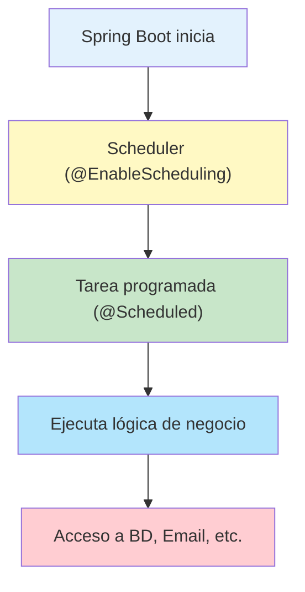

- [19. Tareas Programadas](#19-tareas-programadas)
  - [19.1. Activar la planificación](#191-activar-la-planificación)
  - [19.7. Diagrama didáctico: Flujo de tareas programadas](#197-diagrama-didáctico-flujo-de-tareas-programadas)
  - [19.8. Resumen didáctico](#198-resumen-didáctico)
  - [19.2. Crear una tarea programada](#192-crear-una-tarea-programada)
  - [19.3. Expresiones cron](#193-expresiones-cron)
  - [19.4. Ejemplo avanzado](#194-ejemplo-avanzado)
  - [19.5. Buenas prácticas](#195-buenas-prácticas)
  - [19.6. Desafío propuesto](#196-desafío-propuesto)
  - [19.7. Diagrama didáctico: Flujo de tareas programadas](#197-diagrama-didáctico-flujo-de-tareas-programadas-1)
  - [19.8. Elementos didácticos y resumen](#198-elementos-didácticos-y-resumen)

# 19. Tareas Programadas

Las tareas programadas ("scheduled tasks") permiten ejecutar automáticamente fragmentos de código en momentos concretos.

## 19.1. Activar la planificación

Primero, debes habilitar el soporte para tareas programadas añadiendo la anotación `@EnableScheduling`.

```java
@SpringBootApplication
@EnableScheduling
public class MiAplicacion {
    public static void main(String[] args) {
        SpringApplication.run(MiAplicacion.class, args);
    }
}
```

## 19.7. Diagrama didáctico: Flujo de tareas programadas

```mermaid
flowchart TD
    A[Spring Boot inicia] --> B[Scheduler (@EnableScheduling)]
    B --> C[Tarea programada (@Scheduled)]
    C --> D[Ejecuta lógica de negocio]
    D --> E[Acceso a BD, Email, etc.]
    style A fill:#e3f2fd
    style B fill:#fff9c4
    style C fill:#c8e6c9
    style D fill:#b3e5fc
    style E fill:#ffcdd2
```

*Diagrama: Flujo de ejecución de tareas programadas en Spring Boot.*

## 19.8. Resumen didáctico

- Las tareas programadas permiten automatizar procesos repetitivos y de mantenimiento.
- El uso de `@Scheduled` y `@EnableScheduling` facilita la integración en Spring Boot.
- Es recomendable manejar excepciones y usar hilos asíncronos para no bloquear la aplicación.
- Se pueden combinar con servicios de email, limpieza de datos, generación de reportes, etc.

## 19.2. Crear una tarea programada

Puedes crear una clase de tipo `@Component` con métodos anotados con `@Scheduled`.

```java
@Component
public class MiTareaProgramada {

    @Scheduled(fixedRate = 10000)
    public void tareaRecurrente() {
        System.out.println("Ejecutando tarea cada 10 segundos");
    }
}
```

## 19.3. Expresiones cron

Las expresiones cron permiten definir horarios complejos.

```java
@Scheduled(cron = "0 0 2 * * ?")
public void tareaDiaria() {
    // Se ejecuta a las 2:00 AM cada día
}

@Scheduled(cron = "0 */15 * * * ?")
public void tareaCada15Minutos() {
    // Se ejecuta cada 15 minutos
}
```

## 19.4. Ejemplo avanzado

```java
@Component
@Slf4j
public class TareaReportes {

    private final ReporteService reporteService;
    private final EmailService emailService;

    public TareaReportes(ReporteService reporteService, EmailService emailService) {
        this.reporteService = reporteService;
        this.emailService = emailService;
    }

    @Scheduled(cron = "0 0 8 * * MON-FRI")
    public void generarReporteDiario() {
        log.info("Generando reporte diario...");
        Reporte reporte = reporteService.generarReporteDiario();
        emailService.enviarReporte(reporte);
    }
}
```

## 19.5. Buenas prácticas

- Usar `@Async` junto con `@Scheduled` para no bloquear el hilo principal
- Manejar excepciones dentro de las tareas
- Usar transaccionalidad si la tarea modifica datos
- Configurar pool de hilos si hay muchas tareas

## 19.6. Desafío propuesto


Implementa una tarea programada que cada noche a las 3:00 AM:
1. Archive los registros antiguos de la base de datos
2. Envíe un resumen por email al administrador
3. Limpie los archivos temporales del sistema

## 19.7. Diagrama didáctico: Flujo de tareas programadas



*Diagrama: Flujo de ejecución de tareas programadas en Spring Boot.*

## 19.8. Elementos didácticos y resumen

- Las tareas programadas permiten automatizar procesos repetitivos y de mantenimiento.
- El uso de `@Scheduled` y `@EnableScheduling` facilita la integración en Spring Boot.
- Es recomendable manejar excepciones y usar hilos asíncronos para no bloquear la aplicación.
- Se pueden combinar con servicios de email, limpieza de datos, generación de reportes, etc.
