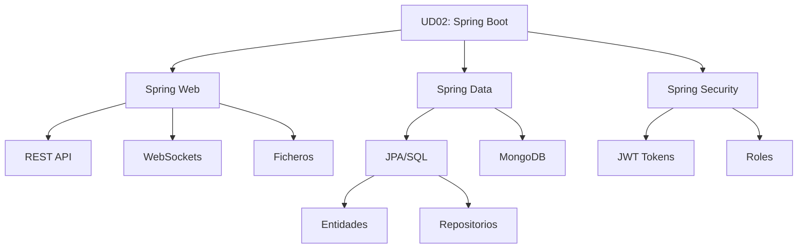

- [20. Resumen](#20-resumen)
  - [20.1. Resumen Global](#201-resumen-global)
  - [20.2. Mapa Conceptual](#202-mapa-conceptual)
  - [20.3. Checklist de Supervivencia](#203-checklist-de-supervivencia)
    - [Configuración Inicial](#configuración-inicial)
    - [Entidades y Repositorios](#entidades-y-repositorios)
    - [Controladores REST](#controladores-rest)
    - [Servicios](#servicios)
    - [Testing](#testing)
    - [Seguridad](#seguridad)

# 20. Resumen

## 20.1. Resumen Global

En este módulo hemos aprendido a desarrollar aplicaciones web con Spring Boot, desde la configuración básica hasta la seguridad con JWT.

**Conceptos clave aprendidos:**

1.  **Spring Boot**: Autoconfiguración, starters, servidor embebido.
2.  **Servicios REST**: Endpoints, métodos HTTP, códigos de estado.
3.  **Spring Web MVC**: @RestController, ResponseEntity, validaciones.
4.  **Servicios**: @Service, validación, caché, excepciones.
5.  **Spring Data JPA**: Entidades @Entity, repositorios, consultas.
6.  **Relaciones JPA**: @OneToOne, @OneToMany, @ManyToOne.
7.  **Testing**: Tests unitarios con JUnit y Mockito.
8.  **Ficheros**: MultipartFile, StorageService.
9.  **WebSockets**: Comunicación bidireccional en tiempo real.
10. **Seguridad**: Spring Security, JWT, roles.

## 20.2. Mapa Conceptual

## 20.3. Checklist de Supervivencia

### Configuración Inicial
- [ ] Proyecto creado en Spring Initializr
- [ ] application.properties configurado

### Entidades y Repositorios
- [ ] Entidades con @Entity y @Id
- [ ] Repositorios extendiendo JpaRepository

### Controladores REST
- [ ] Endpoints con @RestController
- [ ] Métodos HTTP correctos
- [ ] Códigos de estado apropiados
- [ ] @RequestBody con @Valid

### Servicios
- [ ] Lógica de negocio en @Service
- [ ] @Transactional para escritura

### Testing
- [ ] Tests unitarios con Mockito
- [ ] Tests de integración

### Seguridad
- [ ] Spring Security configurado
- [ ] JWT implementado
- [ ] Endpoints protegidos por rol
